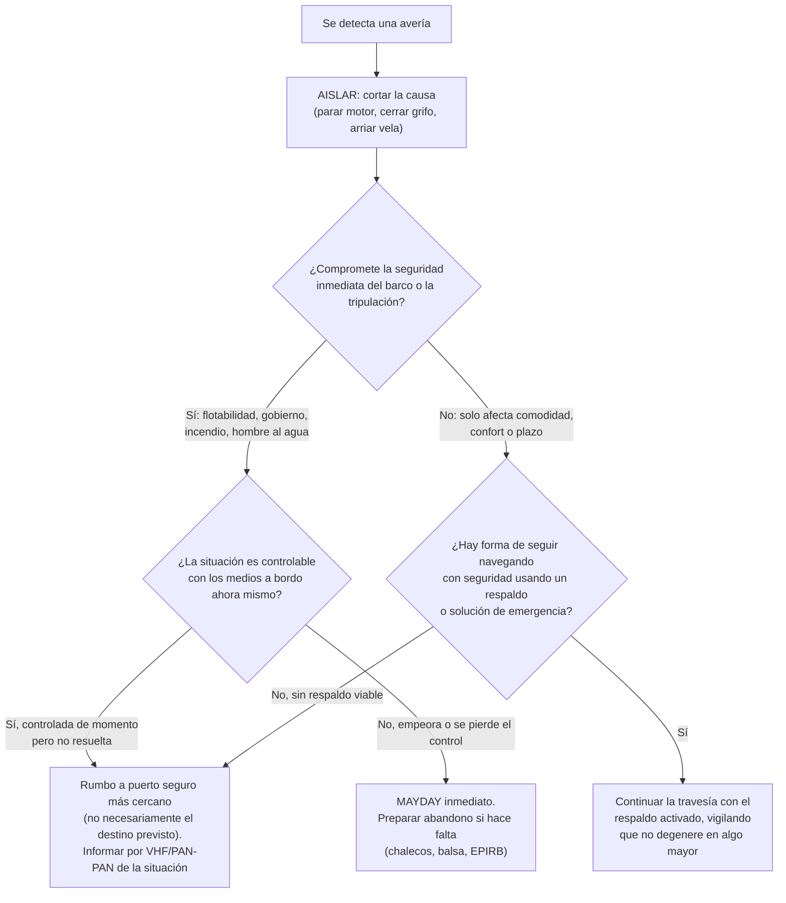

# Averías en Travesía: Checklist de Campo

Este manual no enseña a reparar un motor ni a empalmar un cabo con calma en el pantalán: para eso están [Mecánica Naval y Mantenimiento](MECANICA_Y_MANTENIMIENTO.md), [Electrónica e Instrumentación](ELECTRONICA_NAVAL.md) y [Mantenimiento de Velas y Jarcia](MANTENIMIENTO_DE_VELAS_Y_JARCIA.md), que cubren el diagnóstico técnico y la prevención con el barco parado. Este documento es distinto: es el **checklist que se consulta con la avería ya ocurrida, en plena mar, con oleaje, con los medios limitados que hay a bordo y sin posibilidad de llamar a un técnico**. La pregunta no es "¿por qué ha fallado?", sino "¿qué hago en los próximos cinco minutos?".

---

## 1. La Filosofía de la Avería en el Mar

En tierra, una avería es una molestia que se resuelve con un taller y un plazo de entrega. En el mar, una avería es ante todo una **pregunta de gestión de riesgo**, y el patrón debe responderla en este orden, siempre:

1.  **Aislar el problema.** Antes de intentar reparar nada, corta la causa que puede agravar la avería: para el motor si vibra de forma anómala, cierra el grifo de fondo si hay agua entrando, arría la vela si el obenque está roto. **No se repara nada mientras la situación sigue empeorando.**
2.  **Clasificar la gravedad.** Pregúntate explícitamente: ¿esta avería compromete la **seguridad inmediata** de la tripulación y el barco (flotabilidad, gobierno, riesgo de vía de agua, riesgo de incendio), o solo compromete la **comodidad o el plazo** de la travesía (se pierde el plotter pero hay carta de papel, se rasga el génova pero queda la mayor)? La respuesta cambia por completo qué hacer a continuación.
3.  **Decidir el rumbo de la decisión**, no solo el rumbo del barco: seguir navegando con la avería gestionada, desviarse al puerto seguro más cercano (no necesariamente el puerto de destino original), o pedir asistencia externa.

**Regla práctica:** ante la duda entre "sigo" y "desvío", desvía. Un desvío a puerto cuesta unas horas y algo de orgullo; una avería menor ignorada que degenera en alta mar de noche, con mal tiempo o lejos de ayuda, puede costar mucho más. Y ante la duda entre "PAN-PAN" y "MAYDAY", **avisa antes de que sea evidente que lo necesitas**: es mucho más fácil cancelar una alerta que Salvamento Marítimo ya tiene en marcha que iniciar un rescate cuando la situación ya se ha descontrolado.

---

## 2. Checklist: Fallo Total de Electrónica/Instrumentos

Desde perder solo el plotter/GPS hasta un apagón total de 12V que deja el barco sin instrumentos, sin luces de navegación y sin VHF.

1.  **Antes de tocar nada, comprueba lo obvio: breaker y fusibles principales.** La inmensa mayoría de "fallos totales" no son una avería grave sino un interruptor general (breaker) disparado por una sobrecarga puntual, o un fusible fundido en la línea principal del cuadro. Revisa el cuadro eléctrico de arriba abajo antes de sospechar de la batería o de un cortocircuito complejo.
2.  Si el cuadro está muerto por completo, **comprueba los bornes de la batería de servicios** (sueltos, sulfatados o con mal contacto es la causa más común tras un fusible fundido; ver la sección de arranque en [Mecánica Naval y Mantenimiento](MECANICA_Y_MANTENIMIENTO.md)).
3.  **Desconecta todo consumo no esencial de inmediato**: nevera, luces interiores, cargadores de móvil, equipos de confort. El objetivo es que la energía que quede en la batería se reserve para lo crítico: VHF, luces de navegación y una bomba de achique si hiciera falta.
4.  Si tras aislar breaker/fusibles y consumo no esencial el sistema sigue muerto, **da por perdida la electrónica para el resto de la travesía** y pasa a navegación de respaldo; no pierdas más tiempo intentando repararlo en plena mar con oleaje.
5.  **Recupera la navegación de respaldo**: carta de papel de la zona, compás magnético del barco, y estima por rumbo/velocidad/tiempo (ver [Conceptos Básicos de Cartas Náuticas](cartas_nauticas/CONCEPTOS_BASICOS.md) y [Cálculos de Navegación](cartas_nauticas/CALCULOS_DE_NAVEGACION.md) para el procedimiento de estima; consulta el [Glosario Náutico](GLOSARIO.md) si algún término no resulta familiar).
6.  **Usa el GPS del móvil como respaldo de emergencia inmediato.** Casi todos los smartphones tienen chip GPS propio que funciona sin cobertura de datos ni señal telefónica (solo necesita ver satélites): activa el modo avión para ahorrar batería pero deja el GPS encendido, y usa una app de cartografía offline si la tienes descargada (ver apps recomendadas en [Recursos Útiles](RECURSOS.md)). No sustituye a la carta de papel a largo plazo, pero da una posición fiable en minutos.
7.  Sin VHF fijo, **prueba con el VHF portátil de emergencia** (batería propia); si tampoco hay, el móvil con cobertura costera o un dispositivo satelital tipo inReach/Iridium GO (ver [Electrónica e Instrumentación](ELECTRONICA_NAVAL.md), sección de comunicación por satélite) es tu único canal de aviso.
8.  Si no hay ninguna vía de comunicación operativa y la travesía continúa a ciegas de instrumentos, **considera este escenario en sí mismo motivo suficiente para desviarte al puerto navegable más cercano**, aunque el barco no tenga ninguna otra avería.

---

## 3. Checklist: Rotura de Jarcia o Vela en Alta Mar

### Vela rasgada
1.  **Arría la vela dañada de inmediato** en cuanto se detecte el rasgón: un desgarro pequeño se convierte en una vela inservible en minutos si se deja trabajando con viento.
2.  Evalúa el tamaño y la ubicación del rasgón. Si es pequeño y no afecta a una costura estructural, **repáralo en caliente con cinta especial para velas (sail repair tape)** por ambas caras del paño, aplicada sobre tejido seco y limpio, y vuelve a izar con precaución vigilando que aguante.
3.  Si el rasgón es grande, afecta a una costura principal, o la cinta no sujeta con la carga del viento, **no fuerces la vela dañada**: arría del todo y **iza la vela de repuesto** (tormentín, génova de respeto o mayor de repuesto según el caso).
4.  Si no hay vela de repuesto disponible ni reparación viable, **continúa a motor o con el resto del aparejo intacto** y reduce las expectativas de la travesía (menos velocidad, más tiempo) en lugar de forzar una vela ya comprometida.

### Obenque o estay roto
1.  **Arría inmediatamente toda vela del lado afectado** (o toda la vela si el estay de proa es el que ha fallado): un obenque roto significa que el palo ha perdido uno de sus puntos de sujeción lateral, y la presión del viento en la vela es lo que lo derriba en segundos si se mantiene izada.
2.  **Arriba a motor o con vela mínima** en el lado contrario o con el viento lo más de popa posible, minimizando la carga lateral sobre el palo mientras dure la emergencia.
3.  Si hace falta seguir navegando a vela, **improvisa un obenque de emergencia con un cabo de repuesto o una driza sobrante**: tensa un cabo grueso (o una driza no utilizada) desde lo más alto posible del palo hasta el punto de amarre del obenque roto en la cubierta, usando un tensor, un winch o un aparejo de poleas para dar la mayor tensión posible. No sustituye la resistencia del cable original, pero puede aguantar lo suficiente para llegar a puerto con vela reducida.
4.  Para la nomenclatura de obenques, estays y terminales, y qué aspecto tiene un cable fatigado ("pelo de gato") frente a uno sano, consulta [Mantenimiento de Velas y Jarcia](MANTENIMIENTO_DE_VELAS_Y_JARCIA.md), sección de jarcia firme — aquí no se repite esa referencia, solo la actuación de emergencia.

### Pérdida del palo (desarboladura)
1.  **Prioridad absoluta: asegurar que los restos del palo, las velas y la jarcia no perforen el casco.** Un palo caído por la borda, todavía sujeto por cabos y cables, actúa como un ariete que golpea el costado con cada ola.
2.  **Corta o suelta rápidamente los cabos y cables que mantienen el palo pegado al casco** (tenaza de cizalla o navaja de rigging si están a mano) si no se puede recuperar a bordo de forma segura, aceptando la pérdida del material antes que arriesgar el casco.
3.  Si el palo puede recuperarse sin peligro, **arrástralo junto al costado alejado del casco** con un cabo largo mientras se decide qué hacer, en vez de dejarlo golpear libremente.
4.  **Evalúa la navegación a motor** de inmediato: sin palo no hay propulsión a vela, así que el motor pasa a ser el único medio de propulsión disponible; comprueba combustible suficiente para llegar a puerto y gestiona el consumo en consecuencia.
5.  Comunica la situación por VHF (PAN-PAN como mínimo, dado el riesgo de daño en el casco) y dirígete al puerto seguro más cercano.

---

## 4. Checklist: Vía de Agua No Localizada

Antes de nada, el achique de emergencia y el taponamiento con tacos/cuñas ya están cubiertos en detalle en [Seguridad Reglamentaria y Pirotecnia](SEGURIDAD.md), sección "Vía de Agua y Control de Averías" — no se repite aquí ese procedimiento. Este checklist se centra en **cómo encontrar el origen cuando no es evidente**.

1.  **Pon en marcha el achique disponible de inmediato** (eléctrico y, si el ritmo de entrada de agua lo justifica, también manual) mientras se investiga el origen; ganar tiempo es la prioridad, no localizar la fuga a toda costa antes de achicar.
2.  **Registra sistemáticamente todos los pasacascos y sus cierres**, de proa a popa: entrada de agua de mar del motor, WC, refrigeración, desagües de fregadero y ducha. Comprueba tanto la propia válvula como el estado de la manguera y las abrazaderas en cada uno.
3.  **Revisa la sentina completa**, no solo el punto donde suena la alarma: el agua se desplaza con el balanceo del barco y puede acumularse lejos de donde entra realmente.
4.  **Comprueba el prensaestopas del eje de la hélice (bocina)**: un goteo excesivo (mucho más que la gota por minuto normal en los sistemas clásicos, o cualquier goteo en un sello seco moderno) apunta a un prensaestopas dañado o mal purgado.
5.  **Revisa las uniones del casco**: encuentros de mamparos, pasantes de quilla (si el barco tiene lastre exterior atornillado), y la zona bajo la línea de flotación cerca de un impacto reciente si lo ha habido.
6.  Si el achique consigue mantener el nivel de agua estable o bajarlo, **la situación está controlada de momento pero no resuelta**: sigue vigilando, dirígete a puerto y no des el problema por cerrado solo porque la bomba "va ganando".
7.  **Activa un PAN-PAN o incluso un MAYDAY preventivo aunque el achique aguante de momento**, si el origen de la vía de agua no se ha localizado con certeza, si hay más de un compartimento afectado, o si la tripulación no puede mantener el ritmo de achique de forma indefinida (cansancio, oleaje, de noche). Esperar a que el achique deje de dar abasto para pedir ayuda reduce drásticamente el margen de reacción de un posible rescate.

---

## 5. Checklist: Fallo de Gobierno (Timón)

1.  **Confirma primero si el fallo es del timón o del piloto automático**: desconecta el piloto y prueba a gobernar a mano antes de asumir que se ha perdido la pala del timón o la cadena/cable de dirección.
2.  Si hay resistencia nula en la caña o el volante gira libremente sin efecto en la pala, **sospecha rotura de la cadena o cable de la dirección**: revisa (si el acceso lo permite con seguridad) el cuadrante del timón y la cadena bajo la bañera o en el pañol de popa; un cable saltado de su tambor a veces puede recolocarse a mano.
3.  Si no hay respuesta alguna del timón ni acceso al mecanismo, **para el motor o reduce vela de inmediato**: un barco sin gobierno y con propulsión activa es más peligroso (puede virar de forma impredecible) que uno parado.
4.  **Improvisa un timón de emergencia con un remo grande o un tablón atado a un cabo corto**, sujeto por la popa y accionado manualmente por un tripulante, si la avería es total y hay que seguir gobernando aunque sea de forma tosca.
5.  Alternativa cuando no hay remo disponible o el mar está demasiado agitado para sostenerlo a mano: **fondea un ancla flotante (o cualquier objeto de arrastre: un cubo grande, una vela vieja lastrada) a popa, remolcado de forma asimétrica** (más cerca de una banda que de la otra, o cobrando más cabo por un lado). El arrastre desigual genera un par que permite corregir el rumbo aproximadamente, aunque con mucha menos precisión que un timón real.
6.  **Si no hay motor ni timón operativo, gobierna únicamente con las velas mediante trimado diferencial**: cazando más la mayor (tiende a orzar, es decir, a llevar la proa hacia el viento) o más el génova/foque (tiende a arribar, alejando la proa del viento), se puede mantener un rumbo aproximado jugando solo con el reparto de presión vélica entre proa y popa. Es una técnica imprecisa y exige ajustes constantes, pero puede ser la única opción disponible en pleno océano.
7.  En cuanto el gobierno esté mínimamente controlado (timón de emergencia, ancla de arrastre asimétrica o trimado de velas), **notifica la situación por VHF y dirígete al puerto seguro más próximo con la ruta que exija menos cambios de rumbo posibles**, ya que cada corrección con un sistema de emergencia es más lenta y menos fiable que con el timón original.

---

## 6. Cierre: El Plan de Contingencia Antes de Zarpar

Ninguno de los checklists anteriores sustituye a la preparación previa. La diferencia entre una avería grave bien resuelta y una tragedia suele decidirse **antes de soltar amarras**, no en el momento de la avería:

*   Lleva siempre un **plan de contingencia** conocido por toda la tripulación: qué hacer ante un fallo eléctrico total, dónde están los tacos de emergencia y la bomba manual, quién sabe gobernar con velas si se pierde el timón.
*   Anota y ten accesibles (en papel, plastificados, no solo en el móvil) los **datos de contacto de Salvamento Marítimo** y del centro de coordinación de rescate de la zona antes de zarpar; en España, el **Canal 16 VHF** y el **teléfono 900 202 202** (ver [Recursos Útiles](RECURSOS.md), sección "Organismos Oficiales", para el listado completo de organismos y apps de seguridad como SafeTrx).
*   Comunica siempre tu plan de navegación a alguien en tierra antes de salir, para que exista una alarma si no llegas a la hora prevista aunque tú mismo no puedas dar el aviso.

Una avería en el mar no se improvisa del todo nunca: se gestiona mejor cuanto más se haya pensado en ella con el barco todavía amarrado.
