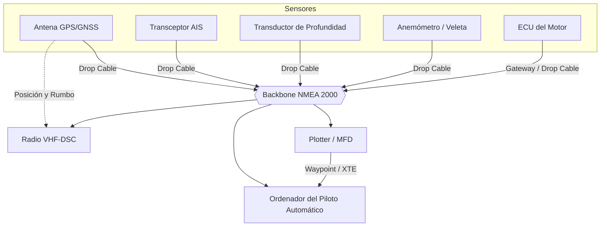

# Manual de Electrónica e Instrumentación Naval

La navegación moderna ha pasado de la era del sextante de bronce a la era del cristal (Glass Cockpit). Los modernos MFD (Multi-Function Displays) unifican todas las fuentes de datos del barco en una única pantalla. Sin embargo, depender ciegamente de la electrónica sin conocer sus limitaciones es letal.

---

## 1. El Protocolo de Red: NMEA 0183 vs NMEA 2000

Los instrumentos náuticos no hablan USB o Ethernet comercial. Utilizan estándares de la *National Marine Electronics Association*.

### NMEA 0183
*   Protocolo muy antiguo (años 80), basado en comunicación serie RS-422.
*   **Problema:** Es de "un solo hablante (Talker) y varios oyentes (Listeners)". Los cables se empalman a mano, siendo una pesadilla técnica si cruzas polaridades. Transmite datos a bajísima velocidad (4800 baudios, o 38400 para AIS).
*   *Formato:* Mensajes ASCII, ej. `$GPGGA,123519,4807.038,N,01131.000,E,1...`

### NMEA 2000 (N2K)
*   Basado en el bus **CAN (Controller Area Network)** de automoción.
*   **Arquitectura:** Es un bus troncal (Backbone) del que cuelgan todos los instrumentos mediante conectores en T (Drop Cables). Es *Plug-and-Play*.
*   **Ventaja:** Todos los equipos pueden "hablar" y "escuchar" simultáneamente a $250 \text{ kbps}$. El equipo de viento habla con el piloto automático, y el GPS habla con la radio VHF al mismo tiempo por un solo cable unificado de 5 pines.
*   *Requisito de red:* El backbone debe tener una resistencia terminal ($120 \Omega$) en cada extremo y ser alimentado a 12V.

---

## 2. Sistemas GNSS (GPS, Galileo, GLONASS)

El Sistema de Posicionamiento Global no sabe dónde estás, simplemente calcula distancias.

### Principio de Funcionamiento
El receptor de a bordo es un reloj atómico sincronizado pasivo. Recibe la señal de un satélite que dice "soy el satélite A, aquí están mis efemérides (mi posición en órbita) y emití esto a las 14:00:00.0000".
El receptor anota a qué hora exacta le llegó el paquete. La diferencia de tiempo multiplicada por la velocidad de la luz da la "Pseudodistancia".
*   Cruzando 3 satélites (Trilateración), obtenemos Latitud y Longitud 2D.
*   El 4º satélite corrige el error de tiempo del reloj de cuarzo del barco, otorgando 3D Fix (Altitud).

### Fuentes de Error y DOP
*   **Dilution of Precision (DOP):** Si los satélites visibles están todos "apelotonados" en una esquina del cielo, el error trigonométrico de corte geométrico (HDOP, Horizontal DOP) se dispara. Un HDOP $\le 2$ es excelente; $\ge 5$ es dudoso.
*   **WAAS / EGNOS:** Sistemas de aumentación. Estaciones de tierra miden el retraso de la señal al cruzar la ionosfera, y envían una corrección milimétrica a los satélites geoestacionarios para que la retransmitan al barco, logrando precisión sub-métrica.

---

## 3. AIS (Sistema de Identificación Automática)

El mayor avance en prevención de colisiones (antirumbos) desde el radar.

El AIS es un transceptor VHF (emite y recibe). Utiliza el GPS integrado del barco y emite periódicamente paquetes de datos por ondas de radio VHF a los barcos circundantes.
Tu pantalla pinta los barcos como triángulos. Si pinchas en ellos verás su nombre, rumbo (COG), velocidad (SOG), MMSI, dimensiones y su **CPA (Closest Point of Approach)**.

### Clases de AIS
1.  **Clase A:** Obligatorio en buques mercantes y pasaje (> 300 GT). Emite a 12W. Tienen prioridad y emiten datos cada 2-10 segundos en función de la velocidad y cambios de rumbo.
2.  **Clase B:** Para yates y veleros. Emite a solo 2W. Emite cada 30 segundos (o menos si es SOTDMA). *Aviso:* Algunos mercantes filtran los "Clase B" de su pantalla para reducir saturación en puertos, así que no asumas que te han visto.

---

## 4. Radares Náuticos

El radar es indispensable con niebla cerrada, operando típicamente en **Banda X (9 GHz, longitud de onda 3 cm)**. Gira escaneando la bahía.

### Funcionamiento Básico
Emite un pulso electromagnético brutalmente potente (magnetrón) que rebota en los metales y el agua. La distancia del "eco" se calcula por el tiempo de vuelo de retorno del microondas.

### Tecnologías
*   **Magnetrón (Clásico):** Gran consumo eléctrico, necesita calentamiento de 90 segundos y no ve muy bien blancos pequeños muy cercanos.
*   **Solid-State / Broadband (FMCW / Doppler):** Modelos modernos sin magnetrón (como Halo o Quantum). Emiten radiación de baja potencia continuada de frecuencia modulada. Ven palos flotando a 5 metros de la proa con resolución HD, consumen muy poco, se encienden instantáneamente, y detectan por efecto Doppler si un blanco se acerca (se pinta en rojo) o se aleja (verde).

---

## 5. Sondas Acústicas (Ecosondas)

El transductor situado bajo el casco emite "pings" de ultrasonidos hacia el fondo del mar.
*   **Frecuencias:** 
    *   **200 kHz (Alta Frecuencia):** Cono de sonido estrecho ($12^\circ - 20^\circ$). Gran resolución de detalle del fondo, ideal para poca profundidad y anclajes.
    *   **50 kHz (Baja Frecuencia):** Cono ancho ($40^\circ$). Las ondas largas penetran profundo (hasta mil metros), ideal para navegación oceánica, aunque la resolución se vuelve borrosa.

### Alarmas de Calado
Todos los plotters y sondas permiten configurar el *Keel Offset* (compensación de la quilla).
*   Sonda real bajo transductor vs. Sonda absoluta (hasta flotación) vs. **Profundidad Restante bajo la orza** (la más segura para recreo). Fija siempre una alarma de "Shallow Water" sonando a $2 \text{ metros}$ de margen bajo quilla.

---

## 6. Autopiloto (Piloto Automático)

No es una simple brújula. El ordenador de rumbo moderno utiliza algoritmos de "estado sólido" de un giróscopo de 9 ejes electromecánico o láser.
A diferencia de un humano, no mira la proa. El autopiloto mide la aceleración angular y "anticipa" que una ola está empujando la popa a estribor *antes* de que el barco empiece a caer significativamente, aplicando compensación de timón micrométrica a un brazo hidráulico.

*   **Rumbo Magnético (Auto):** Navega hacia $090^\circ$ M. No tiene en cuenta la deriva de la corriente.
*   **Navegación por Waypoint (Nav / Track):** Lee los mensajes NMEA 2000 del GPS y ajusta el rumbo para "cazar" la línea imaginaria (XTE - Cross Track Error), combatiendo viento y corriente activamente.
*   **Aleteo de Viento (Wind Vane):** Conectado al anemómetro del mástil, navega manteniendo, por ejemplo, el viento constante a $40^\circ$ de la amura (esencial para largas bordadas a vela).

---

## 7. Balizas de Emergencia por Satélite: EPIRB, PLB y AIS-SART

Cuando el VHF ya no basta —porque el barco se hunde fuera de cobertura costera o porque una persona cae al agua de noche— entra en juego una familia de transmisores de socorro que no dependen de que nadie los escuche por radio: hablan directamente con satélites.

### El Sistema Cospas-Sarsat y los 406 MHz
Todas estas balizas emiten en la frecuencia internacional de socorro **406 MHz**, captada por la constelación de satélites **Cospas-Sarsat** (órbita baja y geoestacionaria). El satélite no solo recibe la señal, sino que la geolocaliza por efecto Doppler y la retransmite a un centro de coordinación de rescate (MRCC) en minutos, junto con el MMSI o identificador único programado en la baliza. Muchos modelos incorporan además un **GPS interno**, que reduce el círculo de incertidumbre de varios kilómetros a apenas metros, y una miniantena **VHF de 121.5 MHz** para que los equipos de rescate hagan la aproximación final por triangulación local (homing).

### EPIRB (Emergency Position Indicating Radio Beacon)
*   Es la baliza **del buque**, no de la persona. Va montada en un soporte específico en cubierta o flybridge.
*   **Liberación Hidrostática (HRU):** El soporte incorpora una cápsula que se disuelve por presión de agua a unos 1.5-4 metros de profundidad. Si el barco se hunde, la EPIRB se libera sola, flota y se activa automáticamente, incluso sin intervención humana (por ejemplo, con la tripulación inconsciente o atrapada).
*   Tiene **flotabilidad propia** y una autonomía de transmisión mínima garantizada de 48 horas.
*   Activación manual: basta con extraerla del soporte y desplegar la antena; empieza a transmitir sola.

### PLB (Personal Locator Beacon)
*   Versión **individual y portátil**, mucho más pequeña, que cada tripulante puede llevar en el chaleco salvavidas o en el bolsillo de la chaqueta de agua.
*   No tiene liberación hidrostática ni flotabilidad garantizada por normativa (algunos modelos flotan, otros no): la activación es siempre **manual**, tirando de la antena y pulsando el botón.
*   Autonomía menor que una EPIRB (típicamente 24 horas), pensada para el tiempo que tarda un rescate, no para una travesía larga.
*   Ideal para el tripulante que sale de la bañera con mal tiempo, para el patrón de una embarcación pequeña sin espacio para una EPIRB, o como respaldo personal en travesías oceánicas.

### AIS-SART y MOB (Man OverBoard)
*   No transmite en 406 MHz ni pasa por satélite: es un **pequeño transmisor AIS** que, al activarse, emite una posición GPS por VHF cada pocos segundos con un icono especial de socorro (SART o MOB).
*   Su alcance es corto (unas pocas millas náuticas, línea de vista VHF), pero su gran ventaja es la **velocidad**: cualquier barco con AIS en las inmediaciones —incluido el propio barco del que ha caído la persona— lo ve en su plotter casi al instante, marcado y con alarma sonora, sin depender de que nadie procese una alerta de Cospas-Sarsat.
*   Se suele integrar en el chaleco salvavidas automático, activándose solo al hincharse este (unidades "MOB" personales).
*   Complementa, no sustituye, a la EPIRB/PLB: el AIS-SART avisa rápido a quien está cerca; la baliza satelital avisa, más lento pero de forma garantizada, a Salvamento Marítimo aunque no haya ningún barco alrededor.

### Falsas Alarmas y Cómo Evitarlas
La inmensa mayoría de las activaciones de balizas 406 MHz que reciben los MRCC son **falsas alarmas**, generalmente por manipulación accidental durante pruebas, mantenimiento o desguace del barco.
*   **Regístrala siempre:** toda EPIRB/PLB debe registrarse con sus datos de contacto en el organismo nacional correspondiente (en España, Salvamento Marítimo). Una baliza sin registrar dispara un protocolo de búsqueda completo, mientras que una registrada permite a Salvamento llamar primero al propietario para descartar el error en segundos.
*   **Desactivación inmediata:** si se activa por error, no basta con guardarla; hay que **apagarla siguiendo el procedimiento del fabricante** (mantener pulsado el botón de apagado) y notificar de inmediato al MRCC o Salvamento Marítimo para cancelar la alerta, indicando el MMSI/ID de la baliza.
*   Revisa la fecha de caducidad de la batería (suele ser de 5-6 años) y prueba el **test de autochequeo** del propio equipo, nunca una activación real, para verificar que funciona.

---

## 8. Comunicación por Satélite a Bordo: de Iridium a Starlink

Fuera del alcance del VHF (unas 20-40 millas según altura de antena) y sin cobertura de datos móviles, el barco depende de satélites para hablar, escribir o navegar por internet. La tecnología ha dado un salto enorme en poco tiempo.

### La Era de la Voz y el Mensaje: Iridium
*   **Iridium** es una constelación de 66 satélites en órbita baja (LEO) que da cobertura de voz y datos de bajísimo ancho de banda en *todo el planeta*, incluidos los polos —a diferencia de sistemas geoestacionarios, que pierden cobertura en latitudes muy altas.
*   **Iridium GO!** convierte el móvil del patrón (vía wifi) en un teléfono satelital y permite mensajería de texto y correo comprimido. Es lento (apto para un parte meteo en texto, no para ver el móvil con normalidad) pero robusto y de bajo consumo.
*   Los dispositivos tipo **Garmin inReach** o **Zoleo** son la versión "solo mensajería y SOS": envían y reciben mensajes cortos, comparten la posición periódicamente con los de tierra (tracking), y llevan un botón de socorro que conecta con un centro de coordinación de rescate privado 24/7. Son el estándar para travesías oceánicas y regatas de altura por su fiabilidad y su consumo mínimo.

### La Era de la Banda Ancha: Starlink Maritime
*   **Starlink** utiliza una constelación mucho más densa de satélites LEO para ofrecer **internet de banda ancha real** a bordo: decenas o cientos de Mbps, suficiente para videollamadas, streaming, cartografía online o teletrabajo desde el barco.
*   Las antenas **Maritime** (más robustas, pensadas para la sal y el movimiento) o **Mini/Standard** (más domésticas, usadas también en barcos de recreo) sustituyen a los sistemas VSAT tradicionales, mucho más caros y de menor velocidad.
*   Convierte el barco en un nodo wifi doméstico: correo, meteorología detallada (GRIB de alta resolución), routing online e incluso llamadas normales por VoIP, algo impensable con Iridium.

### Qué Usar Según el Tipo de Navegación
*   **Navegación costera:** el móvil con datos y el VHF suelen bastar. Un terminal de banda ancha es un lujo, no una necesidad de seguridad.
*   **Navegación oceánica / travesías largas:** un dispositivo tipo inReach o un Iridium GO! como respaldo de seguridad es casi obligatorio (SOS, parte meteo, contacto con tierra), independientemente de si se lleva también un terminal de banda ancha para confort.
*   **Cruceros de larga estancia / trabajo a bordo:** Starlink Maritime aporta el confort y la productividad de una conexión de tierra, pero **no sustituye** al equipamiento de socorro reglamentario (EPIRB, VHF-DSC, PLB): es comunicación de confort, no de emergencia certificada SOLAS/GMDSS.

### Consumo Eléctrico y Limitaciones
*   Un terminal Iridium GO! consume poquísimo, comparable a cargar un móvil, ideal para veleros con balance energético ajustado.
*   Una antena Starlink puede consumir entre 40 y 150 W de forma continua, una carga considerable para la batería de servicio de un barco que navega a vela o fondeado; en muchos casos obliga a dimensionar paneles solares, generador o alternador adicionales solo para sostenerla.
*   El **radomo** (cúpula del terminal) necesita visión limpia del cielo: la arboladura, el radar, los paneles solares en el bimini o simplemente la escora del barco pueden **apantallar la señal** y cortar la conexión justo en las peores condiciones de mar.
*   Toda comunicación satelital de banda ancha depende de la energía a bordo: en un fallo eléctrico total, un teléfono Iridium con baterías propias puede seguir funcionando cuando un terminal Starlink ya lleva rato apagado.

---

## 9. Integración de Instrumentos: de NMEA 0183 a NMEA 2000 y el Plotter

Un barco moderno no es un conjunto de aparatos aislados, sino una pequeña red de sensores que comparten datos en tiempo real. Entender cómo dialogan entre sí explica por qué, por ejemplo, el piloto automático puede corregir el rumbo usando datos del GPS sin que el patrón toque nada.

### El Cableado: Backbone, Drop Cables y T-Connectors
La red NMEA 2000 (ver también la sección 1) se instala físicamente como una espina dorsal:
*   El **Backbone** es el cable troncal principal que recorre el barco de punta a punta, con una resistencia terminal de $120\ \Omega$ en cada extremo.
*   Cada instrumento se conecta a ese troncal mediante un **conector en T (T-Connector)** y un **cable de bajada (Drop Cable)** corto, sin necesidad de cortar ni empalmar el backbone.
*   El resultado es una arquitectura *Plug-and-Play*: se puede añadir o quitar un instrumento sin apagar la red ni afectar a los demás equipos.

### El Ecosistema Conectado

En este esquema, el GPS entrega posición y rumbo al mismo tiempo al plotter, al piloto automático y a la radio VHF-DSC (que la necesita para transmitir la posición en una llamada de socorro digital). El plotter traza la ruta y envía el *Cross Track Error* al piloto, que corrige el rumbo activamente. El AIS aporta los blancos de otros barcos sobre la misma pantalla del plotter, la sonda entrega la profundidad, y el motor puede volcar sus parámetros (rpm, temperatura, presión de aceite) para verlos sin instrumentación analógica adicional.

### NMEA 0183 Frente a NMEA 2000 en la Práctica
*   **NMEA 0183** sigue siendo habitual en instalaciones antiguas o en equipos concretos (algunas radios VHF, receptores AIS económicos): es una conexión **punto a punto**, un cable dedicado entre cada pareja de "hablante" y "oyente", lo que multiplica el cableado si hay muchos equipos.
*   Es habitual encontrar barcos **híbridos**, con un *convertidor* o *multiplexor* NMEA 0183 ↔ NMEA 2000 que traduce entre ambos mundos para que un instrumento antiguo pueda seguir aportando datos a la red moderna del plotter.
*   **NMEA 2000**, al ser un bus compartido, permite que todos los equipos "escuchen" el mismo dato (por ejemplo, la profundidad) sin necesidad de un cable específico para cada consumidor de esa información.

### Protocolos Propietarios: SeaTalk y Similares
Antes de la estandarización, y en parte todavía hoy, algunos fabricantes usan sus propios protocolos de bus:
*   **SeaTalk / SeaTalkNG** (Raymarine) es el ejemplo más conocido: un bus propio, con un cableado y conectores específicos del fabricante, que en sus versiones modernas (SeaTalkNG) es en realidad NMEA 2000 con un conector físico distinto, resoluble con adaptadores estándar.
*   Otros fabricantes (Garmin con su bus propio antiguo, Furuno, B&G/Simrad con su variante SimNet) han seguido caminos similares: capas físicas propias que, internamente, terminan hablando NMEA 2000 y se integran con adaptadores.
*   La recomendación práctica al ampliar o renovar instrumentación es verificar la compatibilidad de conectores físicos, no solo del protocolo: dos equipos "NMEA 2000" de marcas distintas pueden necesitar un adaptador de cableado aunque hablen el mismo idioma de datos.
