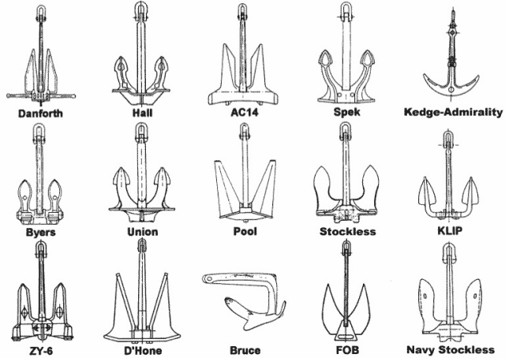

# Maniobras de Puerto y Fondeo (Seamanship)

El verdadero dominio de un barco no se demuestra cruzando un océano en línea recta, sino maniobrando en las distancias cortas: atracando en un puerto abarrotado con viento cruzado, o asegurando el barco en una cala solitaria (fondeo) para dormir tranquilo.

Esta guía cubre la cinemática del barco a motor y la técnica del ancla.

---

## 1. Cinemática del Barco: Hélices y Timón

Antes de acercarse a un muelle, hay que entender cómo interactúan las fuerzas bajo el agua. A diferencia de un coche, el barco "derrapa" de atrás, ya que el timón está en la popa.

### El Efecto de la Hélice (Prop Walk / Presión Lateral de las Palas)
La hélice no solo empuja el barco hacia adelante o hacia atrás, sino que, por el rozamiento transversal de sus palas contra el agua, tiende a empujar la popa hacia un lado, **especialmente marcha atrás**.
*   **Hélice Dextrógira:** Gira a la derecha (en el sentido de las agujas del reloj) en marcha avante. Al dar marcha atrás, **la popa cae a Babor**.
*   **Hélice Levógira:** Gira a la izquierda en marcha avante. Al dar marcha atrás, **la popa cae a Estribor**.

*Aplicación práctica:* Si tienes una hélice dextrógira, atracar de costado dejándote el muelle a tu lado de babor es facilísimo: al dar un golpe de marcha atrás para frenar el barco, la popa se "pegará" mágicamente al muelle sola.

### La Ciaboga (Girar sobre sí mismo)
Consiste en dar la vuelta al barco en el mínimo espacio posible (ej. al final de un pantalán ciego).
1. Mete el timón todo a una banda (ej. a Estribor).
2. Da un acelerón fuerte y corto **Avante**. La corriente de la hélice golpea el timón girado y la proa cae fuertemente a Estribor. Corta gas.
3. El barco avanza por inercia. Antes de tocar la pared, mete **Marcha Atrás**. Como la hélice (dextrógira) tira de la popa a Babor en retroceso, el giro de la proa hacia Estribor se intensifica.
4. Repite el proceso hasta completar el giro de $180^\circ$.

---

## 2. Los Cabos de Amarre

Para amarrar correctamente un barco a un noray (bolardo) del muelle, se emplean diferentes cabos que limitan movimientos distintos:

1.  **Largos (Proa y Popa):** Trabajan en diagonal hacia el exterior. El largo de proa impide que el barco retroceda. El largo de popa impide que el barco avance.
2.  **Esprines (Springs):** Trabajan en diagonal cruzándose hacia el centro del barco. El esprín de proa impide que el barco avance. El esprín de popa impide que retroceda. **Son los cabos más útiles para maniobrar.**
3.  **Traveses:** Trabajan perpendicularmente al muelle. Impiden que el barco se separe (abata), pero no impiden que se desplace adelante o atrás.

### Desatracar usando un Esprín (Springing Off)
Si el viento te empuja fuertemente contra el muelle y no puedes salir:
1. Suelta todos los cabos excepto el **Esprín de Popa** (y pon una defensa grande entre la popa y el muelle).
2. Da motor marcha **Atrás**.
3. El barco no puede retroceder porque el esprín lo retiene, así que la fuerza se traduce en un giro: la popa pivota contra la defensa y **la proa se abre drásticamente** hacia el mar, venciendo al viento.
4. Cuando la proa esté apuntando a la salida, embraga avante, suelta el esprín y sal.

---

## 3. El Fondeo (Echar el Ancla)

Fondear no es tirar un hierro al agua; es crear una cadena de amortiguación para sobrevivir al viento sin garrear (arrastrar el ancla).

### Tipos de Anclas
*   **Danforth:** Plana y con dos uñas largas. Excelente para fondos de arena y barro. Pésima en roca (puede doblarse) o algas (no penetra).
*   **Rocna / Mantus:** De arado moderno con un arco de tubo antivuelco (Roll-bar). La mejor del mercado actual, se clava instantáneamente en casi cualquier fondo.
*   **CQR (Arado articulado):** Clásica, buena penetración en arena, pero pierde terreno frente a la Rocna.
*   **Bruce (Uña de garra):** Sin partes móviles, muy robusta. Buena en roca y arena.
*   **Rezón (Grampín):** Tipo paraguas, de cuatro uñas. Solo se usa en embarcaciones menores o neumáticas para fondos rocosos.

*Distintos diseños de ancla (Danforth, Hall, CQR, Stockless, entre otros). Fuente: [Wikimedia Commons](https://commons.wikimedia.org/wiki/File:Anchor_types.jpg), dominio público.*

### La Regla de Oro: La Longitud de Cadena (Filare)
El ancla no sujeta el barco por su peso, sino porque **tracciona horizontalmente** contra el fondo. Si el barco tira hacia arriba (ángulo), el ancla se desclava. Para que el tiro sea horizontal, necesitas echar muchos metros de cadena (su propio peso la mantiene pegada al fondo).

*   **Mar en calma:** Echar cadena igual a **3 o 4 veces** la profundidad.
*   **Viento fresco:** Echar cadena igual a **5 veces** la profundidad.
*   **Temporal / Fondeo nocturno:** Echar cadena igual a **7 veces** la profundidad.

*Cálculo de profundidad real:* Ojo con las mareas. Profundidad real = (Sonda leída en el profundímetro) + (Lo que vaya a subir la marea esta noche) + (Altura de la proa hasta el agua).

### El Círculo de Borneo
El barco fondeado nunca está quieto; gira impulsado por el viento en un círculo cuyo radio es la longitud de la cadena filada.
**Peligro:** Antes de soltar el ancla, debes calcular si en tu radio de borneo chocarás contra las rocas de la costa u otros barcos si el viento gira $180^\circ$ durante la madrugada.

### Fondos Prohibidos: La Posidonia
La Posidonia Oceánica no es un alga, es una planta superior que forma praderas submarinas (el "pulmón del Mediterráneo"). **Está terminantemente prohibido por ley** echar el ancla sobre ella, ya que la cadena arrasa hectáreas de este ecosistema protegido al bornear. Fondea siempre en los manchones de arena clara (se ven de color turquesa brillante desde la cubierta, a diferencia de la Posidonia que se ve negra).

Para la normativa detallada por comunidad autónoma y las técnicas de fondeo ecológico, consulta [Medioambiente y Fondeo Responsable](MEDIOAMBIENTE.md).
