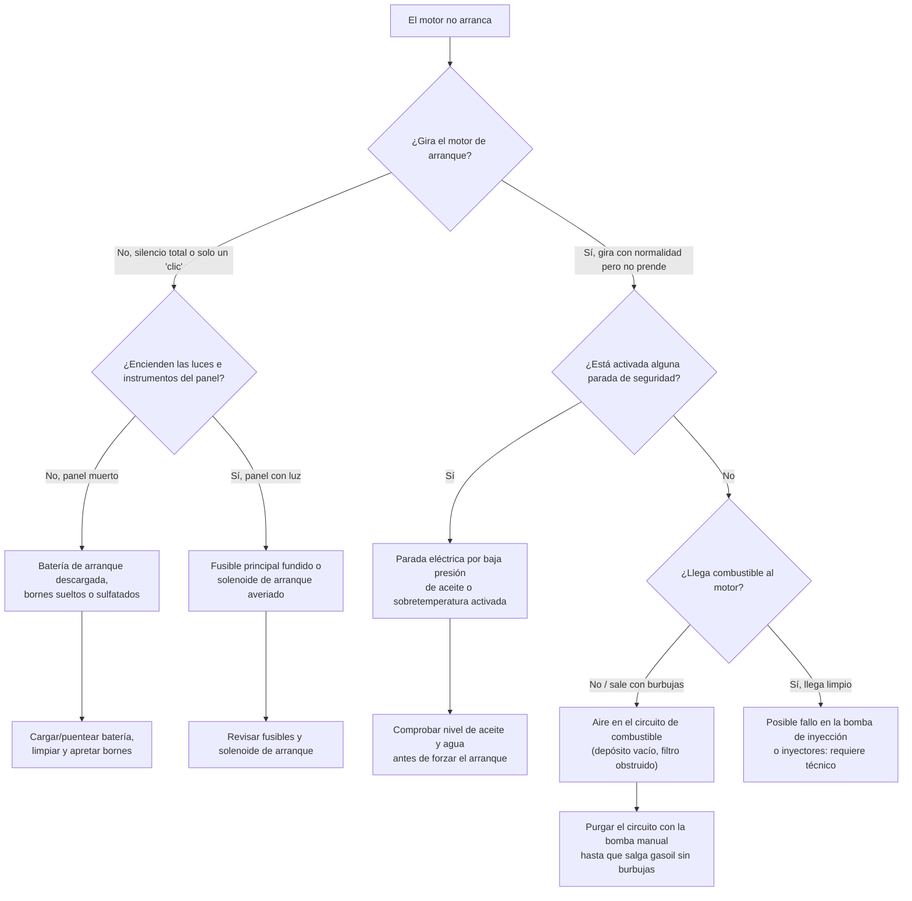
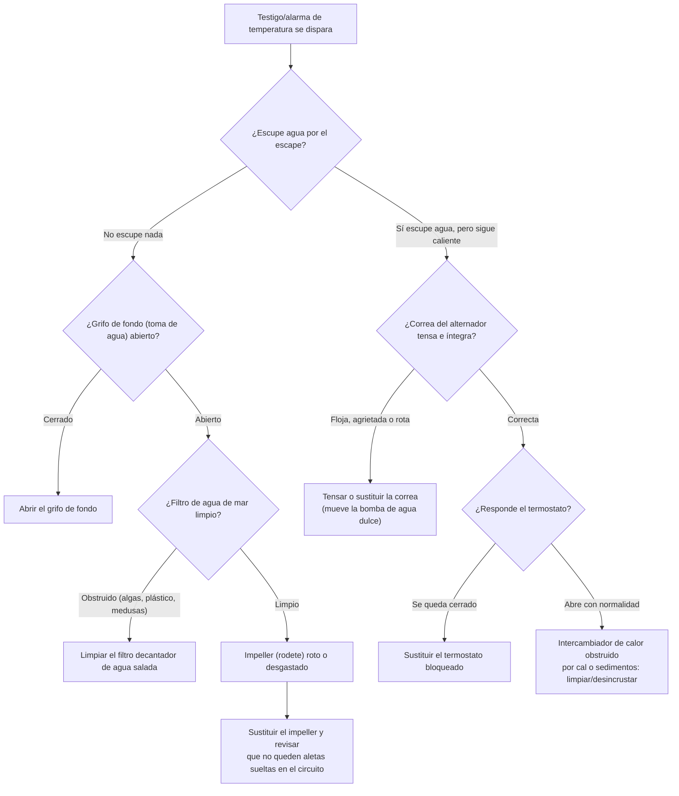
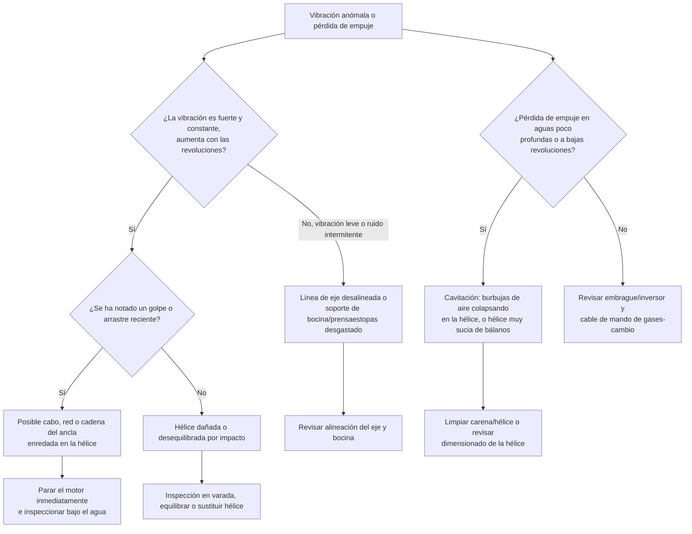
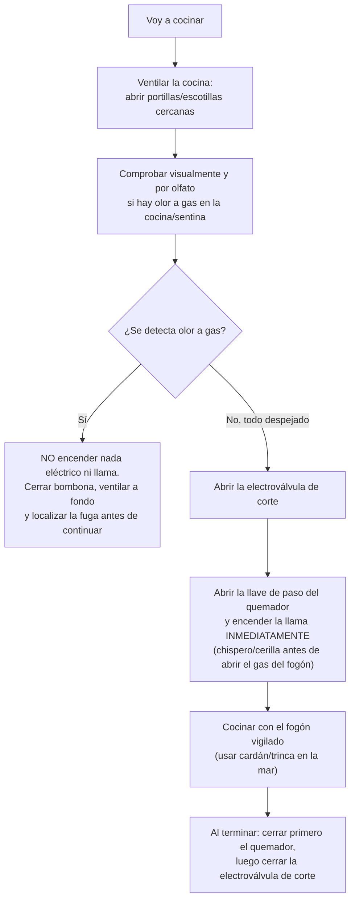

# Manual de Mecánica Naval y Mantenimiento a Bordo

La supervivencia de una embarcación en alta mar depende críticamente de la fiabilidad de su propulsión y de su integridad eléctrica y estanca. A diferencia de un automóvil, un barco no puede detenerse en el arcén. El armador/patrón debe ser su propio mecánico de primera intervención.

---

## 1. El Motor Diésel Marino (Intraborda)

El motor diésel es el estándar en náutica por su robustez, seguridad (el gasoil no emite vapores explosivos a temperatura ambiente como la gasolina) y eficiencia térmica.

### Funcionamiento Básico
Es un motor de **combustión interna por compresión**. No tiene bujías de chispa. El aire entra en el cilindro, el pistón lo comprime brutalmente (elevando su temperatura a más de $600^\circ\text{C}$), y en el punto crítico el inyector pulveriza gasoil, que se autoinflama instantáneamente, empujando el pistón hacia abajo.

### Subsistemas Críticos y Mantenimiento
1.  **Circuito de Combustible:** El mayor enemigo del diésel marino es el **agua** y el "moco" (bacterias que crecen en la interfaz agua-gasoil en el depósito).
    *   **Mantenimiento:** Purgar periódicamente el filtro decantador de agua (pre-filtro). Si entra aire en el circuito (por ejemplo, por agotar el depósito), el motor no arrancará. Hay que purgar el circuito abriendo la tuerca de los inyectores y usando la bomba manual hasta que salga gasoil sin burbujas.
2.  **Sistema de Lubricación:** El aceite reduce la fricción. Un aceite blanquecino/lechoso (mayonesa) indica agua en el cárter (junta de culata rota), lo cual es una emergencia mecánica crítica.
    *   **Mantenimiento:** Comprobar nivel con varilla antes de zarpar. Cambio anual de aceite y filtro.

---

## 2. El Circuito de Refrigeración Marino

Los motores marinos generan calor extremo y se enfrían con el agua sobre la que navegan. Existen dos sistemas:

### Refrigeración Directa (Abierta)
El agua de mar (salada y corrosiva) entra por un pasacascos (grifo de fondo), pasa directamente por los canales del bloque motor (camisas de los cilindros) para absorber el calor, y se expulsa junto con los gases de escape.
*   **Problema:** Alta corrosión. Requiere **ánodos de sacrificio** internos (piezas de zinc que se oxidan ellas mismas en lugar del metal del motor por acción galvánica) que deben cambiarse anualmente.

### Refrigeración Indirecta (Cerrada por Intercambiador)
Es el sistema más moderno y seguro. Tiene dos circuitos:
1.  **Circuito Cerrado (Agua Dulce + Anticongelante):** Baña el motor por dentro, protegiéndolo de la corrosión.
2.  **Circuito Abierto (Agua de Mar):** Recoge agua fría del mar, la pasa por un radiador (intercambiador de calor) donde enfría el circuito cerrado sin mezclarse con él, y se expulsa por el escape.

### El Corazón del Sistema: El Impeller (Rodete)
El agua de mar es bombeada por una bomba cuyo núcleo es un **Rodete de goma o neopreno (Impeller)**. Es la pieza que más falla a bordo. Si el impeller gira en seco (por ejemplo, una bolsa de plástico tapa la toma de agua bajo el casco), se desintegra por fricción en segundos, el motor se sobrecalienta, y colapsa fundiendo la junta de la culata.
*   **Protocolo de Zarpe:** Inmediatamente tras arrancar el motor, el patrón debe asomarse por la popa y comprobar que el barco "escupe" agua junto al humo del escape a intervalos regulares. Si no escupe agua, apagar el motor instantáneamente.

---

## 3. Instalación Eléctrica Naval (12V vs 220V)

### Corriente Continua (DC - 12V o 24V)
Es la "sangre" de los sistemas del barco navegando: instrumentos, VHF, bombas de achique, luces y motor de arranque. Todo barco serio tiene dos parques de baterías separados por un aislador/repartidor de carga:
1.  **Batería de Arranque:** Diseñada para entregar muchísimos amperios en 2 segundos (Cold Cranking Amps, CCA) para mover el motor. Si se descarga profundamente, muere.
2.  **Baterías de Servicios (Ciclo Profundo):** Diseñadas para una descarga lenta y prolongada (luces, nevera). Aguantan descargas fuertes repetidas (Deep Cycle).

*Carga:* Se cargan navegando mediante el **Alternador** impulsado por la correa del motor, o fondeados mediante paneles solares/eólicos.

### Corriente Alterna (AC - 220V)
Solo está disponible cuando el barco está enchufado a la torreta del puerto (Shore Power) mediante un cable amarillo grueso, o si el barco posee un inversor (Inverter) de alta potencia, o un generador diésel autónomo. Alimenta enchufes estándar (para cafeteras, secadores) y el cargador inteligente de baterías.
*   *Peligro Galvánico:* Dejar el barco enchufado a 220V en puerto constantemente acelera la corrosión galvánica destructiva en el casco o la hélice si no hay un aislador galvánico instalado en la línea de tierra.

---

## 4. Integridad del Casco y Bombas de Achique

El agua siempre intentará entrar. El barco tiene conductos por debajo de la línea de flotación (pasacascos).
*   **Grifos de Fondo:** Válvulas conectadas a los pasacascos (entrada de agua al WC, refrigeración, desagües). Deben cerrarse (palanca perpendicular al tubo) al abandonar el barco en puerto o al navegar con mal tiempo.
*   **Bocina y Prensaestopas:** El eje de la hélice tiene que salir del interior del casco hacia el mar, pero el agua no puede entrar. El "prensaestopas" sella este agujero. Los clásicos están diseñados para gotear ligeramente en marcha para refrigerarse (1 gota por minuto). Los modernos (sello seco Volvo) no deben gotear nunca, pero deben "purgarse" (apretarlos con la mano) para que entre agua a refrigerarlos antes de arrancar.
*   **Bombas de Achique (Bilge Pumps):** Ubicadas en la sentina (la parte más baja). Todo yate debe tener una bomba eléctrica conectada a un interruptor de flotador automático (directo a la batería sin pasar por el cuadro, para que funcione aunque quites el contacto), y una **bomba manual obligatoria** operativa desde la cubierta para achicar sin electricidad durante un siniestro.

---

## 5. Invernaje (Winterization)

Preparar el yate para la temporada baja evita costosas facturas por daños ocultos y congelación.
1.  **Motor:** Endulzar el circuito de agua salada (hacerle aspirar agua dulce de un cubo para limpiar la sal). Llenar el depósito de gasoil hasta el límite máximo (para evitar condensación de aire húmedo = agua en el diésel). Añadir biocida contra bacterias. 
2.  **Electricidad:** Desconectar bornes de baterías (primero siempre el negativo `-` negro, luego positivo `+` rojo) para evitar consumo parasitario.
3.  **Velas y Cabuyería:** Retirar velas, enjuagarlas con agua dulce (la sal absorbe humedad ambiental pudriendo la tela). Aflojar los cabos sometidos a tensión permanente.
4.  **Grifos de fondo:** Cerrar todos excepto los sumideros auto-vaciantes de la bañera.

---

## 6. Herramientas Mínimas a Bordo

El maletín de herramientas náuticas debe contener como mínimo:
*   Llaves fijas/carraca, destornilladores, alicates de presión y llaves Allen.
*   *Impeller* (Rodete) de repuesto y junta tórica, junto con el extractor de rodetes.
*   Correa del alternador de repuesto.
*   Filtros de aceite y combustible (y llave de filtros).
*   Cinta autovulcanizante (sella fugas de tuberías).
*   WD-40 / Centauro (desplazadores de humedad) y grasa de litio/Teflón marina.
*   Espiches de madera cónicos (para clavar en una tubería rota bajo la línea de flotación).
*   Multímetro digital (para buscar derivaciones de voltaje).

---

## 7. Diagnóstico de Averías Comunes

Ante una avería, el patrón debe actuar de forma sistemática, descartando primero las causas más simples y frecuentes antes de sospechar de un fallo mecánico grave. Los siguientes diagramas de flujo resumen el protocolo de diagnóstico para las tres averías más habituales a bordo.

### a) El Motor No Arranca

### b) El Motor Se Calienta

### c) Pérdida de Propulsión / Vibración Anómala

---

## 8. Sistemas de Generación de Energía a Bordo

Cuanto más equipado va un barco (neveras, instrumentación, electrónica), mayor es su consumo eléctrico diario, y menos realista resulta depender solo del motor y el alternador para reponer la energía cuando se está fondeado o navegando a vela varios días. Estos son los sistemas de generación autónoma más habituales.

### Paneles Solares
La fuente de energía renovable más extendida a bordo por su silencio y ausencia de partes móviles.
*   **Potencia típica:** paneles individuales entre **100 W y 400 W**. Un crucero de 12 m suele instalar entre 400 W y 1.200 W repartidos en varios paneles (bimini, arco de popa, cubierta) para minimizar el impacto de las sombras parciales (de una driza, la antena, una persona).
*   **Tipos:** **monocristalinos** (mayor rendimiento por m², rígidos), **semiflexibles** (se adaptan a superficies curvas como el bimini, pero se degradan más rápido por el calor al no ventilar por detrás).
*   **Reguladores de carga:** son imprescindibles para no sobrecargar ni sulfatar la batería.

| Regulador | Funcionamiento | Rendimiento | Coste | Recomendado para |
|---|---|---|---|---|
| **PWM** (Pulse Width Modulation) | Conecta el panel directamente a la batería, modulando pulsos | Menor (~75-80%), pierde potencia si el voltaje del panel no coincide con el de la batería | Bajo | Instalaciones pequeñas (<100 W) o presupuesto ajustado |
| **MPPT** (Maximum Power Point Tracking) | Busca el punto óptimo de voltaje/corriente del panel y lo convierte al voltaje de la batería | Alto (~93-97%), especialmente con poca luz o paneles fríos | Más elevado | Cualquier instalación por encima de 100-150 W; siempre recomendable |

### Generadores Eólicos (Aerogeneradores de Barco)
Complementan a los paneles solares, especialmente útiles en travesías nocturnas o en latitudes con menos sol pero viento constante (Canarias, cruce del Atlántico).
*   **Potencia típica:** entre **400 W y 600 W** nominales, aunque en la práctica rinden bien solo con vientos sostenidos superiores a 12-15 nudos.
*   **Inconvenientes:** generan **ruido y vibración** perceptibles en el casco, especialmente fondeado de noche, y su rendimiento cae drásticamente con viento flojo. Requieren un regulador con **resistencia de disipación (dump load)** para frenar la turbina cuando las baterías están llenas y evitar que se embale.

### Grupos Electrógenos (Generadores Diésel)
Motores diésel independientes que accionan un alternador de 220V, para barcos con alto consumo (aire acondicionado, watermaker, congelador) que superan lo que solar/eólica pueden aportar.
*   **Dimensionado:** se mide en **kVA** (ej. 3-8 kVA para un crucero medio). Hay que sobredimensionar ligeramente respecto al consumo pico para no forzar el grupo.
*   **Mantenimiento:** idéntico al del motor principal (cambios de aceite, filtro, impeller propio de refrigeración), pero con la particularidad de que suele funcionar muchas horas a carga parcial, lo que favorece el **engominado de inyectores**; conviene hacerlo trabajar periódicamente a plena carga.
*   **Instalación:** requiere insonorización (caja acústica) y su propio circuito de escape húmedo independiente del motor principal.

### Watermaker / Potabilizadora (Ósmosis Inversa)
Convierte agua de mar en agua dulce potable, clave para navegación de largas travesías o fondeos prolongados sin acceso a puerto.
*   **Funcionamiento:** una bomba de alta presión (55-70 bar) empuja el agua de mar a través de una **membrana semipermeable** que retiene la sal y los microorganismos, dejando pasar solo moléculas de agua.
*   **Producción típica:** desde 20-30 L/h (unidades portátiles pequeñas) hasta 100-200 L/h en instalaciones de crucero.
*   **Consumo eléctrico:** es uno de los mayores consumidores a bordo; una unidad pequeña de 12V puede tirar de **60-120 Ah** por hora de funcionamiento, por lo que en la práctica solo es viable navegando (con el alternador cargando) o con un grupo electrógeno/mucha solar.
*   **Mantenimiento básico:**
    *   Prefiltros de **20 micras y 5 micras** antes de la bomba de alta presión: hay que revisarlos y cambiarlos regularmente, sobre todo en aguas turbias o con floraciones de algas.
    *   **Nunca** hacerla aspirar en puerto con aguas sucias, cerca de descargas o en marea roja.
    *   Si el equipo va a estar **más de una semana sin usarse**, hay que hacer un lavado con agua dulce (*freshwater flush*) para evitar que crezcan bacterias en la membrana; si es una parada larga (invernaje), aplicar **líquido conservante (pickling)** específico para no dañar la membrana, que es el componente más caro de sustituir.

---

## 9. Instalación y Seguridad de Gas (GLP/Butano-Propano)

El Gas Licuado del Petróleo (GLP) es cómodo y eficiente para cocinar a bordo, pero al ser **más pesado que el aire**, cualquier fuga se acumula en los puntos bajos del barco (la sentina) en lugar de dispersarse, formando una atmósfera explosiva silenciosa. La instalación de gas es, junto con el combustible, el sistema que exige más disciplina de seguridad a bordo.

### Bombonas: Butano vs. Propano

| | **Butano** | **Propano** |
|---|---|---|
| Presión de trabajo | Menor (~28 mbar) | Mayor (~37 mbar) |
| Vaporización a baja temperatura | Deja de vaporizar por debajo de **0-2 °C** | Vaporiza correctamente hasta **-40 °C** |
| Uso recomendado | Navegación en climas templados/cálidos | Navegación en invierno o altas latitudes |

### Ubicación Reglamentaria: la Taquilla de Gas
Las bombonas **nunca** deben guardarse sueltas en un armario cualquiera ni, bajo ningún concepto, en la sentina o en un compartimento estanco sin ventilación al exterior.
*   Deben instalarse en una **taquilla estanca dedicada**, separada del resto de compartimentos interiores del barco (aislada del pañol de motor, camarotes o sentina general).
*   La taquilla debe tener un **desagüe/ventilación en su punto más bajo que drene directamente al exterior** (por el costado o popa), de forma que cualquier fuga de gas —más pesado que el aire— caiga y se evacúe fuera del barco en lugar de deslizarse hacia el interior del casco.
*   Las bombonas deben ir sujetas verticalmente con correas o abrazaderas para que no puedan caer ni golpearse con la mar gruesa.

### Electroválvula de Corte
Es una válvula solenoide instalada lo más cerca posible de la bombona, controlada por un interruptor situado junto al fogón en la cocina (o en el panel eléctrico).
*   Permite **cortar el suministro de gas a distancia** sin tener que ir hasta la taquilla, y sobre todo, permite dejar el gas cerrado por defecto y abrirlo solo el tiempo necesario para cocinar.
*   **Norma de oro:** la electroválvula debe permanecer siempre cerrada salvo en el momento exacto de encender el fogón, y debe cerrarse en cuanto se termina de cocinar (no solo apagar el quemador).

### Detector de Gases
Un sensor electrónico de gas (butano/propano/GLP) instalado **en un punto bajo** de la cocina o de la sentina, ya que el gas es más pesado que el aire y se acumula abajo, a diferencia de los detectores de humo o CO que se instalan en alto.
*   Debe estar conectado permanentemente (o a una batería independiente) para que funcione incluso con el barco desatendido y las baterías principales desconectadas.
*   Ante una alarma de gas: cerrar la electroválvula y la llave de la bombona, ventilar a fondo, y **no accionar ningún interruptor eléctrico** (una chispa puede provocar la ignición).

### Protocolo Antes de Encender el Fogón

*   **Regla práctica:** "cerilla antes que gas" — se enciende primero el mechero/chispero junto al quemador y luego se abre el gas del fogón, nunca al revés, para evitar que se acumule gas sin quemar antes de prender la llama.
*   Cocinar siempre con alguien presente y, en la mar con oleaje, usar el fogón cardánico (basculante) con la trinca de la olla puesta.
