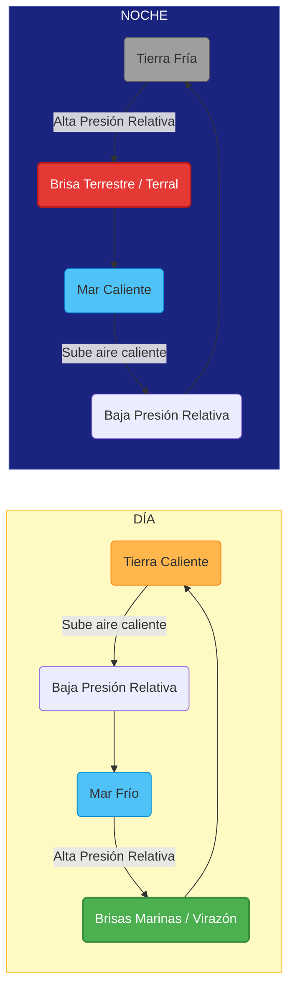

# Meteorología Náutica

Conocer la meteorología es fundamental para la seguridad y el confort en la navegación de recreo. 

## Conceptos Clave

### 1. Presión Atmosférica
Se mide en hectopascales (hPa) o milibares (mb). La presión media a nivel del mar es de 1013 hPa.
*   **Anticiclón (A):** Zona de altas presiones (>1013 hPa). Se asocia a buen tiempo, cielos despejados y vientos flojos. El aire gira en el sentido de las agujas del reloj (en el hemisferio norte).
*   **Borrasca o Depresión (B):** Zona de bajas presiones (<1013 hPa). Se asocia a mal tiempo, nubosidad, lluvia y vientos fuertes. El aire gira en sentido contrario a las agujas del reloj (en el hemisferio norte).
*   **Isobaras:** Líneas que unen puntos con la misma presión atmosférica. Cuanto más juntas están, mayor es la fuerza del viento.

### 2. El Viento
El viento siempre sopla de las altas hacia las bajas presiones.
*   **Escala de Beaufort:** Mide la fuerza del viento, del 0 (Calma, 0 nudos) al 12 (Huracán, >64 nudos). En la náutica de recreo, navegar con vientos superiores a fuerza 6 (Fresco, 22-27 nudos) ya se considera difícil y potencialmente peligroso para barcos pequeños.

### 3. El Estado de la Mar
El viento genera las olas.
*   **Escala de Douglas:** Mide el estado de la mar según la altura de las olas, del 0 (Calma o mar llana) al 9 (Mar enorme, olas de más de 14 metros).
*   **Fetch:** Es la distancia de mar abierto sobre la cual sopla el viento en una dirección constante. A mayor fetch, mayor será el oleaje que se puede formar.

### 3. Vientos Locales y Brisas Térmicas

Las brisas térmicas son vientos locales generados por la diferencia de temperatura entre la tierra y el mar a lo largo del día.

*   **Virazón (Brisa Marina):** Ocurre durante el día. La tierra se calienta más rápido que el mar. El aire caliente sobre la tierra asciende, creando una baja presión que "aspira" el aire más fresco del mar. El viento sopla **del mar a la tierra**. Es el viento preferido para navegar a vela en verano.
*   **Terral (Brisa Terrestre):** Ocurre por la noche. La tierra se enfría más rápido que el mar. El mar retiene el calor, por lo que el aire asciende sobre el agua, creando una baja presión que atrae el aire más frío de la tierra. El viento sopla **de la tierra al mar**. Suele ser más débil que la virazón.

### 5. Previsión Meteorológica
Antes de salir a navegar, es obligatorio consultar los partes meteorológicos. En España, **AEMET** proporciona información meteorológica marítima detallada (avisos de temporal, estado de la mar, predicciones costeras y de altura).
