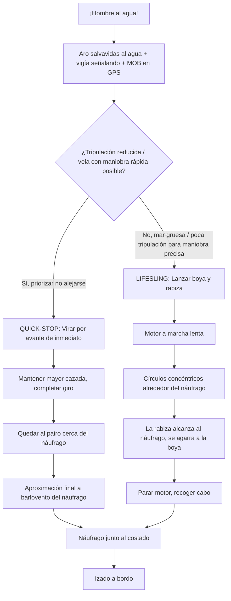

# Protocolo de Hombre al Agua (MOB)

La caída de un tripulante por la borda es la emergencia que más rápido se convierte en tragedia: una persona en el agua se pierde de vista en segundos con solo un metro de ola, y el barco, aunque frene, sigue alejándose por inercia y deriva. No existe una única maniobra "correcta" para todos los casos; existe una secuencia inmediata que nunca cambia y una técnica de recuperación que se adapta a la tripulación, el viento y el estado de la mar.

---

## 1. Secuencia Inmediata (Los Primeros 10 Segundos)

Lo que se hace en los primeros segundos determina si el rescate dura 5 minutos o se convierte en una búsqueda. El orden importa: primero se fija la posición del náufrago, después se maniobra.

1.  **Gritar "¡Hombre al agua!"** en voz muy alta, repetidamente, para que toda la tripulación —incluida la que está bajo cubierta— lo sepa de inmediato.
2.  **Lanzar el aro salvavidas (o boya)** hacia el náufrago de inmediato, aunque esté lejos: le da flotación extra y, sobre todo, crea una referencia visual flotante en el punto de la caída que ayuda a todos a no perder la posición de referencia.
3.  **Designar a un "vigía" que señale con el dedo sin parar de mirar.** Esta es la acción más importante y más olvidada: una persona se dedica en exclusiva a apuntar con el brazo extendido hacia el náufrago y no le quita el ojo de encima bajo ninguna circunstancia, ni siquiera para ayudar en la maniobra. Perder el contacto visual un segundo, con oleaje, puede significar no volver a encontrarlo.
4.  **Marcar la posición en el GPS/plotter (botón MOB).** Todo plotter y la mayoría de las apps de navegación tienen un botón dedicado "MOB" que clava un waypoint exacto en el instante de la caída. Pulsarlo de inmediato da una posición de referencia GPS aunque se pierda el contacto visual.
5.  **Activar la alarma y avisar por radio.** Si hay más tripulación disponible, active la alarma general del barco y, si la maniobra se complica o hay mar gruesa/de noche, emita un MAYDAY por VHF canal 16 con la posición del waypoint MOB.

*Estas cinco acciones son simultáneas, no secuenciales: repártalas entre la tripulación disponible en el mismo instante en que se grita "¡Hombre al agua!".*

---

## 2. Maniobra de Recuperación: Quick-Stop vs. Boya de Recuperación (Lifesling)

Existen dos técnicas clásicas de recuperación, según el tipo de barco, el estado de la mar y el número de tripulantes disponibles a bordo.

### Quick-Stop (Parada Rápida)

Pensada para veleros con tripulación reducida (incluso navegación en solitario con piloto automático), donde no sobran manos para hacer maniobras complejas. La idea es virar de inmediato para no alejarse del punto de caída, en lugar de intentar calcular un rumbo de regreso.

1.  En el instante de la caída, virar por avante (orzar) de inmediato manteniendo la vela mayor cazada, sin soltar escotas.
2.  Completar el giro hasta quedar al pairo (proa al viento con las velas descuadernadas) muy cerca del náufrago, a poca distancia de barlovento.
3.  Arriar o soltar el génova/foque si estorba, y aproximarse a motor o a vela muy despacio, siempre con el náufrago a barlovento para no caerle encima empujado por el viento.
4.  Detener el barco justo al lado del náufrago, con la última maniobra de aproximación a favor del viento para poder frenar en el punto exacto.

### Boya de Recuperación / Lifesling (Círculos Concéntricos)

Preferida cuando hay más mar, más viento, o tripulación limitada para hacer una viradas rápidas y precisas. Consiste en remolcar una boya-aro (Lifesling) unida al barco por una larga rabiza, describiendo círculos alrededor del náufrago hasta que la propia cuerda lo alcance y pueda agarrarse a ella.

1.  Lanzar la boya Lifesling al agua y desplegar toda su rabiza (normalmente 15 a 25 metros).
2.  Motor a marcha lenta, comenzar a describir **círculos amplios y concéntricos** alrededor del náufrago, siempre en el mismo sentido, de forma que la rabiza que arrastra la boya vaya barriendo el agua alrededor de la víctima.
3.  El náufrago debe permanecer donde está (sin nadar hacia el barco) hasta que la línea o la boya pase a su alcance; entonces se agarra o se pasa la boya alrededor del pecho.
4.  Parar el motor en cuanto el náufrago esté sujeto a la rabiza y proceder al izado a bordo.

### Comparativa de las dos Técnicas

*Regla práctica:* el Quick-Stop es más rápido pero exige precisión de maniobra y buena visibilidad del náufrago en todo momento; el Lifesling es más lento pero más tolerante a errores de cálculo, mala mar o tripulación con menos experiencia, porque no depende de "acertar" el punto de parada del barco.

---

## 3. Izado a Bordo de una Persona Inconsciente o sin Fuerzas

Sacar a una persona del agua es, en la mayoría de los casos, más difícil que llegar hasta ella: un cuerpo empapado, exhausto o inconsciente pesa mucho más de lo esperado y el francobordo de la mayoría de embarcaciones de recreo es demasiado alto para trepar sin ayuda.

*   **Escalerilla de baño:** Si el náufrago está consciente y con fuerzas, la plataforma de baño y su escalerilla abatible (deben poder desplegarse también desde el agua) son la vía más rápida.
*   **Aparejo de gancho/poleas (Aparejo de recuperación):** Para una persona inconsciente o sin fuerzas para trepar, use un aparejo de poleas (izador tipo "Man Overboard Module" o un aparejo improvisado con el candelero de la mayor/spinnaker) enganchado a un arnés o a la propia boya Lifesling pasada por debajo de los brazos, e ícela ayudándose de un winch para multiplicar la fuerza disponible.
*   **Plataforma de baño baja:** En lanchas y veleros con plataforma de baño a ras de agua, es a menudo la opción más segura: se puede deslizar al náufrago horizontalmente sobre la plataforma sin necesidad de izarlo en vertical.
*   **Postura de izado:** Recuerde siempre subir al náufrago en posición **horizontal**, nunca vertical tirando de los brazos o los hombros: en una persona con hipotermia, izarla en vertical puede provocar el "colapso por rescate" (fallo cardíaco al redistribuirse de golpe la sangre fría acumulada en las extremidades). Consulte el detalle de este riesgo y su tratamiento en [PRIMEROS_AUXILIOS.md](./PRIMEROS_AUXILIOS.md).

---

## 4. Factores de Riesgo y Prevención

### Factores de Riesgo

*   **Hipotermia:** El factor que más rápido reduce las posibilidades de supervivencia; en aguas frías, la capacidad de nadar o sujetarse a un cabo puede perderse en minutos.
*   **Oscuridad:** De noche, un náufrago sin luz propia es prácticamente invisible; el aro salvavidas con luz de accionamiento automático por volteo es, en esas condiciones, la referencia visual más importante para no perder la posición.
*   **Mar Gruesa:** El oleaje reduce drásticamente la distancia a la que se ve una cabeza en el agua, dificulta enormemente la maniobra de aproximación y aumenta el riesgo de que el propio rescate ponga en peligro a más tripulantes.

### Prevención

La mejor maniobra de hombre al agua es la que nunca hace falta ejecutar:

*   **Arnés y línea de vida:** Uso obligatorio de arnés enganchado a las líneas de vida de cubierta en navegación nocturna, con mal tiempo, o siempre que se navegue en solitario o con tripulación reducida.
*   **Chaleco con luz y silbato:** Todo chaleco a partir de Zona 4 debe llevar luz de emergencia y silbato incorporados (ver [SEGURIDAD.md](./SEGURIDAD.md)), elementos que resultan decisivos para que el náufrago pueda ser localizado y para que él mismo pueda señalar su posición.
*   **Regla de las tres cosas de contacto:** Al moverse por cubierta con mal tiempo, mantenga siempre tres puntos de apoyo/sujeción (dos manos y un pie, o dos pies y una mano) y desplácese agachado y por la zona de barlovento, más protegida.
*   **No navegar solo en cubierta de noche o con mal tiempo** sin avisar a otro tripulante y sin llevar puesto el arnés enganchado.

---

Esta guía complementa las secciones de [SEGURIDAD.md](./SEGURIDAD.md) (equipo obligatorio, chalecos, aro salvavidas) y de [PRIMEROS_AUXILIOS.md](./PRIMEROS_AUXILIOS.md) (tratamiento de la hipotermia tras el rescate).
