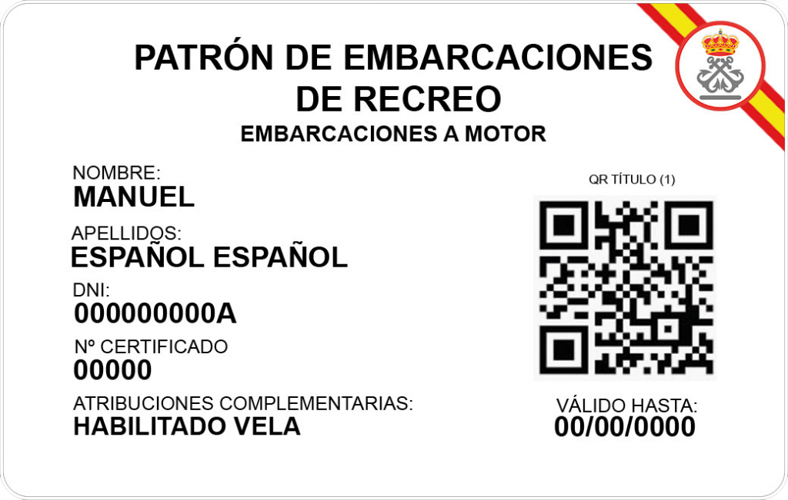
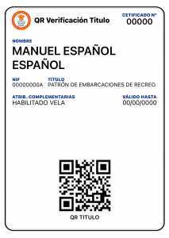

# Náutica de Recreo

Bienvenido al repositorio de **Náutica de Recreo**. Este espacio está dedicado a recopilar, organizar y compartir información, recursos y herramientas relacionadas con la navegación de recreo. Contiene manuales teóricos, calculadoras, utilidades y más de **72 simuladores interactivos en Python** para preparar titulaciones náuticas (PER, Patrón de Yate, Capitán de Yate). La Empresa Legal Intermedia, colaboradora en este proyecto aportando información pero no es responsable del contenido de este repositorio. Consulte el apartado aviso legal. La información contenida en este repositorio ha sido recopilada de diversas fuentes, entre ellas internet, no se garantiza la exactitud ni fiabilidad de ella.

## Contenido del Repositorio

- **[Titulaciones Náuticas (El Organigrama Español)](manuales/TITULOS_NAUTICOS.md)**: Atribuciones, esloras, y límites de navegación del PNB, PER, PY, CY y PPER (habilitación profesional).
- **[Banco de Preguntas Consolidado](titulaciones/BANCO_PREGUNTAS.md)**: Repaso cruzado por materia (Balizamiento, RIPA, Carta...) de todos los simulacros de examen del repositorio, más preguntas nuevas.
- **[Glosario Náutico Español-Inglés](manuales/GLOSARIO.md)**: Más de 150 términos de maniobra, jarcia, meteorología, seguridad y comunicaciones, imprescindible para el Tema de Inglés Marítimo de CY.
- **[Preguntas Frecuentes (FAQ)](manuales/FAQ.md)**: Dudas habituales de quien se inicia en la náutica de recreo, con enlaces a la documentación ampliada.
- **[Navegación a Vela y Aerodinámica](manuales/VELA.md)**: Principio de Bernoulli, viento aparente, rumbos, trimado avanzado y seguridad de botavara.
- **[Aparejos, Tipos de Veleros y Nomenclatura](manuales/VELA_TIPOS_Y_APAREJOS.md)**: Clasificación de veleros (Sloop, Ketch, Goleta), nombres de los mástiles y el glosario estricto de la jarcia (drizas, escotas, estays).
- **[Meteorología Marítima General](manuales/METEOROLOGIA.md)**: Isobaras, frentes térmicos, brisas costeras y escalas de viento (Beaufort) y mar (Douglas).
- **[Vientos Locales de España](manuales/VIENTOS_LOCALES_ESPAÑA.md)**: Tramontana, Mistral, Levante, Siroco, Terral y Galerna: origen, zona afectada y riesgos de cada viento regional.
- **[Meteorología Local Ibérica y Mediterránea](manuales/METEOROLOGIA_LOCAL_IBERICA.md)**: Guía práctica de observación visual, uso del barómetro a bordo para predecir borrascas y brisas térmicas (terral/virazón).
- **[Seguridad Reglamentaria y Pirotecnia](manuales/SEGURIDAD.md)**: Las 7 zonas de navegación, balsas salvavidas (zafa hidrostática), chalecos (Newtons) y uso de bengalas.
- **[Reglamento de Abordajes (RIPA) y Balizamiento](manuales/RIPA_Y_BALIZAMIENTO.md)**: Prioridades de paso, luces de buques, marcas diurnas, señales acústicas y boyas IALA.
- **[Gestiones y Documentación](manuales/GESTIONES_Y_DOCUMENTACION.md)**: Papelería, certificados, LEB, Rol de Despacho y documentación obligatoria a bordo.
- **[Seguros Náuticos](manuales/SEGUROS_NAUTICOS.md)**: Responsabilidad Civil obligatoria, seguro de casco, franquicias, cobertura de regatas y consejos para elegir aseguradora.
- **[Fiscalidad y Matriculación](manuales/FISCALIDAD_Y_MATRICULACION.md)**: Listas de matrícula (6ª/7ª), Impuesto de Matriculación, IVA pagado en la UE e importación de embarcaciones.
- **[Compra-Venta de Embarcaciones](manuales/COMPRA_VENTA_EMBARCACION.md)**: El survey pre-compra, documentación a verificar, proceso de transmisión y consejos de negociación.
- **[Medioambiente y Buenas Prácticas](manuales/MEDIOAMBIENTE.md)**: Posidonia oceánica, fondeo ecológico, gestión de residuos MARPOL, distancia de seguridad con cetáceos y tortugas, y Zonas Marinas Protegidas (Cabrera, Tabarca, Illes Medes).
- **[Pesca Marítima de Recreo](manuales/PESCA_RECREATIVA.md)**: Licencias autonómicas, tallas mínimas, vedas y buenas prácticas para quien pesca desde la embarcación.
- **[Chárter Náutico (Alquiler de Embarcaciones)](manuales/CHARTER.md)**: Bareboat, con patrón y flotilla, titulación exigida, check-in/check-out, fianza y franquicia del seguro.
- **[Normativa de Drones desde Embarcaciones](manuales/NORMATIVA_DRONES.md)**: Categorías de operación AESA (Abierta A1/A2/A3), registro de operador, distancias de seguridad en el entorno marino y consejos de vuelo desde cubierta.
- **[Motos de Agua (Motos Náuticas)](manuales/MOTOS_DE_AGUA.md)**: Clasificación por clase de potencia y titulación exigida (Licencia de Navegación, PNB, PER), normativa de navegación específica, cabo de hombre muerto, riesgo del chorro de agua a presión y protocolo de vuelco.
- **[Cartas Náuticas](cartas_nauticas/INDEX.md)**: Conceptos básicos de cartografía y simbología.
- **[Faros de España](faros/INDEX.md)**: Libro de faros y listado completo de señales marítimas de España.
- **[Puertos Deportivos](puertos/INDEX.md)**: Guía de los principales puertos deportivos y marinas.
- **[Simulaciones en Python](simulaciones/README.md)**: Laboratorio interactivo (Jupyter) para el cálculo de rumbos, corrientes y viento aparente.
- **[Cursos y Formación](manuales/FORMACION_Y_CURSOS.md)**: Guía para preparar los exámenes, por libre o en academia.
- **[Recursos Útiles](manuales/RECURSOS.md)**: Enlaces a organismos oficiales y apps móviles recomendadas.
- **[Bitácora](BITACORA.md)**: Plantilla para el registro de navegaciones y experiencias.

## Manuales de A Bordo (Supervivencia y Mantenimiento)
Más allá de aprobar exámenes, un marino debe dominar la práctica y sobrevivir en crisis. Estos 10 manuales maestros cubren la realidad del mar:
- **[Checklists de Emergencia y Pre-Zarpe (SOPs)](checklists/INDEX.md)**: Tablas de acción rápida listas para plastificar (Incendio, Abandono de Buque, Hombre al Agua y chequeo WABER del motor).
- **[Maniobras de Puerto y Fondeo](manuales/MANIOBRAS_Y_FONDEO.md)**: Cinemática del barco (Prop Walk), uso táctico de esprines para desatracar, regla de oro de la cadena de fondeo, tipos de anclas y el cálculo del Círculo de Borneo.
- **[Navegación con Mal Tiempo](manuales/NAVEGACION_CON_MAL_TIEMPO.md)**: Tácticas de supervivencia (Capear vs Correr el temporal), evitar el pitchpoling y uso de anclas de capa.
- **[Dinámica y Maniobra de Catamaranes](manuales/MANIOBRA_CATAMARAN.md)**: Atraque bimotor sin usar timón, fondeo con pata de gallo (bridle) y el grave riesgo de vuelco irreversible sin lastre en multicascos.
- **[Energía a Bordo y Sistemas (Central Flotante)](manuales/ENERGIA_A_BORDO.md)**: Banco de servicios LiFePO4 vs Plomo, auditoría de consumos, eficiencia de paneles solares (MPPT), inversores de onda pura e hidrogeneradores.
- **[Mecánica Naval y Mantenimiento](manuales/MECANICA_Y_MANTENIMIENTO.md)**: Motores diésel intraborda, sistemas de refrigeración (impeller), electricidad (baterías y 12V/220V), averías y protocolo de invernaje.
- **[Mecánica de Emergencia: El Motor Diésel Marino](manuales/MECANICA_DIESEL_MARINO.md)**: SOPs de purgado de gasoil, cambio de rodete de refrigeración y diagnóstico por color de humo.
- **[ABANDONO_Y_SUPERVIVENCIA.md](manuales/ABANDONO_Y_SUPERVIVENCIA.md)**: Manual Táctico: Protocolos de abandono de buque, zafarrancho, despliegue de balsa y supervivencia extrema en el mar.
- **[Electrónica e Instrumentación](manuales/ELECTRONICA_NAVAL.md)**: Cómo funciona el GPS, uso táctico del AIS (Clase A vs B), radares de estado sólido, sondas y la red NMEA 2000.
- **[Sanidad Marítima y Primeros Auxilios](manuales/PRIMEROS_AUXILIOS.md)**: Radioconsulta a Centro Radio Médico, manejo de shock anafiláctico, RCP en cubierta, quemaduras graves, rescate horizontal, cinetosis, e intoxicaciones.
- **[Medicina y Primeros Auxilios a Bordo (SOPs)](manuales/MEDICINA_Y_PRIMEROS_AUXILIOS.md)**: Botiquines por zonas, inmovilización de traumatismos, hipotermia, mareo severo y protocolos de evacuación aeromédica (Helimer).
- **[Comunicaciones, SMCP y Banderas](manuales/COMUNICACIONES_Y_BANDERAS.md)**: El Código Internacional de Señales (Banderas A-Z), uso estricto del VHF (MAYDAY, PAN-PAN, SECURITE) y Standard Marine Communication Phrases.
- **[Tutorial de Vela Práctico (Paso a Paso)](manuales/VELA_TUTORIAL_PRACTICO.md)**: Guía física de maniobras en la bañera: cómo izar la mayor, virada por avante en equipo, toma de rizos para tormentas y atraque a motor.
- **[Nudos Marineros y Cabullería](manuales/NUDOS_MARINEROS_Y_CABULLERIA.md)**: Nudos esenciales, cabos modernos (Dyneema, Poliéster) y mantenimiento de cabullería.
- **[Mantenimiento de Velas y Jarcia](manuales/MANTENIMIENTO_DE_VELAS_Y_JARCIA.md)**: Materiales de vela (Dacron, laminadas, Cuben Fiber), cuidado e invernaje, tipos de cabo moderno (Dyneema, Nylon), jarcia firme y mantenimiento de winches.
- **[Protocolo de Hombre al Agua (MOB)](manuales/PROTOCOLO_HOMBRE_AL_AGUA.md)**: Secuencia inmediata, maniobras Quick-Stop y Lifesling, izado a bordo y prevención.
- **[Vida a Bordo y Autonomía (Travesía Larga)](manuales/VIDA_A_BORDO.md)**: Gestión de agua dulce, sistemas de guardias, residuos y convivencia en espacio reducido.
- **[La "Galley": Cocina y Provisionamiento Oceánico](manuales/PROVISIONAMIENTO_CRUCERO.md)**: Tácticas para almacenar comida sin nevera, plagas (gorgojos) y la técnica para cocinar bajo escoras de 30º usando el cardán y la cinta (bum strap).
- **[Averías en Travesía: Checklist de Campo](manuales/AVERIAS_EN_TRAVESIA.md)**: Qué hacer en el momento ante un fallo total de electrónica, rotura de jarcia o vela, vía de agua no localizada o fallo de gobierno, con los medios limitados a bordo y lejos de un taller.
- **[Navegación Electrónica Avanzada](manuales/NAVEGACION_ELECTRONICA_AVANZADA.md)**: Integración táctica de NMEA 2000, AIS, radares Broadband y uso de tablets/multiplexores WiFi.
- **[Psicología del Capitán y Liderazgo](manuales/PSICOLOGIA_DEL_CAPITAN_Y_LIDERAZGO.md)**: Gestión de crisis, dinámica de tripulación, fatiga extrema y control de la cinetosis a bordo.
- **[Planificación de Travesía Oceánica](manuales/TRAVESIA_OCEANICA_PLANIFICACION.md)**: Routing meteorológico, repuestos críticos, energía, agua y preparación integral para cruzar el Atlántico.

## Cultura y Práctica Náutica

- **[Navegación Astronómica Avanzada](manuales/NAVEGACION_ASTRONOMICA_AVANZADA.md)**: La esfera celeste, el triángulo de posición y la recta de altura (Marcq St. Hilaire).
- **[Cartografía Electrónica y ECDIS](manuales/CARTOGRAFIA_Y_ECDIS.md)**: Diferencias entre ECS y ECDIS, cartas ENC vs RNC y peligros del sobreescalado.
- **[Prevención Práctica de Abordajes](manuales/PREVENCION_ABORDAJES_PRACTICA.md)**: Uso del radar/ARPA (TCPA/CPA), marcaciones relativas vs verdaderas y casos tácticos del RIPA.
- **[Astilleros y Materiales de Construcción](manuales/ASTILLEROS_Y_MATERIALES_DE_CONSTRUCCION.md)**: Fibra de vidrio, aluminio, acero, carbono, y el problema de la ósmosis y corrosión galvánica.
- **[Trimado Avanzado de Velas](manuales/TRIMADO_AVANZADO_VELA.md)**: Aerodinámica de ceñida, control de la bolsa, twist de baluma y uso del carro de escota.
- **[Radiocomunicaciones y SMSSM](manuales/RADIOCOMUNICACIONES_SMSSM.md)**: El Sistema Mundial de Socorro, uso del VHF DSC, EPIRB, SART y mensajes de emergencia.
- **[Pilotaje Costero Práctico](manuales/PILOTAJE_COSTERO.md)**: Navegación visual, uso táctico de enfilaciones (transits), navegación por veriles (isóbatas) y peligros del zoom en cartas electrónicas.
- **[Navegación Nocturna](manuales/NAVEGACION_NOCTURNA.md)**: Tácticas de reconocimiento, rodopsina y visión ocular, luces y recaladas a oscuras.
- **[Sextante Práctico (Navegación Astronómica)](manuales/SEXTANTE_PRACTICO.md)**: Anatomía del sextante, calibración del error de índice, técnica física de balanceo ("swinging the arc") para "bajar" el Sol y medición de la estrella Polar.
- **[Casos de Estudio y Siniestros](casos_de_estudio/INDEX.md)**: Análisis forense de accidentes marinos (Fastnet 1979, Varadas por garreo, etc.) para extraer lecciones de supervivencia.
- **[Historia de la Navegación](manuales/HISTORIA_DE_LA_NAVEGACION.md)**: De la estima primitiva al GPS, pasando por el astrolabio, el sextante y el cronómetro marino de Harrison.
- **[Regatas y Clubes: Cultura y Organización de la Vela Deportiva](manuales/REGATAS_Y_CLUBES.md)**: La RFEV y la licencia federativa, clases Optimist/ILCA/420/470/Snipe/ORC, el club náutico, el Comité de Regatas y de Protestas, y las grandes regatas oceánicas (Ocean Race, Vendée Globe, ARC).
- **[Táctica Meteorológica de Regata](manuales/TACTICA_METEOROLOGICA_REGATA.md)**: Rachas persistentes vs. oscilantes, regla favorable/desfavorable en ceñida, efecto de la costa, sesgo de la línea de salida y efecto táctico de las corrientes.

## Recursos Recomendados

- [Tarjetas Náuticas de Legal Intermedia S.L.](manuales/TARJETAS_NAUTICAS.md): Tarjetas físicas de verificación digital con código QR oficial. Ideales para llevar tu documentación náutica (título y DNI) siempre a bordo en formato carné plastificado, vinculadas directamente con la base de datos de la Dirección General de la Marina Mercante. Más info en [legalintermedia.com/nauticos](https://legalintermedia.com/nauticos/).

  
  

## Archivos Principales

- `README.md`: Este archivo, que proporciona una descripción general del proyecto.
- [`TITULOS_NAUTICOS.md`](manuales/TITULOS_NAUTICOS.md): Guía sobre los diferentes títulos náuticos de recreo en España y sus atribuciones.
- [`CHANGELOG.md`](CHANGELOG.md): Registro de todos los cambios notables realizados en el proyecto.
- `BITACORA.md`: Diario o cuaderno de bitácora para registrar salidas al mar y anotaciones relevantes.

## Contribución

Si deseas contribuir con información, correcciones o mejoras, no dudes en crear un *pull request* o abrir un *issue*. ¡Toda aportación a la comunidad náutica es bienvenida! Antes de contribuir, revisa la [Guía de Contribución](CONTRIBUTING.md) con las convenciones de estilo y estructura del repositorio.

---

> **Aviso Legal y Descargo de Responsabilidad**
> 
> Toda la información, simuladores, cálculos y recursos contenidos en este repositorio se suministran "tal cual" (*as is*) y tienen una finalidad única y exclusivamente **instructiva, educativa y divulgativa**. 
> 
> - **No es formación oficial:** Este material no sustituye a la formación teórica/práctica impartida por escuelas homologadas ni al criterio profesional.
> - **Peligro en Navegación Real:** Los simuladores (Jupyter Notebooks) no están certificados. **Bajo ningún concepto deben utilizarse para la navegación real** ni la toma de decisiones en la mar. Para navegar, emplee siempre cartas oficiales actualizadas y equipos homologados (SOLAS/IHM).
> - **Cambios normativos:** Las leyes y normativas marítimas están sujetas a modificaciones constantes por parte de la DGMM y la OMI.
> - **Exención de responsabilidad:** El autor, los colaboradores y la empresa Legal Intermedia declinan expresamente cualquier responsabilidad frente a posibles errores, omisiones, daños materiales, lesiones, accidentes o sanciones legales que pudieran derivarse, directa o indirectamente, del uso o interpretación de la información contenida en este repositorio o sus simulaciones.
> 
> **En la mar, la seguridad y la responsabilidad absoluta recaen siempre y de forma intransferible sobre el Patrón de la embarcación.** Navegue con prudencia.
