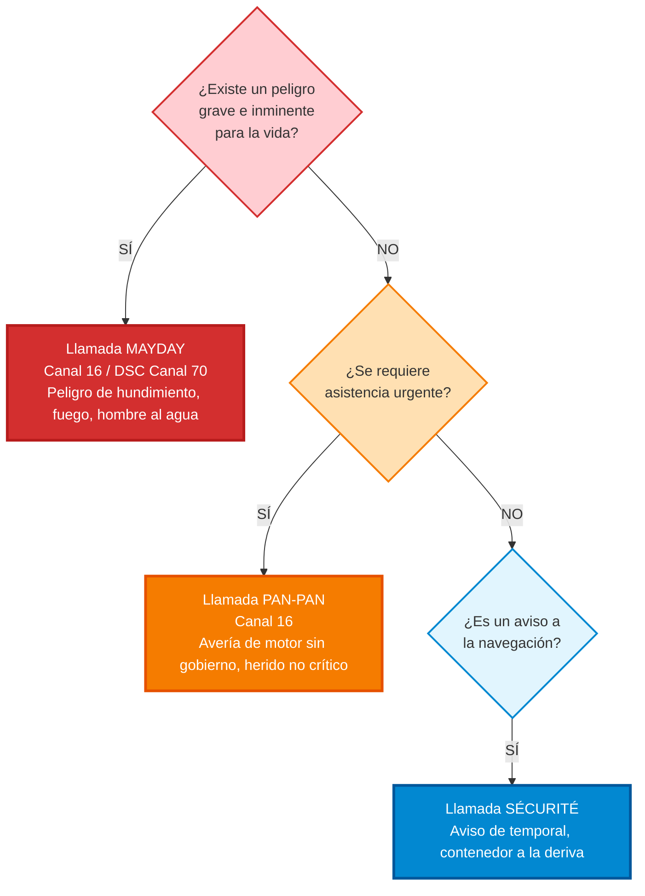

# Seguridad Marítima

La seguridad en la mar es el pilar fundamental de la navegación. Antes de salir, es responsabilidad del patrón comprobar el parte meteorológico, el estado de la embarcación y el equipo de seguridad a bordo.

## Equipo de Seguridad Obligatorio
El material de seguridad obligatorio en España depende de la Zona de Navegación para la que esté despachada la embarcación (de la Zona 1: navegación oceánica, a la Zona 7: aguas protegidas). 
El material básico común incluye:
*   **Chalecos salvavidas:** Uno por cada tripulante a bordo, homologados y con silbato.
*   **Aro salvavidas:** Con rabiza (cabo flotante) y luz (para zonas alejadas).
*   **Pirotecnia:** Bengalas de mano, cohetes con paracaídas y señales fumígenas flotantes (la cantidad depende de la zona).
*   **Extintores:** Acordes a la eslora y motorización.
*   **Achique:** Bomba de achique manual o eléctrica, y baldes.
*   **Botiquín:** Cuyo contenido viene regulado por normativa.

## Comunicaciones (Radio VHF)
La radio VHF es el salvavidas electrónico del navegante.
*   **Canal 16 (156.800 MHz):** Es el canal internacional de socorro, urgencia, seguridad y llamada. Se debe mantener a la escucha de forma permanente mientras se navega.
*   **Llamadas de Emergencia:**
    *   **MAYDAY (Socorro):** Peligro grave e inminente para la vida o la embarcación. Requiere asistencia inmediata (ej: hundimiento, fuego incontrolable, hombre al agua inconsciente). Se repite tres veces: *Mayday, Mayday, Mayday*.
    *   **PAN PAN (Urgencia):** Situación urgente que concierne a la seguridad del barco o una persona, pero que no supone un peligro inmediato (ej: avería de motor, rotura de mástil sin daños personales).
    *   **SECURITE (Seguridad):** Avisos importantes sobre la seguridad de la navegación o avisos meteorológicos (ej: contenedor a la deriva, temporal inminente).

## Maniobra de Hombre al Agua (MOB - Man Overboard)
Si alguien cae por la borda, es la emergencia más crítica. Los pasos inmediatos son:
1.  **Gritar "¡Hombre al agua!"** para alertar a toda la tripulación.
2.  **Lanzar un salvavidas** o cualquier objeto flotante inmediatamente hacia la víctima para marcar su posición y ayudar a su flotabilidad.
3.  **No perder nunca de vista a la víctima:** Asignar a un tripulante la única tarea de señalar y mantener el contacto visual constante.
4.  **Pulsar el botón MOB** del GPS (si se dispone de él) para marcar las coordenadas exactas.
5.  **Iniciar la maniobra de aproximación:** Acercarse siempre por sotavento (por donde sale el viento del barco) para proteger a la víctima con el casco de la embarcación y evitar pasarle por encima.
