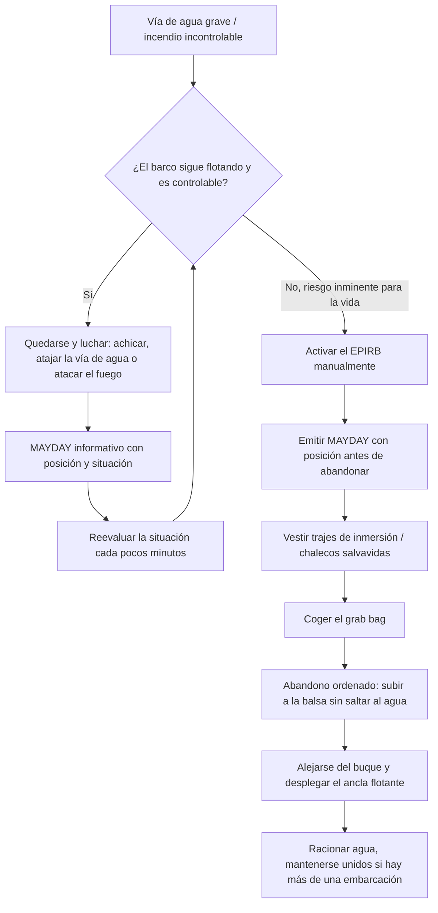

# Seguridad Reglamentaria y Pirotecnia

Salir al mar no es una actividad que la ley deje al azar. Según el Real Decreto 339/2021 sobre el equipo de seguridad y salvamento, toda embarcación abanderada en España debe portar un inventario estricto y homologado (con marcado CE marino, el "timoncito") que depende exclusivamente de la "Zona de Navegación" despachada.

---

## 1. Zonas de Navegación en España

Las capitanías marítimas "despachan" (autorizan) a los barcos a navegar hasta una distancia máxima de la costa, en función de su categoría de diseño y del material de seguridad que lleven a bordo.

*   **Zona 1:** Navegación Oceánica (Sin límite).
*   **Zona 2:** Navegación de Altura (Hasta 60 millas de la costa).
*   **Zona 3:** Navegación Costera (Hasta 25 millas).
*   **Zona 4:** Navegación Costera (Hasta 12 millas). *(El despacho más habitual para embarcaciones de recreo tamaño medio).*
*   **Zona 5:** Navegación Local (Hasta 5 millas).
*   **Zona 6:** Navegación Local (Hasta 2 millas).
*   **Zona 7:** Aguas Protegidas (Rías, bahías y puertos).

*Importante:* El límite real del barco es el más restrictivo entre tu **Título** (ej. PER = 12 millas) y tu **Despacho** (ej. si el barco está en Zona 5, solo puedes alejarte 5 millas aunque tengas el PER).

---

## 2. Chalecos Salvavidas (ISO 12402)

Un chaleco salvavidas no es un simple "flotador". Debe garantizar que una persona inconsciente gire y quede flotando boca arriba con las vías aéreas libres de agua. Se clasifican por su flotabilidad en **Newtons (N)**.

*   **100 N (Ayudas a la flotación):** Zonas 5, 6 y 7. Solo válidos en aguas tranquilas. No garantizan el giro de un inconsciente con ropa de abrigo pesada.
*   **150 N (Uso general):** Obligatorios en Zonas 2, 3 y 4. Garantizan el giro. Pueden ser de espuma rígida o hinchables automáticos (con pastilla de sal o dispositivo hidrostático Hammar que se infla al sumergirse 10 cm). Los hinchables requieren revisión oficial anual.
*   **275 N (Alta Mar Extrema):** Obligatorios en Zona 1. Diseñados para compensar el enorme peso de trajes de supervivencia y herramientas enganchadas al arnés.

A bordo debe haber **un chaleco por cada persona permitida en el barco**, además de un $10\%$ extra si es chárter, y chalecos infantiles específicos adaptados a su talla/peso, dotados con silbato y luz de emergencia (a partir de Zona 4).

---

## 3. Las Balsas Salvavidas (Life Rafts)

Obligatorias para **Zona 1, 2 y 3** (navegaciones a más de 12 millas). 

Las balsas salvavidas de recreo deben cumplir la normativa internacional ISO 9650 o equivalente SOLAS. Se presentan en un contenedor rígido (o una valija blanda si se estiban bajo cubierta, aunque no es lo ideal). 

### Mecanismo de Activación (Zafa Hidrostática)
Las balsas deben ir estibadas en cubierta, libres de estorbos. Llevan una boza (cabo) de unos 15 metros que se ata firmemente a una cornamusa del barco. 
*   **Disparo Manual:** Arrojar el contenedor al agua y tirar bruscamente de todo el cabo de la boza. El "tirón" abre la válvula de las botellas de CO2 inflando la balsa en 5 segundos.
*   **Disparo Automático:** Si el buque se hunde tan rápido que no da tiempo a soltarla, un mecanismo llamado **zafa hidrostática** corta automáticamente las cintas de sujeción al llegar a 2 o 4 metros de profundidad bajo el agua por presión. La balsa flotará hacia la superficie desenrollando la boza hasta dar el "tirón" y auto-inflarse. El barco, al seguir hundiéndose hacia el fondo, partirá la boza (que tiene un eslabón débil de rotura) liberando a la balsa para que no se hunda con el buque.

---

## 4. Señales Pirotécnicas (Emergencia Visual)

La pirotecnia náutica caduca a los **4 años** (o 3 según el fabricante) y debe ser renovada rigurosamente; en caso de inspección de la Guardia Civil, llevar pirotecnia caducada implica sanciones severas.

### Bengalas de Mano (Rojas)
*   *Función:* Avisar de la posición *cuando ya estás viendo al barco de rescate* (Alcance visual: 2-3 millas). 
*   *Uso:* Se sujetan con la mano, apuntando a sotavento. Generan escorias fundidas a más de $1000^\circ\text{C}$ que caen, por lo que **jamás** deben encenderse encima de la balsa salvavidas de goma.
*   *Dotación:* 3 para Zona 4.

### Cohetes con Paracaídas (Rojos)
*   *Función:* Aviso de socorro a larguísima distancia y sobre el horizonte. Suben a más de 300 metros de altura y descienden lentamente colgando de un paracaídas, ardiendo a luz muy brillante roja durante unos 40 segundos. Visibles a más de 20 millas.
*   *Uso:* Disparar ligeramente inclinado (a favor del viento para no quemar la nave).

### Botes Fumígenos (Humo Naranja)
*   *Función:* Localización **diurna** para equipos aéreos (helicópteros SAR).
*   *Uso:* Se activan y se arrojan al agua. Emiten una densa nube de humo naranja durante más de 3 minutos, indicando visualmente tu posición y la dirección/fuerza del viento para el piloto.

---

## 5. Prevención de Incendios: Extintores

La lucha contra incendios exige herramientas específicas, pues el agua a bordo a veces es tu enemigo.
*   **Dotación Mínima:** Depende de la eslora del barco y de la potencia total del motor, oscilando desde 1 extintor 21B para barcos menores, hasta múltiples extintores repartidos cerca de la cocina, cuarto de derrota y camarotes.
*   **Sala de Máquinas:** Todo barco intraborda moderno lleva un agujero minúsculo en la tapa de insonorización del motor para inyectar el extintor sin abrir el compartimento (si lo abres, entra oxígeno repentinamente y ocurre un *flashover* o llamarada explosiva masiva). Los barcos más grandes llevan extintores fijos automáticos (Halón o sustitutos FM200) que se disparan por temperatura.

---

## 6. Equipo Diverso Imprescindible

Incluso en Zona 4, la capitanía marítima exige portar:
*   Aro salvavidas con rabiza (cabo flotante largo de 27 metros) y luz flotante de accionamiento automático por volteo.
*   Espejo de señales (heliógrafo).
*   Bocina de niebla (manual o de gas presurizado).
*   Compás de gobierno magnético instalado y operativo, más cartas náuticas actualizadas de la zona, compás de puntas y transportador.
*   Prismáticos (Binoculares 7x50, estandarizados porque 7x de aumento es lo máximo que puedes sostener sin marearte en un barco en movimiento, y 50 mm de diámetro proporciona luminosidad estelar).

---

## 7. Lucha Contraincendios a Bordo

Un incendio en el mar es, junto con la vía de agua, la emergencia más temida: no hay bomberos a los que llamar y no existe la opción de "salir corriendo" salvo abandonar el barco a la balsa. La rapidez de reacción en el primer minuto decide si el fuego se apaga con un extintor de mano o si termina en un MAYDAY.

### El Triángulo del Fuego

Todo fuego necesita tres elementos simultáneos: **combustible** (gasoil, gas, madera, plástico), **comburente** (oxígeno del aire) y **calor** (chispa, cortocircuito, cigarro). Apagar un incendio consiste siempre en eliminar uno de los tres lados del triángulo: sofocar (quitar oxígeno), enfriar (quitar calor) o cortar el combustible.

### Tipos de Extintor y Qué Fuego Apagan

No todos los extintores sirven para todos los fuegos; usar el incorrecto puede empeorar la situación (por ejemplo, agua sobre un fuego eléctrico electrocuta a quien lo sostiene).

*   **Clase A (Sólidos: madera, cojines, ropa, papel):** Se apagan por enfriamiento. Extintor de **Polvo ABC** o agua.
*   **Clase B (Líquidos: gasoil, gasolina, aceite, disolventes):** Se apagan por sofocación, nunca con agua (la esparce y extiende el incendio flotando sobre ella). Extintor de **Polvo ABC** o **CO2**.
*   **Clase C (Gases: butano, propano, gas del sistema de cocina):** Extremadamente peligroso; lo primero es cortar la válvula de la bombona, no apagar la llama mientras siga escapando gas (riesgo de reignición explosiva de la nube acumulada). Extintor de **Polvo ABC**.
*   **Fuegos Eléctricos (Cuadro eléctrico, motor, baterías):** El extintor de **CO2** es el preferido a bordo porque no deja residuo corrosivo ni conductor sobre la electrónica (a diferencia del polvo ABC, que inutiliza instrumentos y motores tras usarlo). Cortar siempre la corriente antes de atacar el fuego si es posible.

*Polvo ABC vs. CO2:* El polvo ABC es polivalente y barato, pero corrosivo y sucio (arruina la instrumentación electrónica si se usa cerca del cuadro eléctrico). El CO2 es más limpio y apto en espacios cerrados como la sala de máquinas, pero desplaza el oxígeno del aire, por lo que **nunca debe usarse en un espacio confinado con una persona dentro**.

### Ubicación Recomendada de los Extintores

En un velero o lancha de crucero, deben repartirse de forma que siempre haya uno accesible **sin tener que cruzar el fuego** para alcanzarlo:

*   Uno cerca del **puesto de gobierno / cockpit** (acceso inmediato desde el timón).
*   Uno cerca de la **cocina** (el lugar de mayor riesgo por gas y sartenes), pero fuera del propio compartimento de cocina, junto a la puerta o salida.
*   Uno junto a la **entrada del camarote de proa** y otro cerca de los camarotes de popa, para no quedar atrapado si el fuego surge en crujía.
*   Uno dedicado a la **sala de máquinas**, idealmente fijo y automático (disparo por temperatura), inyectable desde el pasador exterior sin abrir la tapa del motor.

### Protocolo de Actuación

1.  **Dar la alarma:** Gritar "¡Fuego, fuego, fuego!" para alertar a toda la tripulación de inmediato.
2.  **Cortar la fuente:** Cerrar la llave de paso del gas, parar el motor y cortar la corriente eléctrica de la zona afectada (interruptor general de baterías) si es seguro hacerlo.
3.  **Atacar el fuego:** Con el extintor adecuado, apuntar a la base de las llamas (no a la parte alta) en barrido corto, manteniéndose a favor del viento para no inhalar los gases tóxicos ni quedar cegado por el humo.
4.  **Confinar:** Cerrar puertas y escotillas del compartimento afectado para limitar el oxígeno disponible mientras se prepara el siguiente extintor.
5.  **Evacuar si no se controla:** Si tras vaciar el extintor el fuego sigue creciendo, o el humo impide respirar, es momento de emitir MAYDAY, preparar la balsa salvavidas y abandonar el barco por la zona más alejada del fuego (normalmente a barlovento), siguiendo el protocolo de abandono de buque de este manual.

---

## 8. Vía de Agua y Control de Averías

Una vía de agua no controlada es la segunda causa de pérdida de embarcaciones de recreo tras el incendio. El objetivo del *damage control* no es necesariamente "secar" el barco, sino **ganar tiempo**: mantener la entrada de agua por debajo de la capacidad de achique hasta llegar a puerto o hasta que llegue el rescate.

### Sistemas de Achique (Bombas de Sentina)

*   **Achique Eléctrico:** La bomba de sentina automática (con interruptor de flotador) es la primera línea de defensa, pero tiene un caudal limitado (normalmente insuficiente frente a una vía de agua real) y depende de que las baterías sigan operativas.
*   **Achique Manual:** Toda embarcación debe llevar una bomba de achique manual de accionamiento por palanca, independiente de la corriente eléctrica. Es lenta y cansada, pero funciona aunque se apague todo el sistema eléctrico del barco.
*   **Achique de Emergencia:** En una vía de agua grave, cualquier recipiente (cubos) y el propio motor pueden usarse como bomba de emergencia: muchos motores intraborda permiten improvisar la aspiración de la toma de refrigeración hacia la sentina en caso de inundación masiva. La regla no escrita es "la mejor bomba de achique es un tripulante asustado con un cubo".

### Taponamiento de Vías de Agua en Pasacascos

La mayoría de las vías de agua graves en recreo no vienen de un choque, sino del **fallo de un pasacascos** (la válvula/racor que atraviesa el casco para tomas de agua de mar, WC, refrigeración, etc.) por rotura de la manguera o del propio accesorio.

*   **Tacos de Madera (Cuñas):** Todo barco debe llevar, atado con un cabo junto a cada pasacascos, un juego de tacos de madera cónicos de varios tamaños. Ante el fallo de un pasacascos, se clava el taco directamente a martillazos en el agujero (la madera se hincha al mojarse, mejorando el sellado) hasta cortar o reducir drásticamente la entrada de agua.
*   **Cierre de la Válvula:** Si el pasacascos conserva su válvula (grifo) operativa, ciérrala primero; el taco es el recurso para cuando la propia válvula o el racor se ha roto y ya no se puede cortar el paso por ahí.
*   **Colchones y Lonas (Vía de agua por el casco):** Ante una vía de agua por impacto o desgarro del casco, se puede aplicar desde el exterior una lona, vela vieja o colchón contra el agujero, trincado con cabos alrededor del casco; la propia presión del agua ayuda a sellarlo contra el forro.

### Protocolo Básico de Damage Control

1.  **Localizar:** Determinar de dónde viene el agua (sentina de proa, de motor, de popa) para saber qué compartimento está afectado; escuchar y mirar, no solo confiar en la alarma de sentina.
2.  **Achicar y contener:** Poner en marcha toda bomba disponible (eléctrica y manual) mientras se ataja el origen con tacos, lonas o cierre de válvulas.
3.  **Aislar el compartimento:** Cerrar puertas estancas o mamparos si el barco los tiene, para que la inundación no se extienda a otros compartimentos y comprometa la flotabilidad general.
4.  **Aligerar y reequilibrar:** Si la entrada de agua supera la capacidad de achique, aligerar peso y repartir la tripulación para mantener el barco lo más adrizado y a flote posible, favoreciendo que la vía de agua quede lo más alta posible respecto a la línea de flotación.
5.  **Comunicar y prepararse para abandonar:** Emitir PAN-PAN o MAYDAY según gravedad, informando de la situación y posición, y tener la balsa salvavidas y los chalecos preparados si el achique no logra estabilizar el nivel de agua.

En caso de colisión (con otro barco, un contenedor a la deriva o un bajo), el shock inicial no debe demorar la inspección: revisar de inmediato todas las sentinas y compartimentos en busca de vía de agua antes de continuar la navegación, aunque el barco parezca estar bien a simple vista.

---

## 9. Abandono de Buque: Cuándo y Cómo

Abandonar el barco es la decisión más grave que puede tomar un patrón, y la estadística de rescates marítimos es clara sobre el error más letal: abandonar demasiado pronto. La regla de oro es tajante:

> **Solo se abandona un barco que se hunde para subir a otro que flota.**

Un casco de fibra o acero, aunque esté escorado, ardiendo parcialmente o con una vía de agua activa, casi siempre ofrece más flotabilidad, más espacio, más visibilidad para los equipos de rescate y más protección frente al frío que una balsa de goma de dos metros. Numerosos naufragios reales terminan con la tripulación muerta en la balsa mientras el barco, "abandonado" a su suerte, es hallado días después todavía a flote. **No se abandona un barco a flote por muy dañado que esté**, salvo que exista un riesgo inminente y cierto para la vida (explosión inminente, incendio ya incontrolable invadiendo toda la cubierta, hundimiento en curso irreversible). Mientras el barco flote y sea mínimamente gobernable, se queda y se lucha: se achica, se ataja la vía de agua, se combate el fuego.

### Secuencia de Abandono Ordenado

Cuando la decisión de abandonar ya es innegociable, el abandono se ejecuta como una maniobra, no como una huida:

1.  **Emitir el mensaje de socorro antes de abandonar.** Con el barco todavía a flote y la instalación eléctrica operativa, transmitir MAYDAY por VHF canal 16 (posición, naturaleza de la emergencia, número de personas a bordo). Es mucho más fácil emitir esta llamada desde el puesto de radio del barco que desde una balsa a la deriva; retrasar el abandono unos segundos para dar este aviso puede ser la diferencia entre ser rescatado en horas o en días.
2.  **Activar el EPIRB manualmente.** No confiar solo en que la zafa hidrostática lo dispare al hundirse el barco: extraerlo de su soporte y activarlo a mano antes de abandonar, para que la señal de socorro empiece a emitirse cuanto antes y llevarlo con la tripulación a la balsa.
3.  **Vestir trajes de inmersión o la máxima ropa de abrigo posible**, y ponerse el chaleco salvavidas correctamente ajustado. El frío, no el ahogamiento, es la principal causa de muerte en supervivencia en balsa; vestirse adecuadamente antes de salir es tan importante como la propia balsa.
4.  **Coger el "grab bag"** (la bolsa de emergencia preparada de antemano, ver sección 11) de camino a cubierta.
5.  **Subir a la balsa sin saltar al agua si es posible.** La balsa debe arrojarse al agua, inflarse y amarrarse firmemente junto al costado del barco (mientras este siga a flote) para que la tripulación puese pasar directamente de cubierta a la balsa "escalón a escalón", en lugar de saltar al mar y nadar hasta ella; nadar en el agua con ropa de abrigo empapada agota y enfría mucho más rápido de lo esperado, y siempre existe el riesgo de no poder subirse después a la balsa por el propio esfuerzo.
6.  **Contar a toda la tripulación** en cuanto estén en la balsa y, en cuanto se confirme que todos están a bordo de ella, cortar o soltar la boza para alejarse del buque, que puede hundirse arrastrando o golpeando la balsa, o liberar restos y objetos flotantes peligrosos a su alrededor.

---

## 10. Supervivencia en Balsa Salvavidas

Una balsa homologada (ISO 9650 o SOLAS) no es un simple flotador: lleva un equipo de supervivencia estibado en una bolsa interior, pensado para mantener con vida a la tripulación durante días hasta la llegada del rescate.

### Contenido del Equipo Estándar

*   **Agua envasada:** Raciones individuales selladas (normalmente en torno a 1,5 litros por persona), pensadas para racionar, no para beber libremente.
*   **Raciones alimenticias:** Barritas o galletas energéticas de alta densidad calórica y bajo contenido en sal (la sal aumenta la sed y acelera la deshidratación).
*   **Señales pirotécnicas:** Un juego reducido de bengalas de mano y, en balsas mayores, algún cohete, para señalizar en cuanto se avista un barco o avión.
*   **Kit de pesca:** Sedal, anzuelos y algún señuelo, como recurso de supervivencia a medio plazo si el rescate se demora más de lo previsto.
*   **Esponja de achique:** Imprescindible para mantener seco el suelo de la balsa; el agua que entra con la tripulación o por el oleaje enfría el cuerpo mucho más rápido que el aire, aunque haga el mismo frío.
*   **Ancla flotante (drogue):** Un pequeño paracaídas submarino unido a la balsa por un cabo, para reducir la deriva y mantener la orientación frente al oleaje (ver más abajo).
*   Además, suele incluir: fuelle o bomba de aire de repuesto para mantener la presión de las cámaras, un pequeño botiquín, linterna, espejo de señales y un cuchillo de seguridad de hoja roma (para no pinchar accidentalmente la propia balsa).

### Racionamiento de Agua

La deshidratación mata más despacio de lo que instintivamente se cree, y el error más común es beberse toda el agua disponible el primer día por pánico o sed. La pauta realista de supervivencia:

*   **Primeras 24 horas:** No beber, o beber una cantidad mínima simbólica. El cuerpo tiene reservas suficientes y beber de más en las primeras horas solo adelanta el momento en que el agua se agote.
*   **Días siguientes:** Racionar a sorbos pequeños y espaciados, en torno a medio litro por persona y día, ajustando según la disponibilidad real y el número de tripulantes.
*   **Jamás beber agua de mar**, por mucha sed que se tenga: el exceso de sal obliga al riñón a gastar más agua corporal de la que aporta, acelerando la deshidratación hasta ser mortal en poco tiempo.
*   Recoger agua de lluvia con cualquier superficie disponible (la propia capota de la balsa, lonas) siempre que sea posible, para alargar las raciones envasadas.

### Mantenerse Juntos si Hay Más de una Embarcación de Supervivencia

Si el abandono obliga a repartir a la tripulación entre varias balsas o embarcaciones auxiliares, **deben amarrarse entre sí con un cabo** en cuanto sea seguro hacerlo, formando un único conjunto a la deriva en lugar de dispersarse. Un grupo de balsas unidas presenta un objetivo mucho mayor y más fácil de localizar visualmente o por radar que varias balsas pequeñas y separadas, permite repartir agua y víveres entre unidades si alguna se ha perdido o dañado, y sostiene mucho mejor la moral de la tripulación que la incertidumbre de una separación.

### El Ancla Flotante (Drogue)

Desplegada desde la proa de la balsa, el ancla flotante cumple dos funciones críticas:

*   **Minimizar la deriva:** Frena el desplazamiento de la balsa empujado por el viento, manteniéndola más cerca del último punto de posición conocido (el que consta en el MAYDAY y en el EPIRB), lo que reduce drásticamente el área de búsqueda de los equipos de rescate.
*   **Mantener la orientación frente al oleaje:** Sin ancla flotante, una balsa ligera tiende a colocarse de costado al oleaje (a través de la mar), la posición de mayor riesgo de vuelco. El ancla flotante actúa de freno en la proa y mantiene la balsa orientada de cara a las olas, mucho más estable y con muchísimo menor riesgo de volcar.

---

## 11. El "Grab Bag" (Bolsa de Emergencia)

El "grab bag" es una bolsa de emergencia preparada con antelación, estanca y con flotabilidad propia (para no hundirse si cae al agua durante el abandono), que se mantiene siempre accesible cerca de la salida de cabina o del puesto de gobierno durante cualquier travesía oceánica. En el momento de abandonar el barco no hay tiempo para pensar ni para buscar objetos por el interior: coger esta bolsa forma parte de la propia secuencia de abandono (sección 9).

Contenido recomendado:

*   **Copia de la documentación náutica:** Rol de despacho, seguro, permiso de navegación y documentación de identidad de la tripulación, preferiblemente plastificada o en funda estanca.
*   **PLB personal (Personal Locator Beacon):** Un radiofaro individual adicional al EPIRB del barco, que cada tripulante puede activar por separado si el grupo llegara a dispersarse.
*   **Agua embotellada extra:** Un suplemento a las raciones ya incluidas en la balsa, especialmente importante si la travesía es larga o la tripulación numerosa.
*   **Botiquín compacto:** Una versión reducida y esencial del botiquín de a bordo (analgésicos, gasas, vendaje, medicación crónica de algún tripulante).
*   **Linterna estanca:** Con pilas de repuesto en bolsa separada, imprescindible para señalizar de noche además de la luz propia de la balsa.
*   **Silbato:** Señal acústica que no depende de baterías y que permite mantener el contacto entre tripulantes en caso de niebla o de separación en el agua.
*   **Manta térmica (manta de supervivencia):** Ligera, compacta y muy eficaz reteniendo el calor corporal como complemento a la ropa de abrigo o traje de inmersión.

*Recomendación práctica:* revisar y actualizar el grab bag antes de cada travesía oceánica (caducidad de la documentación, pilas, medicación) y asegurarse de que toda la tripulación sabe exactamente dónde está estibado.

---

## 12. Diagrama de Decisión: Quedarse a Bordo o Abandonar

---

Para la emergencia de "hombre al agua" (MOB), que requiere un protocolo propio de maniobra y rescate, consulta la guía dedicada: [Protocolo de Hombre al Agua](./PROTOCOLO_HOMBRE_AL_AGUA.md).
