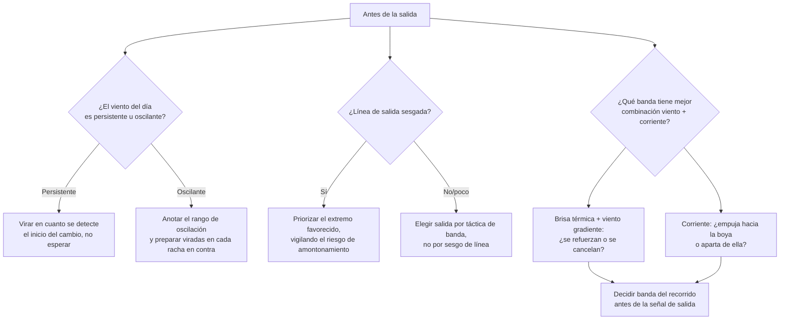

# Táctica Meteorológica en Regata

Saber ceñir, virar o leer una isobara no basta para ganar una regata: hay que traducir esa información en decisiones tácticas, minuto a minuto, sobre el agua. Esta guía es el complemento estratégico de otros dos documentos del repositorio y no repite su contenido:

*   **[VELA.md](VELA.md#9-reglamento-de-regatas-a-vela-rrv--world-sailing)**: aquí se explican las reglas de paso del RRV (amuras opuestas, barlovento/sotavento, alcanzar) y las señales del Comité de Regatas. Este documento asume que ya las conoces y se centra en *cómo ganar metros al viento*, no en el derecho de vía.
*   **[REGATAS_Y_CLUBES.md](REGATAS_Y_CLUBES.md)**: aquí se explica la organización, los comités y los formatos de regata (barlovento-sotavento vs. costera). Este documento asume ese contexto y se centra exclusivamente en la **táctica meteorológica**: cómo leer el viento, la costa y la corriente para tomar mejores decisiones de rumbo.

En resumen: VELA.md y REGATAS_Y_CLUBES.md explican las reglas y el marco de la regata; este archivo explica cómo **ganarla usando la meteorología**.

---

## 1. Rachas y Oscilaciones de Viento (Shifts)

No todos los cambios de dirección del viento se gestionan igual. Distinguir de qué tipo es la racha que tienes delante es la habilidad táctica más importante en ceñida.

### Racha Persistente (Persistent Shift)

Es un cambio de dirección **de medio plazo** que se mantiene y no vuelve atrás: el viento gira progresivamente hacia un lado (por ejemplo, rola de Nordeste a Este a lo largo de la mañana) y no vuelve a su dirección original durante la prueba. Suele estar causado por la evolución sinóptica del día (paso de un frente, rotación de la brisa térmica a medida que avanza el día) más que por turbulencia local.

*   **Cómo detectarla:** comparando la dirección media del viento cada 5-10 minutos con el promedio de los últimos 20-30 minutos. Si la tendencia es siempre hacia el mismo lado y no oscila de vuelta, es persistente.
*   **Cómo jugarla:** en cuanto detectas el inicio de una racha persistente que te va a rolar en contra, **cambia de amura (vira) cuanto antes**. Cada minuto que sigas en la amura equivocada es distancia perdida frente a un rival que sí haya virado. Al contrario que la oscilación, aquí no conviene esperar a que "vuelva": no va a volver.

### Oscilación (Oscillating Shift)

El viento **oscila alrededor de una dirección media** (por ejemplo, entre 340° y 020°, con media en 000°), típicamente por turbulencia térmica, oleaje o inestabilidad local, sin que exista una tendencia clara de rotación a largo plazo.

*   **Cómo detectarla:** el viento cambia de dirección varias veces en pocos minutos, pero siempre vuelve a pasar por el mismo valor medio. Merece la pena anotar (mentalmente o en el compás) los extremos de la oscilación durante la salida para conocer el rango antes de la primera ceñida.
*   **Cómo jugarla — "cabalgar" las rachas:** en ceñida, cuando el viento **rola hacia tu amura actual** (te permite orzar y apuntar más alto a la boya sin perder velocidad), te conviene quedarte en esa amura y aprovechar el ángulo extra. Cuando el viento **rola en tu contra** (te obliga a caer y alejarte del rumbo directo a la boya), esa es la señal para virar hacia la amura contraria, donde la misma oscilación ahora juega a tu favor. El barco que virá en cada racha desfavorable y se queda en cada racha favorable navega, de media, una distancia mucho más corta que el que mantiene el rumbo fijo.

**La regla práctica:** persistente → vira una vez y no vuelvas. Oscilante → vira en cada racha desfavorable, cabalga cada racha favorable. El primer objetivo en la salida (o antes, estudiando el pronóstico) es averiguar con cuál de los dos escenarios vas a jugar ese día.

---

## 2. La Regla del Viento Favorable/Desfavorable en Ceñida

Para saber si una racha es favorable o desfavorable no hace falta mirar el compás fijamente: basta con observar qué le pasa a la **boya de barlovento** respecto a la proa.

*   **Racha favorable (Header a favor / "Lift"):** el viento rola de forma que te permite **orzar** (apuntar más arriba, más cerca de donde sopla el viento) manteniendo la misma velocidad de casco. La boya de barlovento "se acerca" a la proa. En este caso no hace falta virar: simplemente orza y aprovecha el ángulo extra hacia la boya.
*   **Racha desfavorable ("Header"):** el viento rola en el sentido contrario y te obliga a **caer** para mantener el ángulo de ceñida óptimo; la boya de barlovento "se aleja" de la proa, hacia el través. Si sigues en la misma amura estás navegando un ángulo peor del que podrías conseguir virando: es la señal para virar.

La clave está en que orzar (o caer) sin perder velocidad de casco no es gratis: cada ángulo de ceñida tiene una velocidad óptima asociada, y esa combinación de ángulo y velocidad es exactamente lo que mide el **VMG (Velocity Made Good)**, explicado con la curva polar del velero en [simulaciones/16_curva_polar_velero.ipynb](simulaciones/16_curva_polar_velero.ipynb). Una racha favorable, en términos de VMG, es la que te permite **aumentar tu componente de velocidad hacia la boya sin salirte de la banda de ángulos óptima de tu curva polar**; una racha desfavorable es la que te obliga a elegir entre perder VMG manteniendo el rumbo, o virar para recuperar el ángulo óptimo en la amura contraria.

En la práctica, la decisión se reduce a comparar el rumbo compás actual con el rumbo compás medio de ceñida óptimo (el que da mejor VMG con la fuerza de viento del momento, según la polar del barco): si el rumbo actual es más favorable que la media, quédate; si es peor, vira.

---

## 3. Efecto de la Costa sobre el Viento

El viento nunca es homogéneo en todo el campo de regatas cuando hay costa cerca, y esto se debe a dos fenómenos distintos que conviene separar.

### Gradiente de viento por fricción y obstáculos

El viento pierde intensidad cerca de la costa por la fricción del aire contra el relieve, los edificios, los acantilados o la vegetación. Este efecto crea una zona de viento más flojo y más racheado (turbulento, con oscilaciones más bruscas de dirección e intensidad) pegada a tierra, que se va regularizando y ganando fuerza a medida que se navega mar adentro. Como regla general, cuanto más alto y abrupto es el terreno cercano, más ancha y más marcada es esta "sombra de viento".

### Canalización en bahías y estrechos

Cuando el viento gradiente (el viento sinóptico general, asociado a las isobaras) tiene que atravesar una bahía, una ría o un estrecho entre dos puntas o islas, el terreno lo **canaliza**: el viento tiende a alinearse con la orientación del accidente geográfico y puede acelerarse notablemente al comprimirse en la parte más estrecha (efecto Venturi), igual que ocurre con la corriente de agua en un canal. Esto genera zonas de viento más fuerte y más constante en dirección exactamente donde, por la primera regla, cabría esperar viento más flojo por proximidad a tierra: hay que conocer la orografía concreta del campo de regatas para no generalizar.

### La resultante: viento gradiente + brisa térmica

En días de verano con poco gradiente sinóptico, la brisa térmica (virazón y terral) explicada en [METEOROLOGIA.md, sección 3](METEOROLOGIA.md#3-vientos-locales-térmicos) no sustituye al viento general: se **superpone** a él vectorialmente. El viento que realmente sopla sobre el campo de regatas es la suma de:

1.  El viento gradiente/sinóptico de la zona (el que marca el mapa isobárico o el GRIB para esa área amplia).
2.  La brisa térmica local generada por el calentamiento diferencial tierra-mar.

Cuando ambos componentes soplan en direcciones parecidas, el resultado es un viento más intenso de lo que indicaría cada uno por separado. Cuando soplan en direcciones opuestas o muy distintas, el resultado puede ser un viento flojo, inestable y muy variable en dirección durante las horas de transición (media mañana, cuando la térmica empieza a imponerse, o el atardecer, cuando se apaga y el gradiente vuelve a dominar). En una regata costera, prever esta resultante —y no solo consultar el parte general— es lo que marca la diferencia entre acertar la banda del campo de regatas o quedarse sin viento en la equivocada.

---

## 4. Estrategia de Salida y Primera Ceñida

La salida condiciona buena parte de la regata: cruzar la línea con velocidad, en el extremo correcto y en la banda de más viento suele valer más que cualquier maniobra posterior.

### Leer el sesgo de la línea (Line Bias)

La línea de salida rara vez es exactamente perpendicular al viento. Se dice que está **sesgada (biased)** hacia un extremo cuando uno de los dos —el barco de comité o la boya de salida— queda más adelantado hacia de dónde sopla el viento que el otro.

*   **Cómo comprobarlo antes de la salida:** ponte con la proa apuntando exactamente a lo largo de la línea (de un extremo al otro) y observa dónde marca el viento en el compás; o, más simple, navega en ceñida cerca del centro de la línea y compara mentalmente la distancia al viento desde cada extremo. El extremo que queda más a barlovento (más cerca de "de dónde sopla el viento") es el **extremo favorecido**: salir por ahí te da una ventaja de ángulo inmediata sobre quien sale por el otro extremo, equivalente a haber virado antes con una racha favorable.
*   **Regla práctica:** cuanto más sesgada esté la línea, más se concentrará la flota en el extremo favorecido, con el riesgo de amontonamiento y salidas sucias; hay que sopesar la ventaja angular contra el riesgo táctico de salir en un grupo muy apretado.

### Elegir la banda del recorrido antes de salir

Antes de la señal de salida conviene decidir, con la información disponible (parte meteorológico, brisa térmica prevista según la hora del día, efecto de costa de la sección 3, corriente prevista según la sección 5), por qué **banda** del campo de regatas subir en la primera ceñida:

*   ¿Hay más viento previsible en un lado del recorrido por canalización o por menor sombra de costa?
*   ¿Se espera que la brisa térmica entre o rote hacia un lado concreto a medida que avance la prueba (lo que convertiría un shift puntual en persistente, ver sección 1)?
*   ¿Hay corriente favorable (que empuje hacia la boya) en una banda y en contra en la otra?

Decidir esto **antes** de la salida —no durante la ceñida, reaccionando— es lo que distingue una estrategia de una improvisación: la primera racha o la primera duda de rumbo no debería hacerte abandonar un plan bien fundamentado, salvo que el viento real contradiga claramente lo previsto.

---

## 5. Corrientes y su Efecto Táctico

En [cartas_nauticas/CALCULOS_DE_NAVEGACION.md, apartado 1](cartas_nauticas/CALCULOS_DE_NAVEGACION.md#1-el-triángulo-de-velocidades-deriva-y-corrientes) se explica el triángulo de velocidades: cómo el Rumbo Verdadero de la embarcación se combina vectorialmente con el Rumbo y la Intensidad de la Corriente para dar el Rumbo Efectivo, que es por donde realmente transita el barco sobre el fondo. No repetimos aquí esa construcción geométrica; nos interesa su lectura **táctica** en regata.

### El desplazamiento del rumbo efectivo en el campo de regatas

Una corriente que entra **de a través** al recorrido desplaza lateralmente tu rumbo efectivo respecto al rumbo que marca el compás, exactamente igual que en la navegación de crucero: dos barcos que naveguen el mismo rumbo compás y la misma velocidad, pero por bandas distintas del campo de regatas con distinta corriente, acaban en puntos muy distintos del agua. En regata esto se traduce en:

*   Una corriente que te **empuja hacia la boya** (a favor de tu rumbo efectivo) acorta la distancia real que tienes que navegar para llegar a ella: conviene buscar esa banda del recorrido aunque, en el papel, el viento sea ligeramente peor.
*   Una corriente que te **aparta de la boya** alarga el rumbo efectivo: hay que corregir la amura (orzar más de lo que "pide" el viento) para compensarla, y navegar esa banda solo si el viento compensa claramente la pérdida.
*   Una corriente lateral fuerte puede además **enmascarar temporalmente** un shift de viento real: el barco parece rolar respecto a tierra cuando en realidad es la corriente la que está desplazando el rumbo efectivo, no el viento el que ha cambiado. Conviene contrastar el rumbo compás (referencia fija) con la trayectoria sobre el agua (referencia a puntos fijos de tierra o boyas) para no confundir ambos efectos.

### Por qué la corriente puede pesar más que el viento en regata costera

En una prueba de boyas cerradas y corta duración, la corriente suele ser un factor menor frente al viento, porque el recorrido es pequeño y los tramos de tiempo cortos. Pero en una **regata de crucero o costera** —las descritas en [REGATAS_Y_CLUBES.md, sección 5](REGATAS_Y_CLUBES.md#5-tipos-de-regata-boyas-cerradas-frente-a-mar-abierto)—, donde el recorrido discurre horas o días entre cabos, canales o islas, la corriente puede acumular un desplazamiento de millas náuticas completas a lo largo de la prueba, mientras que las variaciones de viento suelen promediarse a lo largo de un tramo largo. Es habitual que la estrategia ganadora de una regata costera dependa más de haber elegido bien la banda con corriente favorable (o de haber esquivado una zona de corriente adversa cerca de un cabo o canal estrecho) que de haber cazado la última racha de viento. Consultar las tablas de corrientes de la zona junto con la previsión de viento es, por tanto, un paso tan importante como consultar el parte meteorológico antes de una regata costera.

---

## Resumen: Checklist Táctico antes de Salir

La táctica meteorológica de regata consiste, en el fondo, en convertir cada una de estas cinco piezas —shifts, VMG, efecto de costa, sesgo de línea y corriente— en una sola decisión simple en cada momento de la prueba: ¿sigo en esta amura o cambio? Cuanta más información previa tengas sobre el terreno, la brisa esperada y las corrientes de la zona, más rápido y con más confianza podrás tomar esa decisión cuando el viento real la ponga sobre la mesa.
