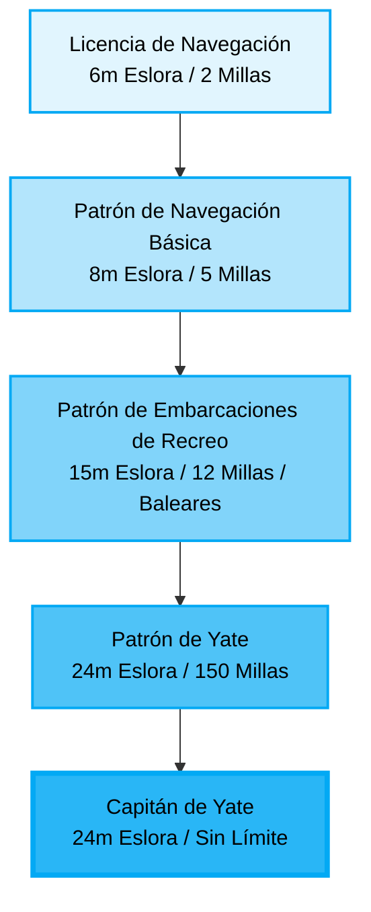

# Titulaciones Náuticas de Recreo en España

En España, para gobernar embarcaciones de recreo a motor o a vela, es necesario estar en posesión de una titulación náutica. Las titulaciones se dividen en diferentes categorías según las atribuciones que otorgan (eslora de la embarcación, distancia a la costa y navegación diurna/nocturna).

A continuación se muestra el listado de los diferentes títulos, organizados de menor a mayor atribución. Haz clic en cada uno de ellos para ver información detallada (atribuciones, requisitos y temario).

*   **[Licencia de Navegación (LN)](titulaciones/LN/INDEX.md)**: Hasta 6m de eslora, 2 millas de la costa, navegación diurna.
*   **[Patrón de Navegación Básica (PNB)](titulaciones/PNB/INDEX.md)**: Hasta 8m de eslora, 5 millas de la costa, navegación diurna y nocturna.
*   **[Patrón de Embarcaciones de Recreo (PER)](titulaciones/PER/INDEX.md)**: Hasta 15m (o 24m) de eslora, 12 millas de la costa (o cruce a Baleares).
*   **[Patrón de Yate (PY)](titulaciones/PY/INDEX.md)**: Hasta 24m de eslora, 150 millas de la costa.
*   **[Capitán de Yate (CY)](titulaciones/CY/INDEX.md)**: Hasta 24m de eslora, sin límite geográfico.

---

### Notas Adicionales Transversales:

*   **Navegación a Vela:** Todos los títulos (excepto la Licencia de Navegación) son expedidos para el gobierno de embarcaciones a motor. Para habilitarlos para embarcaciones a vela, es necesario realizar unas **prácticas de vela complementarias** (16 horas), que solo se tienen que hacer una vez y sirven para todos los títulos (si se hacen con el PNB, valen para el PER, PY y CY).
*   **Reconocimiento Médico:** Para la obtención y renovación de cualquier titulación náutica es necesario superar un reconocimiento médico psicotécnico específico en un centro de reconocimiento de conductores/navegantes.
