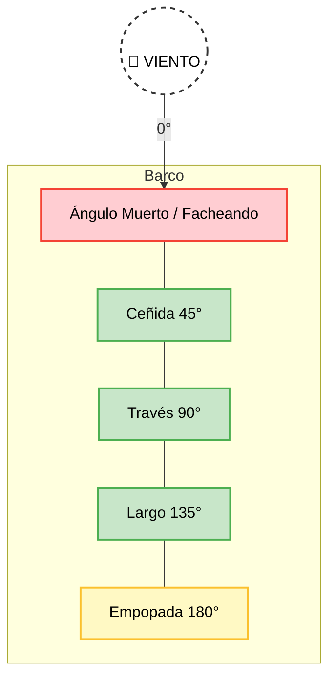

# Navegación a Vela: Conceptos Básicos

La navegación a vela es el arte de propulsar una embarcación utilizando únicamente la fuerza del viento sobre las velas.

## Partes Básicas de un Velero
*   **Casco:** El cuerpo principal del barco.
*   **Mástil o Palo:** El tubo vertical que sujeta las velas.
*   **Botavara:** El tubo horizontal articulado en el mástil que sujeta la base de la vela mayor.
*   **Orza / Quilla:** Apéndice bajo el casco que evita que el barco se desplace lateralmente (abata) y proporciona estabilidad.
*   **Timón:** Superficie en la popa utilizada para gobernar (dirigir) el barco.
*   **Jarcia firme:** Cables de acero que sujetan el mástil (obenques, estay, backstay).
*   **Jarcia de labor:** Cabos utilizados para izar, arriar y ajustar las velas (drizas, escotas, amantillo).

## Las Velas Principales
1.  **Vela Mayor:** La vela principal, izada en la parte posterior del mástil y sujeta a la botavara.
2.  **Foque / Génova:** La vela de proa, izada en el estay (delante del mástil). El Génova es un foque más grande que sobrepasa el mástil hacia popa.
Para navegar a vela, es imprescindible saber de dónde viene el viento. El barco no puede navegar directamente contra el viento. Dependiendo del ángulo que forma la dirección del barco con el viento, navegaremos en un **rumbo** distinto, lo que exigirá una posición diferente de las velas (cazarlas o amollarlas).

### Principales Rumbos
*   **Proa al viento (Facheando):** Ángulo muerto (aprox. 45º a cada lado del viento). Las velas flamean y el barco no avanza.
*   **Ceñida (45º):** El rumbo más cerrado al viento que permite avanzar. Las velas van cazadas al máximo (muy tensas). Es un rumbo rápido y cómodo.
*   **Aleta:** El viento entra por la parte trasera oblicua del barco (entre 100º y 150º).
*   **Empopada o Largo:** El viento entra directamente por la popa del barco (180º). Las velas se abren al máximo hacia los lados.

## Maniobras Principales
*   **Virada por Avante (Virar):** Cambiar de amura (lado por el que entra el viento) pasando la proa por la dirección del viento. Las velas flamean momentáneamente durante la maniobra.
*   **Trasluchada (Virada por redondo):** Cambiar de amura pasando la popa por la dirección del viento. Es una maniobra más delicada ya que la vela mayor cambia de lado de forma violenta si no se controla.
*   **Cazar:** Tirar de las escotas para acercar las velas a la crujía (centro del barco).
*   **Amollar (Largar):** Soltar las escotas para alejar las velas de la crujía.
