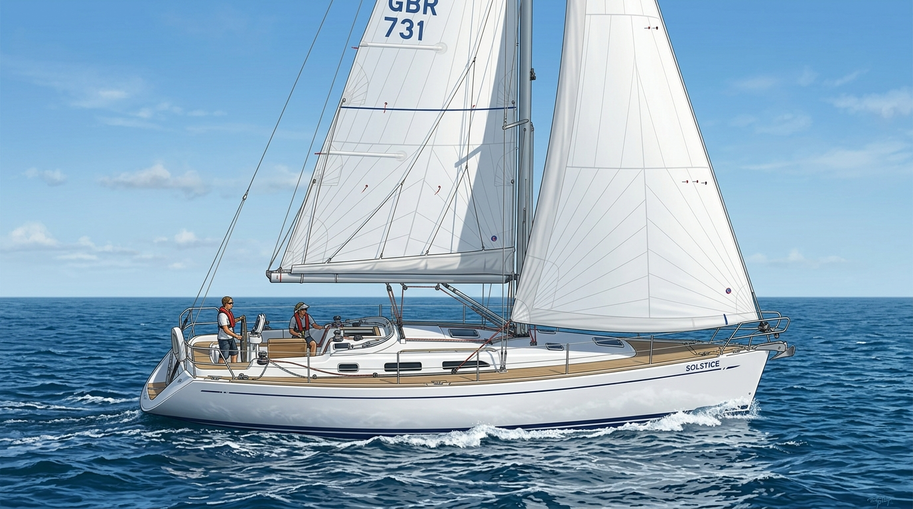
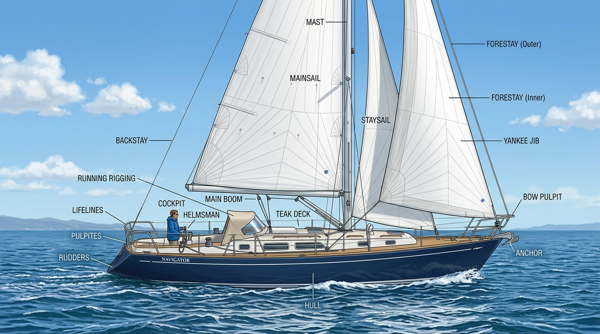
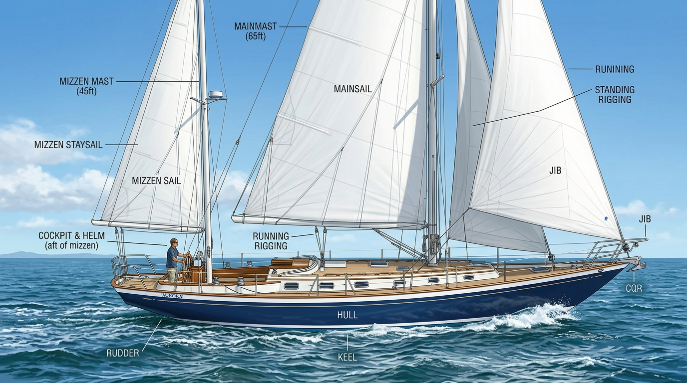
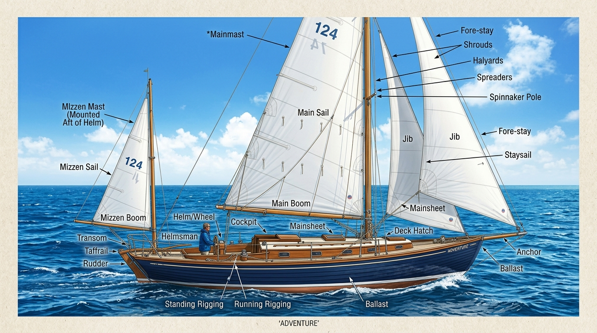
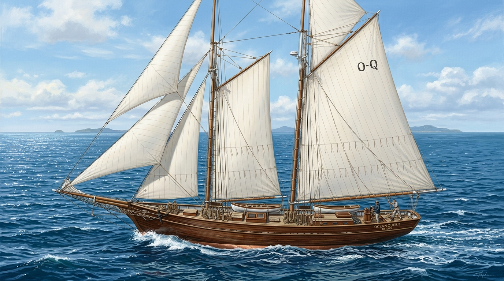
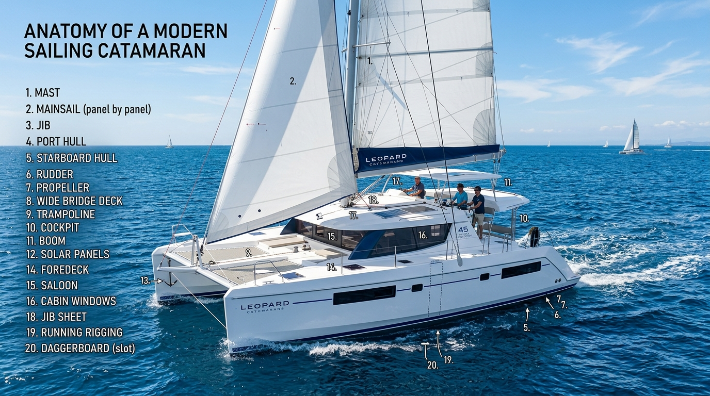
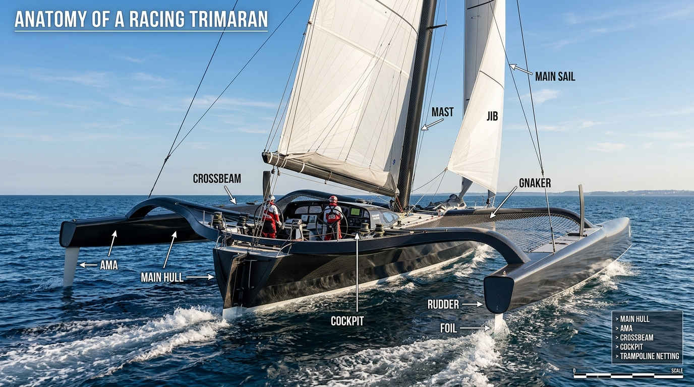
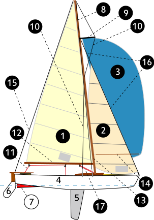

# Aparejos, Tipos de Veleros y Nomenclatura Específica

Para comprender el mundo de la vela, primero hay que entender cómo se clasifican los barcos según su número de mástiles y cómo se llama cada una de las "cuerdas" (cabos) y piezas que los componen. En la mar, la precisión en el lenguaje no es pedantería, es una cuestión de seguridad: en una emergencia, gritar "¡Tira de la cuerda roja!" es inútil; debes gritar "¡Flasca la driza de mayor!".

---

## 1. Tipos de Embarcaciones según su Aparejo

La clasificación principal de los veleros viene dictada por el número de mástiles que tienen y la posición de estos respecto al timón.

### Veleros de Un Solo Mástil
*   **Balandro (Sloop):** Es el velero moderno por excelencia (el 95% de los barcos de recreo actuales). Tiene un solo mástil (Palo Mayor) y dos velas: la Vela Mayor detrás del mástil, y un Foque o Génova por delante. Es el diseño más eficiente para ceñir (navegar contra el viento).
    
    

*   **Cúter (Cutter):** Tiene un solo mástil, pero a diferencia del balandro, el mástil está situado un poco más a popa. Esto permite llevar *dos* velas en proa simultáneamente (ej. un yanqui y una trinqueta). Es el aparejo preferido de los navegantes oceánicos clásicos por la versatilidad para reducir vela en temporales.

    

### Veleros de Dos Mástiles
*   **Queche (Ketch):** Tiene dos mástiles. El delantero es el más grande (Palo Mayor) y el trasero es más pequeño (Palo de Mesana). La característica clave del queche es que el palo de mesana está situado **por delante** de la rueda del timón. Muy usado para cruceros largos porque divide la superficie vélica, haciendo las velas más pequeñas y fáciles de manejar por una sola persona.
    
    

*   **Yola (Yawl):** Visualmente casi idéntico al queche (palo mayor delante, mesana pequeño detrás). La diferencia técnica es que en la yola, el palo de mesana está **por detrás** de la rueda del timón (a veces literalmente colgado en el extremo de la popa). La vela de mesana aquí no aporta mucho empuje, se usa principalmente como un "timón de viento" para mantener el barco equilibrado.
    
    

*   **Goleta (Schooner):** Tiene dos (o más) mástiles, pero a diferencia del queche, el mástil delantero (Palo Trinquete) es **más pequeño o igual** que el mástil trasero (Palo Mayor). Es el aparejo clásico de los barcos piratas y grandes veleros tradicionales. Excelente para vientos de través, pero ciñen muy mal.
    
    

### Multicascos
*   **Catamarán:** Dos cascos unidos por una estructura central. No tienen orza profunda con lastre (no tienen quilla de plomo), su estabilidad viene de la gran anchura (manga) entre los dos cascos. Son rapidísimos, no escoran (no se tumban), pero si vuelcan, no pueden adrizarse solos.
    
    

*   **Trimarán:** Un casco central principal y dos cascos flotadores laterales estabilizadores (amas). Son las máquinas de vela más rápidas del océano.
    
    

---

## 2. Nomenclatura de los Palos (Mástiles)

*Diagrama de referencia de la jarcia y aparejo de un velero de un solo mástil (balandro/sloop). Fuente: [Wikimedia Commons](https://commons.wikimedia.org/wiki/File:Sailingboat-lightning-num.svg), autor Jimmy P. Renzi, dominio público.*

Dependiendo de cuántos mástiles tenga el barco, estos reciben un nombre específico, ordenados siempre de proa a popa:

1.  **Palo Trinquete:** El mástil situado más a proa (delante). (Solo existe en barcos con dos o más mástiles donde el delantero es el más bajo, como las Goletas).
2.  **Palo Mayor:** El mástil principal y más alto del barco. En un balandro (1 palo) es el único que hay.
3.  **Palo de Mesana:** El mástil situado a popa (detrás) del palo mayor. Es más bajito que el mayor. Típico de Queches y Yolas.

---

## 3. La Jarcia: Firme vs Móvil

Se llama **Jarcia** a todo el conjunto de cables, alambres y cabos (cuerdas) de un velero. Se divide estrictamente en dos familias:

### Jarcia Firme (Cables de acero estáticos)
Es el "esqueleto" que sujeta el mástil para que no se caiga al mar. Son cables de acero inoxidable muy tensos que nunca se tocan durante la navegación.
*   **Estay (Stay):** Cable de acero que sujeta el mástil desde la **proa** (hacia adelante). En el estay de proa se enverga (engancha) el Génova.
*   **Backstay:** Cable que sujeta el mástil desde la **popa** (hacia atrás). En los veleros de regata se puede tensar o aflojar para curvar el mástil y aplanar la vela mayor.
*   **Obenques:** Cables laterales que sujetan el mástil por los **costados** (estribor y babor). Suelen pasar por unos separadores horizontales llamados **Crucetas**.

### Jarcia de Labor o Móvil (Cabos de maniobra)
Son todas las "cuerdas" (de poliéster o dyneema) de las que tiramos para subir, bajar o ajustar las velas.
*   **Driza:** Cabo que sirve exclusivamente para **izar** (subir) o arriar (bajar) una vela tirando de su extremo superior (puño de driza o pena). *Ej: Driza de mayor, driza de génova.*
*   **Escota:** Cabo que sirve para **cazar** (tirar hacia el barco) o **lascar** (soltar) una vela, ajustando su ángulo respecto al viento. Se amarran en el puño de escota (la esquina inferior trasera de la vela).
*   **Amantillo:** Cabo que sujeta el extremo libre de la botavara para que no caiga a plomo sobre la cubierta cuando la vela mayor está bajada.
*   **Contra o Trapa:** Un sistema de poleas que tira de la botavara hacia **abajo**. Es vital navegando en rumbos abiertos (empopadas) para evitar que la botavara se levante hacia el cielo y la vela mayor pierda su forma perdiendo el viento.
*   **Pajil (o pajaril):** Cabo que estira la parte inferior (pujamen) de la vela mayor a lo largo de la botavara, aplanando la vela.

---

## 4. Terminología Específica Esencial

*   **Barlovento:** La dirección desde donde **viene** el viento. (Lado "peligroso" y alto cuando el barco escora).
*   **Sotavento:** La dirección hacia donde **va** el viento. (Lado bajo del barco). 
    *   *Regla RIPA:* Un barco que recibe el viento por babor, debe ceder el paso al que lo recibe por estribor. Si ambos lo reciben por el mismo lado, el barco a barlovento cede el paso al barco a sotavento.
*   **Amura:** La parte delantera de los costados del barco. "Recibir el viento por la amura" significa navegar de ceñida.
*   **Aleta:** La parte trasera de los costados del barco (antes de llegar a la popa). "Recibir el viento por la aleta" significa navegar en rumbo de portantes.
*   **Grátil:** El borde delantero de una vela (el que "corta" el viento).
*   **Baluma:** El borde trasero de una vela (por donde "sale" el viento).
*   **Pujamen:** El borde inferior de una vela.
*   **Catavientos (Telltales):** Unos hilitos de lana pegados en la vela. Si van paralelos hacia atrás, el flujo aerodinámico es perfecto. Si caen o se agitan de forma turbulenta, estás mal trimado.

---

## 5. Velas de Popa: Spinnaker, Gennaker y Código 0

Además de la vela mayor y el génova (velas "de serie" para ceñir), muchos veleros llevan a bordo velas de tejido más ligero y globoso, pensadas específicamente para rumbos portantes (a partir del través y hacia la empopada). No son intercambiables entre sí: cada una tiene su ángulo de viento óptimo.

### Spinnaker Simétrico
*   **Forma:** Un globo grande, simétrico (igual por ambos lados), muy redondeado.
*   **Amure:** Necesita un **tangón** (palo horizontal que sale del mástil) para sujetar el puño de amura al lado de barlovento, separándolo del génova/mayor y manteniéndolo "abierto" al viento.
*   **Cuándo se usa:** Es el rey en rumbos de empopada pura, con el viento entrando casi directo por la popa ($150^\circ$-$180^\circ$). Genera su fuerza principalmente por Drag (empuje puro, "efecto paracaídas") más que por Lift.
*   **Complejidad:** Es la vela portante más difícil de maniobrar: requiere gestionar el tangón, tres cabos (driza, escota y braza) y coordinación fina de la tripulación.

### Spinnaker Asimétrico (Gennaker)
*   **Forma:** Un híbrido entre el génova y el spinnaker simétrico: asimétrico (una cara distinta de la otra), como un génova muy grande y globoso.
*   **Amure:** No lleva tangón. Se amura directamente en la proa, normalmente en un **bauprés retráctil** (un palo corto que sale de la proa y se puede recoger cuando no se usa) o, en barcos más sencillos, en el propio tamborete de proa.
*   **Cuándo se usa:** Excelente en rumbos de aleta o través portante, aproximadamente entre $80^\circ$ y $150^\circ$ del viento. Al ser asimétrico, se comporta más como un ala (genera Lift) que como un paracaídas, por lo que es más rápido que el simétrico en esos ángulos, aunque no rinde tan bien en empopada pura.
*   **Complejidad:** Se maniobra de forma mucho más parecida al génova (cazar/lascar una escota a cada banda) y no necesita tangón, por lo que es la opción preferida en tripulaciones reducidas o cruceros de dos personas.

### Código 0
*   **Forma:** Visualmente parecido a un gennaker, pero mucho más plano y con un grátil casi recto, reforzado con un cabo antitorsión (que permite enrollarlo como un génova).
*   **Cuándo se usa:** Es una vela "híbrida" pensada para vientos muy flojos y ángulos cerrados (ceñida amplia a través, $60^\circ$-$90^\circ$), rellenando el hueco entre el génova grande y el gennaker. No sustituye a ninguno de los dos en sus rangos propios; existe específicamente para navegar cuando hay poco viento y el barco necesita más superficie vélica de la que da el génova sin perder capacidad de ceñir.
*   **Ventaja práctica:** Al llevar cabo antitorsión, se enrolla y desenrolla como un génova (mucho más simple y seguro que arriar un spinnaker a mano).

### Maniobra Básica de Izado y Arriado
1.  **Izado:** La vela sube envuelta dentro de una funda o "calcetín" (sock) o enrollada, para evitar que se llene de viento antes de tiempo (lo que la haría incontrolable). Una vez arriba, se suelta el calcetín o se desenrolla, y el viento la infla de golpe.
2.  **Arriado:** Es la maniobra más delicada. La técnica habitual es "matar" la vela metiéndola detrás de la vela mayor (que le tapa el viento), recoger el calcetín tirando de su cabo, o enrollarla, antes de bajarla a cubierta de forma controlada.

### El Peligro: Voleo (Broach)
El **voleo o broach** es el gran peligro de navegar con velas de portante grandes: si una racha de viento fuerte coge la vela con el barco mal controlado (o el timonel se despista), el barco puede escorar y girar bruscamente hacia el viento sin control, tumbándose de lado con la vela pegada al agua. Es difícil de corregir una vez iniciado y puede dañar la jarcia o la propia vela. **Prevención:** rizar o arriar a tiempo cuando refresca, mantener siempre a alguien atento al timón y a la escota, y no navegar con estas velas en exceso de viento para su tamaño.

---

## 6. Multicascos: Catamarán y Trimarán

El catamarán y el trimarán (ya presentados en la sección 1) se comportan de forma radicalmente distinta a un monocasco, hasta el punto de que requieren una técnica de navegación diferente:

*   **Estabilidad por forma, no por peso:** Un monocasco es estable porque su quilla lastrada (con plomo) actúa como un péndulo que siempre intenta devolver el barco a la vertical. Un multicasco no lleva ese lastre: su estabilidad viene de la **forma**, es decir, de la enorme separación entre los cascos (manga), que genera un "brazo de palanca" muy largo para resistir el vuelco.
*   **Ausencia de escora significativa:** Como consecuencia, un multicasco apenas escora navegando (rara vez más de $5^\circ$-$10^\circ$), frente a los $20^\circ$-$30^\circ$ habituales de un monocasco en ceñida. Esto los hace mucho más cómodos y rápidos para moverse a bordo, pero también engañosos: al no escorar, es fácil no notar que se está llevando demasiado trapo hasta que es tarde.
*   **Mayor velocidad:** Al no "gastar" energía en escorar ni en generar resistencia por la forma de una quilla profunda, y con cascos muy finos y ligeros, los multicascos son sensiblemente más rápidos que un monocasco equivalente, llegando a navegar a velocidades cercanas o superiores a la del viento real.
*   **Riesgo de volcada irreversible:** Es la contrapartida más seria. Un monocasco que se tumba (incluso a $90^\circ$) normalmente se adriza solo gracias al peso de su quilla. Un multicasco **no tiene quilla lastrada**: si vuelca por completo (por una racha fuerte, una ola o un exceso de vela), se queda invertido y **no puede adrizarse por sí solo**. Por eso la gestión del exceso de vela (rizar a tiempo) es aún más crítica que en un monocasco.
*   **Técnica de navegación en olas:** Un monocasco "corta" la ola con su casco profundo y su peso. Un multicasco, al ser mucho más ligero y con cascos finos, tiende a "cabalgar" sobre las olas en vez de atravesarlas, lo que exige vigilar mucho más el asiento (trim) de proa a popa (para no clavar una proa en una ola, lo que se conoce como *pitchpoling* o vuelco por proa) y ajustar el rumbo con antelación ante mar de a través o de popa.

Las imágenes de referencia de ambos tipos de embarcación están disponibles en la sección 1 de este documento (`assets/images/catamaran.jpg` y `assets/images/trimaran.jpg`).
