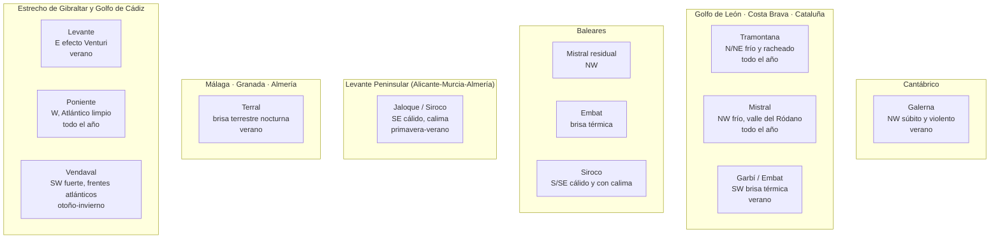
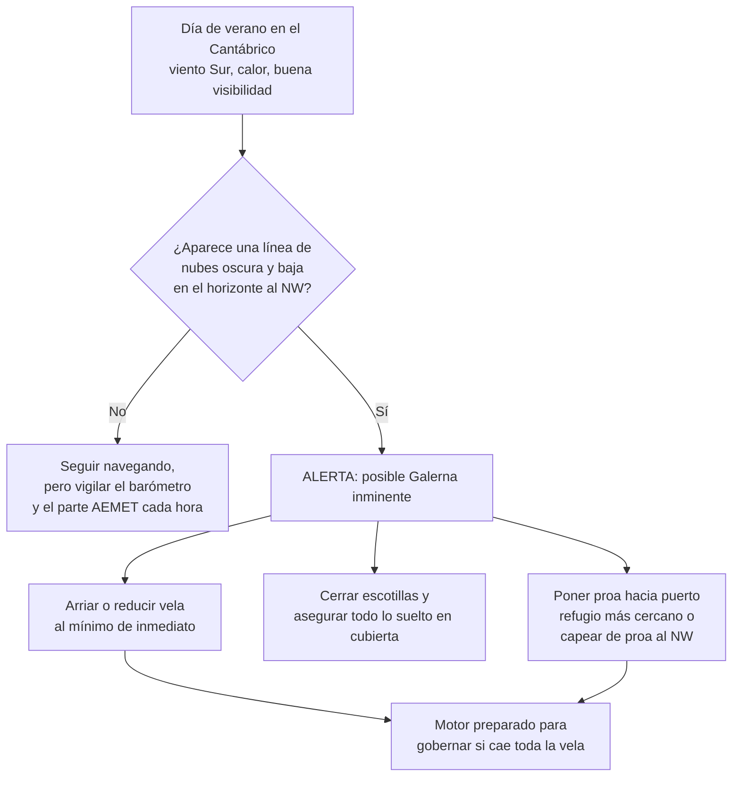

# Vientos Locales de España

[METEOROLOGIA.md](METEOROLOGIA.md) explica los mecanismos generales del viento: isobaras, frentes, brisas térmicas genéricas y escalas de medida. Ese conocimiento es la base, pero **no basta para navegar por la costa española**. Cada golfo, estrecho y sierra del litoral genera su propio viento local, con nombre propio, comportamiento característico y peligros específicos que un patrón debe reconocer de memoria antes de zarpar en esa zona.

Esta guía recorre los vientos regionales más importantes de la costa española, de norte a sur y de este a oeste, explicando su origen, la zona que afecta, la época típica del año, la intensidad habitual y el consejo de seguridad correspondiente.

---

## Mapa Mental: Qué Viento Sopla en Cada Costa

---

## 1. Tramontana (Golfo de León / Costa Brava)

*   **Origen y mecanismo:** Viento frío y denso de origen continental europeo que se ve forzado a **canalizarse por el efecto Venturi** entre los Pirineos y el Macizo Central francés. Se dispara cuando hay un anticiclón sobre las Islas Británicas o el centro de Europa y, simultáneamente, una borrasca o una zona de bajas presiones sobre el golfo de Génova o el Mediterráneo occidental: el fuerte gradiente de presión empuja el aire frío a través del "embudo" pirenaico.
*   **Zona afectada:** Golfo de León, Empordà, Costa Brava y norte de Cataluña; en sus episodios más intensos se deja notar hasta las Baleares.
*   **Época típica:** Puede soplar en cualquier estación, pero es más frecuente y violenta en **otoño e invierno**, aunque también aparece en verano con menor intensidad.
*   **Intensidad habitual:** Fría, seca y muy racheada. En episodios fuertes supera fácilmente los **40-50 nudos** en ráfagas, con un cielo despejado y una visibilidad excelente que puede engañar al patrón novato sobre la violencia real del viento.
*   **Señales de aviso:** Nubes lenticulares estacionarias sobre las crestas pirenaicas, aire extremadamente seco y transparente, y un fuerte gradiente de isobaras en el mapa sinóptico entre el anticiclón centroeuropeo y la baja mediterránea. AEMET emite avisos específicos de "Tramontana" para el Empordà. **Consejo de seguridad:** si el parte anuncia Tramontana, evita salir a puertos pequeños de la Costa Brava o el Cap de Creus; una vez en la mar, prioriza puertos con buen abrigo del N/NE y reduce trapo con antelación, porque las rachas llegan sin apenas transición.

---

## 2. Mistral (Golfo de León, con efecto sobre Baleares)

*   **Origen y mecanismo:** Comparte la misma situación sinóptica que la Tramontana (anticiclón centroeuropeo/atlántico frente a baja mediterránea), pero se canaliza por el **valle del Ródano**, entre los Alpes y el Macizo Central francés, en lugar de por el corredor pirenaico. Es, en la práctica, el "hermano" del oeste de la Tramontana.
*   **Zona afectada:** Golfo de León (costa francesa y catalana), y por extensión el Mediterráneo occidental; en sus rachas más largas alcanza el norte de las Islas Baleares, especialmente Menorca y el norte de Mallorca.
*   **Época típica:** Puede darse **todo el año**, con máxima frecuencia e intensidad en invierno, aunque los episodios de verano —más cortos— también son habituales.
*   **Intensidad habitual:** Viento frío, seco y racheado, de fuerza comparable a la Tramontana; en el propio golfo de León puede alcanzar también los 40-50 nudos.
*   **Consejo de seguridad:** Al igual que con la Tramontana, consulta siempre el parte antes de cruzar el golfo de León hacia o desde Baleares; ambos vientos comparten la misma "fábrica" sinóptica, así que cuando uno sopla fuerte es frecuente que el otro también lo haga simultáneamente en su respectivo corredor.

---

## 3. Levante (Estrecho de Gibraltar y Mediterráneo occidental)

*   **Origen y mecanismo:** Viento del **Este** que se acelera de forma espectacular al atravesar el Estrecho de Gibraltar por el mismo **efecto Venturi** que canaliza la Tramontana y el Mistral, aquí entre las sierras del Rif (Marruecos) y las cordilleras Béticas (España). Un viento de Levante moderado en el Mediterráneo abierto puede duplicar su fuerza al entrar en el "embudo" del Estrecho.
*   **Zona afectada:** Estrecho de Gibraltar, bahía de Algeciras, y por extensión gran parte del Mediterráneo occidental (Alborán, costa andaluza mediterránea, y en episodios amplios hasta Baleares).
*   **Época típica:** Puede soplar en cualquier estación, pero es especialmente **típico y persistente en verano**, cuando se refuerza con el calentamiento térmico continental.
*   **Intensidad habitual:** Húmedo, cálido y capaz de mantenerse varios días seguidos. Su señal más característica es la **nube "rabo de gallo"** que se forma sobre el Peñón de Gibraltar cuando el aire húmedo asciende y condensa al chocar con la roca. Puede alcanzar fuerza 6-7 en el propio Estrecho aun con un gradiente sinóptico modesto, precisamente por el efecto embudo.
*   **Consejo de seguridad:** En el Estrecho, el Levante genera mar de fondo corta y empinada que se opone a la corriente entrante del Atlántico (que siempre fluye hacia el Mediterráneo), formando **olas muy cerradas y peligrosas para embarcaciones pequeñas**. Cruza el Estrecho con Levante fuerte solo si el barco y la tripulación tienen experiencia suficiente.

---

## 4. Poniente (Estrecho de Gibraltar y Golfo de Cádiz)

*   **Origen y mecanismo:** Viento del **Oeste**, contrario al Levante, que entra desde el Atlántico limpio hacia el Mediterráneo a través del Estrecho, generalmente asociado a un flujo atlántico despejado o al paso de un frente.
*   **Zona afectada:** Estrecho de Gibraltar y Golfo de Cádiz, con menor alcance hacia el interior del Mediterráneo que el Levante.
*   **Época típica:** Puede darse todo el año, aunque predomina en los periodos en que el régimen atlántico domina sobre el mediterráneo, típicamente en **otoño e invierno**.
*   **Intensidad habitual:** Suele traer aire más limpio y cielos despejados que el Levante, con visibilidad excelente; su fuerza también se amplifica en el Estrecho por el mismo efecto Venturi, aunque en general es algo menos persistente que su viento opuesto.
*   **Consejo de seguridad:** Con Poniente, la mar y la corriente del Estrecho van a favor, por lo que la travesía suele ser más cómoda que con Levante; aun así, vigila la posible mar de fondo residual si el Poniente sigue a un episodio previo de Levante.

---

## 5. Siroco / Jaloque (viento sahariano)

*   **Origen y mecanismo:** Viento **cálido procedente del Sahara**, del **S o SE**, que se genera cuando una borrasca o zona de bajas presiones situada sobre el Atlántico o el Mediterráneo occidental "succiona" una masa de aire caliente y cargada de polvo desde el norte de África. En la costa mediterránea peninsular se le conoce tradicionalmente como **Jaloque**.
*   **Zona afectada:** Islas Baleares y todo el Levante peninsular (Alicante, Murcia, Almería), con episodios que también alcanzan el resto del litoral mediterráneo español.
*   **Época típica:** Puede darse todo el año, pero es más frecuente en **primavera y verano**, a menudo como preludio de un cambio de tiempo (frente frío que se aproxima por el oeste).
*   **Intensidad habitual:** Su rasgo más distintivo no es tanto la fuerza (moderada, fuerza 3-5 habitualmente) como la **calima**: polvo en suspensión que reduce drásticamente la visibilidad, ensucia las velas y la cubierta, y puede llegar a teñir el cielo de un color ocre-anaranjado. Sube también la temperatura y la humedad de forma notable.
*   **Consejo de seguridad:** Con calima intensa, extrema la vigilancia visual y el uso del radar/AIS, ya que la visibilidad puede caer a menos de una milla; protege instrumentos electrónicos y refrigeración de motor, sensibles al polvo en suspensión.

---

## 6. Terral (costa de Málaga, Granada y Almería)

*   **Origen y mecanismo:** Es la versión local, más intensa, de la brisa terrestre nocturna descrita en [METEOROLOGIA.md](METEOROLOGIA.md): por la noche, las sierras Béticas (Sierra Nevada y su entorno) se enfrían con rapidez y el aire, más denso, desciende hacia la costa buscando el mar, reforzado por el desnivel entre montaña y litoral.
*   **Zona afectada:** Costa de Málaga, Granada y Almería, especialmente en tramos donde las montañas caen directamente sobre el mar.
*   **Época típica:** Predomina en las noches de **verano**, entre el atardecer y las primeras horas del amanecer, con situación anticiclónica y ausencia de viento sinóptico de fondo.
*   **Intensidad habitual:** Viento de tierra hacia el mar, seco y racheado, normalmente moderado (fuerza 3-4) pero con rachas superiores en las bocanas de barrancos y valles que actúan como embudo.
*   **Consejo de seguridad:** El Terral puede sorprender al amanecer a quien fondea o navega cerca de la costa, empujando la embarcación mar adentro sin que se note en tierra; comprueba el garreo del ancla si fondeas de noche en esta costa y ten en cuenta que, aunque el viento sea de tierra, la mar puede seguir teniendo oleaje residual de otras direcciones.

---

## 7. Garbí / Embat (brisa térmica del Mediterráneo catalán y balear)

*   **Origen y mecanismo:** Es la brisa marina térmica clásica (ver "Virazón" en [METEOROLOGIA.md](METEOROLOGIA.md)), pero con nombre e identidad propios en esta costa: se llama **Garbí** en Cataluña y **Embat** en las Islas Baleares (sobre todo en Mallorca). Se forma por el calentamiento diferencial entre la tierra y el mar en días de verano sin viento sinóptico.
*   **Zona afectada:** Litoral catalán y balear.
*   **Época típica:** Días de **verano** con situación anticiclónica y cielos despejados, apareciendo típicamente a media mañana y muriendo al atardecer.
*   **Intensidad habitual:** Sopla del **SW/S** en Cataluña y de dirección variable según la orientación de la costa en Baleares, con fuerza moderada (3-4), ideal y muy apreciada para la navegación a vela y las regatas de verano.
*   **Consejo de seguridad:** Es el viento más "amable" de esta lista, pero no hay que confiarse: si el Garbí/Embat se refuerza de forma anómala o gira bruscamente, puede ser la señal de que un frente o una tormenta convectiva se está acercando por detrás; vigila siempre el cielo hacia poniente.

---

## 8. Galerna (Cantábrico) — Atención Especial de Seguridad

*   **Origen y mecanismo:** La Galerna es un viento del **NW súbito y muy violento**, típico del Cantábrico, causado por el paso rápido de un frente frío o una línea de turbonada que choca contra una masa de aire cálido y húmedo del Sur que ha estado dominando la zona. El contraste térmico brutal entre ambas masas de aire desata el fenómeno en cuestión de minutos.
*   **Zona afectada:** Toda la costa cantábrica (Galicia, Asturias, Cantabria, País Vasco).
*   **Época típica:** Sobre todo en **verano** (de mayo a septiembre), precisamente porque es cuando con más frecuencia se instala un viento Sur cálido y estable que luego es desalojado bruscamente por el frente del NW.
*   **Intensidad habitual:** El viento puede pasar de una calma o una brisa suave del Sur a **rachas de 40-50 nudos** del NW en cuestión de **minutos**, acompañado de un desplome brusco de la temperatura, un oscurecimiento repentino del cielo y mar que se levanta con la misma rapidez con la que llegó el viento.

### Por qué es especialmente peligrosa

A diferencia de casi todos los demás vientos de esta lista, la Galerna no da tiempo de reacción: su rasgo definitorio es la **velocidad de formación**. Un patrón que esté navegando tranquilo con viento Sur y buena visibilidad puede tener menos de media hora entre la primera señal de aviso y el impacto pleno de la Galerna.

**Señales de aviso a vigilar activamente:**
*   Un **descenso brusco y rápido de la presión atmosférica** en el barómetro de a bordo.
*   Una **banda de nubes oscuras y bajas** que aparece de forma relativamente repentina en el horizonte, en dirección NW, contrastando con el cielo despejado del resto del día.
*   Un **cambio brusco de temperatura** perceptible incluso antes de que llegue el viento.
*   Los avisos oficiales de **AEMET** para el Cantábrico en época estival, que deben consultarse siempre antes de zarpar y revisarse periódicamente durante la navegación (VHF, Navtex, apps).

**Consejo de seguridad:** Ante cualquiera de estas señales, **no esperes a confirmar**: reduce vela de inmediato, asegura la cubierta y dirígete al puerto o fondeadero abrigado más cercano. La Galerna ha causado tragedias históricas en el Cantábrico precisamente por sorprender a flotas enteras con las velas desplegadas; la prevención y la lectura constante del cielo y el barómetro son la única defensa real, porque una vez formada, no hay maniobra que la esquive con seguridad en mar abierto.

---

## 9. Vendaval (Estrecho de Gibraltar y Cádiz)

*   **Origen y mecanismo:** Viento fuerte del **SW**, asociado al paso de borrascas y frentes atlánticos profundos que se aproximan a la Península desde el suroeste, arrastrando aire húmedo y mal tiempo desde el Atlántico.
*   **Zona afectada:** Estrecho de Gibraltar y Golfo de Cádiz, con incidencia también en el litoral atlántico andaluz.
*   **Época típica:** Predomina en **otoño e invierno**, coincidiendo con la temporada de mayor actividad de borrascas atlánticas, aunque puede aparecer en cualquier época del año si el sistema frontal es lo bastante intenso.
*   **Intensidad habitual:** Viento fuerte y racheado, con lluvia y mar de fondo importante; en los episodios más profundos puede alcanzar fuerza 8-9 (temporal), con mar gruesa en el Golfo de Cádiz.
*   **Consejo de seguridad:** Al ser un viento asociado a sistemas frontales bien identificables en el mapa sinóptico (a diferencia de la Galerna, de formación mucho más súbita), el Vendaval suele anunciarse con antelación suficiente en los partes de AEMET; la clave es una buena planificación de la travesía y no salir a la mar si el parte anuncia su llegada dentro de la ventana de navegación prevista.

---

## Tabla Resumen

| Viento | Dirección | Zona principal | Época típica | Intensidad habitual |
|---|---|---|---|---|
| **Tramontana** | N/NE | Golfo de León, Costa Brava | Todo el año (más en otoño-invierno) | Fuerte, racheada, hasta 40-50 nudos |
| **Mistral** | NW | Golfo de León, norte de Baleares | Todo el año (más en invierno) | Fuerte, racheada, similar a Tramontana |
| **Levante** | E | Estrecho de Gibraltar, Mediterráneo occidental | Todo el año (típico en verano) | Moderado a fuerte, persistente |
| **Poniente** | W | Estrecho de Gibraltar, Golfo de Cádiz | Todo el año (más en otoño-invierno) | Moderado a fuerte, aire limpio |
| **Siroco/Jaloque** | S/SE | Baleares, Levante peninsular | Todo el año (más en primavera-verano) | Moderado, con calima y calor |
| **Terral** | Tierra→mar (nocturno) | Málaga, Granada, Almería | Noches de verano | Moderado, racheado en barrancos |
| **Garbí/Embat** | SW / variable | Cataluña, Baleares | Verano (diurno) | Moderado (3-4), ideal para vela |
| **Galerna** | NW súbito | Cantábrico | Verano | Violento, 40-50 nudos en minutos |
| **Vendaval** | SW | Estrecho de Gibraltar, Cádiz | Otoño-invierno | Fuerte, hasta temporal (8-9) |

---

## Para Saber Más

*   **[METEOROLOGIA.md](METEOROLOGIA.md):** fundamentos generales de isobaras, frentes, brisas térmicas genéricas, escalas Beaufort y Douglas, y lectura de archivos GRIB — imprescindible para entender el porqué detrás de cada viento local de esta guía.
*   **[RECURSOS.md](RECURSOS.md):** enlaces directos a **AEMET Marítima** (parte oficial obligatorio antes de zarpar, con avisos específicos de Tramontana, Levante o Galerna) y a **Windy** (visualización en tiempo real de viento y comparación de modelos GFS/ECMWF/AROME), las dos herramientas de referencia para comprobar si alguno de estos vientos está activo o previsto en tu zona de navegación.
