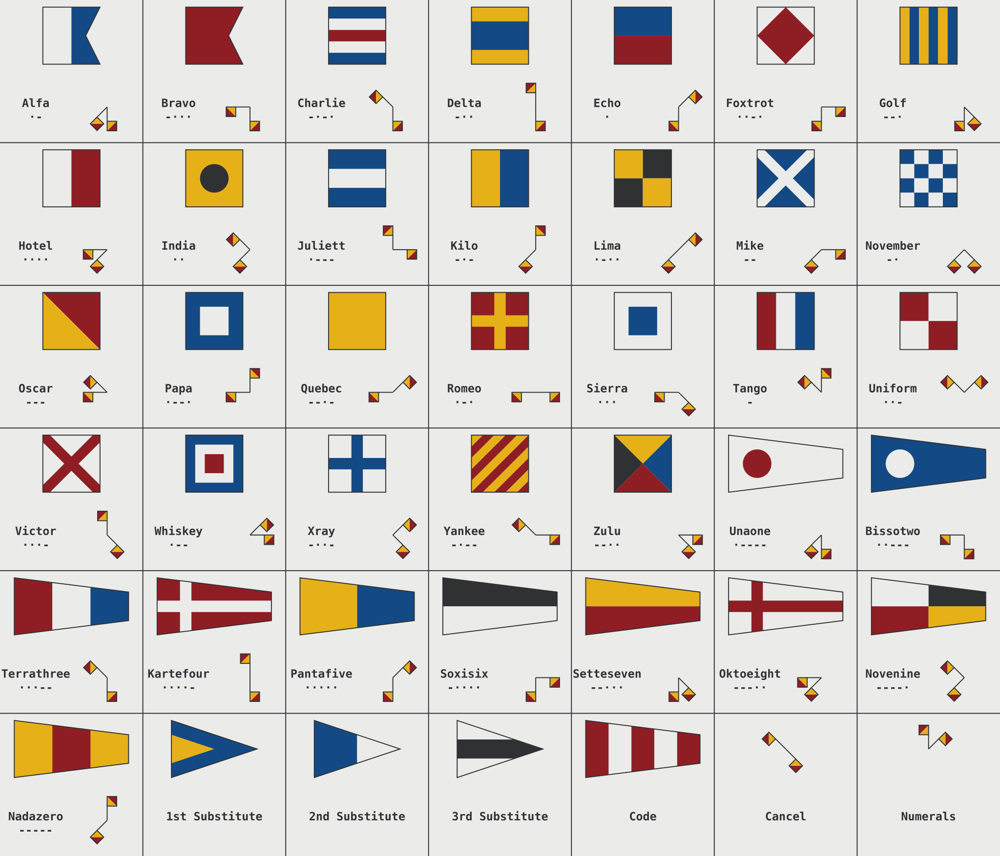
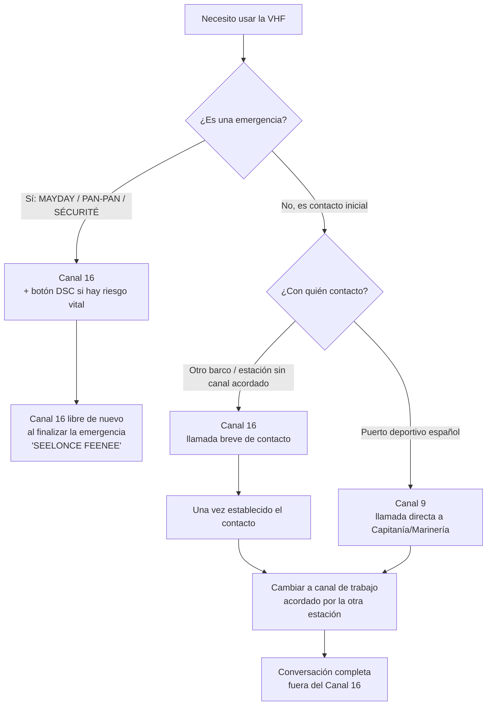

# Comunicaciones Marítimas, SMCP y Banderas del C.I.S.

El lenguaje del mar es universal para evitar colisiones idiomáticas entre buques de distinta bandera. Este manual unifica el uso táctico de la radio, el Código Internacional de Señales (Banderas) y el Alfabeto Fonético de la OMI.

---

## 1. Código Internacional de Señales (C.I.S.) - Las Banderas Náuticas

Izadas en una driza visible de babor o estribor, las banderas envían mensajes sin necesidad de radio. Se leen de arriba hacia abajo. En caso de no tener banderas físicas, los buques las dictan en inglés por VHF ("I am flying flag Alfa").

*Set completo de banderas del C.I.S., semáforo de brazos y alfabeto Morse. Fuente: [Wikimedia Commons](https://commons.wikimedia.org/wiki/File:International_Code_of_Signals.svg), autor Michi83, licencia CC BY-SA 4.0.*

### Banderas de la 'A' a la 'Z' y sus Significados de Letra Única

| Bandera / Letra | Código Fonético | Significado (Letra Sola) | Significado Secundario Común |
| :--- | :--- | :--- | :--- |
| **A** | **Alfa** | "Tengo buzo sumergido; manténgase bien alejado y a poca velocidad." | *Evite mi estela.* |
| **B** | **Bravo** | "Estoy cargando, descargando o transportando mercancías peligrosas." | *Carga de combustible / explosivos.* |
| **C** | **Charlie** | "Sí" (Afirmativo o "El significado de los grupos anteriores debe leerse en sentido afirmativo"). | |
| **D** | **Delta** | "Manténgase alejado de mí; estoy maniobrando con dificultad." | |
| **E** | **Echo** | "Caigo a estribor." | |
| **F** | **Foxtrot** | "Tengo avería; comuníquese conmigo." | *Historicamente: Portaviones en vuelo.* |
| **G** | **Golf** | "Necesito práctico." | *(Pesqueros: Estoy cobrando las redes).* |
| **H** | **Hotel** | "Tengo práctico a bordo." | |
| **I** | **India** | "Caigo a babor." | |
| **J** | **Juliett** | "Tengo incendio y llevo carga peligrosa: manténgase alejado." | |
| **K** | **Kilo** | "Deseo comunicarme con usted." | |
| **L** | **Lima** | "Detenga su buque inmediatamente." | *(En alta mar: Inspección de cuarentena).* |
| **M** | **Mike** | "Mi buque está parado y no tiene arrancada." | |
| **N** | **November** | "No" (Negativo). | |
| **O** | **Oscar** | "¡Hombre al agua!" (MOB). | |
| **P** | **Papa** | "En puerto: Todo el personal debe regresar a bordo (zarpe inminente)." | *(Pesqueros: Mis redes se han enganchado).* |
| **Q** | **Quebec** | "Mi buque está "sano" y pido libre plática." (Bandera amarilla de Sanidad). | |
| **R** | **Romeo** | *(Sin significado como bandera sencilla en alta mar. Usada con números).* | |
| **S** | **Sierra** | "Estoy dando marcha atrás." | |
| **T** | **Tango** | "Manténgase alejado de mí; estoy pescando al arrastre en pareja." | |
| **U** | **Uniform** | "Se dirige usted hacia un peligro." | |
| **V** | **Victor** | "Necesito auxilio." (No es un SOS, pero requiere atención inmediata). | |
| **W** | **Whiskey** | "Necesito asistencia médica." | |
| **X** | **X-ray** | "Suspenda lo que está haciendo y preste atención a mis señales." | |
| **Y** | **Yankee** | "Estoy garreando sobre mi ancla." (Mi ancla no agarra, peligro de derivar). | |
| **Z** | **Zulu** | "Necesito remolcador." | *(Pesqueros: Estoy calando redes).* |

### Expresiones de Dos Letras de Alta Frecuencia
Para mensajes más complejos, se combinan banderas. Algunas son universales:
*   **NC:** (November + Charlie) "Estoy en peligro y necesito auxilio inmediato" (Equivalente visual al MAYDAY).
*   **RY:** "Amotinamiento a bordo".
*   **AE:** "Debo abandonar mi buque".

---

## 2. Alfabeto Fonético Internacional (Spelling)
Para evitar que el ruido estático de la radio confunda una "B" con una "V", es obligatorio deletrear los nombres de barco, indicativos de llamada y posiciones (Ej. P-E-N-A-L-T-I):
`Papa - Echo - November - Alfa - Lima - Tango - India`.

---

## 3. Uso Táctico del VHF y Nombres GMDSS

El Canal 16 de VHF es la frecuencia internacional de Llamada y Socorro (156.800 MHz). Solo debe usarse para establecer contacto rápido o para emergencias. **Queda terminantemente prohibida cualquier transmisión jocosa o charla.**

Hay una jerarquía estricta en las llamadas de emergencia, que interrumpen a las demás:

### 1. MAYDAY (Peligro Inminente y Letal)
El buque, la aeronave o las personas están en riesgo de perecer (naufragio, incendio incontrolable, hombre al agua nocturno, entrada de agua catastrófica). Impone **Silencio de Radio** absoluto a los demás barcos.
> *"MAYDAY, MAYDAY, MAYDAY"*
> *"Aquí el velero [Nombre], [Nombre], [Nombre]"*
> *"MMSI [Nueve dígitos]"*
> *"MAYDAY, [Nombre del barco], Posición [Latitud y Longitud]"*
> *"Sufriendo [vía de agua masiva]. Solicito asistencia inmediata. Somos [4 personas] a bordo. Abandonamos el buque hacia la balsa salvavidas."*
> *"Cambio (Over)."*

*Respuesta del receptor:* "MAYDAY RELAY" (si retransmites en nombre de otro porque la costera no lo escucha), o *"RECEIVED MAYDAY"* por parte de Salvamento.
Si alguien pisa la emisión: *"SEELONCE MAYDAY!"* (¡Cállense, hay un Mayday!). Cuando acaba el protocolo, la costera indica *"SEELONCE FEENEE"* (Silencio finalizado).

### 2. PAN-PAN (Urgencia)
Existe un problema médico grave o una avería peligrosa (motor roto derivando hacia rocas), pero NO hay riesgo inmediato de hundimiento o muerte a corto plazo. No requiere abandono inminente de la nave.
> *"PAN-PAN, PAN-PAN, PAN-PAN"*
> *"A todas las estaciones, a todas las estaciones, a todas las estaciones"*
> *"Aquí [Nombre del Barco]..."*
> *Detallar: Hombre herido con fractura sangrante, solicitamos consejo radio-médico / o Barco sin gobierno derivando.*

### 3. SÉCURITÉ (Seguridad)
Aviso meteorológico o aviso a los navegantes para prevenir desgracias. Lo suele usar Salvamento Marítimo, o tú mismo para alertar de un tronco enorme flotando en alta mar.
> *"SÉCURITÉ, SÉCURITÉ, SÉCURITÉ"*
> *"Aquí Tarifa Tráfico, Tarifa Tráfico..."*
> *"Atención, avistamiento de contenedor flotando semihundido en posición [Lat / Long], peligro a la navegación..."*

---

## 4. VHF con Llamada Selectiva Digital (DSC - Digital Selective Calling)

Las radios VHF modernas no son solo un micrófono de voz: llevan integrado un pequeño ordenador de comunicación digital, la **DSC**, que se reconoce por una **tecla roja protegida por una tapa** en la parte frontal del equipo, marcada como **DISTRESS**.

### Qué Ocurre Técnicamente al Pulsarla
Pulsar (y mantener pulsados, normalmente 3-5 segundos) el botón DISTRESS dispara una secuencia automática que nada tiene que ver con hablar por el Canal 16:
1.  La radio transmite un **mensaje digital codificado** en el Canal 70 (reservado exclusivamente para DSC, nunca para voz) que contiene el **MMSI** del barco, identificándolo de forma inequívoca ante cualquier estación que lo reciba.
2.  Si la radio está conectada a la red NMEA del barco (ver **[ELECTRONICA_NAVAL.md](ELECTRONICA_NAVAL.md)**, sección 9), incluye automáticamente la **posición GPS** y la hora UTC del último fix válido, sin que el patrón tenga que leerla ni teclearla.
3.  Si el patrón ha tenido tiempo de configurar el **tipo de emergencia** en el menú antes de confirmar (incendio, vía de agua, colisión, hombre al agua, hundimiento, abandono de buque...), ese dato viaja también en el mensaje digital.
4.  Tras el envío digital, la radio conmuta sola al Canal 16 en voz y queda lista para que el patrón complete verbalmente el protocolo MAYDAY descrito en la sección 5, ahora ya con el barco identificado y localizado en todas las pantallas cercanas.

### Por Qué Revolucionó la Seguridad Marítima
Antes del DSC, un MAYDAY por voz en el Canal 16 solo servía si **alguien, en ese preciso instante, tenía la radio encendida y estaba escuchando** ese canal. El DSC cambia el paradigma:
*   El mensaje se retransmite como una **alerta automática** que hace sonar una alarma sonora y visual en **todas las radios DSC en rango** (y en las estaciones costeras de Salvamento Marítimo), estén o no sintonizadas al Canal 16 en ese momento.
*   No depende de la atención humana: el barco vecino puede tener la radio en el Canal 9 hablando con el puerto, y aun así su equipo DSC "escucha" siempre el Canal 70 en segundo plano y salta con la alarma.
*   Elimina el margen de error de dar la posición de viva voz bajo el estrés de una emergencia (mala pronunciación de coordenadas, nervios, ruido de fondo): el dato GPS viaja exacto y digital.
*   Es la piedra angular del sistema **GMDSS** (Global Maritime Distress and Safety System) para la navegación de recreo y mercante.

> **Importante:** el botón DISTRESS no sustituye la llamada de voz posterior por el Canal 16; la complementa y la acelera. Un DSC sin la radio conectada a GPS solo enviará el MMSI, sin posición: por eso la instalación correcta (ver conexión NMEA en **[ELECTRONICA_NAVAL.md](ELECTRONICA_NAVAL.md)**) es tan importante como llevar el equipo.

---

## 5. Protocolo de Uso del Canal 16

El Canal 16 (156.800 MHz) tiene dos y solo dos funciones legítimas: **la llamada inicial de contacto** y **las emergencias** (MAYDAY, PAN-PAN, SÉCURITÉ). No es un canal de conversación.

### Cuándo se Usa Exactamente
*   **Llamada inicial:** para contactar por primera vez con otro barco, un puerto deportivo o una estación costera cuando no se conoce (o no se ha acordado) un canal de trabajo previo.
*   **Emergencias:** MAYDAY, PAN-PAN y SÉCURITÉ se emiten siempre en el 16, porque es el canal que todo el mundo debe escuchar por normativa (escucha obligatoria y permanente en todo buque con VHF encendida).
*   **Lo que NO es:** un canal para charlar, coordinar una maniobra de amarre completa, dar el parte meteo entero o discutir el menú de la cena. Cualquier transmisión que no sea de contacto breve o socorro **satura** el único canal que todos los barcos de la zona están obligados a monitorizar, y puede tapar un MAYDAY real.

### Por Qué Hay que Cambiar a un Canal de Trabajo
En cuanto dos estaciones se han localizado mutuamente en el Canal 16, la norma internacional obliga a **cambiar de inmediato** a un canal secundario ("de trabajo") para desarrollar la conversación. Esto:
*   Libera el Canal 16 para que siga disponible como canal de socorro para el resto de la flota.
*   Evita que una conversación larga (instrucciones de amarre, coordinación de una regata, parte meteo detallado) bloquee a alguien que en ese momento necesita gritar MAYDAY.
*   Es una norma de cortesía y disciplina radiotelefónica tan asentada como no pisar una transmisión ajena.

### Ejemplo de Diálogo Tipo
> *Barco:* "Puerto Base, Puerto Base, Puerto Base, aquí Motovelero Alfa, cambio."
> *Puerto:* "Motovelero Alfa, aquí Puerto Base, recibido, cambie a canal de trabajo 9, cambio."
> *Barco:* "Recibido, cambio a canal 9, corto."
>
> *(Ambas estaciones sintonizan el Canal 9 y continúan allí la conversación real: "Motovelero Alfa, aquí Puerto Base, indíqueme calado y eslora para asignarle amarre..."; el Canal 16 queda libre de nuevo en segundos.)*

En los puertos deportivos españoles, el canal de trabajo habitual para contactar con Capitanía/Marinería tras la llamada inicial es el **Canal 9** (ver también **[puertos/INDEX.md](../puertos/INDEX.md)**), aunque cada puerto puede publicar otro canal en su ficha o en el Anuario de Faros y Señales.

---

## 6. Gestión Práctica del MMSI y Falsas Alarmas DSC

El MMSI (ver también **[GESTIONES_Y_DOCUMENTACION.md](GESTIONES_Y_DOCUMENTACION.md)**, punto 1.3) no es solo un número técnico: es el hilo que conecta tu radio con tu identidad real ante Salvamento Marítimo, así que su gestión práctica importa tanto como saber usar el botón rojo.

### Qué Hacer si se Activa una Falsa Alarma DSC
Es fácil pulsar el DISTRESS por accidente (un golpe, un niño jugando con la radio, una tapa mal cerrada). Si ocurre:
1.  **No apagues la radio ni te limites a guardarla.** El mensaje digital ya ha salido y las estaciones que lo reciben iniciarán protocolo de búsqueda si no se cancela.
2.  **Cancela de inmediato por voz en el Canal 16**, dirigiéndote a todas las estaciones:
    > *"Todas las estaciones, todas las estaciones, todas las estaciones, aquí [Nombre del barco], MMSI [nueve dígitos], cancelen mi alerta de socorro DSC de las [hora UTC], alarma falsa, repito, alarma falsa. Cambio."*
3.  Muchas radios modernas permiten además enviar un **código de cancelación DSC** desde el propio menú del equipo (una llamada de "Distress Cancel" o "All Ships" específica que anula digitalmente la alerta anterior); consulta el manual de tu modelo, porque el procedimiento exacto varía por fabricante.
4.  Si Salvamento Marítimo te contacta tras la falsa alarma (suelen hacerlo por radio o llamando al contacto de emergencia registrado), **confirma la cancelación** y facilita tu MMSI para que cierren el expediente sin desplegar medios.

### La Importancia de Mantener el Registro del MMSI Actualizado
El MMSI solo es útil si los datos que hay detrás de ese número están al día en el registro oficial (en España, a través de la Licencia de Estación de Buque, ver **[GESTIONES_Y_DOCUMENTACION.md](GESTIONES_Y_DOCUMENTACION.md)**, punto 1.3):
*   **Contacto de emergencia real y localizable:** si el MMSI se activa, Salvamento Marítimo intenta primero llamar al teléfono de contacto registrado (propietario, patrón habitual o un familiar) para verificar en segundos si es una alarma real o accidental, antes de movilizar un helicóptero o una embarcación de rescate.
*   **Datos desactualizados = riesgo doble:** un MMSI con un teléfono antiguo o un propietario que ya vendió el barco puede provocar que se despliegue un rescate innecesario ante una falsa alarma, o —peor— que nadie pueda confirmar ni descartar nada útil en una emergencia real.
*   **Actualízalo siempre que cambie:** el propietario del barco, el equipo de radio (un MMSI va grabado en el equipo físico, así que un cambio de radio requiere reprogramarlo), o el número de contacto de emergencia.

### Árbol de Decisión: ¿Qué Canal Uso?

---

## 7. SMCP (Standard Marine Communication Phrases)
Es el lenguaje OMI para oficiales mercantes. Sustituye la gramática compleja por sintaxis directa para evitar malos entendidos mortales entre barcos coreanos, rusos o hispanos.
Ejemplos de estructura simplificada:
*   *En lugar de:* "I think you might hit us if you keep going that way."
*   *SMCP:* **"WARNING. YOU ARE RUNNING INTO DANGER. RISK OF COLLISION. ALTER COURSE TO STARBOARD."**
*   **Vocabulario Obligatorio (Message Markers):** Cada mensaje arranca con una palabra clave para indicar el propósito.
    *   *QUESTION / ANSWER* (Pregunta / Respuesta).
    *   *INTENTION* (Te informo de mi maniobra: "Intention. I will alter course to port").
    *   *WARNING* (Peligro).
    *   *INSTRUCTION* (Solo VTS/Guardacostas pueden instruir a otro buque).
    *   *ADVICE* (Sugerencia).
