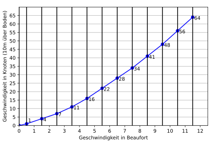
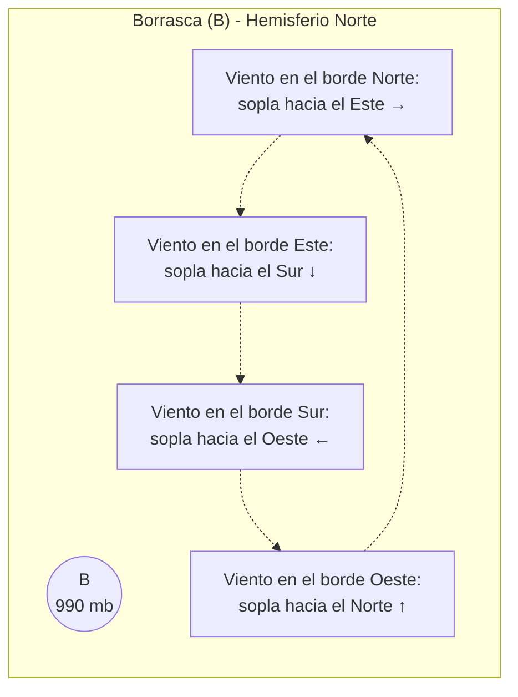
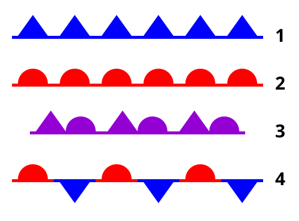
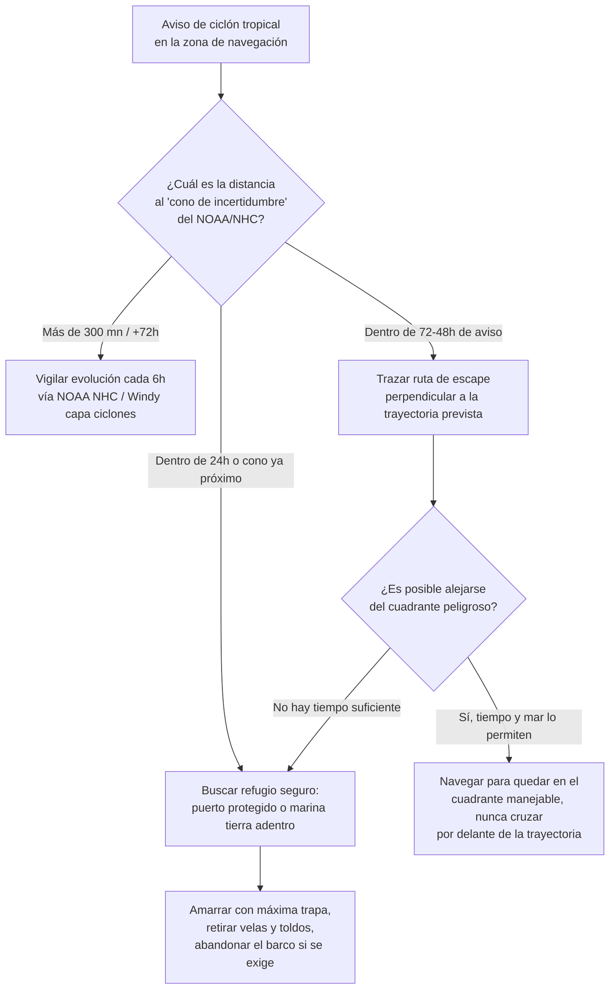

# Meteorología Marítima General

La meteorología es el factor externo más determinante para la seguridad de un barco. A diferencia de en tierra firme, en el mar no hay montañas ni árboles que frenen el viento; sopla en su máxima magnitud teórica, levantando olas que pueden hundir embarcaciones mal preparadas.

---

## 1. La Presión Atmosférica y las Isobaras

El viento se genera siempre por diferencias de presión atmosférica (medida en milibares, mb, o hectopascales, hPa). La atmósfera estándar a nivel del mar es de **1013 mb**.

### Isobaras
Son líneas cerradas que unen puntos de la misma presión atmosférica en un mapa meteorológico. 
*   **Regla Fundamental:** Cuanto más juntas están las isobaras en el mapa, mayor es el gradiente de presión (la "cuesta" de aire es más empinada), por lo que **más fuerte soplará el viento**.

### Centros de Presión
1.  **Anticiclones (A o H):** Zonas de alta presión (>1013 mb). El aire desciende, aplastando las nubes y disipándolas. Generan cielos despejados, buen tiempo, y vientos flojos que giran en sentido **horario** en el hemisferio norte.
2.  **Borrascas / Ciclones (B o L):** Zonas de baja presión (<1013 mb). El aire caliente y húmedo asciende por succión, condensándose en inmensas nubes de lluvia. Generan temporal, mal tiempo, y vientos que giran en sentido **antihorario** y se dirigen hacia el centro en espiral en el hemisferio norte.

### Ley de Buys-Ballot
Una regla táctica vital en el mar en el hemisferio norte:
*   *Si te pones de cara al viento, el centro de la baja presión (la borrasca peligrosa) está siempre a tu derecha y un poco hacia atrás.*

---

## 2. Los Frentes Meteorológicos

Las borrascas arrastran masas de aire de diferente temperatura que chocan entre sí creando líneas frontales.

### Frente Frío
Una cuña de aire frío (más denso y pesado) que avanza chocando contra el aire cálido, obligándolo a subir bruscamente.
*   **Señal Visual:** Nubes de desarrollo vertical inmenso (Cumulonimbos) tipo "yunque".
*   **Peligro en la mar:** Turbonadas (squalls), chubascos violentísimos, rayos y vientos racheados que cambian de dirección de golpe (role a la derecha). 

### Frente Cálido
Una masa de aire cálido que alcanza a una de aire frío y se desliza suavemente por encima de ella.
*   **Señal Visual:** El cielo se cubre de nubes altas y finas (cirros) que luego forman un manto gris (estratos). 
*   **Peligro en la mar:** Lluvia continua, llovizna muy persistente y **reducción grave de la visibilidad (niebla)**. El viento aumenta gradualmente pero sin turbonadas violentas.

---

## 3. Vientos Locales Térmicos

En verano, con situación de anticiclón (isobaras separadas, "sin viento" meteorológico), aparecen los vientos costeros locales generados por el sol.

*   **Brisa Marina (Virazón):** Durante el día, la tierra de la costa se calienta por el sol más rápido que el mar. El aire sobre la playa asciende, y el aire frío del mar acude a rellenar el hueco. El viento sopla **del mar hacia la tierra**. (Típicamente desde las 11:00h hasta las 18:00h, permitiendo regatas perfectas).
*   **Brisa Terrestre (Terral):** Por la noche, la arena de la playa se enfría rápido, pero el mar mantiene el calor. El viento se invierte y sopla **de la tierra hacia el mar**. Puede alejarte de la costa al amanecer si no prestas atención.

---

## 4. Escalas Marítimas: Viento y Mar

Los partes meteorológicos (VHF Navtex, AEMET) siempre usan terminología estandarizada a nivel mundial.

### Escala de Viento (Escala Beaufort)
Va del 0 al 12 (Huracán). En náutica de recreo:

*Fuente: [Wikimedia Commons](https://commons.wikimedia.org/wiki/File:Beaufort_diagram.svg), autor Ixfd64, licencia CC BY 4.0.*

*   **Fuerza 3 - 4 (11-16 nudos):** Brisa moderada. La mejor para navegar a vela cómodamente. "Borreguitos" aislados blancos en el mar.
*   **Fuerza 5 (17-21 nudos):** Brisa fresca. Los veleros deben tomar rizos. Oleaje moderado lleno de espuma blanca.
*   **Fuerza 6 (22-27 nudos):** Brisa fuerte. Silbidos en los obenques, mar gruesa. Iniciar protocolos de mal tiempo.
*   **Fuerza 8 (34-40 nudos):** Temporal. Peligro de vuelco para veleros menores. Se arrían velas mayores y se usa el tormentín.

### Estado de la Mar (Escala Douglas)
Mide la altura significativa de las olas (distancia vertical entre el seno y la cresta).
*   **0:** Mar plana (0 m).
*   **2:** Marejadilla (0.1 a 0.5 m).
*   **3:** Marejada (0.5 a 1.25 m). Típico de viento fuerza 4.
*   **4:** Fuerte marejada (1.25 a 2.5 m). El barco pega "pantocazos" dolorosos.
*   **5:** Mar Gruesa (2.5 a 4 m). Olas más altas que la cabina. Peligro inminente si se navega atravesado (riesgo de vuelco lateral).
*   **6 y superior:** Mar Muy Gruesa a Arbolada (> 4 m). Escenarios oceánicos extremos.

---

## 5. La Niebla (El Asesino Silencioso)

La niebla anula la principal herramienta humana: la vista. Se produce cuando aire húmedo se enfría por debajo de su *Punto de Rocío* (Dew Point), condensando el vapor.
*   **Niebla de Advección:** Masa de aire cálido/húmedo que se desplaza sobre corrientes marinas muy frías. Típica del Atlántico, densa, espesa y dura días enteros sin disiparse con el sol.
*   **Niebla de Radiación:** Se forma en los puertos y estuarios fríos al amanecer. El aire frío baja por los montes. Desaparece cuando calienta el sol.
*   **Protocolo de Niebla (RIPA):** Obligatorio reducir velocidad a régimen de maniobra. Encender el Radar (si se tiene). Encender luces de navegación de día. Emitir señales acústicas obligatorias con la bocina (1 pitido largo cada 2 minutos para barcos de motor con arrancada).

---

## 6. Lectura de Archivos GRIB

Hoy en día casi ningún patrón consulta solo el parte de viva voz: la mayoría planifica con **archivos GRIB**, la materia prima digital detrás de apps como Windy, PredictWind o Squid Sailing (ya recomendadas en [RECURSOS.md](RECURSOS.md)).

### ¿Qué es un archivo GRIB?
**GRIB** (GRIdded Binary) es un formato de datos meteorológicos muy comprimido, diseñado originalmente para transmitirse por canales lentos (radio, satélite Iridium). No es un mapa dibujado, sino una **rejilla (grid)** de puntos geográficos, cada uno con valores numéricos de distintas variables para distintos instantes de tiempo. El software de a bordo (Squid, PredictWind, Windy, OpenCPN con plugin GRIB) se encarga de "dibujar" esos números como flechas, isolíneas y colores.

### Variables habituales en un GRIB
*   **Viento:** dirección y velocidad a 10 m sobre la superficie (la variable más descargada).
*   **Presión atmosférica** a nivel del mar (para trazar isobaras).
*   **Oleaje:** altura significativa, periodo y dirección de la mar de viento y del mar de fondo (*swell*).
*   **Precipitación** acumulada y probabilidad de tormenta/convección.
*   Opcionalmente: temperatura del aire, temperatura del agua, corrientes, nubosidad.

### Cómo interpretar las flechas e isolíneas en la pantalla
*   **Flechas de viento:** apuntan en la dirección **hacia la que sopla el viento** (ojo: es la convención contraria a la de las barbas meteorológicas tradicionales, que indican de dónde viene). Cuanto más gruesa o más rellena la flecha, y cuanto más apretadas estén entre sí, más fuerza de viento.
*   **Color de fondo:** en Windy y PredictWind, una escala de color (azul → verde → amarillo → rojo → morado) codifica la intensidad del viento u oleaje de un vistazo, sin necesidad de leer cada flecha.
*   **Isolíneas de presión:** igual que en un mapa isobárico clásico, isolíneas juntas = viento fuerte; isolíneas separadas = viento flojo.
*   **Barra de tiempo:** el GRIB no es una foto fija, sino una animación con "fotogramas" cada 1, 3 o 6 horas; mover el deslizador temporal permite ver la evolución y anticipar el paso de un frente.

### Diferencias entre modelos: GFS, ECMWF y AROME
No todos los modelos numéricos predicen igual, y saber cuál consultar según la zona y el plazo es clave:

| Modelo | Organismo | Resolución | Alcance temporal | Punto fuerte |
|---|---|---|---|---|
| **GFS** | NOAA (EE.UU.) | ~22-25 km | Hasta 16 días | Gratuito, cobertura global, buena referencia a medio plazo |
| **ECMWF** | Centro Europeo (ECMWF) | ~9 km | Hasta 10-15 días | Considerado el más preciso a nivel global, especialmente 3-7 días |
| **AROME** | Météo-France / AEMET (variantes locales) | ~1.3-2.5 km | Hasta 36-48 h | Altísima resolución, ideal para brisas costeras y fenómenos muy locales |

**Regla práctica:** para pasajes oceánicos o planificación a varios días, ECMWF o GFS son más fiables por su alcance temporal. Para navegar cerca de la costa y afinar la hora exacta en que entra la virazón o un chubasco, AROME (u otro modelo de mesoescala equivalente) ofrece un detalle que los modelos globales no pueden captar.

---

## 7. Cómo Leer un Mapa Isobárico (Paso a Paso)

Saber interpretar una carta de superficie (la que emiten AEMET, el Met Office o el NWS) en segundos es una habilidad tan importante como leer una carta náutica. Sigamos un ejemplo típico del Atlántico Norte.

### Paso 1: Localizar los centros de presión
Busca las letras **A** (o H, High) y **B** (o L, Low) en el mapa. Supongamos un mapa con un anticiclón (A, 1025 mb) centrado sobre las Azores y una borrasca (B, 990 mb) al norte, sobre Irlanda.

### Paso 2: Determinar el sentido de giro (Ley de Buys-Ballot)
En el Hemisferio Norte:
*   Alrededor del **anticiclón (A)**, el viento gira en sentido **horario** y diverge del centro (sale en espiral hacia fuera).
*   Alrededor de la **borrasca (B)**, el viento gira en sentido **antihorario** y converge hacia el centro (entra en espiral).

Aplicando Buys-Ballot: si en nuestro ejemplo un velero navega al sur de la borrasca de Irlanda con viento del Oeste soplándole por el través, y se pone de cara al viento, la B queda a su derecha — coherente con el giro antihorario del diagrama.

### Paso 3: Medir el gradiente de presión (distancia entre isobaras)
Entre el A de las Azores y la B de Irlanda, observa cómo de juntas están las isobaras (normalmente trazadas cada 4 mb):
*   Si están muy separadas (p. ej. sobre el propio anticiclón), el viento será flojo (Beaufort 1-2), típico del "centro de la pera" donde no hay apenas gradiente.
*   Si se aprietan mucho en una zona intermedia (el "collado" o zona de transición entre A y B), ahí es donde soplará más fuerte — a veces incluso más que cerca del propio centro de la borrasca.

### Paso 4: Identificar los frentes y su representación gráfica
Del centro de la borrasca suelen salir dos líneas frontales, con la simbología estándar internacional:
*   **Frente frío:** línea azul con **triángulos** apuntando hacia la dirección de avance.
*   **Frente cálido:** línea roja con **semicírculos** apuntando hacia la dirección de avance.
*   **Frente ocluido:** línea morada que alterna triángulos y semicírculos (el frente frío ha alcanzado al cálido).

*Frente frío, cálido, ocluido y estacionario tal como aparecen en un mapa de superficie. Fuente: [Wikimedia Commons](https://commons.wikimedia.org/wiki/File:Weather_fronts.svg), autor -xfi-, licencia CC BY-SA 3.0.*

En nuestro ejemplo: el frente frío se extiende hacia el suroeste desde la B (el aire polar avanza empujando), mientras el frente cálido se extiende hacia el sureste (el aire tropical húmedo precede a la borrasca). Un velero situado al este de Irlanda vería primero pasar el frente cálido (lluvia fina persistente, visibilidad reducida) y horas o un día después el frente frío (turbonada violenta, rolada de viento y despeje rápido).

### Resumen del procedimiento
1.  Localiza A y B.
2.  Aplica el sentido de giro según el hemisferio.
3.  Mide la separación de isobaras para estimar la fuerza del viento.
4.  Identifica los frentes por su símbolo y anticipa el tipo de mal tiempo asociado.

---

## 8. Ciclones Tropicales: Formación y Vigilancia

Aunque el ciclón tropical es sobre todo materia de la titulación de Capitán de Yate (ver [tema_1_meteorologia.md](../titulaciones/CY/tema_1_meteorologia.md) para la termodinámica y las tácticas de evasión oceánica en detalle), todo navegante de recreo que se mueva en zonas cálidas en temporada de huracanes/tifones debe reconocer los fundamentos y saber vigilar la amenaza.

### Condiciones necesarias para su formación
Un ciclón tropical no se forma en cualquier sitio ni en cualquier momento; necesita coincidir varios ingredientes:
*   **Agua de mar cálida:** temperatura superficial **> 26°C** (idealmente hasta bastantes metros de profundidad), que aporta la energía por evaporación que alimenta la tormenta.
*   **Efecto Coriolis suficiente:** se necesita estar a una latitud mínima de unos 5° del Ecuador para que el planeta imprima el giro; en el propio Ecuador, sin Coriolis, no hay rotación posible.
*   **Cizalladura del viento baja (Wind Shear):** si el viento cambia mucho de velocidad o dirección con la altura, desestructura la columna de nubes antes de que pueda organizarse.
*   **Humedad y aire inestable** en niveles medios de la atmósfera que favorezcan la convección.

### Escala Saffir-Simpson
Clasifica la intensidad según el viento máximo sostenido:

| Categoría | Viento sostenido (nudos) | Efecto |
|---|---|---|
| Tormenta Tropical | 34-63 | Mar gruesa, rachas peligrosas para veleros |
| 1 | 64-82 | Daños menores, ramas caídas |
| 2 | 83-95 | Daños en cubiertas y arboladuras |
| 3 (Mayor) | 96-112 | Daños devastadores |
| 4 | 113-136 | Daños catastróficos |
| 5 | ≥137 | Catastrófico, mar completamente blanca |

### Cuadrante peligroso vs. cuadrante manejable
Igual que en las borrascas extratropicales, la trayectoria del ciclón divide su circulación en dos mitades muy distintas:
*   **Cuadrante peligroso (semicírculo derecho respecto a la trayectoria, en el Hemisferio Norte):** el viento del ciclón y la velocidad de traslación del propio sistema se suman, produciendo los vientos más fuertes y empujando a cualquier barco hacia el vórtice.
*   **Cuadrante manejable (semicírculo izquierdo en el Hemisferio Norte):** la velocidad de traslación se resta a la del viento, produciendo vientos algo menores y tendiendo a alejar al barco del centro.

### Qué hacer si un velero debe evitar la zona de alerta

**Recursos de vigilancia recomendados:**
*   **NOAA National Hurricane Center (NHC):** referencia mundial para el Atlántico y Pacífico Este, publica el "cono de probabilidad" y avisos oficiales de posición e intensidad.
*   **Windy (capa de ciclones tropicales):** permite superponer la trayectoria prevista y la intensidad del ciclón sobre el resto de capas de viento y presión, útil para hacerse una idea rápida sin salir de la misma app de planificación.

La regla de oro: **nunca fiarse de una sola predicción puntual**. Un ciclón puede desviarse cientos de millas de la trayectoria central pronosticada, por lo que la distancia de seguridad debe tomarse siempre respecto al cono de incertidumbre completo, no solo a la línea central.
