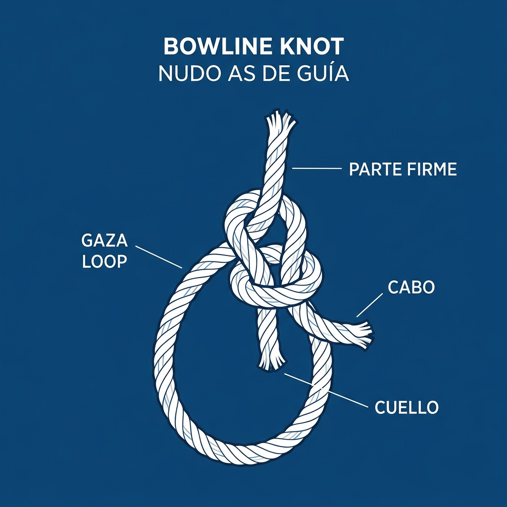
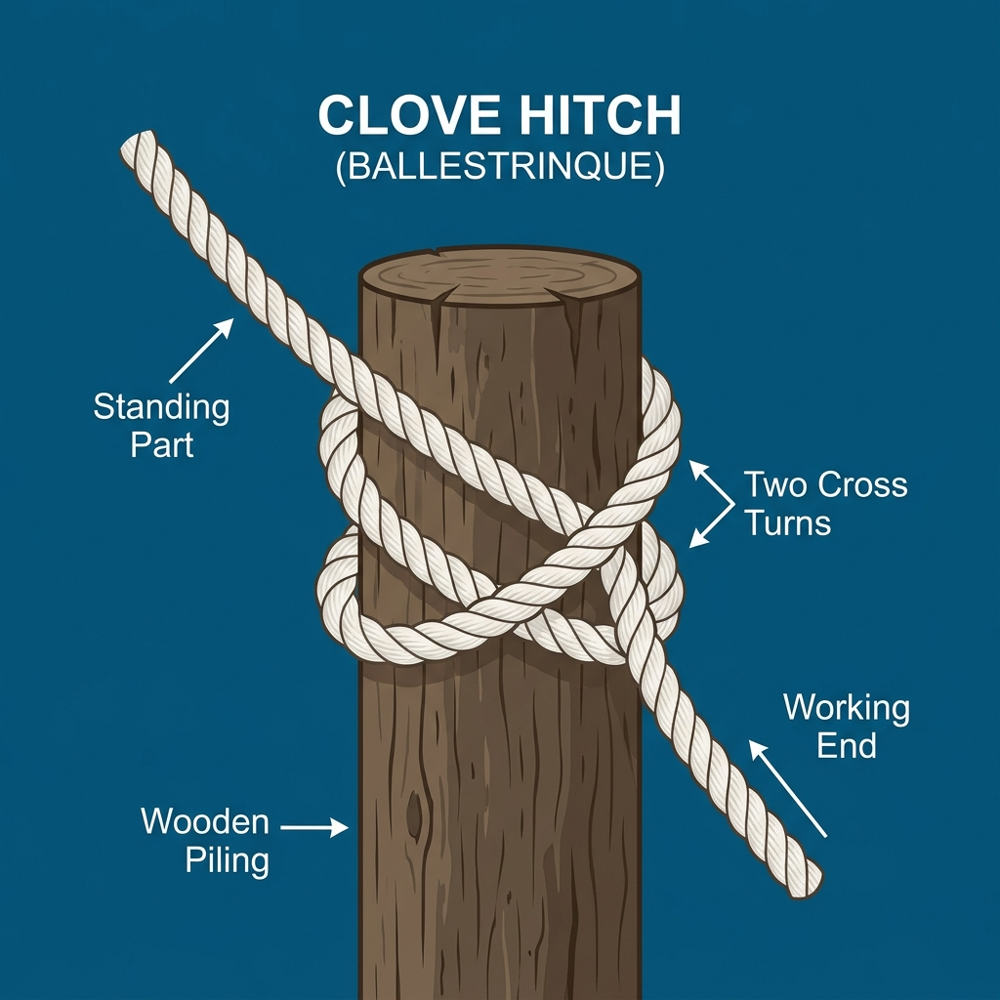
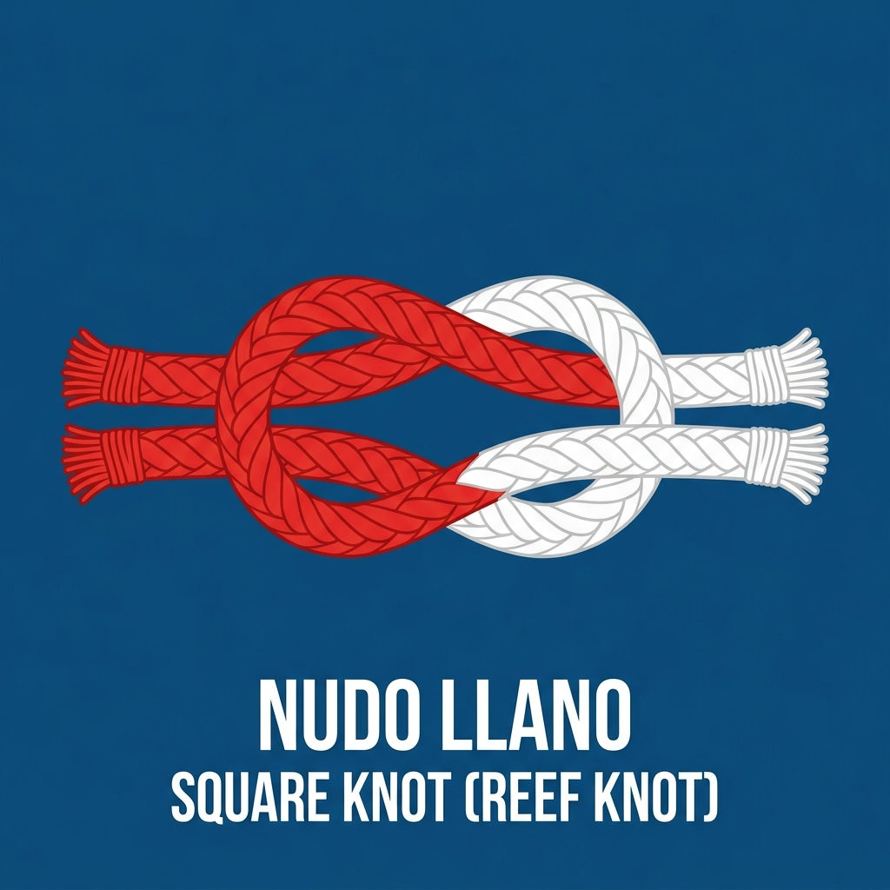
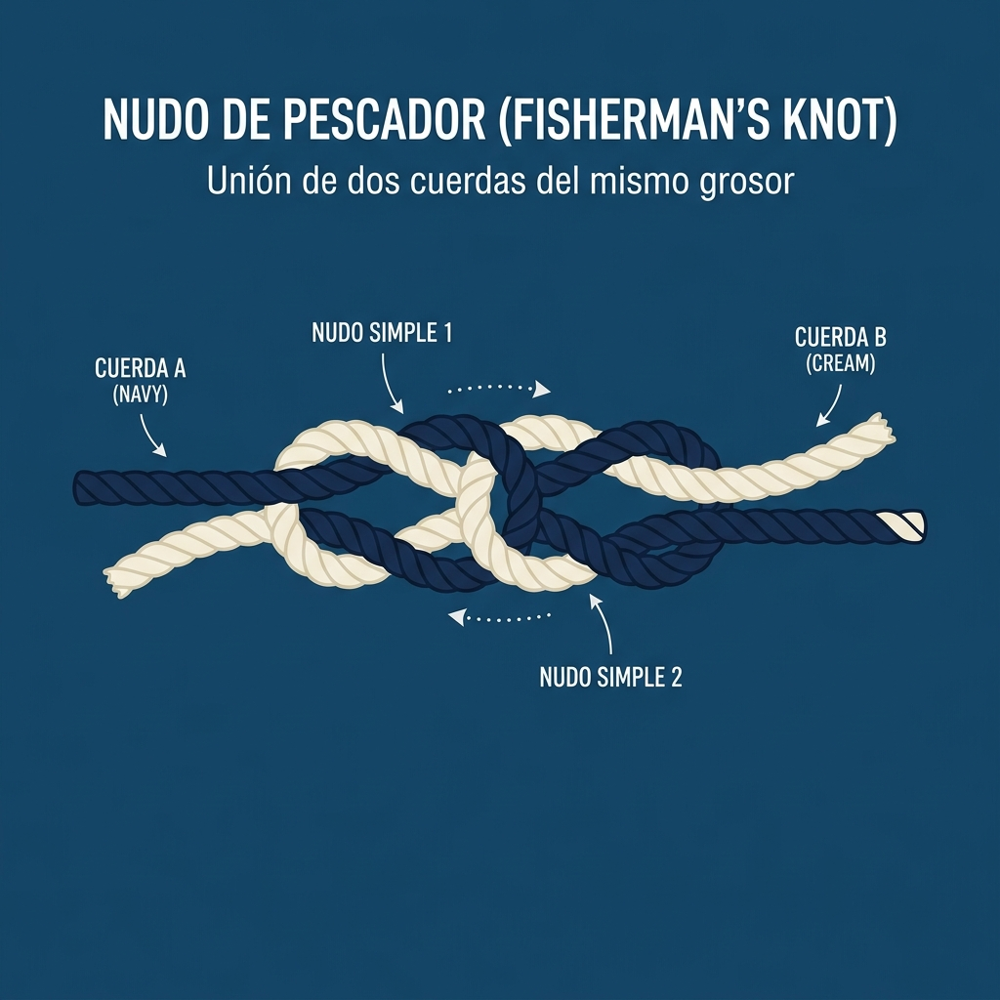

# Nudos Marineros y Cabullería

La cabullería es el conjunto de cabos y cuerdas utilizados a bordo de una embarcación. Conocer los nudos básicos y el manejo adecuado de los cabos es una habilidad fundamental para cualquier navegante, ya que garantiza la seguridad y la eficacia en las maniobras.

## Conceptos Básicos de Cabullería

*   **Cabo:** Cualquier cuerda utilizada en un barco.
*   **Chicote:** El extremo libre de un cabo.
*   **Firme:** La parte principal o más larga de un cabo.
*   **Seno:** Una curva o bucle que se forma en un cabo.
*   **Mena:** El grosor de un cabo (medido por su circunferencia o diámetro).
*   **Adujar:** Recoger un cabo formando vueltas ordenadas para evitar que se enrede.
*   **Hacer firme:** Sujetar un cabo para que no se suelte.
*   **Zafar:** Soltar o desenredar un cabo.

## Materiales de los Cabos

Los cabos modernos se fabrican principalmente con materiales sintéticos, cada uno con características específicas:

*   **Poliéster:** Muy resistente, poco elástico y resistente a los rayos UV. Ideal para drizas y escotas.
*   **Poliamida (Nylon):** Muy elástico y resistente a los tirones. Ideal para amarras y líneas de fondeo.
*   **Dyneema / Spectra:** Extremadamente resistente y ligero, con muy poca elasticidad. Utilizado en veleros de regata para drizas, brazas y obenques.
*   **Polipropileno:** Ligero y flota en el agua. Utilizado para cabos de remolque, rabizas de salvavidas y esquí acuático. Se degrada rápido con el sol.

## Nudos Esenciales

Todo patrón debe dominar una serie de nudos básicos. Un buen nudo marinero se caracteriza por ser fácil de hacer, seguro cuando está sometido a tensión, y fácil de deshacer incluso después de haber soportado mucha carga.

### 1. As de Guía (Bowline)

Es el "rey de los nudos". Se utiliza para formar una gaza (lazo) fija en el extremo de un cabo que no se escurre ni se aprieta.

**Usos:**
*   Amarrar escotas a los puños de las velas.
*   Hacer firme una driza.
*   Para izar a una persona (bucle de rescate).

### 2. Ballestrinque (Clove Hitch)

Nudo rápido para hacer firme un cabo a un mástil, candelero, bita o argolla. Tiende a aflojarse si la tensión no es constante, por lo que a menudo se remata con medios cotes.

**Usos:**
*   Amarrar las defensas a los candeleros.
*   Amarres temporales.

### 3. Nudo Llano o Rizo (Square Knot)

Se utiliza para unir dos cabos del **mismo grosor (mena)** y material. Si se usa con cabos de diferente mena, se escurrirá y se soltará.

**Usos:**
*   Atar los matafiones al tomar rizos en la vela mayor.
*   Unir cabos pequeños o vendajes.

### 4. Vuelta de Escota (Sheet Bend)

Nudo diseñado específicamente para unir dos cabos de **diferente grosor (mena)**. El cabo de mayor mena forma un seno y el más fino se teje alrededor de él.

**Usos:**
*   Unir un cabo de remolque a una amarra más fina.
*   Empalmar la driza con el cabo mensajero.

### 5. Nudo en Ocho o Lasca (Figure-Eight Knot)

Nudo de tope. Forma un volumen en el extremo del cabo para evitar que se escape a través de una polea, mordaza o cáncamo.

**Usos:**
*   Extremos de las escotas de génova y mayor.
*   Extremos de las drizas.

### 6. Pescador (Fisherman's Knot)

Utilizado para unir dos cabos mojados, resbaladizos o de material sintético (como hilos de pesca). Consiste en dos nudos simples que se aprietan uno contra el otro.

**Usos:**
*   Aparejos de pesca.
*   Unir cabos muy finos.

### 7. Margarita (Sheepshank)

Se utiliza para acortar la longitud de un cabo sin cortarlo, o para evitar que una parte rozada o dañada del cabo soporte la tensión.

**Usos:**
*   Proteger una zona gastada del cabo.
*   Acortar temporalmente una amarra o viento.

## Mantenimiento de la Cabullería

*   **Evitar rozaduras:** Proteger los cabos donde rocen con el casco o cubierta usando protecciones plásticas, mangueras o forros de cuero (protecciones antifricción).
*   **Lavar con agua dulce:** Eliminar los cristales de sal que actúan como abrasivos internos rompiendo las fibras.
*   **Secar a la sombra:** Evitar la exposición prolongada y directa al sol cuando no se usan, ya que los rayos UV degradan los materiales sintéticos.
*   **Revisión periódica:** Inspeccionar el alma y la funda (camisa) en busca de deshilachados o pérdida de flexibilidad. Sustituir al menor síntoma de fatiga estructural.
