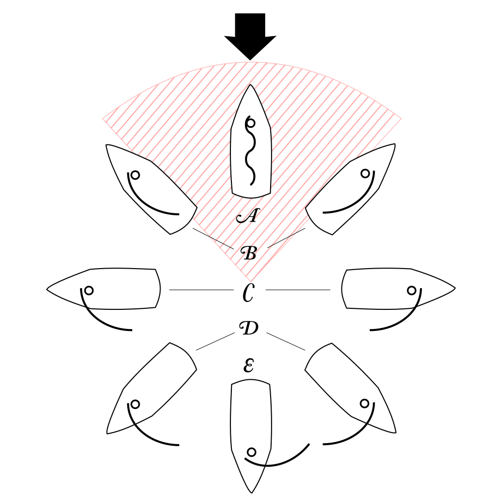

# Navegación a Vela y Aerodinámica

Gobernar un velero es un ejercicio de equilibrio vectorial entre dos fluidos: el aire (aerodinámica) y el agua (hidrodinámica). A diferencia de un barco de motor, un velero no es empujado por el viento, sino que "vuela" en él.

---

## 1. El Principio de Bernoulli (Lift vs Drag)

¿Por qué un velero puede navegar "contra" el viento en un ángulo de $45^\circ$? La respuesta no es que el viento empuje la tela (Drag o resistencia aerodinámica), sino que la vela actúa exactamente igual que el ala de un avión en posición vertical.

1.  El viento golpea el grátil (borde de ataque) de la vela.
2.  El flujo se divide: una parte va por sotavento (la cara convexa exterior) y otra por barlovento (la cara cóncava interior).
3.  Según el Teorema de Bernoulli, el aire de la cara exterior se acelera, provocando una caída drástica de la presión estática.
4.  Esta diferencia de presiones "succiona" la vela hacia adelante. Esta fuerza de empuje se llama **Sustentación (Lift)**.

### El Plano Antideriva
La fuerza de sustentación de la vela tira del barco diagonalmente hacia adelante y hacia un lado. Si el barco fuera plano por debajo, patinaría lateralmente sobre el agua. 
Para evitarlo, los veleros tienen una **orza o quilla profunda**. El agua actúa sobre la quilla generando una fuerza hidrodinámica igual y opuesta a la fuerza lateral del viento, cancelando el desplazamiento lateral (abatimiento) y dejando únicamente el componente de avance hacia adelante.

---

## 2. El Viento Aparente: La suma vectorial

El concepto más difícil para el principiante es que el viento que se siente en la cara (Viento Aparente) no es el mismo que el viento que sopla sobre el mar (Viento Real).

*   **Viento Real (True Wind - TW):** Es el viento meteorológico estático.
*   **Viento de Velocidad:** Es el viento creado por el avance del propio barco (si vas a 10 nudos, generas un viento de 10 nudos en tu contra).
*   **Viento Aparente (Apparent Wind - AW):** Es la suma vectorial del Real + el de Velocidad.

*Consecuencia táctica:* A medida que aceleras de través, el viento aparente aumenta en intensidad y se "cierra" (se acerca hacia la proa). Por eso, al acelerar, siempre tienes que cazar (apretar) más las velas.

---

## 3. Rumbos respecto al viento

No puedes navegar directo contra el ojo del viento (zona muerta, aprox. $45^\circ$ a cada lado de la proa).

*Rosa de rumbos: desde la zona muerta ("no-go zone") hasta la empopada pura. Fuente: [Wikimedia Commons](https://commons.wikimedia.org/wiki/File:Points_of_sail.svg), autor Andrew c, licencia CC BY-SA 3.0.*

1.  **Ceñida (Close Hauled):** A $45^\circ$ del viento. Vas lo más "contra" el viento posible. Velas cazadas a tope, barco muy escorado (tumbado). Es el rumbo de mayor Lift.
2.  **Descuartelar (Close Reach):** A unos $60^\circ$. Más cómodo, menos escora y más rápido que la ceñida.
3.  **Través (Beam Reach):** A $90^\circ$ del viento (entra por un costado). Es el rumbo más rápido de un velero, máximo aprovechamiento de vectores.
4.  **Aleta (Broad Reach):** A $135^\circ$ por detrás. El barco empieza a ser empujado, la vela mayor bloquea el viento a la vela de proa (génova).
5.  **Empopada (Running):** Viento a $180^\circ$ (entra directo por la espalda). Peligroso por riesgo de trasluchada accidental. Solo funciona por Drag (empuje puro), el Lift desaparece. A menudo se navega en "Orejones" (Vela mayor a una banda y Génova a la contraria).

---

## 4. Las Maniobras Básicas: Virar y Trasluchar

Para cambiar de amura (lado por el que entra el viento), hay dos formas de hacerlo:

### Virada por Avante (Tacking)
Cambiar de rumbo metiendo la **proa** a través del ojo del viento.
1.  El caña avisa: *"¡Preparados para virar!"*.
2.  *"¡Virando!"*. Gira el timón empujando la caña hacia la vela mayor.
3.  El barco se enfrenta al viento, las velas flamean ruidosamente.
4.  La tripulación suelta la escota del génova (soltar) y la caza (tira) rápidamente en el lado contrario mientras el viento la infla por la nueva amura.

### Trasluchada (Jibing)
Cambiar de rumbo pasando la **popa** a través del viento.
Es una maniobra **muy violenta y peligrosa** con vientos fuertes, porque la botavara de acero (que pesa 50 kg) cruza la bañera a una velocidad tremenda de un lado a otro (pudiendo golpear cabezas o partir el mástil).
1.  *"¡Preparados para trasluchar!"*.
2.  La tripulación empieza a cazar la vela mayor hacia el centro del barco para controlar su recorrido.
3.  *"¡Traslucho!"*. El barco cruza la popa por el viento.
4.  El viento coge la vela mayor por detrás y la empuja violentamente al nuevo lado. Se lasca rápido para absorber el golpe.

---

## 5. El Equilibrio del Barco: Centro Vélico y Centro de Deriva

Un velero navega recto cuando sus fuerzas están equilibradas. Existen dos centros imaginarios de fuerza:
*   **Centro Vélico (CV):** Es el centro geométrico donde se concentra toda la fuerza de empuje de las velas. Se mueve hacia adelante o atrás dependiendo de qué velas tengas izadas.
*   **Centro de Deriva (CD):** Es el punto de pivote submarino, dictado por la posición de la orza/quilla y el timón.

La relación entre estos dos puntos define el "carácter" del barco al timón:
*   **Barco Ardiente (Weather Helm):** El CV está por detrás del CD. El barco tiende a aproarse (girar hacia el viento) por sí solo. Es la configuración más segura; si el timonel se desmaya y suelta la caña, el barco se pondrá proa al viento y se detendrá. Casi todos los veleros modernos se diseñan ligeramente ardientes.
*   **Barco Blando (Lee Helm):** El CV está por delante del CD. El barco tiende a alejarse del viento (arribar). Es muy peligroso, porque en una racha fuerte el barco girará hacia la empopada y podría trasluchar violentamente.

---

## 6. Inventario de Velas: El Motor del Barco

No todas las velas sirven para lo mismo. Se dividen en velas de ceñida (planas) y velas de portantes (globosas).

### Velas de Ceñida (Upwind)
*   **Vela Mayor:** La vela principal que va sujeta al mástil y a la botavara. Proporciona el equilibrio principal.
*   **Foque (Jib):** Vela de proa pequeña. Su tamaño no sobrepasa el mástil hacia atrás. Ideal para vientos fuertes y ceñidas cerradas.
*   **Génova (Genoa):** Vela de proa grande que se superpone ("solapa") al mástil, llegando a veces casi hasta la popa (Génova 150%). Genera una enorme potencia acelerando el viento a través del canal que forma con la vela mayor (Efecto Venturi).
*   **Tormentín:** Un foque minúsculo, durísimo, de color naranja fosforito, usado solo para sobrevivir en temporales (Fuerza 8+).

### Velas Portantes (Downwind)
Diseñadas para vientos de aleta o empopada. Son como paracaídas inmensos.
*   **Spinnaker (Spi) Simétrico:** Un globo gigante y redondo. Requiere un tangón (palo horizontal que lo separa del mástil). Es muy complejo de maniobrar pero es el rey absoluto en rumbos de empopada pura ($180^\circ$).
*   **Gennaker (Spinnaker Asimétrico):** Un híbrido entre el génova y el spi. Se amura (engancha) directamente en la punta de la proa (o en un botalón), sin tangón. Es más fácil de usar para tripulaciones reducidas y excelente para vientos de aleta ($120^\circ-150^\circ$).

---

## 7. Glosario de Trimado (Ajuste de Velas)

*   **Cazar:** Tirar de un cabo para cerrar (acercar al centro) la vela.
*   **Lascar:** Soltar un cabo para abrir la vela. 
    *   *Regla de oro:* "Ante la duda, lasca". Si la vela flamea (tiembla en el grátil), estás lascando demasiado o vas demasiado ceñido. Caza un poco hasta que deje de flamear.
*   **Rizar (Tomar Rizos):** Reducir el área o tamaño de la vela mayor porque hace demasiado viento y el barco escora peligrosamente. (Se debe rizar *antes* de que sea necesario, no cuando ya es tarde).

---

## 8. Precauciones de Seguridad en Maniobras

La fuerza que ejerce el viento sobre las velas y las escotas se mide en toneladas, no en kilos. Un error de sincronización durante una maniobra puede causar lesiones graves.

### El Peligro de la Botavara
La botavara es un perfil de aluminio o carbono pesado que barre la bañera a la altura de las cabezas.
*   **Trasluchada Involuntaria:** Ocurre navegando de empopada si el caña se despista y el viento coge la vela por el lado contrario. La botavara cruzará el barco a una velocidad letal. **Prevención:** Instalar siempre una **Retenida de Botavara** (un cabo que ata la botavara a la proa para impedir que cruce sola).
*   **Avisos Claros:** El patrón nunca debe iniciar un giro sin gritar *"¡Preparados para virar/trasluchar!"* y recibir el *"¡Listos!"* de la tripulación.

### Manejo de Winches y Cabos
*   **Regla del Pulgar:** Jamás enrolles un cabo en tensión alrededor de tu mano para tirar de él. Si una racha repentina tira del cabo, te amputará los dedos.
*   **Cazar en el Winch:** Siempre mantén las manos al menos a 20 centímetros del tambor del winch. Usa la técnica de "mano sobre mano".
*   **Orden de los Cabos:** Una bañera llena de cabos enredados ("spaghetti") es peligrosa en una emergencia. Los cabos que no se están usando deben estar adujados (enrollados) y colgados ordenadamente.

### Cargas en las Cornamusas
*   Al soltar una driza bajo tensión (ej. para bajar la vela mayor), nunca la quites de golpe de la cornamusa. Mantén una vuelta mordida y suelta fricción poco a poco, o la vela caerá de golpe descontrolada, quemándote las manos por la fricción del cabo.

---

## 9. Reglamento de Regatas a Vela (RRV / World Sailing)

> **Aviso importante:** Lo que sigue es el **Reglamento de Regatas a Vela (RRV)**, redactado por World Sailing (antes ISAF). Es un reglamento **deportivo**, que solo se aplica entre embarcaciones que están compitiendo oficialmente en una regata bajo bandera de club. **No sustituye ni deroga el RIPA** (Reglamento Internacional para Prevenir Abordajes), que es la ley general de navegación aplicable siempre, en todo momento y a todo tipo de embarcación. Consulta [RIPA_Y_BALIZAMIENTO.md](RIPA_Y_BALIZAMIENTO.md) para las reglas generales de derecho de vía fuera de regata. Fuera del campo de regatas (o frente a un barco que no compite), rige siempre el RIPA.

El RRV es, de hecho, **más estricto** que el RIPA en muchos aspectos: obliga a maniobrar con mucha más antelación y añade situaciones (como el adelantamiento o el paso de una marca) que el RIPA general no contempla con tanto detalle.

### Las Tres Reglas Fundamentales de Paso en Regata
Cuando dos veleros en regata se aproximan y existe riesgo de colisión, se aplican en este orden:

1.  **Amuras Opuestas (Regla 10):** Si un barco recibe el viento por babor y el otro por estribor, el amurado a **babor cede el paso** al amurado a **estribor**. Es la regla más básica y se aplica siempre que el bordo sea distinto, sin importar quién va delante o detrás.
2.  **Mismas Amuras, Barlovento/Sotavento (Regla 11):** Si ambos barcos navegan amurados al mismo lado (mismo bordo), el barco que está a **barlovento cede el paso** al barco que está a **sotavento**. El de sotavento tiene preferencia porque es el que "manda" el aire al de barlovento.
3.  **Alcanzar (Regla 12):** Cuando ambos barcos navegan al mismo bordo y no están claramente ni a barlovento ni a sotavento (uno viene por detrás), el barco que **alcanza cede el paso** al barco alcanzado, sea cual sea su amura. El barco alcanzado mantiene su rumbo.

*Nota:* Estas tres reglas son análogas en espíritu a las reglas de cruce entre veleros del RIPA, pero el RRV las desarrolla con mucho más detalle (zonas de las boyas, obligación de dar espacio, protestas, etc.), por lo que **solo son válidas dentro del campo de regatas** y entre barcos que compiten.

### Señales de Banderas del Comité de Regatas
El Comité de Regatas comunica el desarrollo de la salida y la prueba mediante banderas izadas en el barco comité, acompañadas siempre de una señal sonora (bocina o cañonazo):

*   **Bandera de Clase (Señal de Atención):** Iza la bandera de la clase que va a salir. Marca el inicio de la cuenta atrás (normalmente 5 minutos antes de la salida).
*   **Bandera P (Preparatoria):** Se iza junto (o poco después) de la de clase, normalmente a 4 minutos de la salida. Indica que los barcos deben empezar a maniobrar para colocarse en la línea de salida; a partir de aquí ciertas reglas de regata se activan de forma más estricta.
*   **Postergación / AP (Answering Pennant o "Bandera de Respuesta"):** Anuncia que la salida se **pospone**. Se arría (baja) cuando la nueva secuencia de salida está a punto de reanudarse. Suele indicar que hay un problema (viento insuficiente, campo mal orientado, espera de otra flota).
*   **Recall Individual (Bandera X):** Se iza justo después de la salida cuando **uno o varios barcos concretos** se han adelantado (OCS - On Course Side, "barco sobre la línea"). Esos barcos deben volver a cruzar la línea de salida correctamente antes de seguir la regata, o serán descalificados.
*   **Recall General (Primer Sustituto):** Se iza cuando **un número indeterminado o excesivo** de barcos se ha adelantado en la salida, o hubo un error en la línea. Anula la salida completa: **toda la flota** debe repetir la secuencia de salida desde el principio.

---
