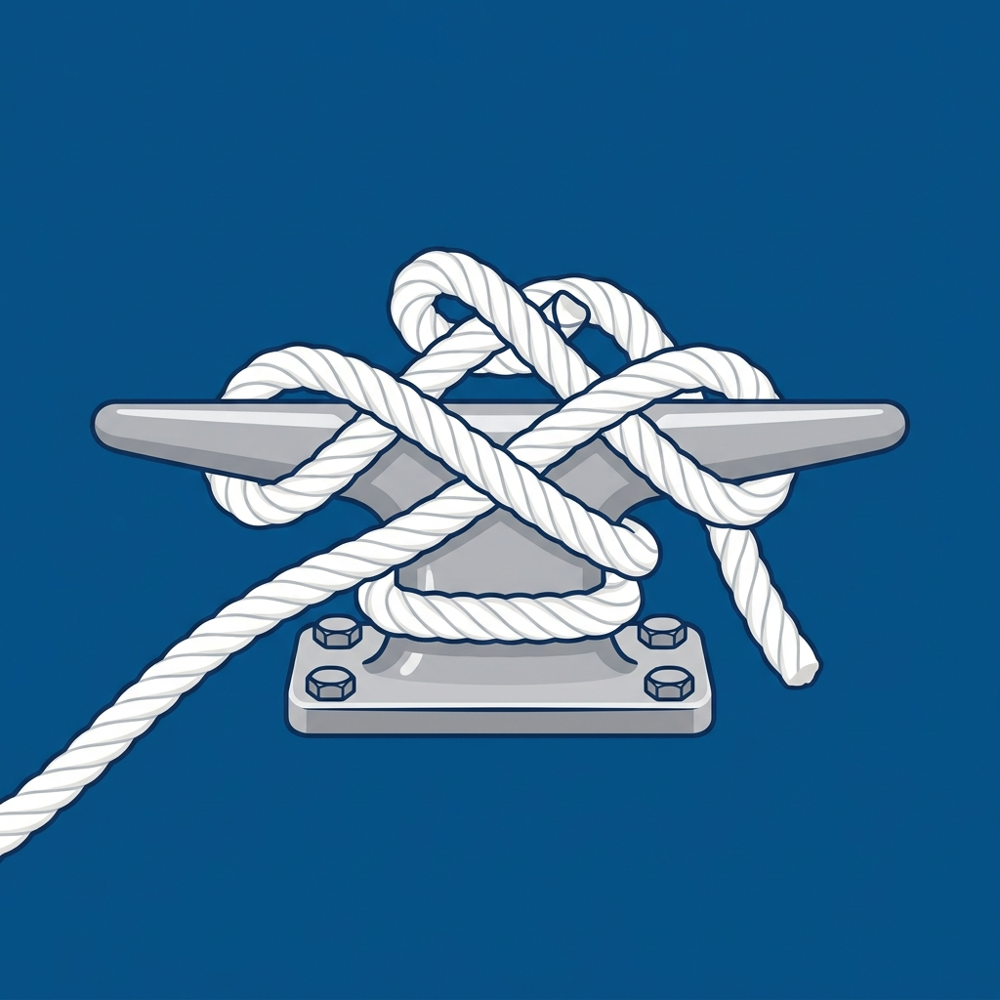

# Nudos de Amarre

Los nudos de amarre se utilizan para hacer firme (sujetar) un cabo a un objeto fijo, como una cornamusa, un noray, un poste, una argolla o una anilla.

## 1. As de Guía (Bowline)

El "Rey de los Nudos". Es un nudo extremadamente seguro que crea una gaza (un lazo) fija que no se escurre ni se aprieta bajo tensión. Es muy fácil de deshacer incluso después de haber soportado grandes cargas.

**Usos principales:**
*   Amarrar las escotas a la vela (foque).
*   Encapillar una amarra en un noray.
*   Izado de personas.
*   **Tutorial en YouTube:** [Cómo hacer el As de Guía (Búsqueda en YouTube)](https://www.youtube.com/results?search_query=como+hacer+nudo+as+de+guia)

---

## 2. Ballestrinque (Clove Hitch)

Es un nudo rápido de hacer y ajustar, pero tiene un defecto crítico: si la tensión no es constante, puede aflojarse.

**Usos principales:**
*   Amarrar las defensas a los guardamancebos (ya que permite ajustar la altura rápidamente).
*   Amarre temporal a un poste o pilote cilíndrico.
*   *Precaución:* Puede aflojarse si la tensión no es constante o si el cabo gira. Suele rematarse con un par de cotes de seguridad para evitar que se deshaga.
*   **Tutorial en YouTube:** [Cómo hacer el Ballestrinque (Búsqueda en YouTube)](https://www.youtube.com/results?search_query=como+hacer+nudo+ballestrinque)

---

## 3. Vuelta de Cornamusa (Cleat Hitch)

Es la forma correcta y marinera de amarrar un cabo (como las amarras del barco o las drizas) a una cornamusa.

**Regla de oro:** Se da una vuelta completa por la base (alejada de la carga), se cruza en forma de "ocho" por los cuernos, y se remata con una mordida (donde el cabo que tira queda pisado por el que cruza).

**Usos principales:**
*   Hacer firmes las amarras (esprines, largos, traveses) al llegar a puerto.
*   Hacer firmes las drizas en el mástil.
