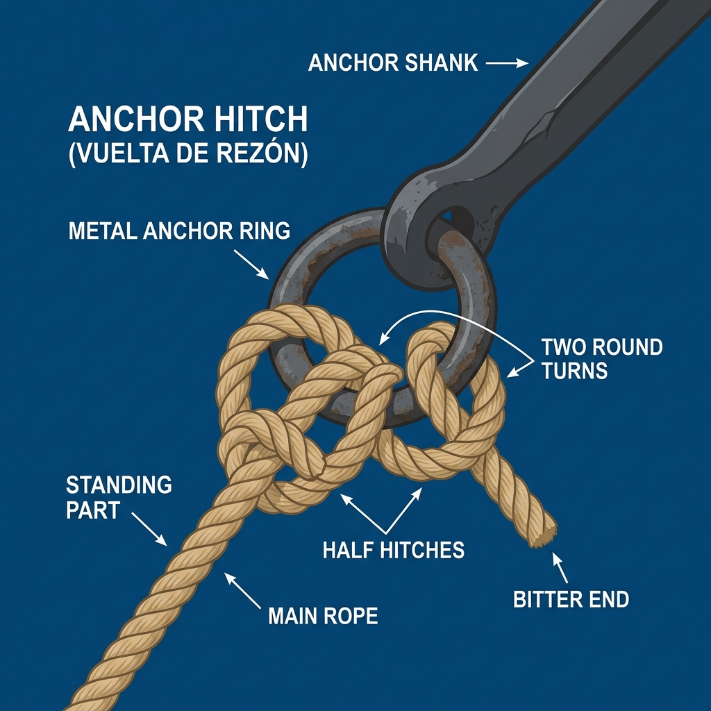
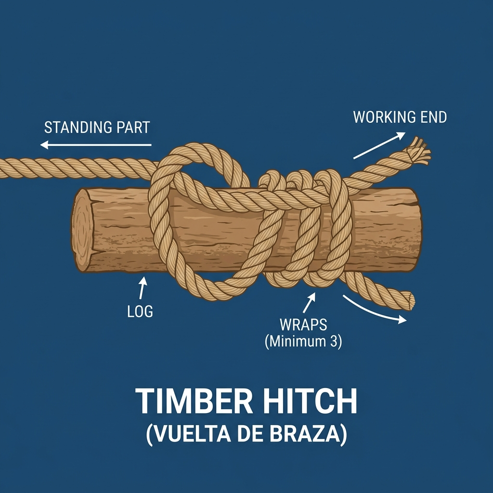

# Nudos de Amarre

Los nudos de amarre se utilizan para hacer firme (sujetar) un cabo a un objeto fijo, como una cornamusa, un noray, un poste, una argolla o una anilla.

## 1. As de Guía (Bowline)

El "Rey de los Nudos". Es un nudo extremadamente seguro que crea una gaza (un lazo) fija que no se escurre ni se aprieta bajo tensión. Es muy fácil de deshacer incluso después de haber soportado grandes cargas.

**Usos principales:**
*   Amarrar las escotas a la vela (foque).
*   Encapillar una amarra en un noray.
*   Izado de personas.

**Uso práctico a bordo:** Si hay que rescatar a alguien caído al agua, el as de guía es el nudo que haces en segundos en el extremo del cabo salvavidas para lanzarle una gaza fija: sabes que no se cerrará sobre la persona por mucha fuerza que haga, y que después podrás deshacerlo aunque haya soportado todo su peso.

*   **Tutorial en YouTube:** [Cómo hacer el As de Guía (Búsqueda en YouTube)](https://www.youtube.com/results?search_query=como+hacer+nudo+as+de+guia)

---

## 2. Ballestrinque (Clove Hitch)

Es un nudo rápido de hacer y ajustar, pero tiene un defecto crítico: si la tensión no es constante, puede aflojarse.

**Usos principales:**
*   Amarrar las defensas a los guardamancebos (ya que permite ajustar la altura rápidamente).
*   Amarre temporal a un poste o pilote cilíndrico.
*   *Precaución:* Puede aflojarse si la tensión no es constante o si el cabo gira. Suele rematarse con un par de cotes de seguridad para evitar que se deshaga.

**Uso práctico a bordo:** Al atracar brevemente en un pantalán para repostar o hacer una gestión rápida, el ballestrinque te permite hacer firme el barco a un pilote o poste en un par de segundos; como es solo para unos minutos y vas a estar pendiente, no hace falta rematarlo con cotes adicionales.

*   **Tutorial en YouTube:** [Cómo hacer el Ballestrinque (Búsqueda en YouTube)](https://www.youtube.com/results?search_query=como+hacer+nudo+ballestrinque)

---

## 3. Vuelta de Cornamusa (Cleat Hitch)

Es la forma correcta y marinera de amarrar un cabo (como las amarras del barco o las drizas) a una cornamusa.

**Regla de oro:** Se da una vuelta completa por la base (alejada de la carga), se cruza en forma de "ocho" por los cuernos, y se remata con una mordida (donde el cabo que tira queda pisado por el que cruza).

**Usos principales:**
*   Hacer firmes las amarras (esprines, largos, traveses) al llegar a puerto.
*   Hacer firmes las drizas en el mástil.

**Uso práctico a bordo:** Al llegar a puerto y lanzar la amarra al personal de muelle, la aseguras en la cornamusa de cubierta con esta vuelta: aguanta toda la tensión del atraque, no se desliza, y puedes soltarla en un segundo tirando del chicote aunque el barco esté tirando con fuerza.

---

## 4. Vuelta de Rezón o de Ancla (Anchor Hitch)
Es un nudo extremadamente resistente, diseñado específicamente para unir un cabo a la argolla (arganeo) de un ancla o rezón.

**Usos principales:**
*   Amarrar la línea de fondeo al ancla.
*   *Ventaja:* Por mucha tensión que sufra bajo el agua o por muchos tirones que dé el barco al fondear, este nudo no se azoca (aprieta) tanto como para ser imposible de deshacer, y no resbala.

---

## 5. Vuelta de Braza (Timber Hitch)
Es un nudo de amarre por fricción, muy rápido de hacer, pero que solo funciona mientras haya tensión constante.

**Usos principales:**
*   Arrastrar, remolcar o izar objetos cilíndricos alargados (como tablones, troncos o perchas).
*   *Precaución:* Si la tensión afloja, el nudo se deshace inmediatamente.
