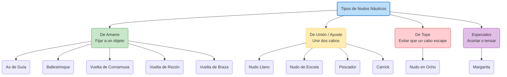

# Nudos Náuticos

En la mar, un nudo mal hecho no solo es un inconveniente, puede ser un peligro mortal. Un buen nudo náutico se define por tres características: es fácil de hacer, cumple su función a la perfección sin escurrirse, y **es fácil de deshacer incluso después de haber estado sometido a gran tensión**.

## Clasificación Principal

Hemos dividido los nudos en cuatro categorías principales para facilitar su estudio:

1.  **[Nudos de Amarre](AMARRE.md)**: Sirven para hacer firme un cabo a un objeto (cornamusa, noray, argolla, mástil). *Ej: As de Guía, Ballestrinque.*
2.  **[Nudos de Unión (Ayustes)](UNION.md)**: Sirven para unir dos cabos entre sí, ya sean del mismo o de distinto grosor. *Ej: Nudo Llano, Nudo de Escota.*
3.  **[Nudos de Tope](TOPE.md)**: Se hacen al final del cabo para evitar que se escape por una polea o pasacabos. *Ej: Nudo en Ocho.*
4.  **[Nudos Especiales (Otros)](OTROS.md)**: Nudos para acortar cabos, hacer tensores o aislar zonas dañadas. *Ej: Nudo de Margarita.*
