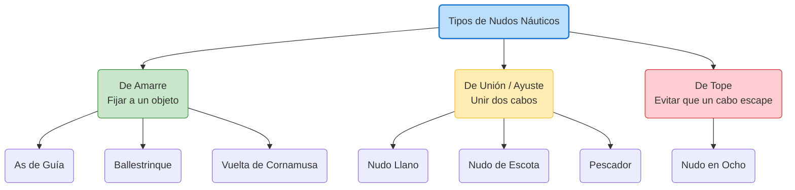

# Nudos Náuticos

En la mar, un nudo mal hecho no solo es un inconveniente, puede ser un peligro mortal. Un buen nudo náutico se define por tres características: es fácil de hacer, cumple su función a la perfección sin escurrirse, y **es fácil de deshacer incluso después de haber estado sometido a gran tensión**.

## Clasificación Principal

Hemos dividido los nudos en tres categorías principales para facilitar su estudio:

*   **[Nudos de Amarre](AMARRE.md)**: Utilizados para hacer firme un cabo a un objeto, poste, noray o incluso a una persona. (Ej: As de guía, Ballestrinque).
*   **[Nudos de Unión (Ayustes)](UNION.md)**: Utilizados para unir dos cabos entre sí. (Ej: Llano, Vuelta de escota).
*   **[Nudos de Tope](TOPE.md)**: Utilizados para engrosar el extremo de un cabo y evitar que se escape. (Ej: Nudo en ocho).
