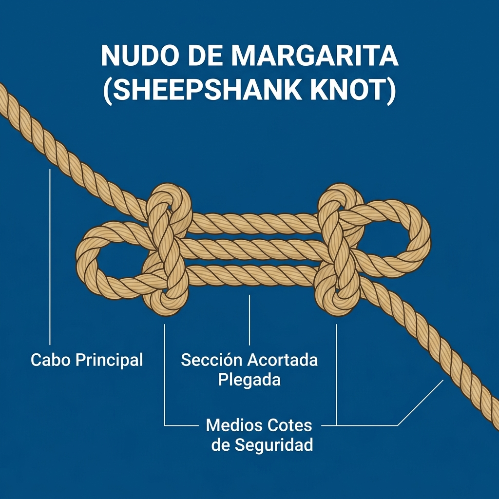

# Otros Nudos (Especiales)

Existen nudos que no encajan estrictamente en la categoría de Amarre, Unión o Tope, pero que cumplen funciones muy específicas e indispensables a bordo.

## 1. Nudo de Margarita (Sheepshank)

El nudo de margarita es una solución temporal e ingeniosa diseñada para dos propósitos principales: acortar un cabo sin tener que cortarlo, o aislar una sección dañada del cabo para que no sufra tensión.

**Usos principales:**
*   **Acortar amarras:** Si un cabo es demasiado largo para una maniobra y no queremos o no podemos cortarlo.
*   **Proteger una sección dañada (coca):** Si el cabo está rozado (descolchado) en un punto central, hacemos el nudo dejando la parte dañada en el bucle central, de forma que la tensión recae sobre los cotes laterales y no sobre la parte débil.
*   *Precaución:* Solo es seguro si el cabo se mantiene bajo tensión constante. Si la tensión afloja, el nudo tiende a deshacerse. Para evitarlo, se pueden meter unos "cazones" (trozos de madera) por las gazas laterales.
