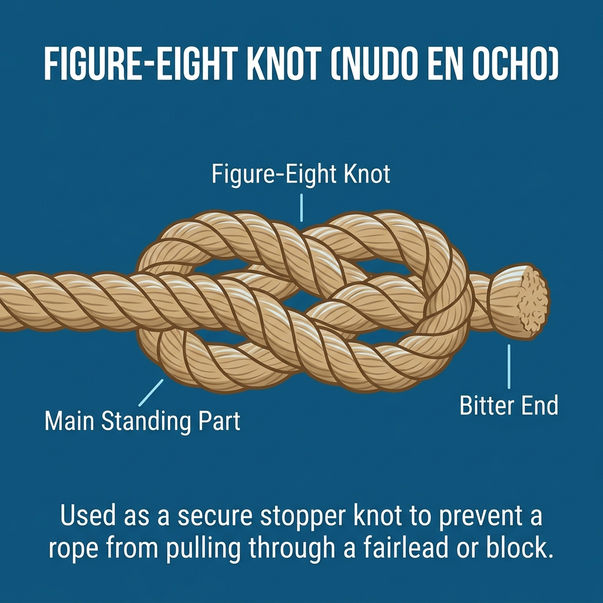

# Nudos de Tope

Los nudos de tope se realizan al final de un cabo para crear un engrosamiento. Su objetivo principal es evitar que el extremo del cabo se escape (se "despase") al pasar por una polea (motón), una mordaza, o un guiacabos.

## 1. Nudo en Ocho (Figure-eight Knot)

Es el nudo de tope por excelencia en náutica. Aunque el nudo simple (el clásico nudo ciego) también sirve de tope, el **nudo en ocho** es mucho más voluminoso y, sobre todo, **no se aprieta (azoca) tanto**, por lo que es mucho más fácil de deshacer después de haber estado sometido a gran tensión.

**Usos principales:**
*   Hacer un tope al final de las **escotas** (ej. escotas del foque) para que no se escapen por los carriles o poleas si se sueltan accidentalmente.
*   Tope en drizas para evitar perderlas en el interior del mástil.
*   En escalada se usa una variante (el ocho doble) para encordarse al arnés, demostrando su extremada seguridad.

**Uso práctico a bordo:** Antes de largar una escota o una driza, hazle siempre un nudo en ocho en el chicote. Así, si durante la maniobra el cabo se te escapa de las manos, quedará retenido en la última polea o pasacabos en lugar de perderse dentro del mástil o por la borda.

**Tutorial en YouTube:** [Cómo hacer el Nudo en Ocho (Búsqueda)](https://www.youtube.com/results?search_query=como+hacer+nudo+ocho)

---

## 2. As de Guía por Seno (Bowline on a Bight)

Es una variante del as de guía que se hace en el **centro del cabo, sin usar ninguno de los dos chicotes**. Crea dos gazas fijas y resistentes que no se escurren ni se aprietan bajo carga, con la misma fiabilidad que el as de guía tradicional.

**Regla de oro:** Se dobla el cabo por el punto deseado formando un seno (un bucle doblado en dos), y se hace el as de guía normal utilizando ese seno como si fuera un único chicote grueso.

**Uso práctico a bordo:** Es el nudo indicado cuando necesitas una gaza en mitad de un cabo cuyos dos extremos ya están ocupados o son inaccesibles, por ejemplo para izar a una persona improvisando un asiento (pasando cada pierna por una de las dos gazas) sin depender de ningún chicote libre.

**Usos principales:**
*   Improvisar un asiento o silla de contramaestre para izar a una persona (una gaza para cada pierna).
*   Crear dos puntos de amarre fijos en el centro de un cabo largo.
*   Maniobras de rescate: lanzar un cabo con doble gaza a una persona en el agua.

**Tutorial en YouTube:** [Cómo hacer el As de Guía por Seno (Búsqueda)](https://www.youtube.com/results?search_query=como+hacer+as+de+guia+por+seno)
