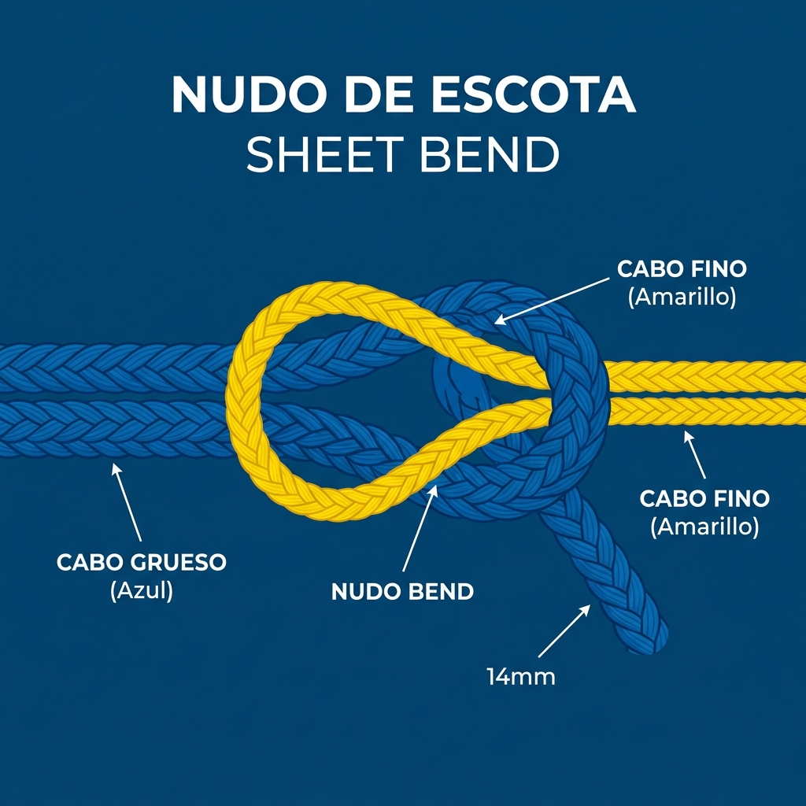

# Nudos de Unión (Ayuste)

Estos nudos sirven para unir o empalmar dos cabos diferentes para formar uno más largo, o para cerrar un cabo sobre sí mismo.

## 1. Nudo Llano (Rizo / Square Knot)
Es el nudo de unión más básico. Sirve para unir dos cabos de la **misma mena** (mismo grosor) y material. Si se usan cabos de distinto grosor, el nudo llano se escurrirá y se deshará bajo tensión.

**Regla de oro:** "El derecho sobre el izquierdo y por debajo; el izquierdo sobre el derecho y por debajo". Ambas partes del cabo deben salir por el mismo lado del lazo; si salen por lados opuestos, habrás hecho un "nudo de la abuela", que es muy inseguro.

**Usos principales:**
*   Tomar rizos en la vela mayor (de ahí su nombre).
*   Uniones temporales sin mucha tensión.

---

## 2. Nudo de Escota (Sheet Bend)
El Nudo de Escota es la solución profesional y segura para **unir dos cabos de diferente grosor (mena)** o diferente rigidez.

**Regla de oro:** Se hace una gaza simple (un bucle en forma de "U") con el cabo **más grueso**. El cabo más fino es el que trabaja, entrando por debajo, rodeando el cabo grueso, y metiéndose por debajo de sí mismo para morder.

**Usos principales:**
*   Unir cabos de diferente mena de forma segura.
*   Unir una escota a la gaza de una vela.

---

## 3. Nudo de Pescador (Fisherman's Knot)
Consiste básicamente en dos nudos simples (uno en cada cabo) que se estrangulan mutuamente al tirar de ellos.

**Usos principales:**
*   Ideal para cabos finos, mojados o muy resbaladizos (como el nylon o los hilos de pescar).
*   *Precaución:* Una vez sometido a mucha tensión o mojado, puede ser increíblemente difícil de deshacer.
