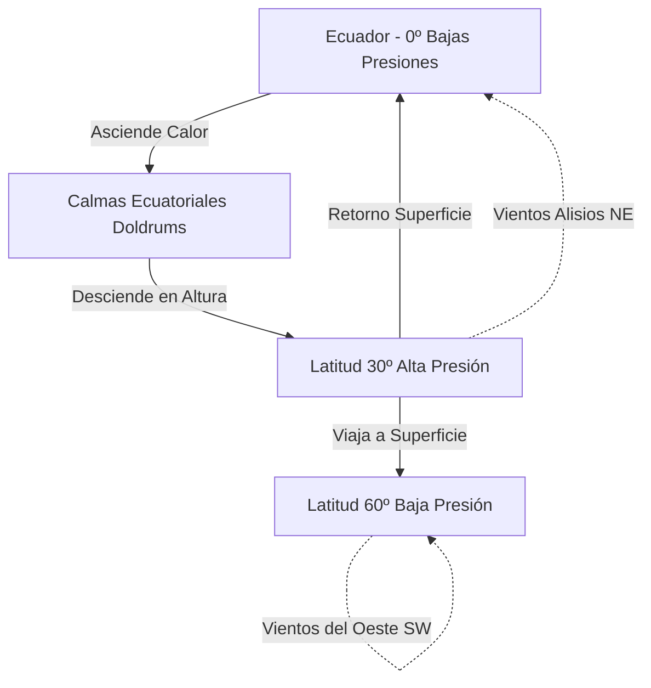

# Capitán de Yate - Tema 1: Meteorología Oceánica Avanzada

El Capitán de Yate debe enfrentarse a los sistemas climáticos globales y planificar rutas oceánicas (Routing) de varias semanas o meses, donde esquivar los centros de bajas presiones, los ciclones tropicales y aprovechar los sistemas de corrientes principales es vital. A diferencia del PER o PY, donde la meteorología es local o costera, aquí estudiamos la termodinámica del planeta entero y las fuerzas de la naturaleza a escala sinóptica.

---

## 1. Dinámica Atmosférica Global y Células de Circulación

La Tierra no calienta por igual el ecuador y los polos. Este diferencial térmico, sumado a la rotación de la Tierra (Fuerza de Coriolis), crea un sistema de cinturones de presión y de viento permanente que rige la navegación oceánica.

### El Efecto Coriolis (Fundamento Físico)
Cualquier masa de aire o agua que se desplace por la superficie de la Tierra sufrirá una desviación aparente respecto a su trayectoria original debido al giro del planeta. La aceleración de Coriolis $a_c$ viene dada por:

$$ a_c = 2 \cdot \Omega \cdot v \cdot \sin(\phi) $$

Donde:
*   $\Omega$ es la velocidad angular de la Tierra ($7.292 \times 10^{-5} \text{ rad/s}$).
*   $v$ es la velocidad de la masa de aire.
*   $\phi$ es la latitud.

Consecuencias:
*   En el **Hemisferio Norte (HN)**, Coriolis desvía los fluidos hacia la **DERECHA**.
*   En el **Hemisferio Sur (HS)**, Coriolis desvía los fluidos hacia la **IZQUIERDA**.
*   En el Ecuador ($\phi = 0$), la fuerza de Coriolis es cero (por eso los huracanes no cruzan el Ecuador).

### Células y Vientos Planetarios
1.  **Célula de Hadley (0º a 30º Latitud):** 
    *   El aire caliente asciende en el Ecuador Térmico formando la Zona de Convergencia Intertropical (ZCIT), un cinturón de bajas presiones llamado **Doldrums** (Calmas Ecuatoriales). Es una zona temida por los veleros por la ausencia de viento y tremendas tormentas eléctricas (convectivas).
    *   El aire en altura viaja hacia los polos y desciende frío en los 30º, formando los Grandes Anticiclones Subtropicales (Ej: Anticiclón de las Azores).
    *   El retorno en superficie hacia el Ecuador se desvía, formando los **Vientos Alisios (Trade Winds)**: constantes del Noreste (NE) en el HN y del Sureste (SE) en el HS.

2.  **Célula de Ferrel (30º a 60º Latitud):**
    *   El aire en superficie viaja desde los anticiclones (30º) a las bajas subpolares (60º).
    *   Generan los **Vientos del Oeste (Westerlies)** (del Suroeste en el HN y del Noroeste en el HS). Son el motor de las borrascas extratropicales. En el HS (sin continentes) se llaman *Cuarenta Rugientes* (Roaring Forties), *Cincuenta Aullantes* (Furious Fifties) y *Sesenta Bramadores* (Screaming Sixties).

3.  **Célula Polar (60º a 90º Latitud):**
    *   El aire gélido desciende (Anticiclón Polar) y viaja a latitudes subpolares formando los **Vientos del Este Polares**.

### Corrientes en Chorro (Jet Streams) y Ondas de Rossby
A gran altitud en la tropopausa, las fronteras entre estas células generan vientos a más de 300 km/h:
*   **Corriente en chorro polar:** Entre Célula Polar y Ferrel. Guía los frentes de borrascas atlánticas.
*   **Ondas de Rossby:** Meandros gigantes en los *Jet Streams* que dictan patrones climáticos duraderos, creando bloqueos anticiclónicos u olas de frío intenso.

---

## 2. Los Ciclones Tropicales Extremos (Huracanes / Tifones)

Es la peor amenaza para la vida de un navegante. Su energía térmica equivalente supera con creces el armamento termonuclear mundial.
*   **Atlántico / Pacífico Este:** Huracán.
*   **Pacífico Noroeste:** Tifón.
*   **Índico / Oceanía:** Ciclón Severo.

### Condiciones Termodinámicas Críticas de Formación
*   Temperatura del agua: **$\ge 26.5^\circ\text{C}$** hasta al menos 50 metros de profundidad, aportando ingentes cantidades de calor latente de evaporación.
*   Instabilidad atmosférica (CAPE elevado) y alta humedad en troposfera media.
*   Baja cizalladura del viento en altura (Wind Shear). Si el viento cambia de velocidad o dirección rápidamente con la altura, el "tubo" del huracán se decapita.
*   **$\phi \ge 5^\circ$ (Separación del Ecuador):** Necesario para que Coriolis genere vorticidad (giro).

### Escala de Saffir-Simpson (Intensidad)
Mide el viento máximo sostenido (promedio 1 minuto).
*   **Categoría 1:** 64-82 nudos. Daños mínimos.
*   **Categoría 3:** 96-112 nudos. Daños devastadores (Major Hurricane).
*   **Categoría 5:** $\ge 137$ nudos (>252 km/h). Catastrófico. Mar completamente blanca, olas > 15 metros.

### Estructura del Ciclón
*   **Ojo (Eye):** Centro de subsidencia (20-50 km). Cielo despejado, calmas y presión atmosférica hundida (puede bajar de 900 mb).
*   **Pared del Ojo (Eyewall):** Anillo de cumulonimbos convectivos. Vientos máximos, ascenso violento del aire. El lado derecho de la pared en el HN es el sector más letal del planeta.
*   **Bandas Espirales:** Convección que alimenta el núcleo, con turbonadas y tornados embebidos.

### Navegación Evasiva y Ecuaciones Tácticas
La "Regla del Semicírculo" es vital. Dividimos el huracán por su eje de traslación.

1.  **Semicírculo Peligroso (El Derecho en el H. Norte):** 
    *   $V_{\text{total}} = V_{\text{viento}} + V_{\text{traslación}}$. Viento máximo.
    *   El viento sopla hacia el vórtice, succionando el barco hacia la pared del ojo.
    *   **Táctica:** Poner el viento por la amura de estribor ($045^\circ - 060^\circ$ relativos), avanzar todo lo posible.

2.  **Semicírculo Manejable (El Izquierdo en el H. Norte):**
    *   $V_{\text{total}} = V_{\text{viento}} - V_{\text{traslación}}$.
    *   El viento tiende a expulsar al buque hacia la periferia.
    *   **Táctica:** Viento por la aleta de estribor ($130^\circ - 150^\circ$ relativos), correr el temporal alejándose.

**Regla 1-2-3 de Evitación del NHC:**
Error medio en predicción del vórtice. Un radio de evitación extra de:
*   100 millas náuticas a 24 horas.
*   200 millas náuticas a 48 horas.
*   300 millas náuticas a 72 horas.
Se dibuja un "Cono de Probabilidad" y el buque JAMÁS debe entrar en él.

---

## 3. Circulación Termohalina y Dinámica de Corrientes

El océano no está quieto. Existen dos flujos superpuestos:

### La Espiral de Ekman y Transporte de Ekman
El viento (ej: Alisios) empuja el agua. Por fricción y Coriolis, el agua superficial se desvía 45º respecto al viento. Las capas inferiores, por arrastre, se desvían aún más y pierden fuerza, trazando una hélice (Espiral de Ekman).
El resultado neto (Transporte de Ekman) es que la masa de agua profunda se mueve a 90º del viento dominante (a la derecha en el HN, izquierda en el HS).

*   **Afloramiento (Upwelling):** Si el transporte de Ekman aleja el agua de la costa, aguas gélidas y ricas en nutrientes suben del fondo (Ej: Costas de Perú, Canarias).
*   **Hundimiento (Downwelling):** Si el agua se apila contra la costa.

### Corrientes Superficiales Mayores (Giros)
*   **Corriente del Golfo (Gulf Stream):** Transporta $30 \times 10^6 \text{ m}^3\text{/s}$ (Sverdrups) de agua a $28^\circ\text{C}$ a 4 nudos por la costa Este americana, cruzando hacia Europa (Corriente del Atlántico Norte).
*   **Kuroshio:** El equivalente de la del Golfo en Japón.
*   **Corriente Circumpolar Antártica (ACC):** La única corriente ininterrumpida por tierra, impulsada por los Vientos del Oeste.

### La Gran Cinta Transportadora (Circulación Termohalina)
Movimiento de densidad impulsado por diferencias de temperatura (termo) y salinidad (halina).
*   En el Atlántico Norte (cerca de Groenlandia), el agua es muy salada y gélida (muy densa). Se hunde (Agua Profunda del Atlántico Norte - NADW).
*   Viaja por el fondo del océano hacia el Sur, entra en el Índico y Pacífico, donde aflora miles de años después.
*   Mantiene el equilibrio térmico del planeta. Si se detiene por el deshielo de Groenlandia (agua dulce ligera), Europa sufriría una mini-glaciación.

### El Niño - Oscilación del Sur (ENSO)
*   **Condiciones Normales:** Alisios empujan agua caliente a Indonesia; aguas frías afloran en Perú.
*   **El Niño:** Los Alisios colapsan o se invierten. El agua caliente inunda el Pacífico Este (Perú). Diluvios en Sudamérica, sequías catastróficas en Australia.
*   **La Niña:** Alisios exacerbados, enfriamiento masivo en Perú, más huracanes en el Atlántico.

---

## 4. Ciclogénesis Explosiva y Frentes Extremos

Las borrascas extratropicales (Bajas Presiones) se alimentan del choque de masas de aire térmicamente distintas.

### Frente Frío
*   Masa de aire polar avanza como una cuña pesada, obligando al aire cálido a ascender violentamente.
*   **Símbolos:** Línea con triángulos azules.
*   **Nubes:** Desarrollo vertical abrupto (Cumulonimbus, $Cb$).
*   **Meteoro:** Lluvias torrenciales cortas, granizo, tornados. Rolada de viento fuerte y caída extrema de presión.

### Frente Cálido
*   El aire cálido resbala gradualmente sobre el frío.
*   **Símbolos:** Línea con semicírculos rojos.
*   **Nubes:** Estratiformes (Cirrus $\rightarrow$ Altostratus $\rightarrow$ Nimbostratus). Lluvia fina y persistente.

### "Bombogénesis" (Ciclogénesis Explosiva)
Ocurre cuando la presión central de una borrasca cae a un ritmo de al menos **$1 \text{ milibar (hPa)}$ por hora durante 24 horas**. Es equivalente a un huracán extratropical de invierno. Provocan olas "pícaras" gigantes (Rogue Waves) y vientos huracanados. Se dan comúnmente frente a Terranova y el Golfo de Vizcaya (Gale of the Century).

---

## 5. Hielos Oceánicos y Peligros Polares

Navegar en altas latitudes ($> 50^\circ$) conlleva peligros letales asociados al hielo.

*   **Icebergs / Témpanos:** Fragmentos de glaciares. Solo el 10% asoma. Visibles en Radar.
*   **Growlers (Gruñones) / Bergy Bits:** Trozos del tamaño de un camión, semihundidos. **El mayor terror polar**: invisibles al radar debido al oleaje (clutter), indestructibles. Impactar a 8 nudos parte un casco de fibra o acero.
*   **Banquisa (Pack Ice):** Agua de mar congelada flotante. Implica quedarse atrapado.
*   **Icing (Acumulación de Hielo en Superestructuras):** Peligro mortal inmediato. Ocurre con aire a $\le -2^\circ\text{C}$ y agua del mar a $\le 5^\circ\text{C}$. Los rociones de las olas se congelan en la jarcia, barandillas y radar. El buque adquiere toneladas de peso extra en la parte superior, **elevando el Centro de Gravedad ($G$)** drásticamente, lo que causa el vuelco irremediable del barco por pérdida de estabilidad transversal.

*Táctica ante hielos:* Monitorear continuamente el termómetro de agua salada (sea temperature). Una bajada drástica y repentina indica hielos. Navegar a mínima máquina y establecer vigías reforzados en la amura.

---

## Ejemplos Prácticos

**Problema 1: Aceleración de Coriolis en el Frente Subpolar**
Calcule la magnitud de la aceleración de Coriolis que experimenta una masa de aire moviéndose a $v = 30 \text{ m/s}$ (aprox. 58 nudos) en la latitud $\phi = 60^\circ \text{ N}$.

*Solución:*
La velocidad angular de la Tierra es $\Omega \approx 7.292 \times 10^{-5} \text{ rad/s}$.
La fórmula de la aceleración de Coriolis es:
$$ a_c = 2 \cdot \Omega \cdot v \cdot \sin(\phi) $$
Sustituyendo los valores:
$$ a_c = 2 \cdot (7.292 \times 10^{-5} \text{ rad/s}) \cdot (30 \text{ m/s}) \cdot \sin(60^\circ) $$
Sabiendo que $\sin(60^\circ) = \frac{\sqrt{3}}{2} \approx 0.866$:
$$ a_c = 2 \cdot 7.292 \times 10^{-5} \cdot 30 \cdot 0.866 = 3.789 \times 10^{-3} \text{ m/s}^2 $$
Esta sutil aceleración acumulada sobre cientos de kilómetros es la responsable de desviar los vientos y crear el giro ciclónico de las borrascas extratropicales.

---

## Referencias Bibliográficas y Jurisprudencia

*   **Bibliografía Recomendada:**
    *   *Meteorology for Seafarers*, C.R. Burgess. Un estándar indispensable en la Marina Mercante.
    *   *Heavy Weather Sailing*, Peter Bruce.
*   **Convenciones OMI:**
    *   SOLAS (Safety of Life at Sea), Capítulo V (Safety of Navigation): Obligaciones de los buques en la transmisión de mensajes de peligro meteorológico (Ice Patrol, avisos de huracanes).
*   **Jurisprudencia (Admiralty Court):**
    *   *The "M/V Toledo" (1995)*: El tribunal dictaminó sobre la negligencia del capitán al no usar debidamente los partes meteorológicos y cartas de superficie (facsímil) para evadir un ciclón extratropical.
