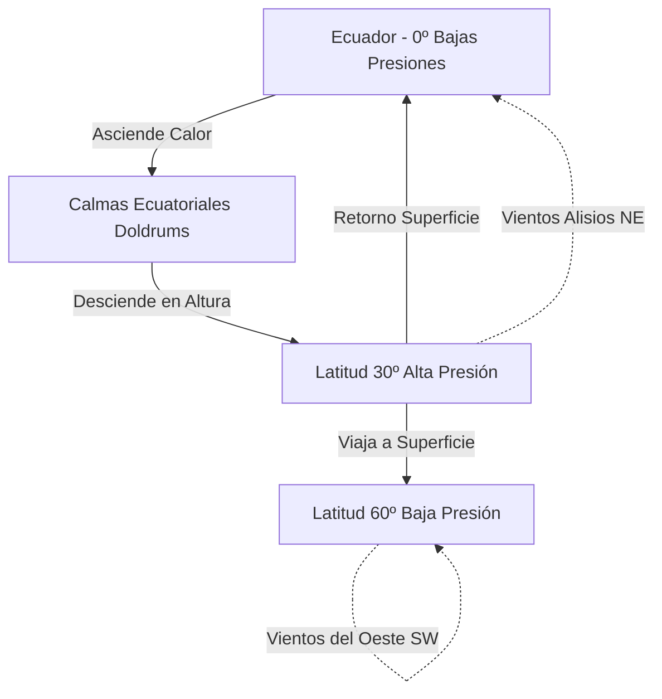

# Capitán de Yate - Tema 1: Meteorología Oceánica Avanzada

El Capitán de Yate debe enfrentarse a los sistemas climáticos globales y planificar rutas oceánicas (Routing) de varias semanas o meses, donde esquivar los centros de bajas presiones y los ciclones tropicales es vital. A diferencia del PER o PY, donde la meteo es local o costera, aquí estudiamos el planeta entero.

---

## 1. Dinámica Atmosférica Global y Células de Circulación

La Tierra no calienta por igual el ecuador y los polos. Esto, sumado a la rotación de la Tierra (Fuerza de Coriolis), crea un sistema de cinturones de presión y de viento permanente que rige la navegación oceánica a vela.

### El Efecto Coriolis (Teorema Fundamental)
Cualquier masa de aire o agua que se desplace por la superficie de la Tierra sufrirá una desviación aparente respecto a su trayectoria original debido al giro del planeta.
*   En el **Hemisferio Norte (HN)**, Coriolis desvía los vientos siempre hacia la **DERECHA** de su trayectoria.
*   En el **Hemisferio Sur (HS)**, Coriolis desvía los vientos siempre hacia la **IZQUIERDA** de su trayectoria.
*   En el Ecuador, la fuerza de Coriolis es CERO (por eso los huracanes nunca cruzan el Ecuador).

### Células y Vientos Planetarios
1.  **Célula de Hadley (0º a 30º Latitud):** 
    *   El aire caliente asciende en el Ecuador Térmico formando un cinturón de bajas presiones llamado **Doldrums** (Calmas Ecuatoriales). Es una zona temida por los veleros por la ausencia total de viento y tremendas tormentas eléctricas locales.
    *   El aire en altura viaja hacia los polos y desciende frío alrededor de los 30º de latitud, formando los Grandes Anticiclones Subtropicales (Ej: Anticiclón de las Azores, Anticiclón de Santa Elena).
    *   El aire que regresa por la superficie del océano hacia el Ecuador se desvía por Coriolis, formando los famosos **Vientos Alisios (Trade Winds)**. Soplan constantes del Noreste (NE) en el H. Norte y del Sureste (SE) en el H. Sur.

2.  **Célula de Ferrel (30º a 60º Latitud):**
    *   El aire en superficie viaja desde los anticiclones subtropicales (30º) hacia las bajas presiones subpolares (60º).
    *   Al desviarse por Coriolis, producen los **Vientos del Oeste (Westerlies)**. Soplan desde el Suroeste en el H. Norte y desde el Noroeste en el H. Sur. Son vientos fríos, muy húmedos y portadores de los trenes de borrascas atlánticas frontales. Las latitudes 40º y 50º Sur, donde no hay continentes que frenen el viento, se llaman los *Cuarenta Rugientes* (Roaring Forties) y *Cincuenta Aullantes* (Furious Fifties).

3.  **Célula Polar (60º a 90º Latitud):**
    *   El aire gélido desciende sobre el Polo Norte / Sur (Anticiclón Polar) y viaja hacia las latitudes subpolares.
    *   Desviados por Coriolis, forman los **Vientos del Este Polares**.

## 2. Los Ciclones Tropicales (Huracanes / Tifones)

Es la peor amenaza para la vida de un navegante. Reciben distintos nombres (Huracán en el Atlántico, Tifón en el Pacífico, Ciclón en Índico) pero son idénticos.

### Condiciones Matemáticas de Formación
*   Agua del mar muy caliente: **Mínimo 26.5 ºC** hasta al menos 50 metros de profundidad.
*   Alta humedad en capas medias y bajas de la atmósfera.
*   **Separación del Ecuador de al menos 5º de latitud**. Por debajo de 5º, la fuerza de Coriolis es insuficiente para iniciar el giro del aire ascendente en espiral.

### Estructura del Ciclón
*   **Ojo (Eye):** Centro del ciclón (20-50 km de diámetro). Sorprendentemente, hay cielo despejado, calmas de viento y la presión atmosférica más baja registrada.
*   **Pared del Ojo (Eyewall):** El anillo de nubes cumulonimbos gigantes que rodea el ojo. Alberga los vientos más violentos y destructivos y lluvias torrenciales continuas.
*   **Bandas Espirales:** Nubes de tormenta en forma de brazos que giran hacia el centro, con rachas violentas.

### Navegación Evasiva (Regla del Semicírculo)
Si el huracán te alcanza en alta mar, no puedes esperar. Debes aplicar reglas matemáticas de escape. Si divides el huracán por la línea de su trayectoria de avance en dos mitades (cortándolo en sentido de su marcha):

1.  **Semicírculo Peligroso (El Derecho en el H. Norte):** 
    *   Es letal. La velocidad de traslación del huracán se *suma* a la velocidad de sus propios vientos giratorios (viento real tremendo).
    *   Además, la dirección del viento en esta zona tiende a arrastrar el barco *hacia la pared del ojo* (succión directa).
    *   *Escape Táctico:* Poner el viento por la amura de estribor, a cuartos, capear o navegar a máxima máquina para salir del radio de acción hacia la periferia derecha.

2.  **Semicírculo Manejable (El Izquierdo en el H. Norte):**
    *   La velocidad de traslación del meteoro se *resta* a la del viento giratorio (vientos algo más flojos que en el semicírculo derecho).
    *   El viento te expulsa naturalmente hacia fuera del huracán, hacia su cola.
    *   *Escape Táctico:* Poner el viento por la aleta de estribor y correr el temporal para alejarte del vórtice.

## 3. Corrientes Oceánicas y Routing

El viento constante (como los Alisios) arrastra el agua superficial a gran escala por fricción continuada.

### Giro del Atlántico Norte (La Ruta de los Exploradores)
En el Atlántico Norte se forma un gigantesco anillo de agua circulante en el sentido de las agujas del reloj:
1.  **Corriente de Canarias (Sur):** Agua fría bajando por la costa de Portugal y África Occidental.
2.  **Corriente Norecuatorial (Oeste):** Empujada por los Alisios, atraviesa el océano Atlántico hacia el Caribe.
3.  **Corriente del Golfo (Gulf Stream) (Noreste):** Agua muy caliente (28ºC), estrecha, profunda y muy rápida (hasta 4 nudos) que sube por la costa este de Florida hacia latitudes altas. Choca con la corriente fría del Labrador en Terranova creando nieblas perpetuas.
4.  **Corriente del Atlántico Norte (Este):** Cierra el ciclo hacia las costas de Europa (Irlanda/Francia), calentando el clima europeo respecto a las mismas latitudes de Canadá.

### Routing Meteorológico
Para cruzar el Atlántico de España a América en velero, jamás se hace en línea recta (ortodrómica). 
*   **Ida:** Se baja primero navegando hacia el Sur hasta Canarias y luego Cabo Verde para "enganchar" los Vientos Alisios y la Corriente Ecuatorial a favor en la popa. 
*   **Vuelta:** Para volver a Europa, se sube primero hacia el Norte por la costa americana (Nueva York/Bermudas) para coger los Vientos del Oeste (Westerlies) y la Corriente del Golfo a favor en la popa.

Intentar volver de América a Europa por el Sur a vela es prácticamente un suicidio logístico (el viento y corriente en contra te dejarán parado o empujado hacia atrás).

## 4. Hielos Oceánicos
El radar detecta grandes Icebergs, pero es inútil frente a "Growlers" (escombros de hielo flotantes casi del tamaño de un coche). Un impacto con un growler a 8 nudos abrirá el casco al instante. Hay que prestar máxima atención a las isotermas del agua del mar medidas por el termómetro de la quilla; una bajada repentina de la temperatura superficial indica posible cercanía de hielos.
