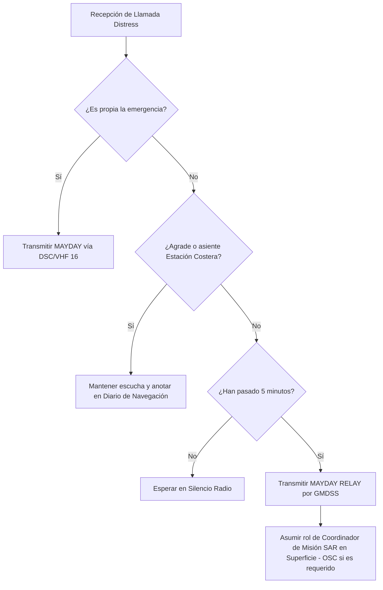

# Capitán de Yate - Tema 2: Inglés Marítimo (SMCP)

El nivel de Capitán de Yate exige poder comunicarse sin ambigüedades con Estaciones Costeras (MRCC), servicios de control de tráfico (VTS), Prácticos, Salvamento Marítimo, helicópteros SAR y otros buques de cualquier nacionalidad, especialmente en situaciones de emergencia, peligro o abordaje inminente.

---

## 1. El Vocabulario Normalizado (SMCP) y El Sistema GMDSS

Las **Standard Marine Communication Phrases (SMCP)** de la Organización Marítima Internacional (OMI) son un catálogo obligatorio de frases hechas diseñadas para sortear las barreras idiomáticas. La regla fundamental es: **Nunca se debe improvisar inglés gramaticalmente complejo por radio**. Frases pasivas o complejas ("It would be highly appreciated if you could steer clear") causan desastres.

El SMCP opera bajo la cobertura del **GMDSS (Global Maritime Distress and Safety System)**.

### Marcadores de Mensaje (Message Markers)
Todo mensaje crucial debe ser precedido por uno de los 8 marcadores para tipificar legalmente el propósito de la transmisión:

*   **QUESTION:** Solicita información y exige respuesta. *(Ej: QUESTION. What is your draft?)*
*   **ANSWER:** Respuesta directa. *(Ej: ANSWER. My draft is four decimal five metres.)*
*   **INSTRUCTION:** Orden vinculante dada por una autoridad legal (VTS, MRCC). *(Ej: INSTRUCTION. Do not enter the fairway.)*
*   **ADVICE:** Recomendación táctica. El Capitán es responsable de acatarla o no. *(Ej: ADVICE. Alter course to starboard.)*
*   **WARNING:** Alerta crítica sobre un peligro externo. *(Ej: WARNING. Obstruction in the fairway.)*
*   **INFORMATION:** Declaración de un hecho. *(Ej: INFORMATION. MV Sirius will depart at one-six-zero-zero UTC.)*
*   **INTENTION:** Declaración de maniobra inminente del propio buque. *(Ej: INTENTION. I will reduce speed.)*
*   **REQUEST:** Solicitar servicio. *(Ej: REQUEST. I require two tugs.)*

### Reglas Estrictas de Pronunciación y Deletreo
*   **Alfabeto Fonético OMI:** Alfa, Bravo, Charlie, Delta, Echo, Foxtrot, Golf, Hotel, India, Juliett, Kilo, Lima, Mike, November, Oscar, Papa, Quebec, Romeo, Sierra, Tango, Uniform, Victor, Whiskey, X-ray, Yankee, Zulu. [(Ver Banderas Náuticas y Alfabeto)](https://cheatography.com/jorgejuan007/cheat-sheets/alfabeto-nautico/)
*   **Números:** Dígito a dígito.
    *   $15$ = **ONE-FIVE**.
    *   $150^\circ$ (Rumbo) = **Heading ONE-FIVE-ZERO**.
    *   $30.5$ = **THREE-ZERO DECIMAL FIVE**.
*   Las posiciones siempre en Lat/Lon precisando North/South y East/West.

---

## 2. Protocolos de Emergencia y Socorro (Distress, Urgency, Safety)

Las comunicaciones de emergencia se hacen por el Canal 16 VHF, Frecuencias de 2182 kHz (MF) o mediante llamada selectiva digital (DSC - Canal 70).

### 1. MAYDAY (Socorro / Distress)
Para un peligro **grave e inminente** que amenaza la vida o la flotabilidad, requiriendo auxilio instantáneo.
*   **Estructura del Mensaje (Acotación de tiempo crítico):**
    > **MAYDAY, MAYDAY, MAYDAY.**
    > This is motor yacht SEAWOLF, SEAWOLF, SEAWOLF. Callsign Echo-Bravo-Two-One. MMSI 224123456.
    > **MAYDAY SEAWOLF.**
    > My position is Latitude Four-Five Degrees, Two-Zero Minutes North; Longitude Zero-Zero-Eight Degrees, One-Five Minutes West.
    > We have struck a submerged container. Severe flooding in engine room. Vessel is sinking.
    > I require immediate assistance.
    > Six persons on board. We are abandoning ship into life rafts.
    > Over.

### 2. MAYDAY RELAY (Retransmisión de Socorro)
Si escuchas un Mayday y la estación costera no responde tras 5 minutos, estás **obligado** a retransmitirlo para avisar a otras autoridades.

    > **MAYDAY RELAY, MAYDAY RELAY, MAYDAY RELAY.**
    > All stations, all stations, all stations.
    > This is motor yacht ORION, ORION, ORION.
    > The following received from sailing vessel WINDJAMMER on Channel 16: (Leer el mensaje íntegro de la víctima). Over.

### 3. PAN-PAN (Urgencia / Urgency)
Mensaje urgente de seguridad sin riesgo inmediato de hundimiento (avería en temporal, asistencia médica urgente).
    > **PAN-PAN, PAN-PAN, PAN-PAN.**
    > All stations, all stations, all stations.
    > This is yacht ALBATROS, ALBATROS, ALBATROS.
    > Position: Bearing One-Eight-Zero from Cape Finisterre, distance Five miles.
    > Engine failure, drifting towards the rocks. Require towage. Over.

### 4. SÉCURITÉ (Seguridad / Safety)
Avisos a los navegantes, peligros en la mar o temporales inminentes.
    > **SÉCURITÉ, SÉCURITÉ, SÉCURITÉ.**
    > All stations. This is Tarifa Traffic.
    > Navigational warning: Unlit buoy adrift in position...

---

## 3. Diccionario Completo y Terminología

### 3.1. Arquitectura y Partes del Buque (Ship's Anatomy)
*   **Hull / Keel / Bilge:** Casco / Quilla / Sentina.
*   **Bow / Stern / Midships:** Proa / Popa / Centro.
*   **Port / Starboard:** Babor / Estribor.
*   **Bridge / Wheelhouse:** Puente de mando.
*   **Engine room / Bulkhead:** Sala de máquinas / Mamparo.
*   **Propeller / Rudder / Thruster:** Hélice / Timón / Hélice de maniobra (Bow thruster).
*   **Freeboard / Draft (Draught) / Air draft:** Francobordo / Calado / Calado aéreo (Gálibo).
*   **Hatch / Hold / Derrick:** Escotilla / Bodega / Pluma de carga.

### 3.2. Maniobra y Fondeo (Ship Handling & Anchoring)
*   **Mooring lines:** Amarras en general.
    *   **Head line / Stern line:** Largo de proa / Largo de popa.
    *   **Spring line:** Esprín (impide el avance/retroceso).
    *   **Breast line:** Través (mantiene pegado al muelle).
*   **To drop anchor / To weigh anchor:** Fondear / Levar ancla.
*   **Anchor is dragging:** El ancla garrea (no agarra el fondo).
*   **Anchor is aweigh:** El ancla ha zarpado (no toca fondo).
*   **Anchor is foul:** El ancla está enredada.
*   **Fenders / Bollard / Cleat:** Defensas / Noray / Cornamusa.
*   **Tug / Towing line:** Remolcador / Cable de remolque.
*   **Make fast / Let go:** Hacer firme (amarrar) / Soltar amarras.

### 3.3. Navegación, Cartografía y Pilotaje
*   **Heading (HDG) / Course Over Ground (COG):** Rumbo de aguja (adónde apunta la proa) / Rumbo real sobre el fondo.
*   **Speed Over Ground (SOG) / Speed through water:** Vel. sobre el fondo (GPS) / Vel. en corredera.
*   **Bearing / Relative Bearing:** Demora verdadera / Marcación (relativa a la proa).
*   **Fairway / Channel / TSS:** Canal navegable / Dispositivo de Separación de Tráfico.
*   **Buoy / Beacon / Lighthouse:** Boya / Baliza / Faro.
*   **Shallows / Shoal / Awash:** Bajíos / Banco de arena / A flor de agua (apenas sobresale).
*   **Sounding / Depth:** Sonda (medida de la carta) / Profundidad real bajo quilla (Under Keel Clearance - UKC).
*   **Tide / Ebb / Flood:** Marea / Marea bajante (reflujo) / Marea entrante (flujo).
*   **Current / Eddy:** Corriente / Remolino.

### 3.4. Meteorología Avanzada (Weather & Sea State)
*   **Gale / Storm / Hurricane:** Temporal / Tormenta (Fuerza 10) / Huracán (Fuerza 12).
*   **Squall / Gust:** Turbonada / Racha.
*   **Fog / Overcast / Restricted Visibility:** Niebla / Cielo cubierto / Visibilidad reducida.
*   **Swell / Waves / Rough Sea:** Mar de fondo / Olas de viento / Mar gruesa.
*   **Veering / Backing:** Viento rolando a la derecha (sentido horario) / Rolando a la izquierda.

### 3.5. Operaciones de Búsqueda y Salvamento (SAR) y Médicas
*   **Man Overboard (MOB):** Hombre al agua.
*   **Search pattern (Expanding square / Sector search):** Patrón de búsqueda (Cuadrado expansivo / Búsqueda por sectores).
*   **Life raft / Life jacket / Flare:** Balsa salvavidas / Chaleco / Bengala.
*   **Helicopter hoist operation:** Operación de izado mediante helicóptero (mantener rumbo al viento).
*   **MEDEVAC (Medical Evacuation):** Evacuación médica.
*   **Stretcher / Casualty / Unconscious:** Camilla / Herido-Víctima / Inconsciente.
*   **Severe bleeding / Heart attack:** Hemorragia severa / Infarto.

---

## 4. Escenarios y Diálogos SMCP de Examen (Scenarios)

Los exámenes de CY evalúan fuertemente la comprensión y respuesta a situaciones dadas, incluyendo el RIPA (Reglamento de Abordajes).

### Escenario 1: Abordaje Inminente (RIPA / Collision Avoidance)
**VTS:** *Motor vessel TANGO. This is VTS. WARNING. You are running into danger. Unknown vessel ahead of you is not responding. Risk of collision.*
**TANGO:** *This is TANGO. Understood. INTENTION: I will alter course to starboard and reduce speed.*
**VTS:** *TANGO, VTS. Keep clear of unknown vessel. Do not alter course to port.*

### Escenario 2: Asistencia Médica (Medical Advice - Radio Medical)
**YACHT:** *PAN-PAN. This is yacht BLUE HORIZON. REQUEST. I require medical advice. Crew member has severe chest pains and is vomiting. Pulse is weak.*
**COAST RADIO:** *BLUE HORIZON. This is Coast Radio. Understood. Stand by on this channel. I am connecting you to the medical centre.*
**DOCTOR:** *This is Doctor. QUESTION. Is the casualty conscious?*
**YACHT:** *ANSWER. The casualty is unconscious.*

### Escenario 3: Interacción con el Práctico (Pilotage)
**SHIP:** *Pilot Station. This is MV GALAXY. What is your ETA at the pilot boarding ground?*
**PILOT:** *GALAXY. Pilot boat is proceeding to you. Rig pilot ladder on the port side, one metre above water. Maintain speed of six knots.*
**SHIP:** *Understood. Pilot ladder on port side, one metre above water. Speed six knots.*

### Escenario 4: Fuego a bordo y Abandono (Fire and Abandonment)
**YACHT:** *MAYDAY. Yacht STELLA. Fire in engine room. Fire is not under control. CO2 system activated but failed. We are abandoning ship. Over.*

---

## 5. Glosario de Frases y Traducciones Rápidas Clave

Estas frases aparecen literalmente en los test oficiales:

*   *"My vessel is restricted in her ability to manoeuvre."* $\rightarrow$ Mi buque tiene capacidad de maniobra restringida.
*   *"I am constrained by my draft."* $\rightarrow$ Estoy restringido por mi calado.
*   *"You are proceeding at a dangerous speed."* $\rightarrow$ Navega usted a velocidad peligrosa.
*   *"What is your CPA (Closest Point of Approach)?"* $\rightarrow$ ¿Cuál es su punto de máxima aproximación?
*   *"What is your TCPA (Time to CPA)?"* $\rightarrow$ ¿Cuánto tiempo falta para la máxima aproximación?
*   *"Visibility is reduced by fog to less than two cables."* $\rightarrow$ La visibilidad está reducida por niebla a menos de dos cables.
*   *"My propeller is fouled."* $\rightarrow$ Tengo la hélice enredada.
*   *"I am not under command."* $\rightarrow$ Soy un buque sin gobierno.
*   *"Hold on!"* $\rightarrow$ ¡Agárrense fuertemente! (Aviso antes de impacto o golpe de mar).

---

## Ejemplos Prácticos

**Problema 1: Cálculo del TCPA (Time to Closest Point of Approach) a partir del radar ARPA**
Un buque propio (Own Ship) y un blanco (Target) presentan un riesgo de abordaje. El sistema ARPA arroja que la distancia al CPA (Distancia de mínima aproximación) se alcanzará tras recorrer la distancia relativa $D_{\text{rel}} = 3.5 \text{ NM}$ a una velocidad relativa $V_{\text{rel}} = 14 \text{ nudos}$. Calcule el $TCPA$ en minutos.

*Solución:*
Sabemos que la velocidad relativa es $V_{\text{rel}} = \frac{D_{\text{rel}}}{TCPA}$.
Despejando $TCPA$:

$$
TCPA = \frac{D_{\text{rel}}}{V_{\text{rel}}}
$$

Sustituyendo los valores:

$$
TCPA = \frac{3.5 \text{ NM}}{14 \text{ NM/h}} = 0.25 \text{ h}
$$

Convirtiendo a minutos:

$$
TCPA_{\text{min}} = 0.25 \text{ h} \cdot 60 \text{ min/h} = 15 \text{ minutos}
$$

*Intervención SMCP:* "WARNING. You are running into danger. TCPA is one-five minutes."

**Problema 2: Cálculo del Vector de Abatimiento (Leeway) en Operaciones SAR**
En una operación de rescate, un MRCC le ordena establecer un Datum inicial para una balsa salvavidas. La posición del incidente fue $L = 40^\circ 15' \text{ N}$, $l = 005^\circ 30' \text{ W}$ a las 10:00 UTC. La corriente dominante es $SET = 090^\circ$ a $R_c = 1.5 \text{ nudos}$. El viento es del Noroeste ($NW = 315^\circ$) a 20 nudos. El manual de la OMI establece que el *Leeway* (abatimiento de la balsa) es un $5\%$ de la velocidad del viento, desplazándose directamente a favor del viento (Hacia el $135^\circ$). Calcule el vector de deriva combinada (Total Water Current + Leeway) y la posición del Datum a las 14:00 UTC.

*Solución:*
1. **Vector Corriente ($V_c$):** $090^\circ$ a $1.5 \text{ nudos}$.
2. **Vector Leeway ($V_l$):** El viento sopla desde $315^\circ$, empuja hacia $135^\circ$. Velocidad = $0.05 \cdot 20 = 1.0 \text{ nudo}$. Dirección = $135^\circ$.
3. **Suma Vectorial (Drift Vector):** 
   Componente X (Este): $X = 1.5 \cdot \sin(90^\circ) + 1.0 \cdot \sin(135^\circ) = 1.5 \cdot 1 + 1.0 \cdot 0.707 = 1.5 + 0.707 = 2.207 \text{ nudos Este}$.
   Componente Y (Norte): $Y = 1.5 \cdot \cos(90^\circ) + 1.0 \cdot \cos(135^\circ) = 1.5 \cdot 0 + 1.0 \cdot (-0.707) = -0.707 \text{ nudos Norte}$ (es decir, hacia el Sur).
   Magnitud Resultante (Drift Speed): $v_d = \sqrt{2.207^2 + (-0.707)^2} = \sqrt{4.87 + 0.50} = 2.317 \text{ nudos}$.
   Dirección Resultante (Drift Direction): $\theta = \arctan(\frac{X}{Y}) = \arctan(\frac{2.207}{-0.707}) = \arctan(-3.12)$. Como $X>0$ y $Y<0$, estamos en el segundo cuadrante (Sudeste). $\theta = 180^\circ - 72.2^\circ = 107.8^\circ$.
4. **Desplazamiento Total en 4 horas (10:00 a 14:00):** $D = 2.317 \text{ nds} \cdot 4 \text{ h} = 9.268 \text{ millas náuticas}$ en rumbo $107.8^\circ$.
Esta es la corrección geométrica para plotear el Datum SAR y emitir la alerta de seguridad SMCP.

**Problema 3: Cinemática Radar de Maniobra Evasiva (Resolución de Triángulo de Velocidades)**
Su buque (A) navega al $000^\circ$ a 12 nudos. En la pantalla ARPA detecta un buque (B) en marcación constante (riesgo de abordaje). El vector relativo indica que B se acerca a una velocidad relativa de 15 nudos desde el $045^\circ$ relativo. Si usted decide alterar su rumbo a estribor cayendo al $060^\circ$ manteniendo 12 nudos, ¿cuál será el nuevo vector de movimiento relativo de B? (Resolución trigonométrica analítica).

*Solución:*
1. **Vector Propio Original ($V_a$):** Magnitud $12$, Rumbo $000^\circ$. Componentes: $V_{ax} = 0$, $V_{ay} = 12$.
2. **Vector Relativo Original ($V_{rel}$):** El buque B viene desde el $045^\circ$, así que se mueve hacia el $225^\circ$. Magnitud $15$.
   Componentes relativas: $V_{rx} = 15 \cdot \sin(225^\circ) = -10.6$, $V_{ry} = 15 \cdot \cos(225^\circ) = -10.6$.
3. **Vector Verdadero de B ($V_b$):** Sabiendo que $V_{rel} = V_b - V_a$, entonces $V_b = V_{rel} + V_a$.
   $V_{bx} = -10.6 + 0 = -10.6$
   $V_{by} = -10.6 + 12 = 1.4$
4. **Nuevo Vector Propio ($V_{a'}$):** Alterando al $060^\circ$ a $12$ nudos.
   $V_{a'x} = 12 \cdot \sin(60^\circ) = 10.39$
   $V_{a'y} = 12 \cdot \cos(60^\circ) = 6$
5. **Nuevo Vector Relativo ($V_{rel'}$):** $V_{rel'} = V_b - V_{a'}$
   $V_{r'x} = -10.6 - 10.39 = -20.99$
   $V_{r'y} = 1.4 - 6 = -4.6$
6. **Nueva Cinemática de B:**
   Magnitud (Nueva Velocidad Relativa de acercamiento): $V = \sqrt{(-20.99)^2 + (-4.6)^2} = \sqrt{440.58 + 21.16} = 21.48 \text{ nudos}$.
   Dirección del movimiento relativo: $\arctan(\frac{-20.99}{-4.6}) = \arctan(4.56) = 77.6^\circ$. Como ambos son negativos, es tercer cuadrante: $180^\circ + 77.6^\circ = 257.6^\circ$.
Al maniobrar, el blanco pasará seguro por la popa, cambiando el CPA dramáticamente.
*Intervención SMCP:* "INTENTION. Altering course to zero-six-zero to pass astern of you."

---

## Referencias Bibliográficas y Jurisprudencia

*   **Bibliografía Recomendada:**
    *   *IMO Standard Marine Communication Phrases (SMCP)* (Resolución A.918(22)).
    *   *Maritime English*, C. Blakey.
*   **Convenciones OMI:**
    *   STCW (Standards of Training, Certification and Watchkeeping for Seafarers): Exige competencia estandarizada en inglés para oficiales de puente.
    *   Reglamento Internacional para Prevenir Abordajes (RIPA/COLREGs).
*   **Jurisprudencia (Admiralty Court):**
    *   *The "Estonia" Disaster (1994)*: La falta de comprensión clara y barreras idiomáticas en el tráfico de socorro (Mayday) agravó enormemente la respuesta SAR, provocando cambios fundamentales en el estándar GMDSS y el uso de frases tipo.
    *   *The "Scandinavian Star" (1990)*: El fallo masivo en la comunicación en inglés a bordo entre la tripulación (multinacional) durante la evacuación conllevó graves condenas judiciales sobre la seguridad naval.
