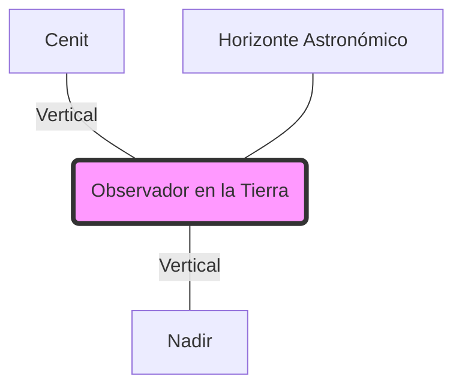

# Capitán de Yate - Tema 3: Teoría Astronómica Avanzada

Para poder realizar los cálculos astronómicos matemáticos con el sextante, el Capitán de Yate debe dominar absolutamente la visualización mental de la geometría esférica del universo observable desde la Tierra. Esta abstracción geométrica requiere imaginarse en el centro del Universo.

---

## 1. La Esfera Celeste y el Geocentrismo Náutico

En la navegación astronómica moderna, **revertimos a la teoría geocéntrica de Ptolomeo**. A efectos de cálculo trigonométrico, asumimos (aunque sea físicamente falso) que la Tierra está quieta en el centro exacto del Universo, y que todos los astros (Sol, Luna, Planetas y Estrellas) están "pegados" a la pared interior de una esfera gigantesca de radio infinito que gira de Este a Oeste alrededor nuestro.

### Puntos y Planos Inmóviles (De la Tierra)
*   **Eje del Mundo:** La prolongación geométrica infinita del eje de rotación de la Tierra. Corta la bóveda celeste en el Polo Norte Celeste (muy cerca de la Estrella Polar) y el Polo Sur Celeste (cerca de la Cruz del Sur).
*   **Ecuador Celeste:** Si extendemos el plano del Ecuador Terrestre hacia el infinito, cortaremos la esfera celeste en dos hemisferios. Todos los astros situados en el Ecuador Celeste caen perpendiculares sobre el Ecuador terrestre.
*   **La Vertical del Observador:** Una línea recta o "plomada" imaginaria que pasa por el centro de gravedad de la Tierra y sube pasando por tus propios pies y cabeza. Al chocar contra la bóveda celeste de arriba, marca tu **Cenit**. Al chocar abajo, en las antípodas de la bóveda, marca tu **Nadir**.
*   **Horizonte Astronómico (o Verdadero):** El plano que pasa por el centro geométrico de la Tierra y es perfectamente perpendicular (90º) a la Vertical del Observador. No debe confundirse con el Horizonte de la Mar o Aparente (el que ves físicamente), que está deprimido por la elevación del ojo humano.

## 2. Los Sistemas de Coordenadas Celestes

Imagina que la Esfera Celeste es un mapamundi donde quieres dar las coordenadas de una ciudad. Según qué punto tomes como "Origen de Latitud 0" y "Origen de Longitud 0", tendrás diferentes sistemas. En CY manejamos tres que se superponen constantemente:

### 2.1. Coordenadas Horizontales (Visión del Observador Local)
Son las que usas físicamente con el sextante estando en cubierta. Dependen totalmente de dónde estés y de la hora que sea.
*   **Altura (a):** Ángulo medido en el plano vertical, desde el horizonte (0º) subiendo hasta encontrar el astro (hasta un máximo de 90º en el Cenit). Si el astro está bajo el horizonte, su altura es negativa.
*   **Azimut (Z):** Ángulo medido sobre el plano horizontal, contando desde el Polo Norte (000º) en el sentido de las agujas del reloj (hacia el Este, Sur, Oeste) hasta llegar a la vertical que "cae" desde el astro. Va de 000º a 360º. Equivaldría a la Demora.

### 2.2. Coordenadas Ecuatoriales (Visión del Almanaque)
Son las coordenadas absolutas en las que se mueve el astro, similares a las coordenadas de un barco (Lat/Lon). Independientes de dónde se encuentre el observador, pero que varían con las horas.
*   **Declinación (Dec):** Distancia angular desde el Ecuador Celeste hasta el astro. Positiva si está al Norte del Ecuador Celeste, Negativa si está al Sur. Es exactamente el equivalente a la **Latitud** terrestre.
*   **Ángulo Horario Local (hL):** Es el ángulo (medido de Este a Oeste) desde el meridiano del propio observador hasta el meridiano donde se encuentra el astro actualmente. De 0º a 360º.
*   **Ángulo Horario en Greenwich (hG):** Ángulo medido desde el Meridiano Cero (Greenwich) hasta el meridiano del astro. Viene dado en las tablas del Almanaque y crece de Este a Oeste según gira la Tierra.
    $$ hL = hG + Latitud_{Observador} $$ *(Sumar si la Longitud es Este, Restar si es Oeste)*.

### 2.3. Coordenadas Uranográficas (Visión Estelar Inmóvil)
*   **Ascensión Recta (AR):** Es la coordenada de "Longitud" inmutable de las estrellas. Se mide hacia el Este a partir del **Punto de Aries** (el punto astronómico exacto donde el Sol cruza el Ecuador Celeste el 21 de marzo, equinoccio de primavera).
*   **Ángulo Sidéreo (AS):** Exactamente igual que la AR, pero medida en sentido inverso (hacia el Oeste).

## 3. El Triángulo de Posición Astronómico (El Santo Grial del CY)

La navegación astronómica no es más que la resolución trigonométrica de un gigantesco triángulo curvado dibujado en la superficie de la bóveda celeste.

Sus tres **Vértices** son:
1.  **Polo Elevado (Pn o Ps):** El Polo Celeste más cercano a nosotros (Norte si estamos en Europa).
2.  **El Cenit (Z):** El punto directamente encima de nuestras cabezas.
3.  **El Astro (A):** El Sol, estrella o planeta que estamos observando.

Los tres **Lados** o "Cateros" de este triángulo (medidos en grados angulares) son:
*   **Colatitud (90º - Latitud):** La distancia que hay desde el Polo hasta tu Cenit.
*   **Codeclinación (90º - Declinación):** La distancia que hay desde el Polo hasta el Astro (también llamada Distancia Polar).
*   **Distancia Cenital (90º - Altura):** La distancia angular entre tu Cenit y el Astro.

Los **Ángulos** internos de los vértices:
*   El ángulo en el vértice del Polo es exactamente el **Ángulo Horario Local (hL)** o el Ángulo en el Polo (P).
*   El ángulo en el vértice del Cenit es el **Azimut (Z)** o relacionado trigonométricamente con él.
*   El ángulo en el vértice del Astro se llama *Ángulo Paraláctico*, pero en navegación marítima no tiene utilidad directa.

> **Magia Trigonométrica:** Gracias a las fórmulas de la trigonometría esférica (Regla de Napier, Fórmula de Borda o la más moderna de las Cosenusas), si el Capitán conoce su Latitud Estimada, la Declinación del astro (del almanaque) y el Ángulo Horario del astro (del almanaque + hora UTC), **puede calcular matemáticamente cuál debería ser la Altura y el Azimut exactos del astro en ese instante**. La diferencia entre esa Altura calculada matemáticamente y la Altura Verdadera que medimos nosotros con nuestro sextante de metal es lo que nos permite posicionarnos en la carta.

## 4. Fenómenos Celestes Específicos

*   **Tránsito (Paso por el Meridiano):** Ocurre cuando el astro cruza el meridiano de nuestro barco. Alcanza su altura máxima del día. En ese instante, su Azimut es exactamente Norte (000º) o Sur (180º). Calcular la latitud en este momento (la Latitud por la Meridiana) es facilísimo: sumas/restas su Declinación y la Distancia Cenital, sin logaritmos.
*   **El Crepúsculo (La Ventana de Oportunidad):**
    *   *Crepúsculo Civil:* El Sol está oculto entre 0º y -6º bajo el horizonte. Hay mucha luz en el cielo, pero no se pueden ver las estrellas para dispararles con el sextante.
    *   *Crepúsculo Náutico:* El Sol desciende de -6º a -12º bajo el horizonte. **Es el momento dorado y el único instante de todo el día donde se puede triangular la posición estelar.** Durante unos cortos 15 a 30 minutos, ya ha oscurecido lo suficiente para que las estrellas de primera magnitud brillen claramente en el cielo, pero aún queda un ligerísimo resplandor solar que perfila la línea afilada del horizonte de la mar para que puedas apoyar el astro en ella usando los espejos del sextante. Si esperas demasiado, el horizonte se vuelve negro y el sextante es inútil (no sabes si estás apuntando al cielo, al mar, o a la costa negra de lejos).
    *   *Crepúsculo Astronómico:* De -12º a -18º bajo el horizonte. Oscuridad casi total. Solo para telescopios de observación.
