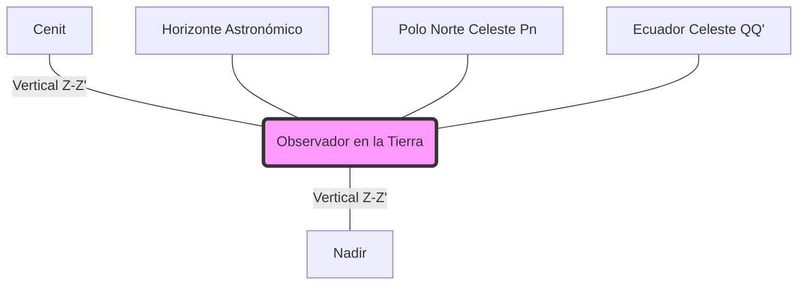

# Capitán de Yate - Tema 3: Teoría Astronómica y Astrofísica Avanzada

Para dominar el cálculo de posiciones mediante el sextante, el Capitán de Yate debe visualizar y comprender con precisión geométrica el universo observable desde nuestro planeta, así como la mecánica física que altera sutilmente estas observaciones. Esta abstracción requiere proyectarse al centro del Universo de forma puramente matemática.

---

## 1. La Esfera Celeste y el Paradigma del Geocentrismo Náutico

En la navegación astronómica moderna, **revertimos funcionalmente a la teoría geocéntrica de Ptolomeo**. A efectos de cálculo de trigonometría esférica, la Tierra está absolutamente quieta en el centro exacto del Universo, y todos los astros (Sol, Luna, planetas y el firmamento estelar) están adosados a la pared interior de una Esfera Celeste de radio infinito que gira de Este a Oeste.

### Puntos, Ejes y Planos de Referencia Absoluta
*   **Eje del Mundo:** La prolongación geométrica infinita del eje de rotación terrestre. Corta la bóveda en el **Polo Norte Celeste ($Pn$)** (próximo a Polaris, $\alpha$ Ursae Minoris) y el **Polo Sur Celeste ($Ps$)** (próximo a Sigma Octantis).
*   **Ecuador Celeste ($QQ'$):** Extensión del plano del Ecuador Terrestre hacia el infinito. Divide la esfera en Hemisferio Norte Celeste y Sur Celeste. Es el plano fundamental de declinación.
*   **La Vertical del Observador ($ZZ'$):** La recta topocéntrica (plomada) que une el centro de la Tierra, el observador y el infinito celeste. 
    *   **Cenit ($Z$):** Intersección superior de la vertical con la Esfera Celeste.
    *   **Nadir ($Z'$):** Intersección inferior, diametralmente opuesta.
*   **Horizonte Astronómico o Racional ($HH'$):** El plano que pasa por el centro de la Tierra y es ortogonal ($90^\circ$) a la Vertical del Observador. No debe confundirse con el Horizonte Aparente o de la Mar, deprimido por la altitud del ojo del navegante.
*   **Eclíptica:** La trayectoria aparente anual del Sol sobre la Esfera Celeste. Se encuentra inclinada respecto al Ecuador Celeste unos $23^\circ 27'$ (Oblicuidad de la Eclíptica), marcando los Trópicos.

---

## 2. Astrofísica: Movimientos Complejos y Mecánica Celeste

El eje de la Tierra y sus órbitas no son perfectas, introduciendo variaciones astrofísicas que obligan a recalibrar el Almanaque Náutico cada año.

### Precesión de los Equinoccios
La Tierra no es una esfera perfecta; tiene un ensanchamiento ecuatorial. La atracción gravitatoria combinada de la Luna y el Sol sobre este abultamiento produce un momento de fuerza que hace que el eje de rotación de la Tierra describa un cono inmenso, como una peonza perdiendo inercia.
*   **Período:** Un ciclo de precesión dura aproximadamente **25.772 años** (Año Platónico).
*   **Efecto Náutico:** El Punto de Aries (el $0^\circ$ de Ascensión Recta) retrocede a lo largo de la eclíptica unos $50.3$ segundos de arco por año. Además, la Estrella Polar no será siempre la estrella del Norte (en el año 14.000 d.C., será Vega).

### Nutación y Bamboleo de Chandler
*   **Nutación:** Una pequeña oscilación o "cabeceo" superpuesta al cono de precesión, debida principalmente a la inclinación de la órbita de la Luna (5º sobre la eclíptica) y la regresión de sus nodos. Tiene un período principal de 18,6 años y una amplitud de 9 segundos de arco.
*   **Bamboleo de Chandler (Chandler Wobble):** Un pequeño movimiento irregular de los polos geográficos sobre la superficie terrestre (unos 9 metros) con un período de 433 días, producto de la distribución de masas fluidas y sólidas del planeta.

### Leyes de Kepler y la Ecuación del Tiempo
1.  **Órbitas Elípticas:** La Tierra orbita al Sol en una elipse. En el **Perihelio** (enero), estamos más cerca y la velocidad orbital de la Tierra es mayor. En el **Afelio** (julio), estamos más lejos y vamos más lentos.
2.  **Ecuación del Tiempo ($E$):** Como la velocidad orbital terrestre varía (y la eclíptica está inclinada), el "Sol Verdadero" a veces se adelanta y a veces se atrasa respecto a un "Sol Medio" imaginario que usaría un reloj atómico. La diferencia entre el Sol Verdadero (Almanaque) y el Sol Medio (Reloj) es la Ecuación del Tiempo, que puede llegar a $\pm 16$ minutos, siendo crítica para calcular la hora exacta de la Culminación del Meridiano.

---

## 3. Los Tres Sistemas de Coordenadas Celestes

### 3.1. Coordenadas Horizontales Topocéntricas (La Visión del Sextante)
Relativas a la posición y horizonte del navegante.
*   **Altura ($a$):** Ángulo vertical desde el Horizonte Astronómico ($0^\circ$) hasta el astro (máximo $90^\circ$ en el Cenit). Si $a < 0$, el astro no es visible.
*   **Azimut ($Z$ / $Zv$):** Ángulo en el plano horizontal desde el Polo Elevado (Norte verdadero $= 000^\circ$) girando en sentido horario ($0^\circ$ a $360^\circ$) hasta el círculo vertical que pasa por el astro.
*   **Distancia Cenital ($z$):** El complemento de la Altura. $z = 90^\circ - a$.

### 3.2. Coordenadas Ecuatoriales Locales y Absolutas (El Almanaque)
*   **Declinación ($\delta$ o $Dec$):** Distancia angular desde el Ecuador Celeste. Va de $0^\circ$ a $90^\circ$ Norte (+) o Sur (-). Equivalente cósmico de la **Latitud**.
*   **Ángulo Horario Local ($hL$):** Ángulo de $0^\circ$ a $360^\circ$ hacia el **Oeste**, medido desde el meridiano superior del observador hasta el semicírculo horario del astro.
*   **Ángulo Horario en Greenwich ($hG$):** Exactamente igual pero medido desde el Meridiano Principal (Greenwich).
    $$ hL = hG + L_{\text{observador}} $$ (Adoptando longitud Este +, Oeste -).

### 3.3. Coordenadas Ecuatoriales Uranográficas (Fijas en las Estrellas)
Para catalogar estrellas estáticas, se usa el "Greenwich de las Estrellas", que es el **Punto Vernal o Primer Punto de Aries ($\gamma$)** (donde el Sol cruza al Norte del ecuador en Primavera).
*   **Ángulo Sidéreo ($AS$):** Ángulo medido de Este a **Oeste** desde el Meridiano de Aries hasta la estrella.
*   **Ascensión Recta ($AR$ o $\alpha$):** Se mide de Oeste a **Este**. Por tanto, $AR = 360^\circ - AS$. Se suele medir en horas (0 a 24h).
    $$ hG_{\text{estrella}} = hG_{\text{Aries}} + AS_{\text{estrella}} $$

---

## 4. El Triángulo Esférico de Posición (Trigonometría Astronómica)

La navegación es la resolución pura del gigantesco triángulo curvado dibujado en la superficie de la bóveda celeste por los arcos de círculo máximo.

### Los Vértices, Lados y Ángulos
**Vértices:**
1.  **Polo Elevado ($Pn$ o $Ps$):** Polo de mismo nombre que la latitud de estima.
2.  **Cenit ($Z$):** El punto sobre la cabeza del observador.
3.  **Astro ($A$):** La posición proyectada del objeto observado.

**Lados (Arcos):**
*   **Colatitud ($c$):** $90^\circ - l_e$. Arco del Polo al Cenit.
*   **Codeclinación o Distancia Polar ($\Delta$):** $90^\circ - Dec$. Arco del Polo al Astro. Si Latitud y Declinación tienen distinto nombre, la Distancia polar es $90^\circ + Dec$.
*   **Distancia Cenital ($z$):** $90^\circ - a_e$. Arco del Cenit al Astro.

**Ángulos de los vértices:**
*   **Ángulo en el Polo ($P$):** Formado entre el meridiano local y el del astro. Es la versión semicircular del $hL$ (se mide de $0^\circ$ a $180^\circ$ hacia el E o W).
*   **Ángulo Cénit o Azimutal ($Z$):** Ángulo en el vértice del Cenit.
*   **Ángulo Paraláctico ($q$):** Ángulo en el vértice del Astro. Poco usado en navegación, vital en astronomía para orientación de telescopios.

Para resolver este triángulo y hallar la Altura Estimada ($a_e$) y el Azimut ($Z$), utilizamos la **Ley de los Cosenos para lados esféricos** (conocida en náutica como *Fórmula de la Cosenusa*):

$$ \cos(z) = \cos(c) \cdot \cos(\Delta) + \sin(c) \cdot \sin(\Delta) \cdot \cos(P) $$

Sustituyendo por Lat, Dec y $a_e$:

$$ \sin(a_e) = \sin(l_e) \cdot \sin(Dec) + \cos(l_e) \cdot \cos(Dec) \cdot \cos(P) $$

---

## 5. Fenómenos Celestes Críticos

### Tránsito o Culminación (Paso por el Meridiano)
Cuando el $hL = 0^\circ$ (paso superior) o $180^\circ$ (paso inferior). El astro alcanza la altura máxima, $P = 0$ y su Azimut es exactamente Norte o Sur. La derivada del arco cenital respecto al tiempo es cero, haciendo el cálculo inmensamente sencillo para determinar Latitud de manera analítica directa sin fórmulas trigonométricas (Meridiana).

### Las Fases del Crepúsculo
El horizonte es indispensable para la observación, al igual que las estrellas. La intersección funcional donde ambos son visibles es mínima.
*   **Crepúsculo Civil ($0^\circ$ a $-6^\circ$):** El cielo está muy iluminado por dispersión atmosférica de Rayleigh. Las estrellas mayores aún no compiten con el fondo celeste.
*   **Crepúsculo Náutico ($-6^\circ$ a $-12^\circ$):** **La Ventana Crítica.** Dura de 20 a 45 minutos dependiendo de la latitud. Suficiente oscuridad para identificar estrellas de 1ª y 2ª magnitud, pero con remanente lumínico que permite ver el recorte afilado del horizonte de la mar en los espejos del sextante. Si se dilata la observación a $-11^\circ$, el error en altura se dispara porque el horizonte de la mar real se confunde con las bandas de oscuridad superficial.
*   **Crepúsculo Astronómico ($-12^\circ$ a $-18^\circ$):** Oscuridad inservible para el sextante marino (aunque existen sextantes de burbuja artificial o visores nocturnos para estos casos extremos, no regulados en CY).
