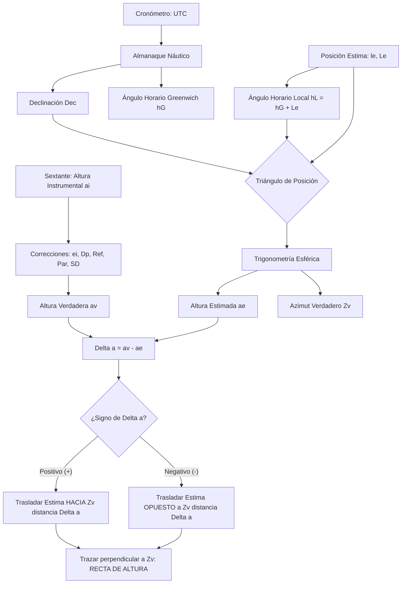

# Capitán de Yate - Tema 4: Cálculos Astronómicos Avanzados y Resolución Analítica

El cálculo analítico de posición mediante rectas de altura es la destreza reina del Capitán de Yate. Exige un rigor matemático absoluto en aritmética sexagesimal y trigonometría esférica, así como en el manejo detallado del Almanaque Náutico y de la corrección de errores óptico-físicos. Un simple despiste en un signo (+/-) colapsa toda la solución en la carta náutica.

---

## 1. Tratamiento Analítico de las Correcciones del Sextante

El sextante proporciona un valor angular en crudo, la **Altura Instrumental ($ai$)**. Para llegar a la **Altura Verdadera ($a_v$)** geométrica topocéntrica referida al centro de la Tierra, debemos aplicar correcciones de óptica instrumental, geometría y refracción atmosférica.

La ecuación general de depuración es:
$$ a_v = a_i + e_i - D_p - C_{\text{ref}} + C_{\text{par}} \pm C_{\text{SD}} $$

### Paso 1: Error Mecánico (Altura Observada, $a_o$)
1.  **Error de Índice ($e_i$):** El colimador y el espejo índice no son exactamente paralelos a $0^\circ$. Si medimos $+2'$ sobre cero en el ajuste del horizonte, el error es positivo y la corrección es $-2'$. 
    $$ a_o = a_i \pm e_i $$

### Paso 2: Geometría de Altura (Altura Aparente, $a_a$)
2.  **Depresión del Horizonte ($D_p$):** Al elevar el ojo del observador ($e$, en metros) sobre el nivel del mar, la tangente visual hacia el horizonte aparente se hunde bajo el horizonte astronómico. Esto agranda la medida de la altura. Su corrección **siempre es negativa**.
    Fórmula empírica clásica: $D_p \approx 1.77' \cdot \sqrt{e}$
    $$ a_a = a_o - D_p $$

### Paso 3: Correcciones Astronómicas y Ópticas (Altura Verdadera, $a_v$)
Las "Tablas Principales" del Almanaque o las fórmulas integran:
3.  **Refracción Astronómica ($C_{\text{ref}}$):** La atmósfera terrestre actúa como una lente convergente. El rayo de luz del astro se curva hacia la normal, "levantando" virtualmente el astro. Para altas alturas ($>15^\circ$), $C_{\text{ref}} \approx \frac{58.2''}{\tan(a_a)}$. Para alturas menores, la refracción es extrema y el cálculo pierde fiabilidad. **Siempre es negativa**.
4.  **Paralaje en Altura ($C_{\text{par}}$):** Solo vital en Luna y planetas cercanos. El Almanaque da coordenadas desde el centro de la Tierra (geocéntricas), pero tú mides desde la superficie (topocéntrico). Como miras "desde arriba", el astro se ve más bajo. **Siempre es positiva**.
    Fórmula: $C_{\text{par}} = HP \cdot \cos(a_a)$, donde $HP$ es el Paralaje Horizontal Ecuatorial.
5.  **Semidiámetro ($C_{\text{SD}}$):** Para el Sol y la Luna. Medimos el Limbo Inferior (borde de abajo). Hay que **sumar** el semidiámetro aparente (aprox $16'$). Si medimos el Limbo Superior (por estar nublado abajo), se **resta**.
    **Aumento de la Luna:** Si la Luna está muy alta en el cielo, está $6000 \text{ km}$ (el radio de la Tierra) más cerca de ti que si estuviera en el horizonte, por lo que su semidiámetro aparente aumenta ($+0.3'$ en el cénit).

**Uso en examen:** En el examen se utiliza la Corrección Total ($C_t$) tabulada, que agrupa refracción y semidiámetro para un Sol medio, dejando unas tablas adjuntas para el mes y la luna.
$$ a_v = a_a + C_t $$

---

## 2. Resolución Analítica del Método de Marcq St. Hilaire (1875)

El núcleo del sistema de posicionamiento oceánico radica en calcular la diferencia precisa entre tu "Estimación" y la "Realidad". 

### Fase 1: Extracción de Coordenadas del Almanaque
1.  **Datos de Partida:** HCL (Hora Civil del Lugar) o HCR (Hora Civil de Reloj) $\rightarrow$ Conversión a **Hora Universal (UTC o $H_{cG}$)** y fecha exacta.
2.  **Situación Estima:** $l_e$ (Latitud estimada) y $L_e$ (Longitud estimada).
3.  Entrando en el Almanaque con el UTC exacto:
    *   **Declinación ($Dec$):** Interpolada para el minuto y segundo, tomando la corrección por variación horaria ($d$).
    *   **Ángulo Horario de Greenwich ($h_G$):** $h_G = h_G(\text{hora}) + \text{pp}(\text{minutos, segundos})$.

### Fase 2: El Triángulo de Posición
4.  **Ángulo Horario Local ($h_L$):**
    $$ h_L = h_G + L_e $$
    *   (Adoptando criterio de signos Longitud: Este $+$, Oeste $-$). Se ajusta al rango $[0^\circ, 360^\circ]$.
5.  **Ángulo en el Polo ($P$):**
    *   Si $h_L < 180^\circ \implies P = h_L$ (Astro al Oeste, bajando).
    *   Si $h_L > 180^\circ \implies P = 360^\circ - h_L$ (Astro al Este, subiendo).
    *   *Nota analítica:* La fórmula de Borda o la Cosenusa usa $\cos(P)$. A efectos de cálculo puro, $\cos(h_L) = \cos(P)$ en todos los cuadrantes.

### Fase 3: Ecuación Trigonométrica (Cálculo de $a_e$ y $Z$)
6.  **Altura Estimada ($a_e$) (Cosenusa de Lados):**
    $$ \sin(a_e) = \sin(l_e) \cdot \sin(Dec) + \cos(l_e) \cdot \cos(Dec) \cdot \cos(P) $$
    **ATENCIÓN A LOS SIGNOS:** 
    Si $l_e$ y $Dec$ están en el mismo hemisferio (mismo "Nombre", ej: N y N), ambas son positivas.
    Si están en distinto hemisferio (ej: $l_e$ N y $Dec$ S), $\sin(Dec)$ y $\cos(Dec)$ generarán que el primer término de la suma sea de signo opuesto o debes introducir $Dec$ como un valor negativo. 
    $a_e = \arcsin(\text{resultado})$.

7.  **Azimut Verdadero ($Z_v$):**
    Fórmula de las Cotangentes (Regla de Neper):
    $$ \cot(Z) = \frac{\cos(l_e) \cdot \tan(Dec) - \sin(l_e) \cdot \cos(P)}{\sin(P)} $$
    Al aplicar arcotangente $\arctan(\frac{1}{\cot(Z)})$, obtienes el Azimut Cuadrantal (Ej: $N 45^\circ E$, o $S 130^\circ W$). Hay que convertirlo a Azimut Circular ($0^\circ - 360^\circ$) según en qué cuadrante geográfico se halle el astro (definido por el nombre de la latitud y si $h_L$ indica que está al E o al W).

### Fase 4: La Determinante St. Hilaire
8.  **Diferencia de Alturas ($\Delta a$ o $\Delta$):**
    $$ \Delta a = a_v - a_e $$
    *   Si $\Delta a$ es **Positivo (+)**: $a_v > a_e$. El astro está "más alto" en la realidad que en la estima, lo que implica que el buque está más cerca del punto geográfico del astro. Se avanza la estima **HACIA** el $Z_v$.
    *   Si $\Delta a$ es **Negativo (-)**: $a_v < a_e$. El barco está más alejado. Se retrasa la estima **EN CONTRA** (rumbo $Z_v \pm 180^\circ$).

---

## 3. Casos Extremos, Especiales y Edge Cases

### A. El Sol de Medianoche y Alturas Circumpolares
En altas latitudes ($l > 66.5^\circ$), el Sol puede no ocultarse, cruzando el meridiano en tránsito inferior. En este caso:
*   $h_L = 180^\circ$, por tanto $P = 180^\circ$. El coseno de $180^\circ$ es $-1$.
*   La Altura Meridiana Inferior es la mínima altura.
*   Fórmula simplificada: $a_v = l_e + Dec - 90^\circ$ (cuando están en el mismo hemisferio).

### B. El Paso por el Cénit ($a_v \approx 90^\circ$)
Si navegas en los trópicos y la Declinación del astro se iguala a tu Latitud ($l_e \approx Dec$), el astro pasará por la vertical de tu cabeza ($a_v = 90^\circ$).
*   **Problema de Singularidad Matemática:** A medida que la altura tiende a $90^\circ$, el radio del círculo de altura tiende a 0. La Recta de Altura (que es una tangente al círculo de altura proyectada en la carta náutica Mercator) deja de ser recta y se curva severamente, arruinando el teorema de Marcq St. Hilaire y causando enormes errores de ploteo.
*   **Solución:** No disparar el sextante si el astro tiene $a_v > 85^\circ$, salvo para cálculos de latitud directa por paso meridiano.

### C. Translación Analítica de Rectas de Altura
Para lograr una Situación Verdadera por dos rectas de Sol separadas horas en el tiempo, debemos "trasladar" la primera recta por el Rumbo y Distancia navegada.
En lugar de dibujar y arrastrar escuadra y cartabón, analíticamente se calcula el Avance del vector:
1.  Se halla el $\Delta l$ y el $\Delta L$ navegados (Estima de Loxodrómica o Traverse Tables).
2.  Se aplica esa nueva estima para el cálculo de la Recta 2, haciendo que el punto Determinativo de la Recta 2 contenga indirectamente el traslado de la nave, o bien se calcula matemáticamente el corte de dos rectas como un sistema de dos ecuaciones lineales (la Ecuación de la Recta de Altura es: $\Delta l \cdot \cos(Z_v) + \Delta L \cdot \cos(l) \cdot \sin(Z_v) = \Delta a$).

---

## 4. Ecuaciones Extra: Latitud por Altura de la Estrella Polar

La Estrella Polar describe un círculo levógiro diminuto alrededor del Polo Norte Celeste (su $Dec \approx 89^\circ 20'$). No está exactamente en el eje. 
La latitud exacta ($l_v$) no es igual a su Altura Verdadera, hay que aplicar una corrección tabulada basada en el Ángulo Horario Local de Aries ($h_{L\gamma}$), el cual indica la fase de rotación del Polo.

Fórmula tradicional simplificada del Almanaque:
$$ l_v = a_v - 1^\circ + \text{Tab. I} + \text{Tab. II} + \text{Tab. III} $$
Donde las tablas I, II y III purgan la posición angular exacta de Polaris dependiente del $h_{L\gamma}$, la Latitud aproximada y el mes del año. No requiere resolver triángulos complejos, proveyendo una Latitud de extrema precisión instantánea para navegantes del Hemisferio Norte.

---

## Recursos Audiovisuales (Videotutoriales de Apoyo)

*   📺 **Escuela Náutica Navarra:** [Uso del Sextante y Recta de Altura - Capitán de Yate Online](https://www.youtube.com/watch?v=LZ6ZI4COyLg&list=PLMXOwDG__-d7AufNnb1GmUaO1nA5kT2mI) (Lista de reproducción esencial: Observación real desde una embarcación, ploteo analítico sobre carta náutica y trazado práctico del Método de Marcq St. Hilaire).

## Ejemplos Prácticos

**Problema 1: Cálculo Analítico del Azimut por el Teorema de las Cotangentes**
Tras calcular la altura de un astro, debemos calcular su Azimut verdadero ($Z_v$).
Datos: Latitud $l_e = 35^\circ \text{ N}$ (+), Declinación $Dec = 20^\circ \text{ S}$ (-), Ángulo en el Polo $P = 60^\circ$ (Oeste).
Halle el $Z_v$ usando la fórmula de la cotangente.

*Solución:*
$$ \cot(Z) = \frac{\cos(l_e) \cdot \tan(Dec) - \sin(l_e) \cdot \cos(P)}{\sin(P)} $$
Insertamos datos con signos algebraicos: $l_e = +35^\circ$, $Dec = -20^\circ$, $P = 60^\circ$.
$$ \cot(Z) = \frac{\cos(35^\circ) \cdot \tan(-20^\circ) - \sin(35^\circ) \cdot \cos(60^\circ)}{\sin(60^\circ)} $$
$$ \cot(Z) = \frac{(0.8192 \cdot -0.3640) - (0.5736 \cdot 0.5000)}{0.8660} $$
$$ \cot(Z) = \frac{-0.2982 - 0.2868}{0.8660} = \frac{-0.5850}{0.8660} = -0.6755 $$
Tomando la inversa para obtener la tangente:
$$ \tan(Z) = \frac{1}{-0.6755} = -1.4804 $$
$$ Z = \arctan(-1.4804) = -55.96^\circ $$
Como la Latitud es Norte, contamos el ángulo desde el Norte. Al ser el ángulo horario Oeste ($P$ Oeste), el astro se halla en el cuadrante SW. El azimut cuadrantal es $N 124.04^\circ W$ o matemáticamente $S 55.96^\circ W$ partiendo desde el Sur de la fórmula pura. Sin embargo, aplicando la regla marinera:
Si $l_e > 0$, el polo elevado es el Norte ($000^\circ$). Al ser la declinación contraria y la cotangente negativa, el azimut supera los $90^\circ$ respecto al polo elevado.
Azimut verdadero: $Z_v = 360^\circ - 124.04^\circ = 235.96^\circ$.

**Problema 2: Sistema de Ecuaciones para Observaciones Simultáneas de Dos Astros**
Al crepúsculo náutico, un Capitán de Yate obtiene dos Rectas de Altura simultáneas para las estrellas Vega y Arcturus.
Estrella 1 (Vega): $\Delta a_1 = +3'$, Azimut $Z_1 = 045^\circ$.
Estrella 2 (Arcturus): $\Delta a_2 = -4'$, Azimut $Z_2 = 135^\circ$.
Desde una misma Posición de Estima (P.E.), calcule la corrección matemática de la Latitud ($\Delta l$) y el Apartamiento ($\Delta A = \Delta L \cdot \cos l_e$) para hallar la Situación Verdadera (Situación Observada) puramente por álgebra lineal matricial, sin carta náutica.

*Solución:*
Las ecuaciones lineales para las rectas de altura en función del incremento de posición son:
$$ \Delta l \cdot \cos(Z_1) + \Delta A \cdot \sin(Z_1) = \Delta a_1 $$
$$ \Delta l \cdot \cos(Z_2) + \Delta A \cdot \sin(Z_2) = \Delta a_2 $$
Sustituyendo los valores trigonométricos de los azimuts:
$\cos(45^\circ) = 0.7071$, $\sin(45^\circ) = 0.7071$
$\cos(135^\circ) = -0.7071$, $\sin(135^\circ) = 0.7071$
Planteamos el sistema matricial (Regla de Cramer o reducción):
1) $0.7071 \cdot \Delta l + 0.7071 \cdot \Delta A = 3$
2) $-0.7071 \cdot \Delta l + 0.7071 \cdot \Delta A = -4$
Sumamos (1) y (2) para despejar $\Delta A$:
$(0.7071 - 0.7071) \Delta l + (0.7071 + 0.7071) \Delta A = 3 - 4$
$1.4142 \cdot \Delta A = -1 \implies \Delta A = \frac{-1}{1.4142} = -0.707 \text{ millas náuticas}$.
Restamos (2) de (1) para despejar $\Delta l$:
$(0.7071 - (-0.7071)) \Delta l + (0.7071 - 0.7071) \Delta A = 3 - (-4)$
$1.4142 \cdot \Delta l = 7 \implies \Delta l = \frac{7}{1.4142} = +4.95 \text{ millas náuticas (Minutos de Latitud)}$.
*Conclusión analítica:* La situación observada se halla a $4.95'$ hacia el Norte ($\Delta l > 0$) y $0.707'$ de apartamiento hacia el Oeste ($\Delta A < 0$) desde el punto de estima inicial.

**Problema 3: Algoritmo Avanzado de Refracción (Fórmula de Bennett)**
Para evitar descartar alturas solares muy bajas ($a_a = 4^\circ$), el navegante decide utilizar la fórmula empírica de alta precisión de G.G. Bennett (1982) para calcular la Refracción Astronómica ($R_0$) en minutos de arco, con las condiciones atmosféricas estándar. La fórmula es:
$$ R_0 = \frac{\cot(a_a + \frac{7.31}{a_a + 4.4})}{1} $$
Calcule la refracción $R_0$ exacta para una altura aparente $a_a = 4.0^\circ$.

*Solución:*
Primero calculamos el sumando corrector interno:
$$ C = \frac{7.31}{4.0 + 4.4} = \frac{7.31}{8.4} = 0.8702^\circ $$
Sumamos esto al argumento de la cotangente:
$$ Argumento = a_a + C = 4.0^\circ + 0.8702^\circ = 4.8702^\circ $$
Aplicamos la función trigonométrica:
$$ R_0 = \cot(4.8702^\circ) = \frac{1}{\tan(4.8702^\circ)} $$
Calculamos la tangente:
$\tan(4.8702^\circ) \approx 0.08518$
$$ R_0 = \frac{1}{0.08518} = 11.739 \text{ minutos de arco} $$
Por tanto, la corrección de refracción será $C_{\text{ref}} = -11.74'$. Esta fórmula magistral proporciona una precisión astronómica superior a las tablas estándar de interpolación lineal en los umbrales críticos del horizonte.

---

## Referencias Bibliográficas y Jurisprudencia

*   **Bibliografía Recomendada:**
    *   *Navegación Astronómica*, Luis Mederos. Explicación matricial y analítica muy detallada.
    *   *H.O. Pub 229 (Sight Reduction Tables for Marine Navigation)*.
*   **Convenciones OMI:**
    *   STCW exige la capacidad certificada de planificar un viaje oceánico sin el uso de medios electrónicos satelitales (GNSS).
*   **Jurisprudencia (Admiralty Court):**
    *   *The "Temple Bar" (1945)*: Uno de los pilares legales. El buque varó tras no efectuar correctas verificaciones astronómicas del compás giroscópico y la corredera. El juez penalizó la confianza excesiva e injustificada en un solo medio no astronómico de navegación.
