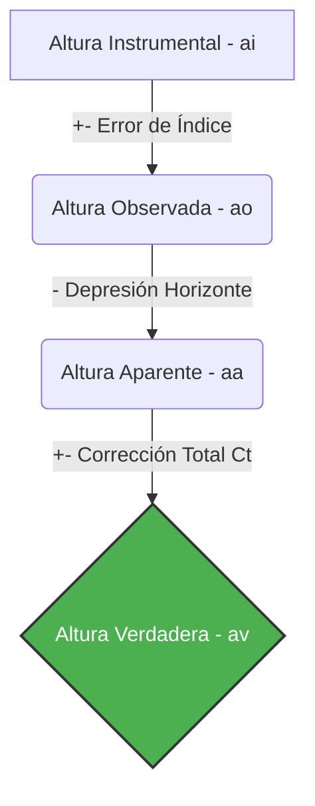
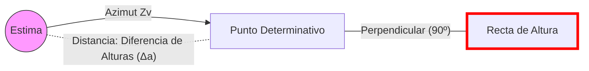

# Capitán de Yate - Tema 4: Cálculos Astronómicos Avanzados

El bloque de cálculo del Capitán de Yate es la prueba definitiva de navegación astronómica. Requiere un manejo exquisitamente matemático y ordenado del sextante, del Almanaque Náutico y de las fórmulas de resolución trigonométrica. Un solo error en un signo sumando minutos te sitúa a cientos de millas de tu posición real.

---

## 1. Correcciones de la Altura del Sextante (El Proceso Completo)

Cuando medimos el ángulo vertical de un astro (el Sol, por ejemplo) apoyándolo visualmente sobre la línea del horizonte del mar con el sextante, obtenemos la **Altura Instrumental ($ai$)**. Esta medida está contaminada por varios errores físicos y ópticos que debemos purgar paso a paso para obtener la **Altura Verdadera ($av$)** del centro de la Tierra al centro del astro.

$$ a_v = a_i + e_i + D_p + C_{\text{ref}} + C_{\text{par}} + C_{\text{SD}} $$

### Paso 1: De Altura Instrumental ($ai$) a Altura Observada ($ao$)
1.  **Error de Índice ($ei$):** Es el desajuste mecánico interno de los espejos del sextante. Si al poner el sextante a cero grados el horizonte se ve partido, hay error. Puede ser aditivo o sustractivo (+ o -). 
    *   *Obtenemos:* $ao = ai \pm ei$

### Paso 2: De Altura Observada ($ao$) a Altura Aparente ($aa$)
2.  **Depresión del Horizonte ($Dp$):** Como el ojo del observador está elevado (por ejemplo, a 3 metros sobre el mar), vemos un horizonte "aparente" que está curvado hacia abajo respecto al horizonte "astronómico" perfecto. Al medir desde ese horizonte más bajo, la altura que medimos es engañosamente más grande. **Siempre se resta (-)**. Se busca en la Tabla C de "Correcciones por Elevación del Observador" en el Almanaque.
    *   *Obtenemos:* $aa = ao - Dp$

### Paso 3: De Altura Aparente ($aa$) a Altura Verdadera ($av$)
Aquí agrupamos tres fenómenos atmosféricos y geométricos. En el Almanaque Náutico, las "Tablas Principales de Correcciones de Altura" nos dan un valor único ($Ct$) que agrupa a los tres.
3.  **Refracción ($C_{ref}$):** La luz del astro se curva al atravesar las capas de la atmósfera (más densas cerca del agua). El astro parece estar "flotando" más alto de lo que realmente está. **Siempre se resta (-)**.
4.  **Paralaje ($C_{par}$):** Diferencia de ángulo si observáramos desde la superficie frente al centro matemático de la Tierra. Muy notable en la Luna. **Siempre se suma (+)**.
5.  **Semidiámetro ($C_{SD}$):** (Solo para Sol y Luna). Como son astros muy grandes, no podemos medir su centro a ojo. Medimos apoyando el "Limbo Inferior" (borde de abajo) en el horizonte, por lo que **hay que sumar (+)** el radio del astro. Si por algún motivo midiéramos el Limbo Superior, se resta (-).

> En los exámenes de CY, lo normal es usar la tabla de corrección total de la página 387 del Almanaque.
> $$ a_v = a_a + C_t $$

## 2. Situación por Rectas de Altura (Método de Marcq St. Hilaire)

Inventado a finales del siglo XIX, es el método universal para situarse en medio del océano a cualquier hora del día.

### El Concepto
Nosotros *creemos* estar en un punto de la carta (Situación de Estima). Usando fórmulas, calculamos qué Altura debería tener el astro exactamente si estuviéramos en esa Estima. Si la altura que calculamos es *menor* que la que acabamos de medir de verdad con el sextante, significa que el astro está más alto en el cielo de lo previsto, ergo, estamos más cerca del astro que nuestra estima original.

### Resolución Matemática Paso a Paso
1.  **Situación de Estima ($le, Le$):** Establecemos nuestra Latitud ($l_e$) y Longitud ($L_e$) estimadas a la hora exacta UTC del disparo del sextante.
2.  **Cálculo del Horario del Astro en Greenwich ($hG$):** Usando la hora UTC, entramos en las páginas diarias del Almanaque. Obtenemos el $hG$ de la hora entera, y le sumamos la parte proporcional de los minutos y segundos exactos.
3.  **Ángulo Horario Local ($hL$):**
    $$ h_L = h_G + L_e \quad \text{(Sumar si la Longitud es Este, Restar si es Oeste)} $$
    *(Nota: Si hL > 360º, se le restan 360º. Si hL < 0º, se le suman 360º).*
4.  **Ángulo en el Polo ($P$):** Para la calculadora, se convierte el $hL$ en $P$. 
    *   Si $hL < 180^\circ$, el astro está al Oeste. $P = hL$ (W).
    *   Si $hL > 180^\circ$, el astro está al Este. $P = 360^\circ - hL$ (E).
5.  **Declinación ($Dec$):** Se saca del Almanaque para la hora UTC exacta, interpolando los minutos.
6.  **Cálculo de la Altura Estimada ($a_e$) [Fórmula de la Cosenusa]:**
    $$ \sin(a_e) = \sin(l_e) \cdot \sin(Dec) + \cos(l_e) \cdot \cos(Dec) \cdot \cos(P) $$
    *(Crucial: Si $l_e$ y $Dec$ tienen DISTINTO nombre -una Norte y otra Sur-, el primer término se vuelve negativo).*
7.  **Cálculo del Azimut Verdadero ($Z_v$):**
    $$ \cot(Z) = \frac{\cos(l_e) \cdot \tan(Dec)}{\sin(P)} - \frac{\sin(l_e)}{\tan(P)} $$
8.  **Diferencia de Alturas ($\Delta a$):**
    $$ \Delta a = a_v - a_e $$
    *   $\Delta a$ **positivo (+):** Vas Hacia el astro. Se mide la distancia desde la estima hacia el mismo Azimut.
    *   $\Delta a$ **negativo (-):** Vas En Contra. Se mide en dirección contraria ($Z_v + 180^\circ$).

### El Trazado en la Carta
Desde el punto de Estima, trazas una línea en la dirección del Azimut. Marcas en esa línea la distancia $\Delta a$ (1' = 1 milla). En ese nuevo punto, trazas una recta perpendicular al Azimut. ¡Felicidades, acabas de trazar tu Recta de Altura! Tu barco está en esa línea recta.

## 3. Situación Verdadera (Corte de dos Rectas)

Una recta no da una posición aislada, necesitas dos rectas que se crucen en un punto (Situación Verdadera).

*   **Observación Estelar Simultánea:** En el Crepúsculo Náutico, un buen oficial puede "disparar" a tres estrellas diferentes (ej: Vega, Sirio y Arcturus) en un lapso de 5 minutos. Trazas las tres rectas y, donde se cortan formando un pequeño triángulo, ahí estás.
*   **Traslado de la Recta del Sol (Recta de Mañana y Meridiana):** A las 09:00 disparas al Sol y trazas una recta de altura. Navegas a Rumbo=090º y Velocidad=10 nudos durante 4 horas (hasta las 13:00). A las 13:00, "agarras" físicamente la recta dibujada a las 09:00 y la trasladas 40 millas náuticas enterita en dirección 090º. Luego disparas la Meridiana a las 13:00. Donde se cruza la Meridiana con tu vieja recta trasladada, es tu situación Verdadera de las 13:00.

## 4. El "Milagro" de la Altura Meridiana

La Latitud por la Altura Meridiana es el cálculo más antiguo, bello y sencillo de la náutica.
Se realiza en el mediodía verdadero, el preciso instante en el que el Sol cruza por nuestro propio meridiano (Azimut exactamente 000º o 180º). Es cuando el Sol "cuélga" más alto en todo el día.

En este instante mágico, el triángulo esférico se colapsa en una línea plana, por lo que **no se necesitan logaritmos ni cosenos**.

**Fórmula de la Latitud Meridiana:**
$$ l_v = Z + Dec $$

Donde:
*   $a_v$: Altura verdadera medida con el sextante.
*   $Z$ (Distancia Cenital) = $90^\circ - a_v$. (Llevará signo del punto cardinal donde *no* esté el astro. Si vemos el Sol al Sur, la distancia al Cenit "tira" hacia el Norte, luego $Z$ es Norte).
*   $Dec$: La sacas del Almanaque.

**Regla de los signos:** Si $Z$ y $Dec$ tienen el mismo nombre (ej: los dos Norte), se suman, y el resultado es Norte. Si tienen distinto nombre (ej: $Z$ Norte y $Dec$ Sur), se restan, y el resultado lleva el nombre de la cifra más grande.
