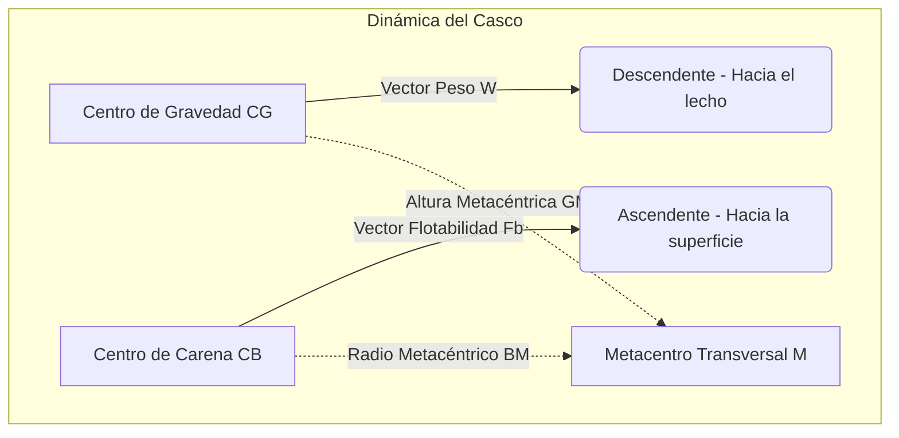

# Nomenclatura Náutica y Física de la Estabilidad

El estudio de la nomenclatura náutica trasciende la mera memorización de términos; implica una comprensión profunda de la física de medios continuos y la hidrostática aplicada a cascos de pequeña eslora (hasta 6 metros), diseñados típicamente para navegaciones diurnas a un máximo de 2 millas de un abrigo o playa accesible.

## Glosario Básico: Tus Primeras 8 Palabras en el Mar

Si nunca has pisado un barco, empieza por aquí. Estas son las palabras que el instructor usará constantemente durante las prácticas, así que conviene tenerlas claras antes de subir a bordo. Piensa en el barco como si fuera tu propio cuerpo: tiene una parte de delante, una de detrás, una izquierda y una derecha.

*   🔵 **Proa:** La parte delantera del barco, la que "corta" el agua al avanzar. Es como la punta de tu zapato cuando caminas hacia adelante.
*   🔵 **Popa:** La parte de atrás del barco, por donde suele estar el motor. Es lo último que ves alejarse si el barco se va sin ti.
*   🔵 **Babor:** El lado izquierdo del barco, mirando siempre hacia la proa (hacia adelante), igual que cuando dices que algo está "a tu izquierda" mirando hacia donde caminas.
*   🔵 **Estribor:** El lado derecho del barco, mirando hacia la proa. Es justo el contrario de babor. Un truco que usan muchos patrones: en las cartas de navegación y en las luces del barco, estribor siempre va asociado al color verde, y babor al rojo. Si te acostumbras a esa pareja de colores, luego identificar los lados es automático.
*   🔵 **Casco:** El "cuerpo" exterior del barco, la carcasa que flota y separa el agua de dentro del barco. Es como la carrocería de un coche, pero pensada para flotar en vez de rodar.
*   🔵 **Cubierta:** El "suelo" que pisas cuando estás de pie en el barco. Es como el piso de tu casa, solo que este se mueve con las olas.
*   🔵 **Timón:** La pieza que gira para cambiar la dirección del barco. Funciona parecido al volante de un coche, aunque en muchas lanchas pequeñas el propio manillar del motor hace esta función.
*   🔵 **Ancla:** Un peso metálico (normalmente en forma de gancho) que se lanza al fondo del mar atado con una cadena o cabo, para que el barco se quede quieto en un sitio sin irse a la deriva. Es el "freno de mano" del barco.

**Consejo práctico:** No hace falta memorizar esto de golpe. Durante las prácticas en el mar, el instructor señalará cada parte mientras la nombra, y en cuestión de minutos estas palabras te saldrán solas.

## Análisis del Equilibrio y Flotabilidad

La flotabilidad de una embarcación menor se rige por el Principio de Arquímedes. El desplazamiento $\Delta$ de la nave en condiciones de carga máxima (considerando el límite estructural para pequeñas esloras) se define mediante la ecuación de equilibrio hidrostático:

$$
\Delta = \rho_{\text{agua}} \cdot g \cdot \nabla
$$

Donde:
* $\Delta$ es la fuerza de empuje o desplazamiento expresada en Newtons ($\text{N}$).
* $\rho_{\text{agua}}$ es la densidad del agua circundante (aproximadamente $1025 \, \text{kg/m}^3$ para agua de mar estándar).
* $g$ es la aceleración de la gravedad ($9.81 \, \text{m/s}^2$).
* $\nabla$ es el volumen de la carena sumergida en $\text{m}^3$.

Para asegurar la estabilidad estática transversal en ángulos de escora pequeños (esencial en embarcaciones de recreo propensas a la traslación de pesos en cubierta), el momento adrizante $M_R$ se cuantifica con la siguiente aproximación en régimen lineal:

$$
M_R = \Delta \cdot GZ \approx \Delta \cdot GM \cdot \sin(\theta)
$$

Siendo $GM$ la altura metacéntrica, la cual determina el diferencial termodinámico de la estabilidad de la nave:

$$
GM = KB + BM - KG
$$

### Diagrama de Fuerzas de Estabilidad

## Protocolos de Seguridad y Esfuerzos Mecánicos

Las embarcaciones limitadas a navegaciones cortas están sujetas a esfuerzos mecánicos transitorios derivados del oleaje de alta frecuencia cerca de la costa. La tensión longitudinal máxima $T_{\text{max}}$ sobre una cornamusa de amarre durante un fondeo de emergencia puede modelarse teóricamente basándose en la disipación de la energía cinética:

$$
T_{\text{max}} = \sqrt{ \frac{k \cdot m \cdot v^2}{L} }
$$

Donde $k$ representa la constante elástica de rigidez de la línea de fondeo, $m$ la masa inercial de la embarcación, $v$ la velocidad de oscilación o deriva frente a la racha de viento, y $L$ la longitud efectiva del cabo desplegado.

## Ejemplos Prácticos

**Problema 1: Evaluación del Límite de Estabilidad Inicial**

Una lancha fueraborda (autorizada bajo Licencia de Navegación) de 5.5 metros de eslora posee un volumen de carena desplazado de $\nabla = 1.2 \, \text{m}^3$. Si, debido a la carga de los pasajeros en cubierta, el centro de gravedad se localiza a $0.4 \, \text{m}$ geométricamente por encima del centro de carena ($BG = 0.4 \, \text{m}$), y el radio metacéntrico de la sección transversal del casco se ha calculado en $BM = 1.1 \, \text{m}$:

Determine analíticamente la altura metacéntrica $GM$ y el momento adrizante $M_R$ para una escora inducida por el viento de $\theta = 10^\circ$. Considere un régimen fluido estático con densidad $\rho_{\text{agua}} = 1025 \, \text{kg/m}^3$.

**Solución Rigurosa Paso a Paso:**

1. **Cálculo del Desplazamiento ($\Delta$):**
   Utilizando la ecuación del equilibrio hidrostático:
   

$$
\Delta = \rho_{\text{agua}} \cdot g \cdot \nabla
$$

   

$$
\Delta = (1025 \, \text{kg/m}^3) \cdot (9.81 \, \text{m/s}^2) \cdot (1.2 \, \text{m}^3)
$$

   

$$
\Delta = 12066.3 \, \text{N}
$$

2. **Determinación de la Altura Metacéntrica ($GM$):**
   A partir de la geometría de masas del casco:
   

$$
GM = BM - BG
$$

   

$$
GM = 1.1 \, \text{m} - 0.4 \, \text{m} = 0.7 \, \text{m}
$$

   Dado que $GM > 0$, concluimos matemáticamente que la embarcación goza de un equilibrio inicial inherentemente estable.

3. **Cálculo del Brazo Adrizante ($GZ$) y Momento Adrizante ($M_R$):**
   Aplicando la condición de linealidad para ángulos moderados ($\theta \le 15^\circ$):
   

$$
GZ \approx GM \cdot \sin(10^\circ) = 0.7 \cdot 0.1736 \approx 0.1215 \, \text{m}
$$

   El momento restaurador resultante será:
   

$$
M_R = \Delta \cdot GZ = 12066.3 \, \text{N} \cdot 0.1215 \, \text{m} \approx 1466.05 \, \text{N}\cdot\text{m}
$$

## Referencias Bibliográficas y Jurisprudencia

* **Real Decreto 875/2014, de 10 de octubre:** Por el que se regulan las titulaciones náuticas para el gobierno de las embarcaciones de recreo (BOE-A-2014-10344), prestando especial atención a las limitaciones operativas de la Licencia de Navegación.
* **Física de Fluidos Aplicada a la Arquitectura Naval:** Pérez, J.M. (2018). Ed. Universidad Politécnica de Madrid. Capítulo 3: Estabilidad paramétrica en pequeñas esloras.
* **Jurisprudencia Marítima:** Sentencia de la Audiencia Provincial de Cádiz (Sección 2ª) de 14 de marzo de 2021. Establece doctrina sobre la responsabilidad directa del patrón en el mantenimiento del francobordo operativo frente a sobrecargas transitorias en embarcaciones de categoría de diseño C.
