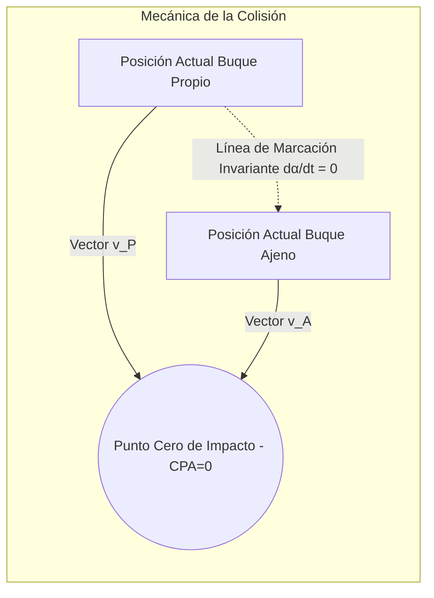
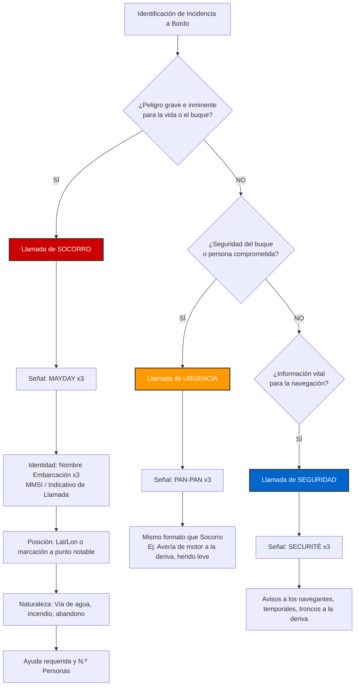

# Análisis Cinemático del RIPA

El Reglamento Internacional para Prevenir Abordajes (RIPA) es la normativa fundamental de convivencia marítima. Para embarcaciones menores, operando bajo la Licencia de Navegación (hasta 6 metros de eslora, luz diurna, 2 millas de la costa), la detección del riesgo de abordaje exige un análisis exhaustivo de la cinemática en el plano de navegación bidimensional.

## Las 3 cosas que un principiante DEBE saber sobre el RIPA

Olvídate por un momento de las matemáticas. Si es tu primera vez en el mar, con quedarte con estas 3 ideas ya navegas de forma segura y respetuosa con los demás:

1.  **Si tienes dudas, cede el paso.** El mar no tiene semáforos ni carriles pintados, así que la norma de oro es: ante la duda, frena o desvíate tú. Es como cuando en un cruce de calles sin señales no sabes quién tiene preferencia: lo más seguro es dejar pasar al otro antes que arriesgarte.
2.  **Nunca te cruces por delante de un barco grande.** Los barcos grandes (cargueros, ferris, pesqueros) pesan muchísimo y necesitan mucha distancia para frenar o girar, aunque parezca que van "despacio" desde lejos. Es como cruzar la vía justo delante de un tren: aunque el tren esté "lejos", en realidad se acerca mucho más rápido de lo que parece y no puede parar en seco. Mantente siempre alejado de su trayectoria y dales todo el margen posible.
3.  **En caso de emergencia, llama por el Canal 16 de VHF.** El Canal 16 es el "112" del mar: es el canal de socorro que escuchan Salvamento Marítimo y el resto de barcos cercanos. Si tienes un problema grave, coges la radio, pulsas para hablar, dices "MAYDAY, MAYDAY, MAYDAY", el nombre de tu barco y dónde estás. No hace falta que lo digas perfecto, lo importante es pedir ayuda cuanto antes.

Con estas 3 ideas claras ya tienes cubierto lo esencial del RIPA para navegar con la Licencia de Navegación. El resto de reglas de cruce y prioridades detalladas son propias de titulaciones superiores (PER, PNB), no de este curso de 2 horas.

## Velocidad Relativa y Marcación Constante

El riesgo inminente de abordaje se verifica analíticamente si la demora o marcación de un buque que se aproxima permanece inalterada a lo largo del tiempo, mientras su distancia se reduce progresivamente (fenómeno conocido en la doctrina náutica anglosajona como CBDR: *Constant Bearing, Decreasing Range*).

Si expresamos $\vec{v}_P$ como el vector velocidad del buque propio y $\vec{v}_A$ como el del buque ajeno (o contacto), el vector de la velocidad relativa $\vec{v}_{\text{rel}}$ observado desde nuestro sistema de referencia no inercial se define por el álgebra vectorial:

$$ \vec{v}_{\text{rel}} = \vec{v}_A - \vec{v}_P $$

En coordenadas polares relativas, definiendo la posición del buque A respecto al nuestro como el vector $\vec{r} = R \cdot \hat{u}_r$, el sistema converge asintóticamente a un abordaje si, y solo si, se cumplen simultáneamente estas dos derivadas temporales:

$$ \frac{d\alpha}{dt} = 0 \quad \text{y} \quad \frac{dR}{dt} < 0 $$

Donde $\alpha$ es el ángulo de demora verdadera (azimut) y $R$ es la métrica de distancia espacial entre los dos navíos.

### Diagrama Vectorial de Incursión

## Propagación de Ondas Electromagnéticas (VHF)

A pesar de que el plan de estudios de la Licencia de Navegación no impone la obligatoriedad de equipos de radiocomunicaciones de instalación fija, la tenencia y uso de transceptores portátiles VHF es crítica para la supervivencia. Las ondas de muy alta frecuencia (Banda VHF Marina, 156.000 MHz a 174.000 MHz) están limitadas fundamentalmente por la restricción de propagación por línea de visión (*Line-of-Sight*, LOS).

El horizonte radioeléctrico cinemático, $D_{\text{radio}}$, expresado en millas náuticas, sufre una perturbación por refracción en la baja troposfera y puede modelizarse con la siguiente aproximación empírica:

$$ D_{\text{radio}} \approx 2.22 \cdot \left( \sqrt{h_t} + \sqrt{h_r} \right) $$

Donde $h_t$ y $h_r$ representan las cotas de elevación en metros de las antenas transmisora y receptora respectivamente. Para una lancha de 5 metros, la cota de antena portátil apenas supera $1.5 \, \text{m}$, lo que constriñe severamente el radio de propagación.

### Árbol de Decisión: Protocolo VHF de Emergencia (Canal 16)

## Ejemplos Prácticos

**Problema 1: Evaluación Diferencial del Tiempo hasta la Colisión (TTC)**

Un patrón al mando de una embarcación (Buque Propio, P) navega a una velocidad de $V_P = 12 \, \text{nudos}$ manteniendo un rumbo cartesiano constante de $090^\circ$. Repentinamente avista visualmente a una embarcación a motor (Buque Ajeno, A) exactamente por su través de babor, determinando mediante telemetría visual una distancia geométrica inicial de $R_0 = 2 \, \text{millas}$. 

Tras un lapso de observación de $t = 5 \, \text{minutos}$, el patrón comprueba que la marcación sigue siendo rigurosamente el través de babor ($\frac{d\alpha}{dt} = 0$), pero la distancia se ha reducido a $R_1 = 1 \, \text{milla}$.

Calcule la magnitud del vector de la velocidad relativa de aproximación $\left| \vec{v}_{\text{rel}} \right|$ e integre la ecuación de movimiento para determinar el tiempo restante para la intercepción catastrófica, suponiendo que ninguno aplica la Regla 8 del RIPA.

**Solución Rigurosa Paso a Paso:**

1. **Definición de las Derivadas Fundamentales:**
   Por la invarianza angular, sabemos que la velocidad relativa se proyecta íntegramente sobre el eje radial. El diferencial de tiempo transcurrido es:
   $$ \Delta t = 5 \, \text{minutos} \cdot \left( \frac{1 \, \text{hora}}{60 \, \text{minutos}} \right) = \frac{1}{12} \, \text{horas} $$

2. **Obtención del Módulo de la Velocidad Relativa ($\left| \vec{v}_{\text{rel}} \right|$):**
   Evaluando el límite finito de la contracción de la distancia:
   $$ \left| \vec{v}_{\text{rel}} \right| = - \frac{\Delta R}{\Delta t} = - \frac{R_1 - R_0}{\Delta t} $$
   $$ \left| \vec{v}_{\text{rel}} \right| = - \frac{1 \, \text{milla} - 2 \, \text{millas}}{\frac{1}{12} \, \text{horas}} = \frac{1}{\frac{1}{12}} = 12 \, \text{nudos} $$
   La tasa de aproximación es contante a $12 \, \text{millas/hora}$.

3. **Proyección del Tiempo Restante de Impacto ($t_{\text{impacto}}$):**
   $$ t_{\text{impacto}} = \frac{R_1}{\left| \vec{v}_{\text{rel}} \right|} = \frac{1 \, \text{milla}}{12 \, \text{nudos}} $$
   $$ t_{\text{impacto}} = \frac{1}{12} \, \text{horas} = 5 \, \text{minutos} $$
   El patrón dispone de un tiempo de respuesta crítico de $300 \, \text{segundos}$ para iniciar maniobras evasivas según dictamina el RIPA.

## Referencias Bibliográficas y Jurisprudencia

* **Organización Marítima Internacional (OMI):** Convenio sobre el Reglamento Internacional para Prevenir los Abordajes (COLREG 1972), enmendado. Reglas críticas a referenciar: Regla 5 (Vigilancia), Regla 7 (Riesgo de abordaje) y Regla 8 (Maniobras para evitar el abordaje).
* **Física Ondulatoria para Telecomunicaciones Marítimas:** Gómez, L.R. (2020). Ediciones Náuticas Superiores. Estudio analítico de los efectos de superficie sobre bandas UHF/VHF.
* **Jurisprudencia Marítima Nacional:** Sentencia del Tribunal Supremo (Sala de lo Civil) de 22 de mayo de 2018. Establece una sentencia definitoria sobre la distribución de responsabilidad extracontractual (culpa compartida) en abordajes producidos dentro de la zona de navegación de 2 millas, castigando la negligencia en el mantenimiento de una vigilancia visual permanente y el deficiente análisis cinemático del peligro.
