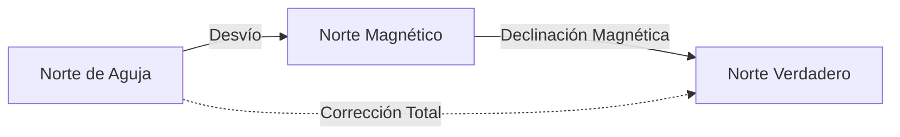

# PER - Tema 11: Carta de Navegación (Ejercicios)

El Tema 11 es la "prueba de fuego" del PER. Es una parte 100% práctica que se realiza sobre la Carta de enseñanza del Estrecho de Gibraltar (Carta 105).

Debes llevar al examen regla, escuadra, cartabón (o reglas paralelas), compás y transportador de ángulos, además de calculadora (no programable). **Si fallas más de 2 problemas de los 4 de este bloque, suspendes todo el examen del PER automáticamente.**

---

## 1. Coordenadas y Uso del Compás

Cualquier punto en la carta se define por dos coordenadas:
*   **Latitud ($l$):** Se lee en las escalas verticales (izquierda y derecha). Se expresa en Grados y Minutos (ej. $36^\circ 15,2' N$). Siempre es Norte (N) en la carta del Estrecho.
*   **Longitud ($L$):** Se lee en las escalas horizontales (arriba y abajo). Se expresa en Grados y Minutos (ej. $005^\circ 42,6' W$). Siempre es Oeste (W) en la carta del Estrecho.

> [!WARNING]
> **Medición de Distancias:** Las distancias (Millas Náuticas) se miden con el compás de puntas **ÚNICAMENTE** en las escalas de Latitud (verticales), justo a la altura del lugar donde estamos trabajando. **Nunca** uses la escala de longitud para medir distancias. 1 Minuto de Latitud = 1 Milla Náutica.

## 2. Rumbos y la Corrección Total

En la carta náutica todo está orientado al **Norte Verdadero (Geográfico)**. Sin embargo, nuestro compás en el barco apunta al **Norte Magnético**, que está desplazado. Además, el metal y los motores de nuestro propio barco desvían aún más la brújula.

Fórmula Maestra:
$$ Rumbo Verdadero (Rv) = Rumbo de Aguja (Ra) + Correcci\acute{o}n Total (Ct) $$

### ¿Qué es la Corrección Total (Ct)?
Es la suma de dos errores:
$$ Ct = Declinaci\acute{o}n Magn\acute{e}tica (dm) + Desv\acute{i}o (\Delta) $$

*   **Declinación Magnética ($dm$):** La da la propia carta (en la rosa de los vientos) para un año base, y te indica cuánto cambia cada año. (Ej: *dm = $2^\circ 50' W$ en 2005, variación anual $7' E$*). Hay que actualizarla al año del examen. ¡Recuerda que W es negativo (-) y E es positivo (+)!
*   **Desvío ($\Delta$):** Es el error propio del barco. Te lo dará el enunciado del problema (Ej: $\Delta = +2^\circ$).

### Trazado vs. Timón
*   **Para trazar en la carta:** Siempre se usa el **Rumbo Verdadero (Rv)**.
*   **Para decirle al timonel dónde apuntar:** Siempre se usa el **Rumbo de Aguja (Ra)**.

## 3. Problemas Clásicos de Examen

El examen constará de 4 problemas que pueden combinar estas situaciones:

1.  **Situación por Demoras (Cruzamientos):** Estás viendo dos faros (ej. Faro de Tarifa y Faro de Punta Almina). Tomas dos Demoras de Aguja ($Da$) con tu compás de marcaciones. Las conviertes a Demoras Verdaderas ($Dv = Da + Ct$) y las trazas en la carta desde los faros, al revés. Donde se crucen las dos líneas, está tu barco.
2.  **Cálculo de Rumbo:** Te dicen que estás en el punto A y quieres ir al punto B. Dibujas la línea en la carta, mides su ángulo con el transportador (ese es el Rv). Luego le restas la Ct para hallar el Ra que debes poner en la bitácora del barco.
3.  **Cálculo de ETA (Hora Estimada de Llegada):** Mides con el compás la distancia (D) en la escala lateral. Tienes una velocidad (V) del enunciado. Usas la fórmula de la velocidad: $Tiempo = \frac{Distancia}{Velocidad}$. Le sumas ese tiempo a tu Hora de Salida.
4.  **Situación por líneas de posición especiales:** Combinar una demora a un faro con una isobata (línea de profundidad). Donde la línea de la demora corte a la línea de 50 metros de profundidad que marca la carta, ahí estás.
