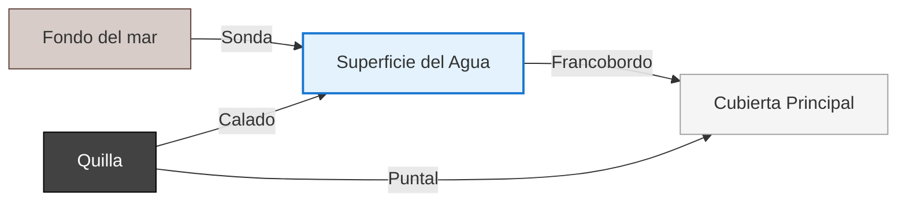

# Tema 1: Nomenclatura Náutica

En este tema se estudian las dimensiones, partes y estructura fundamental de una embarcación. Es el vocabulario básico que todo navegante debe dominar para comunicarse a bordo.

## Dimensiones del Buque

*   **Eslora:** Es la longitud del barco.
    *   *Eslora de flotación:* La longitud de la parte del barco que toca el agua.
    *   *Eslora máxima:* La longitud total, incluyendo apéndices fijos.
*   **Manga:** Es la anchura del barco.
    *   *Manga máxima:* La anchura máxima del barco en su sección más ancha.
*   **Puntal:** Es la altura del barco desde la quilla (parte más baja) hasta la cubierta principal.
*   **Calado:** Es la profundidad que alcanza el barco en el agua (desde la línea de flotación hasta la parte más baja de la quilla). Conocer el calado es vital para no encallar.
*   **Francobordo:** Es la distancia desde la línea de flotación hasta la cubierta principal (la parte que sobresale del agua). Es la reserva de flotabilidad del barco.
*   **Asiento:** Es la diferencia entre el calado de popa y el calado de proa. Si el barco está más hundido de popa, tiene asiento apopante (positivo).
*   **Desplazamiento:** Es el peso del agua que desplaza el barco (y por tanto, el peso del propio barco). Se mide en toneladas métricas.

## Partes del Buque

*   **Proa:** La parte delantera del barco (con forma de cuña para cortar el agua).
*   **Popa:** La parte trasera del barco.
*   **Babor:** Mirando hacia proa, es el lado izquierdo del barco (luz roja).
*   **Estribor:** Mirando hacia proa, es el lado derecho del barco (luz verde).
*   **Crujía:** Es la línea imaginaria que divide el barco de proa a popa en dos mitades simétricas (babor y estribor).
*   **Obra Viva (Carena):** Es la parte del casco que está sumergida bajo el agua.
*   **Obra Muerta:** Es la parte del casco que está por encima de la línea de flotación.
*   **Línea de Flotación:** La línea que separa la obra viva de la obra muerta.

## Estructura

*   **Casco:** Es el armazón externo del barco. Debe ser estanco e hidrodinámico.
*   **Quilla:** Es la "columna vertebral" del barco, la pieza longitudinal que va de proa a popa en la parte inferior.
*   **Roda:** Es la continuación de la quilla en la parte de proa (la "nariz").
*   **Codaste:** Es la continuación de la quilla en la parte de popa.
*   **Cuadernas:** Son las "costillas" del barco. Piezas transversales que se apoyan en la quilla y dan forma al casco.
*   **Bao:** Son las vigas transversales que unen las cuadernas en la parte superior y soportan la cubierta.
*   **Borda:** Es la parte superior del costado del barco.

## Accesorios y Elementos de Maniobra

*   **Cornamusa:** Pieza en forma de "T" (con dos cuernos) utilizada para amarrar cabos.
*   **Noray:** Poste metálico macizo en el muelle utilizado para hacer firmes los cabos de amarre del barco.
*   **Bitácora:** Mueble o caja, habitualmente cerca del timón, que aloja el compás magnético (brújula).
*   **Candeleros y Guardamancebos:** Los candeleros son postes verticales metálicos en el borde de la cubierta. Por ellos pasa el guardamancebos (un cable de acero) que sirve de barandilla para evitar caer al agua.
*   **Imbornales:** Agujeros en la base de la borda que permiten que el agua que entra en la cubierta se evacúe rápidamente hacia el mar.
