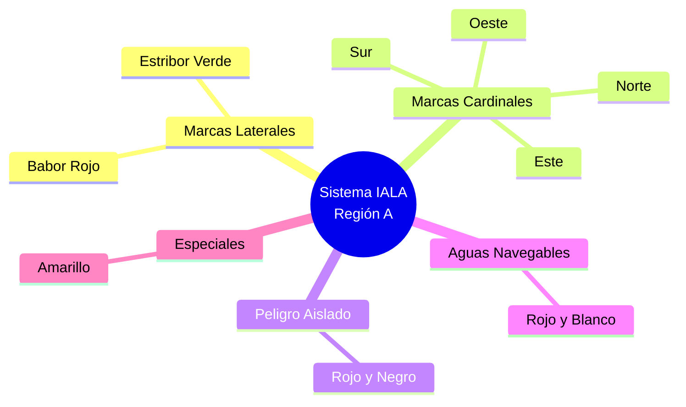

# Tema 5: Balizamiento (Sistema IALA)

El balizamiento es el "código de circulación" del mar. Utiliza boyas y balizas para indicar los canales navegables, los peligros y zonas especiales. El examen del PER exige conocer a la perfección la normativa IALA (Asociación Internacional de Señalización Marítima).

España pertenece a la **Región A** del sistema IALA.

En todas las marcas debes memorizar tres cosas:
1.  **Color** (del cuerpo de la boya y de la luz).
2.  **Marca de Tope** (la figura geométrica que lleva encima).
3.  **Ritmo de la luz** (cómo parpadea de noche).

## 1. Marcas Laterales

Indican los lados de un canal navegable (por ejemplo, la entrada a un puerto o la ría). Se definen "entrando" al puerto desde la mar.

*   **Marca Lateral de Estribor (Entrando):**
    *   *Color:* Verde.
    *   *Forma:* Cónica, castillete o espeque.
    *   *Marca de tope:* Un cono verde con el vértice hacia arriba.
    *   *Luz:* Verde. Cualquier ritmo excepto el de las marcas de bifurcación (Ej: Gp(2+1)).
*   **Marca Lateral de Babor (Entrando):**
    *   *Color:* Rojo.
    *   *Forma:* Cilíndrica, castillete o espeque.
    *   *Marca de tope:* Un cilindro rojo.
    *   *Luz:* Roja. Cualquier ritmo excepto el de las marcas de bifurcación.

*(Nota mnemotécnica para la Región A: Entrando a puerto, dejamos las boyas Verdes a Estribor (babor rojo, estribor verde - coincide con las luces del barco).*

## 2. Marcas Cardinales

Se utilizan en alta mar o zonas abiertas para indicar dónde están las "aguas más profundas y seguras" con respecto a un peligro. Si ves una marca Cardinal Norte, significa que el agua segura está al NORTE de la boya (el peligro está al sur).

Tienen colores Amarillo (Y) y Negro (B). Sus marcas de tope son dos conos superpuestos.

*   **Cardinal Norte:**
    *   *Marca de tope:* Dos conos negros con los vértices hacia ARRIBA.
    *   *Colores:* Negro sobre Amarillo.
    *   *Luz:* Blanca. Centelleo Rápido (Q) o Muy Rápido (VQ) continuo.
*   **Cardinal Sur:**
    *   *Marca de tope:* Dos conos negros con los vértices hacia ABAJO.
    *   *Colores:* Amarillo sobre Negro.
    *   *Luz:* Blanca. 6 centelleos cortos + 1 destello largo (6Q + LFl) cada 10 o 15 segundos.
*   **Cardinal Este:**
    *   *Marca de tope:* Dos conos negros opuestos por sus bases (parece un rombo / huevo).
    *   *Colores:* Negro con banda central Amarilla (Negro - Amarillo - Negro).
    *   *Luz:* Blanca. 3 centelleos rápidos (Q(3)) cada 5 o 10 segundos. *(Truco: 3 del reloj analógico es el Este).*
*   **Cardinal Oeste:**
    *   *Marca de tope:* Dos conos negros opuestos por sus vértices (parece un reloj de arena / copa).
    *   *Colores:* Amarillo con banda central Negra (Amarillo - Negro - Amarillo).
    *   *Luz:* Blanca. 9 centelleos rápidos (Q(9)) cada 10 o 15 segundos. *(Truco: 9 del reloj analógico es el Oeste).*

## 3. Marca de Peligro Aislado

Se coloca exactamente encima de un peligro de poca extensión rodeado de aguas navegables (ej: una roca pequeña en medio del mar).

*   *Color:* Negro con una o varias bandas anchas horizontales ROJAS.
*   *Marca de tope:* Dos esferas negras superpuestas.
*   *Luz:* Blanca. Grupos de 2 destellos (Fl(2)).

## 4. Marca de Aguas Navegables

Sirve para indicar que hay aguas navegables alrededor de la marca (ej: el eje de un canal, o la boya de recalada para enfilar la entrada a puerto).

*   *Color:* Rayas verticales Rojas y Blancas.
*   *Marca de tope:* Una esfera roja.
*   *Luz:* Blanca. Isofásica (Iso), de Ocultaciones (Oc), destello largo de 10s (LFl.10s) o la letra Morse "A" (punto-raya).

## 5. Marcas Especiales

Indican zonas especiales (tuberías, zonas militares, áreas de recreo). No están destinadas principalmente a ayudar a la navegación.

*   *Color:* Amarillo.
*   *Marca de tope:* Una "X" (aspa) amarilla.
*   *Luz:* Amarilla. Ritmos diferentes a las demás luces amarillas/blancas.
