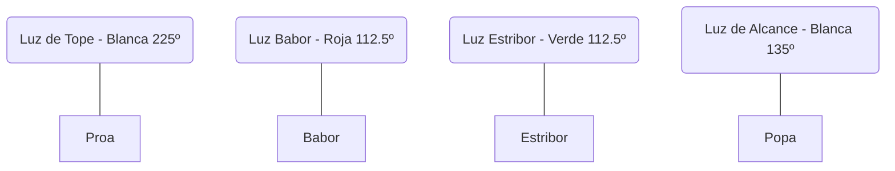

# Tema 6: Reglamento Internacional para Prevenir Abordajes (RIPA) - Nivel Enciclopédico

El RIPA es el marco normativo internacional inamovible dictado por la OMI (Organización Marítima Internacional). En los exámenes náuticos, es la parte más crítica y **tiene carácter eliminatorio**. En el PER, de las 10 preguntas de RIPA (luces, marcas, pitadas y reglas de paso), un máximo de 5 fallos supone el suspenso automático e irrevocable del examen completo, independientemente de tu nota en el resto.

Este documento profundiza en la interpretación jurídica y práctica de las reglas.

---

## Parte A: Generalidades (Reglas 1 a 3)

*   **Regla 1 (Ámbito de aplicación):** Se aplica a todos los buques en alta mar y en todas las aguas navegables por los buques de navegación marítima. Nada de lo expuesto eximirá del cumplimiento de reglas locales especiales dictadas por capitanías de puertos o vías navegables interiores.
*   **Regla 2 (Responsabilidad / "Buen sentido marinero"):** Esta regla es la base jurídica en los juicios por colisión. "Ninguna disposición del reglamento eximirá a un buque, a su propietario, al Capitán o a la dotación de las consecuencias de cualquier negligencia". Incluso si tienes preferencia absoluta de paso, si el otro barco se te echa encima y tú no haces nada para evitarlo pudiendo hacerlo, serás declarado culpable subsidiario.
*   **Regla 3 (Definiciones Legales Excluyentes):**
    *   **Buque de propulsión mecánica:** Cualquier buque movido por una máquina. (Un velero con las velas izadas pero con el motor encendido es, a efectos jurídicos del RIPA, un buque de propulsión mecánica y pierde todos sus privilegios de velero).
    *   **Buque de vela:** Todo buque navegando a vela *siempre que su maquinaria propulsora no se esté utilizando*.
    *   **Buque en navegación:** Un buque que no está fondeado (con ancla), ni amarrado a tierra, ni varado. ¡Cuidado! Un barco que está flotando a la deriva en medio del mar con el motor apagado *SÍ* está "en navegación".
    *   **Buque sin gobierno:** Un buque que por una circunstancia excepcional (avería del timón, fallo total del motor) es incapaz de maniobrar según el RIPA y, por tanto, no puede apartarse de la derrota de otro.
    *   **Buque con capacidad de maniobra restringida:** Buque que por la *naturaleza de su trabajo* (dragado, tendido de cables submarinos, portaaviones lanzando aviones, remolcador en operaciones difíciles) no puede maniobrar libremente.

---

## Parte B: Reglas de Rumbo y Gobierno

### Sección I: En cualquier condición de visibilidad (Reglas 4 a 10)

*   **Regla 5 (Vigilancia):** Obliga a mantener en todo momento una eficaz vigilancia visual, auditiva y radar (si se dispone de él). El piloto automático no exime de hacer guardia humana en cubierta.
*   **Regla 7 (Riesgo de abordaje):** Se considerará que existe riesgo si la demora (el ángulo del compás) de un buque que se aproxima **no varía apreciablemente**. Si tú ves un barco por el través de babor, pasa el tiempo y cada vez está más grande pero sigue exactamente por el través de babor (demora constante y distancia disminuyendo), **hay colisión geométrica inminente**.
*   **Regla 8 (Maniobras):** Toda maniobra será clara, decidida, amplia y con la debida antelación. Está prohibido hacer "micro-correcciones" de rumbo (ej. girar solo 3 grados) porque el otro barco no lo percibirá. Debes caer 30º o 40º de golpe para mostrar tus intenciones.

### Sección II: Buques a la vista unos de otros (Reglas 11 a 18)

*   **Regla 12 (Velero vs Velero):**
    1.  Si reciben el viento por bandas contrarias: Cede el paso el que recibe el viento por **babor** (el que va amurado a babor).
    2.  Si reciben el viento por la misma banda: Cede el paso el que está a **barlovento** (el que está más cerca de la dirección del viento y por tanto "roba" el viento al otro).
*   **Regla 13 (Situación de alcance):** "El que alcanza paga". Un buque alcanza a otro cuando se aproxima desde una marcación mayor de **22,5º a popa del través**. El buque que alcanza debe ceder siempre el paso. Esta regla **anula a todas las demás**. Si un minúsculo velero alcanza por detrás a un gigantesco petrolero, el velero debe apartarse de la estela del petrolero.
*   **Regla 14 (Vuelta encontrada - De frente):** Dos buques de propulsión mecánica que se acercan exactamente proa contra proa. **Ambos** deben caer (girar) a **estribor** para pasar babor con babor.
*   **Regla 15 (Cruce de motores):** Dos buques a motor que se cruzan perpendicular u oblicuamente. **Cederá el paso el que vea al otro por su lado de estribor** (igual que en los coches). El buque que cede debe intentar pasar siempre por la popa del otro.
*   **Regla 17 (La responsabilidad del privilegiado):** El barco que tiene preferencia (buque que sigue rumbo) no debe hacer nada, manteniendo rumbo y velocidad constantes. PERO si observa que el otro barco (buque que cede) no está maniobrando y el choque es inminente, está **obligado a intervenir** (normalmente cayendo a estribor y reduciendo máquina).

### La Jerarquía Absoluta (Regla 18)
Un buque de menor prioridad debe apartarse siempre de uno de mayor prioridad. Memoriza la escalera ("**S**olo **R**esponden **P**ersonas **V**erdaderamente **M**aravillosas"):
1.  **S**in gobierno (Avería total del buque).
2.  **R**estringido por su calado o de Maniobrabilidad Restringida.
3.  **P**escando (Faenando profesionalmente con redes o palangres; una caña de recreo NO da privilegio).
4.  **V**ela (Navegando a vela pura).
5.  **M**otor (Cualquier barco a motor).

---

## Parte C: Luces y Marcas (Reglas 20 a 31)

Las luces deben llevarse encendidas imperativamente del ocaso al orto del sol, y en situaciones de niebla diurna.

### Los 4 Sectores Angulares (Regla 21)

La suma de Babor, Estribor y Alcance da 360º. Nunca verás la luz de alcance y una de costado a la vez (si ocurre, el barco que miras gira).

### Configuraciones Críticas de Noche (y Marcas de Día)

*   **Buque a Motor:**
    *   Luz de tope delantera, tope trasera más alta (obligatoria solo si es $\ge 50m$), luces de costado (roja/verde) y alcance (blanca popa).
*   **Velero:**
    *   Costados y alcance. *(Se distingue del motor porque le falta la luz de tope blanca superior)*. Opcionalmente puede llevar dos luces todo horizonte en la perilla del mástil: **Roja sobre Verde** ("Red over green, sailing machine").
    *   Día: Si va a motor y a vela simultáneamente, debe izar un **Cono negro con vértice hacia abajo**.
*   **Buque Fondeado (Anclado):**
    *   Noche: Una luz blanca todo horizonte (dos si $\ge 50m$).
    *   Día: Una **Bola negra** a proa.
*   **Buque Varado (Encallado):**
    *   Noche: Luz blanca de fondeo + **Dos luces rojas** verticales.
    *   Día: **Tres bolas negras** verticales.
*   **Buque Sin Gobierno:**
    *   Noche: **Roja sobre Roja** ("Red over red, captain is dead"). Sin luces de costado ni alcance (salvo que tenga arrancada y avance por inercia).
    *   Día: **Dos bolas negras** verticales.
*   **Buque con Maniobrabilidad Restringida:**
    *   Noche: **Roja - Blanca - Roja** verticales.
    *   Día: **Bola - Diamante - Bola** negras verticales.
*   **Buque Pescando:**
    *   Noche arrastrero: **Verde sobre Blanca**.
    *   Noche palangre/redes: **Roja sobre Blanca** ("Red over white, fishing at night").
    *   Día: Dos conos unidos por los vértices (Reloj de arena).
*   **Buque Práctico (Pilot):**
    *   Noche: **Blanca sobre Roja** ("White over red, pilot ahead").
    *   Día: Bandera H (mitad blanca, mitad roja vertical).

---

## Parte D: Señales Acústicas y de Peligro (Reglas 32 a 37)

Un buque debe llevar pito y campana si mide más de 12m. (El gong a partir de 100m).
*   **Corto:** $~1s$. **Largo:** $4s - 6s$.

### Señales de Maniobra (Visibilidad Buena)
Se hacen al maniobrar cerca de otro buque a motor.
*   **1 corta:** Caigo a Estribor.
*   **2 cortas:** Caigo a Babor.
*   **3 cortas:** Doy marcha atrás.
*   **5 o más cortas (Señal de Alarma):** ¡Atención, no le entiendo o considero que su maniobra es peligrosa!

### Señales en Niebla Ciega
No ves los barcos, solo los oyes. Son avisos de posición, no de intención de giro.
*   **Motor avanzando:** 1 larga cada 2 min.
*   **Motor parado en medio del mar:** 2 largas cada 2 min.
*   **Buques privilegiados (Sin gobierno, restringidos, vela, pesca, remolcando):** 1 larga + 2 cortas cada 2 min.
*   **Remolcado (el barco pasivo de atrás):** 1 larga + 3 cortas cada 2 min (inmediatamente después del remolcador).
*   **Fondeado:** Repique rápido de campana de 5s, cada minuto. (Si mide $>100m$, toca campana en proa 5s y luego gong en popa 5s).

### Señales Oficiales de Socorro (Anexo IV)
Uso exclusivo para situaciones de emergencia inminente (Hundimiento, fuego, abordaje grave):
* Llamas de fuego sobre el buque.
* Disparo de cañón o bengalas rojas/cohetes de estrellas rojas.
* Humo naranja y bandera cuadrada sobre una bola.
* Pitido/timbre continuo de cualquier aparato de niebla.
* La frase "MAYDAY" por VHF o el SOS Morse (... --- ...).
* Levantar y bajar repetidamente los brazos extendidos en cruz.
