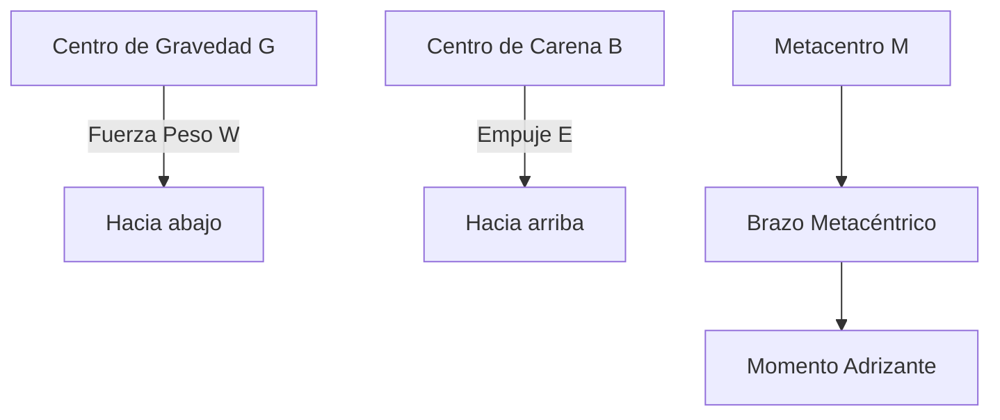

# Tema 1: Nomenclatura Náutica Avanzada

El estudio de la nomenclatura náutica para el Patrón de Navegación Básica (PNB) requiere una comprensión profunda de la geometría de masas y la hidrostática del casco. Aunque limitadas a esloras de $8\text{ metros}$, las embarcaciones de recreo obedecen a las mismas ecuaciones fundamentales de la arquitectura naval.

## Vocabulario Básico: Partes del Barco

Antes de entrar en fórmulas, el examen exige memorizar con precisión el vocabulario elemental que identifica cada zona del barco. Es la base de las 4 preguntas de este tema.

### Orientación General
*   **Proa:** Parte delantera de la embarcación, la que corta el agua al avanzar.
*   **Popa:** Parte trasera.
*   **Babor:** Lado izquierdo del barco mirando hacia proa (de noche, luz roja).
*   **Estribor:** Lado derecho mirando hacia proa (de noche, luz verde).
*   **Línea de Crujía:** Eje longitudinal imaginario que divide el barco en dos mitades simétricas (babor/estribor).

### Sectores de Orientación (para marcar la posición de otros objetos o barcos)
*   **Amura:** Zona entre la proa y el través, hacia proa.
*   **Través:** Dirección perpendicular a la crujía (a 90° del rumbo).
*   **Aleta:** Zona entre el través y la popa, hacia popa.

### Casco y Cubierta
*   **Casco:** Cuerpo estanco que proporciona flotabilidad.
*   **Obra Viva (Carena):** Parte del casco sumergida, por debajo de la línea de flotación.
*   **Obra Muerta:** Parte del casco por encima de la línea de flotación, expuesta al aire.
*   **Línea de Flotación:** Línea que separa la obra viva de la obra muerta; marca el nivel del agua en reposo.
*   **Quilla:** Pieza estructural longitudinal en la parte más baja del casco; le da rigidez y, en veleros, contrarresta el abatimiento y aporta lastre.
*   **Roda:** Prolongación de la quilla en la proa.
*   **Codaste:** Prolongación de la quilla en la popa, donde se apoyan el timón y, a menudo, la hélice.
*   **Cubierta:** Superficie que cierra el casco por arriba.
*   **Bañera (Cockpit):** Zona hundida en cubierta, a popa, desde donde se gobierna el barco.
*   **Borda:** Borde superior del costado del barco.
*   **Amurada:** Parte del costado que sobresale por encima de la cubierta.
*   **Timón:** Superficie orientable en popa que gobierna el rumbo del barco.
*   **Hélice:** Sistema de propulsión que convierte el giro del motor en empuje.

## Tipos de Casco

El examen puede preguntar por la forma o el número de cascos de una embarcación:

*   **Por el número de cascos:**
    *   **Monocasco:** Un único casco (la mayoría de veleros y lanchas).
    *   **Multicasco:** Dos o más cascos unidos por una estructura. *Catamarán* (dos cascos) y *trimarán* (tres cascos) ofrecen mayor estabilidad transversal (mayor manga efectiva) a costa de maniobrabilidad en espacios reducidos.
*   **Por la forma de las cuadernas (sección transversal):**
    *   **Casco redondeado (en V suave):** Buen comportamiento en la mar, típico de veleros y barcos de desplazamiento.
    *   **Casco en V profunda:** Corta bien el oleaje a velocidad, propio de lanchas rápidas.
    *   **Casco plano:** Muy estable en aguas tranquilas y de poco calado, típico de embarcaciones fluviales o de playa, pero incómodo con mar picada.
*   **Por el régimen de navegación:**
    *   **Casco de desplazamiento:** Navega "dentro" del agua, desplazándola; su velocidad máxima está limitada por su eslora de flotación.
    *   **Casco planeador:** A partir de cierta velocidad, se eleva y desliza sobre la superficie del agua, reduciendo la resistencia. Típico de lanchas motoras de recreo.

## Dimensiones Principales (Resumen para Examen)

| Dimensión | Definición | Importancia práctica |
| :--- | :--- | :--- |
| **Eslora ($L$)** | Longitud del barco de proa a popa. | Determina el título necesario (PNB: hasta 8 m) y la maniobrabilidad. |
| **Manga ($B$)** | Anchura máxima del barco. | Afecta a la estabilidad transversal: a mayor manga, más estable inicialmente. |
| **Puntal ($D$)** | Altura del casco medida desde la quilla hasta la cubierta principal. | Define el volumen interior y la reserva de flotabilidad. |
| **Calado ($T$)** | Profundidad de la parte sumergida del casco (de la línea de flotación hacia abajo). | Crítico para no encallar en bajos o zonas someras. |
| **Francobordo** | Altura desde la línea de flotación hasta la cubierta ($\text{Puntal} - \text{Calado}$). | A mayor francobordo, más reserva de flotabilidad y seguridad frente a olas. |

*Regla mnemotécnica:* Eslora (largo), Manga (ancho), Puntal (alto interior), Calado (profundidad sumergida). Las cuatro dimensiones básicas que cualquier patrón debe conocer de su propio barco antes de zarpar.

## Geometría del Casco y Coeficientes de Afinado

La descripción de la forma del casco se define mediante los planos de referencia y coeficientes de afinado.

- **Eslora de Flotación ($L_{WL}$):** Longitud en el plano de flotación en condiciones de desplazamiento a plena carga.
- **Manga ($B$):** Anchura máxima de la carena.
- **Calado ($T$):** Profundidad de la parte sumergida.

El desplazamiento de la embarcación $\Delta$ está gobernado por el volumen de la carena $\nabla$ y la densidad del agua $\rho$:

$$
\Delta = \rho \cdot \nabla
$$

El coeficiente de bloque ($C_B$) se define como:

$$
C_B = \frac{\nabla}{L_{WL} \cdot B \cdot T}
$$

Para embarcaciones de planeo típicas en PNB, $C_B$ suele estar en el rango de $0.35$ a $0.55$.

## Estabilidad Estática Transversal

La estabilidad inicial de la embarcación se analiza mediante la altura metacéntrica transversal ($\overline{GM}$):

$$
\overline{GM} = \overline{KB} + \overline{BM} - \overline{KG}
$$

Donde:
- $\overline{KB}$: Distancia vertical desde la quilla al centro de carena.
- $\overline{BM}$: Radio metacéntrico transversal, $\overline{BM} = \frac{I_T}{\nabla}$, siendo $I_T$ el momento de inercia transversal de la superficie de flotación.
- $\overline{KG}$: Distancia vertical desde la quilla al centro de gravedad.

### Diagrama de Vectores de Estabilidad

## Momento Adrizante

Para pequeños ángulos de escora ($\theta < 10^\circ$), el brazo adrizante ($GZ$) se aproxima a:

$$
GZ = \overline{GM} \cdot \sin(\theta)
$$

El momento adrizante ($M_A$) viene dado por:

$$
M_A = \Delta \cdot GZ = \Delta \cdot \overline{GM} \cdot \sin(\theta)
$$

## Recursos Audiovisuales (Videotutoriales de Apoyo)

*   📺 **Escuela Náutica Neptuno:** [Examen PER y PNB - NOMENCLATURA NÁUTICA - Tema 1](https://www.youtube.com/watch?v=FIjt7RyDYQg) (Excelente repaso visual de las partes del casco, estructura, equipo de fondeo, timón y dimensiones).

## Ejemplos Prácticos

### Problema 1: Cálculo del Momento Adrizante
Una embarcación de PNB tiene un desplazamiento $\Delta = 2500\text{ kg}$, una altura metacéntrica $\overline{GM} = 0.8\text{ m}$. Si el buque escora $\theta = 5^\circ$ debido al movimiento de la tripulación.
1. Calcule el volumen de carena $\nabla$ en agua de mar ($\rho = 1025\text{ kg/m}^3$).
2. Calcule el momento adrizante $M_A$.

**Solución:**
1. Cálculo de $\nabla$:
$$
\nabla = \frac{\Delta}{\rho} = \frac{2500\text{ kg}}{1025\text{ kg/m}^3} \approx 2.439\text{ m}^3
$$

2. Cálculo del momento adrizante $M_A$:
$$
M_A = \Delta \cdot g \cdot \overline{GM} \cdot \sin(5^\circ)
$$
(Notar que $\Delta$ suele expresarse como masa, por lo que multiplicamos por la gravedad $g = 9.81\text{ m/s}^2$ para obtener el momento en Newtons-metro).
$$
M_A = 2500 \cdot 9.81 \cdot 0.8 \cdot 0.08715 \approx 1709.8\text{ N}\cdot\text{m}
$$

## Referencias Bibliográficas y Jurisprudencia

- Real Decreto 875/2014, de 10 de octubre, por el que se regulan las titulaciones náuticas para el gobierno de las embarcaciones de recreo.
- Olivella Puig, J. (1994). *Teoría del buque*. UPC.
- Organización Marítima Internacional (OMI), *Código Internacional de Estabilidad sin Avería*.
