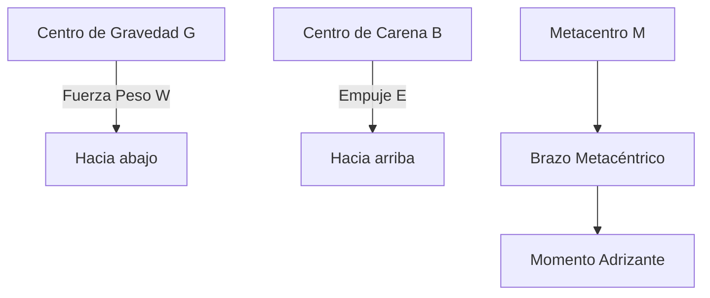

# Tema 1: Nomenclatura Náutica Avanzada

El estudio de la nomenclatura náutica para el Patrón de Navegación Básica (PNB) requiere una comprensión profunda de la geometría de masas y la hidrostática del casco. Aunque limitadas a esloras de $8\text{ metros}$, las embarcaciones de recreo obedecen a las mismas ecuaciones fundamentales de la arquitectura naval.

## Geometría del Casco y Coeficientes de Afinado

La descripción de la forma del casco se define mediante los planos de referencia y coeficientes de afinado.

- **Eslora de Flotación ($L_{WL}$):** Longitud en el plano de flotación en condiciones de desplazamiento a plena carga.
- **Manga ($B$):** Anchura máxima de la carena.
- **Calado ($T$):** Profundidad de la parte sumergida.

El desplazamiento de la embarcación $\Delta$ está gobernado por el volumen de la carena $\nabla$ y la densidad del agua $\rho$:

$$
\Delta = \rho \cdot \nabla
$$

El coeficiente de bloque ($C_B$) se define como:

$$
C_B = \frac{\nabla}{L_{WL} \cdot B \cdot T}
$$

Para embarcaciones de planeo típicas en PNB, $C_B$ suele estar en el rango de $0.35$ a $0.55$.

## Estabilidad Estática Transversal

La estabilidad inicial de la embarcación se analiza mediante la altura metacéntrica transversal ($\overline{GM}$):

$$
\overline{GM} = \overline{KB} + \overline{BM} - \overline{KG}
$$

Donde:
- $\overline{KB}$: Distancia vertical desde la quilla al centro de carena.
- $\overline{BM}$: Radio metacéntrico transversal, $\overline{BM} = \frac{I_T}{\nabla}$, siendo $I_T$ el momento de inercia transversal de la superficie de flotación.
- $\overline{KG}$: Distancia vertical desde la quilla al centro de gravedad.

### Diagrama de Vectores de Estabilidad

## Momento Adrizante

Para pequeños ángulos de escora ($\theta < 10^\circ$), el brazo adrizante ($GZ$) se aproxima a:

$$
GZ = \overline{GM} \cdot \sin(\theta)
$$

El momento adrizante ($M_A$) viene dado por:

$$
M_A = \Delta \cdot GZ = \Delta \cdot \overline{GM} \cdot \sin(\theta)
$$

## Ejemplos Prácticos

### Problema 1: Cálculo del Momento Adrizante
Una embarcación de PNB tiene un desplazamiento $\Delta = 2500\text{ kg}$, una altura metacéntrica $\overline{GM} = 0.8\text{ m}$. Si el buque escora $\theta = 5^\circ$ debido al movimiento de la tripulación.
1. Calcule el volumen de carena $\nabla$ en agua de mar ($\rho = 1025\text{ kg/m}^3$).
2. Calcule el momento adrizante $M_A$.

**Solución:**
1. Cálculo de $\nabla$:
$$
\nabla = \frac{\Delta}{\rho} = \frac{2500\text{ kg}}{1025\text{ kg/m}^3} \approx 2.439\text{ m}^3
$$

2. Cálculo del momento adrizante $M_A$:
$$
M_A = \Delta \cdot g \cdot \overline{GM} \cdot \sin(5^\circ)
$$
(Notar que $\Delta$ suele expresarse como masa, por lo que multiplicamos por la gravedad $g = 9.81\text{ m/s}^2$ para obtener el momento en Newtons-metro).
$$
M_A = 2500 \cdot 9.81 \cdot 0.8 \cdot 0.08715 \approx 1709.8\text{ N}\cdot\text{m}
$$

## Referencias Bibliográficas y Jurisprudencia

- Real Decreto 875/2014, de 10 de octubre, por el que se regulan las titulaciones náuticas para el gobierno de las embarcaciones de recreo.
- Olivella Puig, J. (1994). *Teoría del buque*. UPC.
- Organización Marítima Internacional (OMI), *Código Internacional de Estabilidad sin Avería*.
