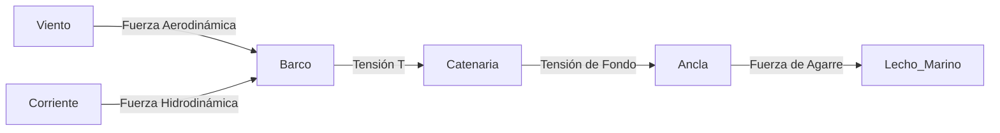

# Tema 2: Dinámica de Amarre y Fondeo

La maniobra de fondeo y amarre implica un equilibrio dinámico de fuerzas aerodinámicas e hidrodinámicas actuando sobre la embarcación, contrarrestadas por la tensión y el rozamiento del tren de fondeo o las amarras.

## Nudos Básicos Exigidos en el Temario PNB

El examen no pregunta por la dinámica de la catenaria, pero sí exige reconocer y saber para qué sirve cada nudo básico. Aquí tienes el resumen mínimo de examen; para el paso a paso de cada nudo con imágenes, consulta el catálogo completo en **[nudos/INDEX.md](../../nudos/INDEX.md)**.

| Nudo | Categoría | Uso principal |
| :--- | :--- | :--- |
| **As de Guía** | Amarre | Crea una gaza (lazo) fija que no corre ni aprieta bajo carga. El "rey de los nudos": amarrar a un noray, rescate, remolque. Ver [AMARRE.md](../../nudos/AMARRE.md). |
| **Ballestrinque** | Amarre | Hacer firme rápidamente un cabo a una pieza cilíndrica (defensa a un candelero, poste). Fácil de hacer pero puede correr si la tracción no es perpendicular. Ver [AMARRE.md](../../nudos/AMARRE.md). |
| **Vuelta de Cornamusa (Vuelta de Rezón)** | Amarre | Nudo específico para hacer firme un cabo a una cornamusa en cubierta o en el muelle, en "ochos" cruzados. Ver [AMARRE.md](../../nudos/AMARRE.md). |
| **Nudo Llano** | Unión | Une dos cabos del mismo grosor. **No fiable** para cargas fuertes, aporta poca seguridad si los cabos son de diámetro distinto. Ver [UNION.md](../../nudos/UNION.md). |
| **Nudo de Escota** | Unión | Une dos cabos de **distinto grosor**, más seguro que el llano para esa función. Ver [UNION.md](../../nudos/UNION.md). |
| **Nudo en Ocho** | Tope | Se hace en el extremo de un cabo (escota, driza) para impedir que se escape por una polea o un pasacabos. Ver [TOPE.md](../../nudos/TOPE.md). |

*Consejo de examen:* las preguntas de nudos en el PNB suelen mostrar un dibujo y pedir identificar el nudo o su función (amarrar, unir o evitar que un cabo se escape), no ejecutarlo. Fíjate en si el nudo forma una gaza fija (As de Guía), une dos chicotes (Llano/Escota) o es un tope grueso en el extremo (Ocho).

## Maniobra Básica de Fondeo

La técnica y las reglas prácticas de filado (3-5 veces la profundidad, círculo de borneo, tipos de ancla, respeto a la Posidonia) están desarrolladas con detalle en **[MANIOBRAS_Y_FONDEO.md](../../manuales/MANIOBRAS_Y_FONDEO.md)**. Para el examen PNB basta con conocer la secuencia básica de la maniobra:

1.  **Elegir el fondeadero:** Comprobar en la carta o app que el fondo es de arena (nunca sobre Posidonia u otras praderas protegidas) y que hay espacio suficiente para el círculo de borneo sin riesgo de chocar con la costa u otros barcos.
2.  **Aproximación:** Situar el barco proa al viento (o a la corriente, la que sea dominante) y detener la arrancada justo en el punto elegido.
3.  **Largar el ancla:** Filar el ancla y la cadena **despacio y controlada** (nunca dejarla caer de golpe amontonada, pues se enreda y no agarra); a la vez, el barco cae ligeramente hacia atrás por el viento/corriente.
4.  **Filar la longitud adecuada:** Dejar salir cadena hasta la longitud recomendada (mínimo 3-4 veces la profundidad en calma, hasta 5-7 veces con viento fuerte o de noche).
5.  **Sentar el ancla:** Dar una suave marcha atrás con el motor para tensar la cadena y que las uñas del ancla se claven en el fondo.
6.  **Comprobar que no garrea:** Tomar una o dos referencias fijas en tierra (una marca en el horizonte alineada con otra más cercana, o la demora a un objeto fijo) y vigilar unos minutos que el barco no se desplaza respecto a ellas.

## Dinámica del Fondeo y la Catenaria

Cuando una embarcación está fondeada, la cadena forma una curva conocida como catenaria. La ecuación paramétrica de la catenaria está dada por:

$$
y = a \cdot \cosh\left(\frac{x}{a}\right)
$$

Donde $a = \frac{T_0}{w}$, siendo $T_0$ la componente horizontal de la tensión y $w$ el peso lineal de la cadena en el agua.

### Fuerzas Actuantes

La fuerza total de arrastre ($F_D$) sobre el barco se compone del arrastre por viento ($R_{air}$) y corriente ($R_{water}$):

$$
F_D = \frac{1}{2} \rho_{air} V_{air}^2 C_{D,air} A_{air} + \frac{1}{2} \rho_{water} V_{water}^2 C_{D,water} A_{water}
$$

Donde:
- $\rho$ es la densidad del fluido.
- $V$ es la velocidad relativa del fluido.
- $C_D$ es el coeficiente de resistencia aerodinámica o hidrodinámica.
- $A$ es el área proyectada frontal.

### Diagrama de Fuerzas de Fondeo

## Amortiguamiento y Longitud de Fondeo

Para garantizar que la tracción sobre el ancla sea puramente horizontal, la longitud mínima de cadena $L_c$ necesaria se calcula como:

$$
L_c = \sqrt{h^2 + 2h \cdot \frac{T_0}{w}}
$$

Donde $h$ es la profundidad total (calado + marea + altura de la roldana). La recomendación práctica del PNB de fondear "entre 3 y 5 veces la profundidad" se deriva de aproximar el límite elástico del sistema frente a $F_D$ máxima esperada.

## Ejemplos Prácticos

### Problema 1: Tensión de Fondeo y Longitud de Cadena
Una embarcación de $7.5\text{ m}$ de eslora está fondeada en $10\text{ m}$ de agua (incluyendo marea y altura de proa). La cadena pesa $w = 25\text{ N/m}$ sumergida. Un viento sostenido genera una fuerza horizontal $F_D = T_0 = 1200\text{ N}$.
1. Calcule la longitud de cadena $L_c$ necesaria para asegurar tracción horizontal en el ancla.

**Solución:**
Utilizamos la ecuación de la catenaria para tracción horizontal:

$$
L_c = \sqrt{h^2 + 2h \cdot \frac{T_0}{w}}
$$

Sustituyendo valores:

$$
L_c = \sqrt{10^2 + 2(10) \cdot \frac{1200}{25}}
$$

$$
L_c = \sqrt{100 + 20 \cdot 48} = \sqrt{100 + 960} = \sqrt{1060} \approx 32.55\text{ m}
$$

La longitud mínima teórica es de $32.55\text{ m}$. Esto justifica la regla de fondear al menos $3\text{-}4$ veces la profundidad ($30\text{-}40\text{ m}$).

## Referencias Bibliográficas y Jurisprudencia

- Reglamento Internacional para Prevenir Abordajes (RIPA), Parte B (Sección referida a fondeo).
- Thomson, W. T. (1993). *Theory of Vibration with Applications*.
- Normativa ISO 15084:2003 *Small craft — Anchoring, mooring and towing — Strong points*.
