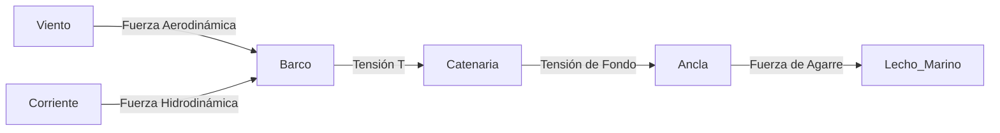

# Tema 2: Dinámica de Amarre y Fondeo

La maniobra de fondeo y amarre implica un equilibrio dinámico de fuerzas aerodinámicas e hidrodinámicas actuando sobre la embarcación, contrarrestadas por la tensión y el rozamiento del tren de fondeo o las amarras.

## Dinámica del Fondeo y la Catenaria

Cuando una embarcación está fondeada, la cadena forma una curva conocida como catenaria. La ecuación paramétrica de la catenaria está dada por:

$$
y = a \cdot \cosh\left(\frac{x}{a}\right)
$$

Donde $a = \frac{T_0}{w}$, siendo $T_0$ la componente horizontal de la tensión y $w$ el peso lineal de la cadena en el agua.

### Fuerzas Actuantes

La fuerza total de arrastre ($F_D$) sobre el barco se compone del arrastre por viento ($R_{air}$) y corriente ($R_{water}$):

$$
F_D = \frac{1}{2} \rho_{air} V_{air}^2 C_{D,air} A_{air} + \frac{1}{2} \rho_{water} V_{water}^2 C_{D,water} A_{water}
$$

Donde:
- $\rho$ es la densidad del fluido.
- $V$ es la velocidad relativa del fluido.
- $C_D$ es el coeficiente de resistencia aerodinámica o hidrodinámica.
- $A$ es el área proyectada frontal.

### Diagrama de Fuerzas de Fondeo

## Amortiguamiento y Longitud de Fondeo

Para garantizar que la tracción sobre el ancla sea puramente horizontal, la longitud mínima de cadena $L_c$ necesaria se calcula como:

$$
L_c = \sqrt{h^2 + 2h \cdot \frac{T_0}{w}}
$$

Donde $h$ es la profundidad total (calado + marea + altura de la roldana). La recomendación práctica del PNB de fondear "entre 3 y 5 veces la profundidad" se deriva de aproximar el límite elástico del sistema frente a $F_D$ máxima esperada.

## Ejemplos Prácticos

### Problema 1: Tensión de Fondeo y Longitud de Cadena
Una embarcación de $7.5\text{ m}$ de eslora está fondeada en $10\text{ m}$ de agua (incluyendo marea y altura de proa). La cadena pesa $w = 25\text{ N/m}$ sumergida. Un viento sostenido genera una fuerza horizontal $F_D = T_0 = 1200\text{ N}$.
1. Calcule la longitud de cadena $L_c$ necesaria para asegurar tracción horizontal en el ancla.

**Solución:**
Utilizamos la ecuación de la catenaria para tracción horizontal:
$$
L_c = \sqrt{h^2 + 2h \cdot \frac{T_0}{w}}
$$
Sustituyendo valores:
$$
L_c = \sqrt{10^2 + 2(10) \cdot \frac{1200}{25}}
$$
$$
L_c = \sqrt{100 + 20 \cdot 48} = \sqrt{100 + 960} = \sqrt{1060} \approx 32.55\text{ m}
$$
La longitud mínima teórica es de $32.55\text{ m}$. Esto justifica la regla de fondear al menos $3\text{-}4$ veces la profundidad ($30\text{-}40\text{ m}$).

## Referencias Bibliográficas y Jurisprudencia

- Reglamento Internacional para Prevenir Abordajes (RIPA), Parte B (Sección referida a fondeo).
- Thomson, W. T. (1993). *Theory of Vibration with Applications*.
- Normativa ISO 15084:2003 *Small craft — Anchoring, mooring and towing — Strong points*.
