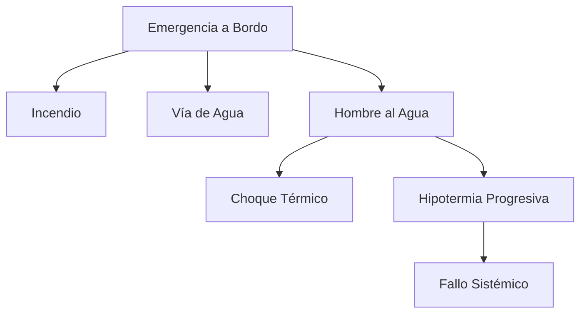

# Tema 3: Seguridad en la Mar y Termodinámica

La seguridad en la mar para el PNB exige la comprensión de los límites operativos del buque, las respuestas fisiológicas del ser humano y la gestión estocástica del riesgo meteorológico.

## Equipo de Salvamento Obligatorio (Zona de Navegación del PNB)

El PNB navega, como máximo, hasta **5 millas de la costa**, lo que en el régimen de despachos de las capitanías marítimas corresponde a la **Zona de Navegación 5** (o zonas más restrictivas, 6 y 7, si el barco está despachado así). El detalle completo de zonas, normativa y equipo por categoría está en **[SEGURIDAD.md](../../SEGURIDAD.md)**; para el examen basta con retener este resumen:

| Equipo | Exigencia en Zona 5 (hasta 5 millas) |
| :--- | :--- |
| **Chalecos salvavidas** | Uno por persona a bordo, homologados **100 N** como mínimo (ISO 12402), con silbato y luz. |
| **Aro salvavidas** | Con rabiza (cabo flotante) y luz de accionamiento automático por volteo. |
| **Balsa salvavidas** | **No exigida** en Zona 5 (solo obligatoria en Zonas 1, 2 y 3, navegación de más de 12 millas). |
| **Señales pirotécnicas** | Bengalas de mano y, según categoría del barco, algún cohete/fumígeno; deben estar en vigor (caducan a los 4 años). |
| **Extintor** | Al menos uno, adecuado a la eslora y a la instalación del motor. |
| **Otros** | Bocina de niebla, espejo de señales, compás magnético y cartas náuticas de la zona. |

*Idea clave de examen:* a menor Zona de Navegación (más cerca de costa), menor exigencia de equipo pesado (no hay balsa salvavidas en Zona 5), pero el chaleco salvavidas por persona y el aro con rabiza son **siempre** obligatorios, en cualquier zona.

## Hombre al Agua (MOB): Maniobra Básica

La secuencia inmediata y las técnicas completas de recuperación (Quick-Stop, Lifesling, izado a bordo) están desarrolladas paso a paso en **[PROTOCOLO_HOMBRE_AL_AGUA.md](../../PROTOCOLO_HOMBRE_AL_AGUA.md)**. Para el examen PNB, memoriza el orden de la reacción inmediata ante una caída al agua:

1.  **Gritar "¡Hombre al agua!"** para alertar a toda la tripulación.
2.  **Lanzar el aro salvavidas** hacia el náufrago de inmediato.
3.  **Designar un vigía** que señale con el brazo extendido y no pierda de vista al náufrago en ningún momento.
4.  **Marcar la posición** (botón MOB del GPS/plotter si el barco lo lleva).
5.  **Maniobrar para volver** hacia el náufrago y recuperarlo, aproximándose siempre con el motor en punto muerto o parado en el instante final para evitar que la hélice le alcance.

## Remolque

Remolcar a otra embarcación (o ser remolcado) es una maniobra habitual de auxilio entre barcos de recreo. Puntos clave para el examen:

*   **El cabo de remolque** debe hacerse firme en un punto resistente de proa (bita o cornamusa reforzada), nunca en un candelero o pasamanos, que no está diseñado para soportar esa carga.
*   **Longitud del remolque:** cuanto más largo el cabo, más suave (menos tirones) es el remolque, ya que la elasticidad del cabo y su propio peso amortiguan los tirones bruscos entre olas.
*   **Velocidad:** siempre lenta y progresiva, evitando aceleraciones y frenazos bruscos que puedan romper el cabo o dar un tirón violento (efecto "latigazo") al barco remolcado.
*   **Gobierno del barco remolcado:** debe llevar a alguien al timón (si es posible) para mantener el rumbo detrás del remolcador y evitar que el remolque se cruce o "culebree".
*   **Marcas y luces:** un buque remolcando muestra de noche una luz amarilla sobre la blanca de alcance (popa) y, si el remolque mide más de 200 metros, una marca de diamante de día (ver Tema 6, RIPA).

## Termodinámica de la Hipotermia

Cuando un tripulante cae al mar, experimenta pérdida de calor predominantemente por convección. La tasa de transferencia de calor $q$ (en Vatios) se modeliza según la Ley de Enfriamiento de Newton:

$$
q = h_c \cdot A \cdot (T_{cuerpo} - T_{agua})
$$

Donde:
- $h_c$: Coeficiente de transferencia de calor por convección ($> 1000\text{ W/m}^2\text{K}$ para agua en movimiento).
- $A$: Superficie corporal expuesta.
- $T_{cuerpo}$: Temperatura central.
- $T_{agua}$: Temperatura del agua.

La pérdida de energía interna $U$ a lo largo del tiempo lleva a un descenso de la temperatura corporal:

$$
\frac{dU}{dt} = -q = m \cdot c_p \cdot \frac{dT_{cuerpo}}{dt}
$$

Donde $m$ es la masa y $c_p$ el calor específico del cuerpo humano.

### Diagrama de Árbol de Fallos de Seguridad

## Estabilidad Dinámica y Riesgo de Vuelco

La energía requerida para escorar el buque un ángulo $\phi$ viene dada por el área bajo la curva del brazo adrizante (Estabilidad Dinámica, $E_D$):

$$
E_D = \Delta \int_{0}^{\phi} GZ(\theta) d\theta
$$

En condiciones de mar formada, el momento escorante provocado por una ola rompiente puede superar la estabilidad dinámica, resultando en zozobra, un riesgo crítico en esloras $\le 8\text{ m}$.

## Ejemplos Prácticos

### Problema 1: Cálculo de Tiempo de Descenso Térmico
Un tripulante de $80\text{ kg}$ cae al mar ($T_{agua} = 10^\circ\text{C}$). Asuma un coeficiente convectivo efectivo global tal que la tasa de pérdida de calor es constante a $q = 800\text{ W}$ (despreciando termorregulación). El calor específico del cuerpo es $c_p = 3470\text{ J/(kg}\cdot\text{K)}$.
1. Calcule la tasa de caída de temperatura corporal en $\text{K/min}$.
2. ¿En cuánto tiempo su temperatura central descenderá de $37^\circ\text{C}$ a $32^\circ\text{C}$ (hipotermia severa)?

**Solución:**
1. Ecuación diferencial:

$$
\frac{dT}{dt} = \frac{-q}{m \cdot c_p}
$$

Sustituyendo valores:

$$
\frac{dT}{dt} = \frac{-800}{80 \cdot 3470} = -0.00288\text{ K/s}
$$

En minutos:

$$
\frac{dT}{dt} = -0.00288 \cdot 60 = -0.173\text{ K/min}
$$

2. Tiempo necesario para descender $\Delta T = 5\text{ K}$:

$$
t = \frac{\Delta T}{|\frac{dT}{dt}|} = \frac{5}{0.173} \approx 28.9\text{ minutos}
$$

Esto subraya la urgencia extrema en la maniobra de recogida de hombre al agua.

## Referencias Bibliográficas y Jurisprudencia

- Convenio Internacional para la Seguridad de la Vida Humana en el Mar (SOLAS), 1974.
- Orden FOM/1144/2003, equipos de seguridad, salvamento, contra incendios y prevención de vertidos.
- Golden, F., & Tipton, M. (2002). *Essentials of Sea Survival*. Human Kinetics.
