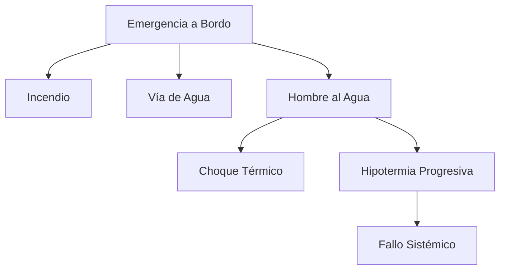

# Tema 3: Seguridad en la Mar y Termodinámica

La seguridad en la mar para el PNB exige la comprensión de los límites operativos del buque, las respuestas fisiológicas del ser humano y la gestión estocástica del riesgo meteorológico.

## Termodinámica de la Hipotermia

Cuando un tripulante cae al mar, experimenta pérdida de calor predominantemente por convección. La tasa de transferencia de calor $q$ (en Vatios) se modeliza según la Ley de Enfriamiento de Newton:

$$
q = h_c \cdot A \cdot (T_{cuerpo} - T_{agua})
$$

Donde:
- $h_c$: Coeficiente de transferencia de calor por convección ($> 1000\text{ W/m}^2\text{K}$ para agua en movimiento).
- $A$: Superficie corporal expuesta.
- $T_{cuerpo}$: Temperatura central.
- $T_{agua}$: Temperatura del agua.

La pérdida de energía interna $U$ a lo largo del tiempo lleva a un descenso de la temperatura corporal:

$$
\frac{dU}{dt} = -q = m \cdot c_p \cdot \frac{dT_{cuerpo}}{dt}
$$
Donde $m$ es la masa y $c_p$ el calor específico del cuerpo humano.

### Diagrama de Árbol de Fallos de Seguridad

## Estabilidad Dinámica y Riesgo de Vuelco

La energía requerida para escorar el buque un ángulo $\phi$ viene dada por el área bajo la curva del brazo adrizante (Estabilidad Dinámica, $E_D$):

$$
E_D = \Delta \int_{0}^{\phi} GZ(\theta) d\theta
$$

En condiciones de mar formada, el momento escorante provocado por una ola rompiente puede superar la estabilidad dinámica, resultando en zozobra, un riesgo crítico en esloras $\le 8\text{ m}$.

## Ejemplos Prácticos

### Problema 1: Cálculo de Tiempo de Descenso Térmico
Un tripulante de $80\text{ kg}$ cae al mar ($T_{agua} = 10^\circ\text{C}$). Asuma un coeficiente convectivo efectivo global tal que la tasa de pérdida de calor es constante a $q = 800\text{ W}$ (despreciando termorregulación). El calor específico del cuerpo es $c_p = 3470\text{ J/(kg}\cdot\text{K)}$.
1. Calcule la tasa de caída de temperatura corporal en $\text{K/min}$.
2. ¿En cuánto tiempo su temperatura central descenderá de $37^\circ\text{C}$ a $32^\circ\text{C}$ (hipotermia severa)?

**Solución:**
1. Ecuación diferencial:
$$
\frac{dT}{dt} = \frac{-q}{m \cdot c_p}
$$
Sustituyendo valores:
$$
\frac{dT}{dt} = \frac{-800}{80 \cdot 3470} = -0.00288\text{ K/s}
$$
En minutos:
$$
\frac{dT}{dt} = -0.00288 \cdot 60 = -0.173\text{ K/min}
$$

2. Tiempo necesario para descender $\Delta T = 5\text{ K}$:
$$
t = \frac{\Delta T}{|\frac{dT}{dt}|} = \frac{5}{0.173} \approx 28.9\text{ minutos}
$$
Esto subraya la urgencia extrema en la maniobra de recogida de hombre al agua.

## Referencias Bibliográficas y Jurisprudencia

- Convenio Internacional para la Seguridad de la Vida Humana en el Mar (SOLAS), 1974.
- Orden FOM/1144/2003, equipos de seguridad, salvamento, contra incendios y prevención de vertidos.
- Golden, F., & Tipton, M. (2002). *Essentials of Sea Survival*. Human Kinetics.
