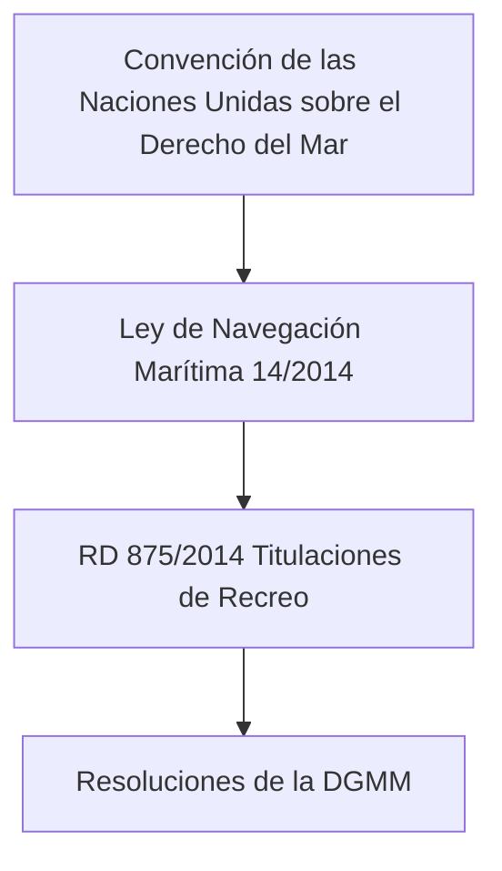

# Tema 4: Legislación Marítima y Análisis Jurídico

El marco legal que rige las atribuciones del Patrón de Navegación Básica se inscribe en el ámbito del Derecho Administrativo Sancionador y del Derecho Marítimo Internacional. El análisis de estas normas se aborda desde la lógica de la teoría de conjuntos y la teoría de decisiones.

## Zonas de Baño

Es materia frecuente de examen porque afecta directamente a la navegación de recreo cerca de la costa, el hábitat natural del PNB.

*   **Balizamiento de las zonas de baño:** Se delimitan con boyas amarillas esféricas (a veces con una banda roja) formando un perímetro cerrado frente a playas y calas.
*   **Distancia de exclusión general:** Como norma general, la navegación a motor está **prohibida dentro de las zonas de baño balizadas**, y se establece una franja de seguridad adicional (habitualmente hasta 200 metros desde la orilla en playas no balizadas, o el límite que marquen las boyas amarillas donde exista balizamiento) en la que solo pueden navegar embarcaciones de vela ligera, remo o similares a velocidad muy reducida.
*   **Corredores de acceso:** Para entrar o salir de la playa, los barcos deben usar los "corredores" perpendiculares a la costa, señalizados y libres de bañistas, navegando a la mínima velocidad de gobierno.
*   **Velocidad:** Fuera de la zona de baño pero cerca de la costa, se debe mantener una velocidad prudente y moderada, evitando la estela hacia embarcaciones menores, bañistas o la orilla.
*   **Responsabilidad del patrón:** Invadir una zona de baño balizada, aunque sea brevemente, es una infracción administrativa grave con independencia de que se produzca o no un accidente.

## Protección del Medio Marino (Nociones Básicas)

El patrón de recreo tiene obligaciones legales de protección ambiental que se examinan a nivel básico en el PNB. El desarrollo completo de normativa autonómica, sanciones y buenas prácticas está en **[MEDIOAMBIENTE.md](../../manuales/MEDIOAMBIENTE.md)**; para el examen retén estas ideas:

*   **Posidonia Oceánica:** Planta protegida que forma praderas submarinas en el Mediterráneo. **Prohibido fondear sobre ella**; hay que fondear siempre sobre fondos de arena (se distinguen por su color turquesa claro, frente al verde oscuro de la pradera).
*   **MARPOL - Vertidos prohibidos:** Prohibición absoluta de arrojar **plásticos y basura** al mar en cualquier punto. Los hidrocarburos (aceite, sentina contaminada) no pueden verterse nunca; deben retenerse a bordo y entregarse en los puntos limpios portuarios.
*   **Distancia a cetáceos y fauna protegida:** Mantener una distancia mínima de aproximación (60 metros para cetáceos) y nunca perseguir, rodear o interponerse en la trayectoria de delfines, ballenas o tortugas marinas.
*   **Zonas Marinas Protegidas (ZMP):** En parques nacionales o reservas marinas (p. ej. Cabrera, Tabarca, Illes Medes) el fondeo libre suele estar prohibido y se exige el uso de boyas ecológicas o autorización previa.

## Dominio de Aplicación Normativa

Definamos el conjunto de embarcaciones $E$ y el conjunto de atribuciones $A$. Para la titulación PNB, el dominio de atribuciones se define como:

$$
A_{PNB} = \{ x \in E \mid L(x) \le 8\text{ m} \land \text{Dist}(x) \le 5\text{ millas} \}
$$

Donde $L(x)$ es la eslora de la embarcación y $\text{Dist}(x)$ la distancia a un puerto, marina o lugar de abrigo. 
Cualquier evento de navegación $N$ que verifique $N \notin A_{PNB}$ incurre en una infracción grave según el régimen sancionador de la Ley de Puertos del Estado y de la Marina Mercante.

### Jerarquía Normativa

## Prevención de Contaminación (MARPOL)

La ecuación de la dilución de efluentes en el medio marino para la zona de descargas permitidas se puede modelizar estocásticamente, pero el anexo V de MARPOL establece un régimen absoluto de "cero vertidos" de plásticos:

$$
\forall t, V_{plastico}(t) = 0
$$

La probabilidad $P$ de una sanción por contaminación accidental frente a negligencia se evalúa mediante la carga de la prueba, donde el patrón asume responsabilidad objetiva por el buque.

## Ejemplos Prácticos

### Problema 1: Inferencia Lógica de Sanciones
Un patrón de PNB es avistado navegando en un buque a motor a una distancia rectilínea $D_p = \sqrt{x^2 + y^2}$ desde un refugio. Las coordenadas de la embarcación respecto al refugio son $(x=4\text{ millas}, y=3.5\text{ millas})$.
1. Determine matemáticamente si existe infracción de las atribuciones del PNB.

**Solución:**
1. Cálculo de la distancia euclídea al lugar de abrigo:

$$
D_p = \sqrt{4^2 + 3.5^2} = \sqrt{16 + 12.25} = \sqrt{28.25} \approx 5.315\text{ millas}
$$

2. Verificación de la condición de atribución:
Condición: $D_p \le 5\text{ millas}$.
Evaluación: $5.315 \le 5$ es FALSO.
Conclusión: $\exists$ Infracción administrativa por superar la distancia de 5 millas de un abrigo, violando las atribuciones conferidas por el RD 875/2014.

## Referencias Bibliográficas y Jurisprudencia

- Ley 14/2014, de 24 de julio, de Navegación Marítima.
- Real Decreto 875/2014, de 10 de octubre, de titulaciones náuticas para embarcaciones de recreo.
- Convenio Internacional para prevenir la contaminación por los buques (MARPOL 73/78).
- Texto Refundido de la Ley de Puertos del Estado y de la Marina Mercante (TRLPEMM, RDL 2/2011).
