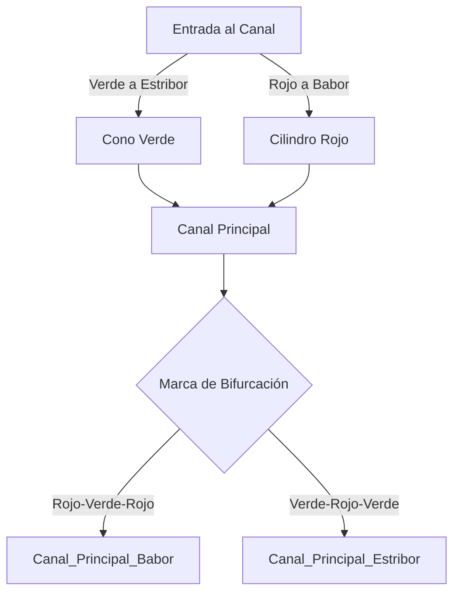

# Tema 5: Sistema de Balizamiento IALA (A)

El Sistema de Balizamiento Marítimo de la Asociación Internacional de Autoridades de Señalización Marítima (IALA), región A, define la topología de la navegación en canales y aguas restringidas, estableciendo grafos de trayectorias seguras mediante señales visuales y lumínicas.

> **Importante:** El Balizamiento es materia **eliminatoria** en el examen PNB (máximo **2 fallos** permitidos de 5 preguntas). Esta sección resume, de forma autocontenida, todo lo necesario para repasar sin saltar a otro documento. Para el detalle exhaustivo y ejemplos adicionales, consulta **[RIPA_Y_BALIZAMIENTO.md](../../RIPA_Y_BALIZAMIENTO.md)**.

## Resumen Autocontenido: Las 5 Familias de Marcas IALA (Región A)

España está en la **Región A** (rojo a babor entrando de mar a puerto). En América es la Región B, con los colores laterales invertidos: en el examen español, asume siempre Región A salvo que se indique lo contrario.

### 1. Marcas Laterales (delimitan el canal navegable)
Indican los límites de un canal en el sentido convencional de entrada del mar hacia puerto (aguas arriba, o de retorno).

| | Babor | Estribor |
| :--- | :--- | :--- |
| **Color** | Rojo | Verde |
| **Forma / Tope** | Cilíndrica o castillete; tope cilíndrico rojo | Cónica o castillete; tope cónico verde |
| **Luz** | Roja, destellos regulares | Verde, destellos regulares |
| **Numeración** | Par | Impar |

*Regla de oro:* entrando de mar a puerto, deja el rojo a tu izquierda (babor) y el verde a tu derecha (estribor). Saliendo de puerto a mar, es al revés.

### 2. Marcas Cardinales (señalan dónde está el peligro respecto a la boya)
Color amarillo y negro; el tope (dos conos negros) indica el cuadrante seguro. La luz es siempre **blanca**.

| Cuadrante | Colores (de arriba a abajo) | Tope (dos conos) | Ritmo de luz | Truco mnemotécnico |
| :--- | :--- | :--- | :--- | :--- |
| **Norte** | Negro / Amarillo | Ambos hacia arriba | Destellos rápidos continuos | Las 12 en punto (continuo) |
| **Sur** | Amarillo / Negro | Ambos hacia abajo | 6 destellos + 1 destello largo | Las 6 |
| **Este** | Negro / Amarillo / Negro | Base con base (forma de huevo) | 3 destellos rápidos | Las 3 |
| **Oeste** | Amarillo / Negro / Amarillo | Vértice con vértice (copa de vino) | 9 destellos rápidos | Las 9 |

*Cómo pasarla:* hay que navegar por el lado indicado por el nombre de la marca (una cardinal Norte se pasa por su Norte, dejando el peligro al Sur de la boya, y así sucesivamente).

### 3. Marca de Peligro Aislado
Señala un peligro de poca extensión rodeado de aguas navegables (un bajo, un pecio).

*   **Color:** Negro con una o más bandas horizontales **rojas**.
*   **Tope:** Dos bolas negras, una sobre otra.
*   **Luz:** Blanca, grupo de **2 destellos**.
*   **Se puede pasar por cualquier lado**, siempre manteniendo una distancia de seguridad prudente respecto a la boya.

### 4. Marca de Aguas Navegables (boya de recalada)
Indica que el agua es navegable en todo su entorno; se usa típicamente para señalar el punto de recalada o el eje de un canal ancho.

*   **Color:** Franjas verticales **rojas y blancas**.
*   **Tope:** Una esfera roja.
*   **Luz:** Blanca (isófase, ocultaciones, o un destello largo cada 10 s).
*   Se puede navegar cerca de ella por cualquier costado; suele marcar el punto de aproximación o el centro del canal.

### 5. Marcas Especiales
Señalan zonas con un propósito distinto a la ayuda a la navegación pura (zonas de fondeo, cables submarinos, zonas de deportes náuticos, vertederos).

*   **Color:** Amarillo.
*   **Tope:** Una X (aspa) amarilla, si la lleva.
*   **Luz:** Amarilla, ritmo distinto al de las marcas cardinales/laterales para no confundirlas (p. ej. destello simple).
*   No indican peligro de navegación por sí mismas, sino la naturaleza especial de la zona.

### Tabla Resumen Rápida (repaso final antes del examen)

| Marca | Color | Luz | Forma del tope |
| :--- | :--- | :--- | :--- |
| Lateral babor | Rojo | Roja | Cilindro |
| Lateral estribor | Verde | Verde | Cono |
| Cardinal N/S/E/O | Amarillo-Negro | Blanca (ritmo por cuadrante) | Dos conos negros |
| Peligro aislado | Negro-Rojo | Blanca (2 destellos) | Dos bolas negras |
| Aguas navegables | Rojo-Blanco (vertical) | Blanca (isófase/larga) | Esfera roja |
| Especial | Amarillo | Amarilla | Aspa amarilla |

## Topología de los Canales de Navegación

Podemos modelizar un canal como un corredor delimitado por dos conjuntos de puntos $L_{babor}$ y $L_{estribor}$ relativos al sentido convencional de balizamiento (hacia tierra). 

Para el sistema IALA A:
- Color en babor: Rojo (cilindro).
- Color en estribor: Verde (cono).

El algoritmo de decisión para mantener un rumbo seguro $\vec{r}$ dentro del canal se rige por:

$$
\vec{r}(t) \in \text{Interior}(L_{babor}, L_{estribor})
$$

### Diagrama de Grafo de Navegación Segura

## Periodos y Frecuencias de Señales Luminosas

La identificación nocturna de boyas se fundamenta en el análisis de señales periódicas. La función de intensidad luminosa $I(t)$ es una función periódica de periodo $T$:

$$
I(t) = I(t + T)
$$

Ejemplo: La luz de un peligro aislado presenta grupos de dos destellos blancos. Si $t_d$ es el tiempo de destello y $t_o$ el tiempo de oscuridad, el periodo es:

$$
T = t_{d1} + t_{o1} + t_{d2} + t_{o2}
$$

## Recursos Audiovisuales (Videotutoriales de Apoyo)

*   📺 **Escuela Náutica Neptuno:** [Examen PER y PNB - BALIZAMIENTO - Tema 5](https://www.youtube.com/results?search_query=Examen+PER+y+PNB+-+BALIZAMIENTO+-+Tema+5+Escuela+Nautica+Neptuno) (Repaso visual completo sobre marcas cardinales y laterales del Sistema IALA).

## Ejemplos Prácticos

### Problema 1: Frecuencia de una Marca Cardinal Sur
Una boya Cardinal Sur emite 6 destellos rápidos + 1 destello largo cada 15 segundos. 
Si el destello rápido dura $0.3\text{ s}$, el intervalo entre ellos es de $0.3\text{ s}$, el destello largo dura $2\text{ s}$, calcule el tiempo de oscuridad largo (el eclipse final del ciclo) $t_{eclipse\_final}$.

**Solución:**
1. Desglose del ciclo de luz $T = 15\text{ s}$.
2. Suma de tiempos de los 6 destellos rápidos y sus 5 intervalos internos:
$$
T_{rapidos} = 6 \cdot 0.3 + 5 \cdot 0.3 = 1.8 + 1.5 = 3.3\text{ s}
$$
3. Tiempo del intervalo previo al destello largo (supongamos también $0.3\text{ s}$) y el destello largo:
$$
T_{largo} = 0.3 + 2.0 = 2.3\text{ s}
$$
4. Tiempo total emitido antes del eclipse:
$$
T_{activo} = 3.3 + 2.3 = 5.6\text{ s}
$$
5. Ecuación de periodo:
$$
t_{eclipse\_final} = T - T_{activo} = 15 - 5.6 = 9.4\text{ s}
$$
El navegante debe observar un periodo de total oscuridad de $9.4\text{ segundos}$ para validar la marca como Cardinal Sur.

## Referencias Bibliográficas y Jurisprudencia

- Sistema de Balizamiento Marítimo y otras ayudas a la navegación de la IALA (Asociación Internacional de Señalización Marítima).
- Publicaciones especiales del Instituto Hidrográfico de la Marina (IHM).
