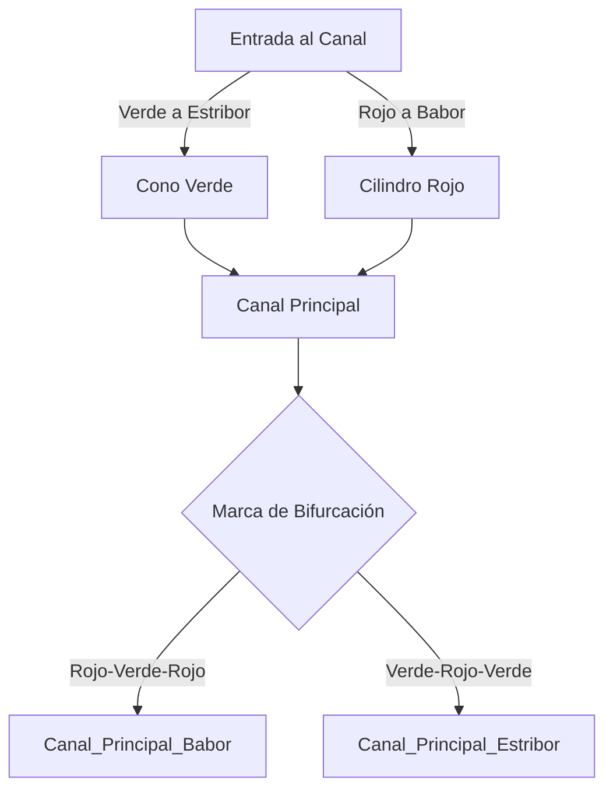

# Tema 5: Sistema de Balizamiento IALA (A)

El Sistema de Balizamiento Marítimo de la Asociación Internacional de Autoridades de Señalización Marítima (IALA), región A, define la topología de la navegación en canales y aguas restringidas, estableciendo grafos de trayectorias seguras mediante señales visuales y lumínicas.

## Topología de los Canales de Navegación

Podemos modelizar un canal como un corredor delimitado por dos conjuntos de puntos $L_{babor}$ y $L_{estribor}$ relativos al sentido convencional de balizamiento (hacia tierra). 

Para el sistema IALA A:
- Color en babor: Rojo (cilindro).
- Color en estribor: Verde (cono).

El algoritmo de decisión para mantener un rumbo seguro $\vec{r}$ dentro del canal se rige por:

$$
\vec{r}(t) \in \text{Interior}(L_{babor}, L_{estribor})
$$

### Diagrama de Grafo de Navegación Segura

## Periodos y Frecuencias de Señales Luminosas

La identificación nocturna de boyas se fundamenta en el análisis de señales periódicas. La función de intensidad luminosa $I(t)$ es una función periódica de periodo $T$:

$$
I(t) = I(t + T)
$$

Ejemplo: La luz de un peligro aislado presenta grupos de dos destellos blancos. Si $t_d$ es el tiempo de destello y $t_o$ el tiempo de oscuridad, el periodo es:

$$
T = t_{d1} + t_{o1} + t_{d2} + t_{o2}
$$

## Ejemplos Prácticos

### Problema 1: Frecuencia de una Marca Cardinal Sur
Una boya Cardinal Sur emite 6 destellos rápidos + 1 destello largo cada 15 segundos. 
Si el destello rápido dura $0.3\text{ s}$, el intervalo entre ellos es de $0.3\text{ s}$, el destello largo dura $2\text{ s}$, calcule el tiempo de oscuridad largo (el eclipse final del ciclo) $t_{eclipse\_final}$.

**Solución:**
1. Desglose del ciclo de luz $T = 15\text{ s}$.
2. Suma de tiempos de los 6 destellos rápidos y sus 5 intervalos internos:
$$
T_{rapidos} = 6 \cdot 0.3 + 5 \cdot 0.3 = 1.8 + 1.5 = 3.3\text{ s}
$$
3. Tiempo del intervalo previo al destello largo (supongamos también $0.3\text{ s}$) y el destello largo:
$$
T_{largo} = 0.3 + 2.0 = 2.3\text{ s}
$$
4. Tiempo total emitido antes del eclipse:
$$
T_{activo} = 3.3 + 2.3 = 5.6\text{ s}
$$
5. Ecuación de periodo:
$$
t_{eclipse\_final} = T - T_{activo} = 15 - 5.6 = 9.4\text{ s}
$$
El navegante debe observar un periodo de total oscuridad de $9.4\text{ segundos}$ para validar la marca como Cardinal Sur.

## Referencias Bibliográficas y Jurisprudencia

- Sistema de Balizamiento Marítimo y otras ayudas a la navegación de la IALA (Asociación Internacional de Señalización Marítima).
- Publicaciones especiales del Instituto Hidrográfico de la Marina (IHM).
