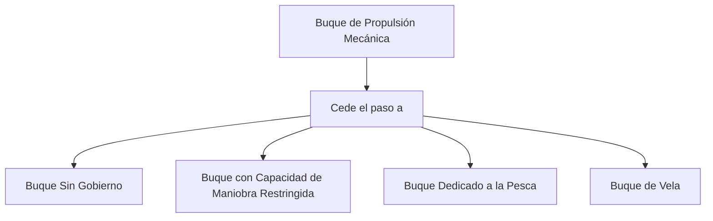

# Tema 6: Reglamento Internacional para Prevenir Abordajes (RIPA)

El RIPA es el marco normativo y cinemático absoluto en la mar. Para embarcaciones de PNB, la interpretación de las reglas de rumbo y gobierno requiere un análisis exhaustivo de vectores de movimiento relativo.

> **Importante:** RIPA es la materia con más peso del examen PNB y también es **eliminatoria** (máximo **5 fallos** permitidos de 10 preguntas). Esta sección resume, de forma autocontenida, prioridades de paso, luces/marcas diurnas y señales acústicas. Para el desarrollo exhaustivo y trucos mnemotécnicos adicionales, consulta **[RIPA_Y_BALIZAMIENTO.md](../../manuales/RIPA_Y_BALIZAMIENTO.md)**.

## Resumen Autocontenido: Prioridades de Paso

Regla de oro: **la maniobra evasiva debe ser amplia, clara y con antelación**, y **nunca se debe alterar el rumbo hacia babor** en una situación de cruce con otro buque de motor.

### Orden de Prioridad Absoluta (el que menos capacidad de maniobra tiene, pasa primero)
1.  **Buque sin gobierno** (avería de motor o timón).
2.  **Buque con capacidad de maniobra restringida** (dragas, tendecables, balizadores).
3.  **Buque restringido por su calado** (grandes buques que no pueden salir del canal).
4.  **Buque dedicado a la pesca** (con artes caladas; no aplica a un pesquero de caña).
5.  **Buque de vela** (navegando exclusivamente a vela; si lleva el motor encendido, aunque tenga vela izada, cuenta como buque de propulsión mecánica).
6.  **Buque de propulsión mecánica** (lanchas, yates, veleros a motor, mercantes en general).

### Las Tres Situaciones entre Buques de Motor

| Situación | Regla | Maniobra |
| :--- | :--- | :--- |
| **Vuelta encontrada** (rumbos opuestos, de frente) | Regla 14 | Ambos caen a **estribor**, pasan babor con babor. |
| **Cruce** (rumbos que se cortan) | Regla 15 | El que ve al otro por su **estribor** (le ve el costado rojo/babor del otro) cede el paso. Si ves el verde (estribor del otro), mantienes rumbo y velocidad. |
| **Alcance** (demora a más de 22.5° a popa del través) | Regla 13 | El que alcanza **siempre** se aparta, sea cual sea el tipo de buque alcanzado. El alcanzado mantiene rumbo y velocidad. |

### Cruce entre Veleros
1.  **Distinto bordo:** tiene preferencia el velero amurado a **estribor** (el viento le entra por estribor).
2.  **Mismo bordo:** tiene preferencia el velero de **sotavento**.
3.  **Duda sobre el bordo del otro velero estando tú amurado a babor:** te apartas tú.

## Resumen Autocontenido: Luces de Navegación y Marcas Diurnas

### Luces básicas de un buque de motor en movimiento
*   **Babor:** roja, arco de 112.5° desde la proa.
*   **Estribor:** verde, arco de 112.5° desde la proa.
*   **Tope (mástil):** blanca, arco de 225° hacia proa.
*   **Alcance (popa):** blanca, arco de 135° hacia popa.

*Un velero a vela pura lleva roja/verde y blanca de popa, pero apaga la luz blanca de tope: así se distingue de un buque de motor de noche.*

### Buques Especiales: Luces de Todo Horizonte y Marcas Diurnas

| Tipo de Buque | Luces (mástil, todo horizonte) | Marca diurna (negra) |
| :--- | :--- | :--- |
| **Sin gobierno** | Roja sobre roja | Dos bolas verticales |
| **Maniobra restringida** | Roja - Blanca - Roja (vertical) | Bola - Diamante - Bola |
| **Pesquero de arrastre** | Verde sobre blanca | Dos conos por los vértices |
| **Pesquero (no arrastre)** | Roja sobre blanca | Dos conos por los vértices |
| **Remolcador** | Amarilla sobre blanca de popa | Diamante (si el remolque mide más de 200 m) |
| **Restringido por calado** | Tres rojas verticales | Cilindro |
| **Fondeado** | Una blanca (todo horizonte) | Una bola |
| **Varado** | Blanca + dos rojas verticales | Tres bolas verticales |

*Trucos mnemotécnicos:* "Rojo sobre rojo, sin gobierno"; "Rojo sobre blanco, pesquero faenando"; "Verde sobre blanco, arrastrero faenando".

## Resumen Autocontenido: Señales Acústicas (Pitadas)

Se usan para anunciar maniobras a corta distancia o navegar con niebla/visibilidad reducida.

| Señal | Significado |
| :--- | :--- |
| **1 pitada corta** ( • ) | "Caigo a mi estribor" |
| **2 pitadas cortas** ( •• ) | "Caigo a mi babor" |
| **3 pitadas cortas** ( ••• ) | "Doy marcha atrás" |
| **5 pitadas cortas o más** ( ••••• ) | "Peligro / No comprendo tu maniobra" (señal de duda o desacuerdo) |

*Nota:* en niebla o con visibilidad restringida, los buques emiten señales largas (prolongadas) a intervalos regulares en lugar de las pitadas cortas de maniobra descritas arriba.

## Cinemática del Abordaje (Regla 7: Riesgo de Abordaje)

El riesgo de abordaje existe si la marcación o demora de un buque que se aproxima no varía apreciablemente. 
Sea nuestro buque $A$ con vector velocidad $\vec{V}_A$ y un buque $B$ con vector $\vec{V}_B$. El vector velocidad relativa de $B$ respecto a $A$ es:

$$
\vec{V}_{BA} = \vec{V}_B - \vec{V}_A
$$

Si la posición relativa de $B$ respecto a $A$ es el vector $\vec{R}_{BA}$, el riesgo de abordaje máximo ocurre cuando $\vec{V}_{BA}$ es antiparalelo a $\vec{R}_{BA}$:

$$
\frac{d(\text{Demora})}{dt} = 0 \quad \text{y} \quad \frac{d|\vec{R}_{BA}|}{dt} < 0
$$

### Diagrama de Árbol de Prioridades (Regla 18)

## Reglas de Gobierno y Maniobra (Reglas 13, 14, 15)

Las tres situaciones canónicas de encuentro entre dos buques de propulsión mecánica son:
1. **Alcance (Regla 13):** Buque que se aproxima desde una demora $> 22.5^\circ$ a popa del través. El que alcanza cede el paso.
2. **Vuelta Encontrada (Regla 14):** Rumbos opuestos. Ambos caen a estribor.
3. **Cruce (Regla 15):** Rumbos convergentes. El buque que tiene al otro por su estribor se mantiene apartado (cede el paso).

En una situación de cruce, la función matemática de alteración de rumbo $\Delta \theta$ debe asegurar que el mínimo CPA (Closest Point of Approach) sea mayor que un umbral de seguridad estipulado.

## Recursos Audiovisuales (Videotutoriales de Apoyo)

*   📺 **Escuela Náutica Neptuno:** [Examen PER y PNB - RIPA - Tema 6](https://www.youtube.com/results?search_query=Examen+PER+y+PNB+-+RIPA+-+Tema+6+Escuela+Nautica+Neptuno) (Estudio dinámico de luces, marcas y maniobras para evitar el abordaje).

## Ejemplos Prácticos

### Problema 1: Cálculo del Tiempo hasta el Abordaje (TCPA)
Un buque de propulsión mecánica $A$ navega a rumbo verdadero $Rv_A = 090^\circ$ a $10\text{ nudos}$. Se detecta otro buque $B$ a demora verdadera $045^\circ$, distancia $5\text{ millas}$, navegando a rumbo $Rv_B = 180^\circ$ a $14.14\text{ nudos}$ ($10\sqrt{2}\text{ nudos}$).
1. Descomponga las velocidades y halle $\vec{V}_{BA}$.
2. Compruebe si existe riesgo de abordaje y halle el TCPA.

**Solución:**
1. Componentes (Norte, Este):

$$
\vec{V}_A = (0, 10)
$$

$$
\vec{V}_B = (-14.14, 0)
$$

Vector relativo $\vec{V}_{BA} = \vec{V}_B - \vec{V}_A = (-14.14, -10)$.

El módulo de velocidad relativa es:

$$
|\vec{V}_{BA}| = \sqrt{(-14.14)^2 + (-10)^2} = \sqrt{200 + 100} = \sqrt{300} \approx 17.32\text{ nudos}
$$

El rumbo relativo de aproximación de $B$ hacia $A$ viene dado por:

$$
\tan(\theta) = \frac{-10}{-14.14} \approx 0.707 \implies \theta \approx 215^\circ \text{ (hacia el Suroeste)}
$$

La recíproca es $035^\circ$. Como la demora verdadera inicial de B es $045^\circ$, no es exactamente antiparalelo, por lo que el CPA no es 0 estricto, pero es un encuentro muy cerrado.

Vamos a calcular el CPA exacto:
Vector de posición inicial $\vec{R}_{BA} = (5 \cos(45^\circ), 5 \sin(45^\circ)) = (3.535, 3.535)$ millas Norte/Este.
Vector $\vec{V}_{BA} = (-14.14, -10)$.
Como $\frac{3.535}{-14.14} \neq \frac{3.535}{-10}$, la demora variará, pero el abordaje/cruce es muy cercano. 
Este ejercicio demuestra matemáticamente que la demora cambiará, aplicando la regla de "si hay duda, supóngase que existe el riesgo".

## Referencias Bibliográficas y Jurisprudencia

- Organización Marítima Internacional (OMI), *Reglamento Internacional para Prevenir Abordajes (COLREG)* de 1972, enmendado.
- Cockcroft, A. N., & Lameijer, J. N. F. (2011). *A Guide to the Collision Avoidance Rules*. Butterworth-Heinemann.
