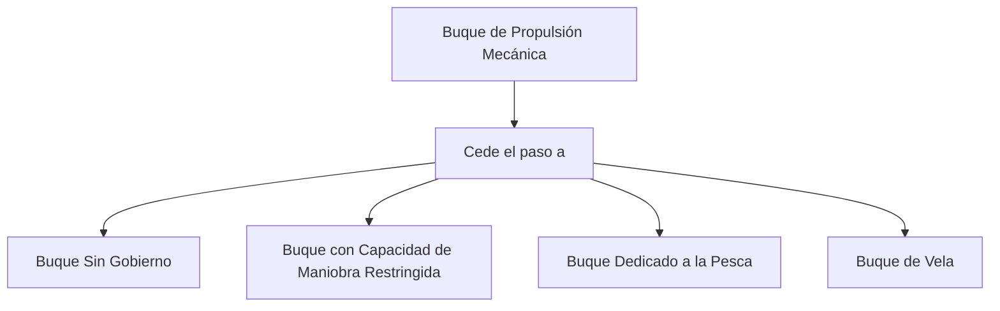

# Tema 6: Reglamento Internacional para Prevenir Abordajes (RIPA)

El RIPA es el marco normativo y cinemático absoluto en la mar. Para embarcaciones de PNB, la interpretación de las reglas de rumbo y gobierno requiere un análisis exhaustivo de vectores de movimiento relativo.

## Cinemática del Abordaje (Regla 7: Riesgo de Abordaje)

El riesgo de abordaje existe si la marcación o demora de un buque que se aproxima no varía apreciablemente. 
Sea nuestro buque $A$ con vector velocidad $\vec{V}_A$ y un buque $B$ con vector $\vec{V}_B$. El vector velocidad relativa de $B$ respecto a $A$ es:

$$
\vec{V}_{BA} = \vec{V}_B - \vec{V}_A
$$

Si la posición relativa de $B$ respecto a $A$ es el vector $\vec{R}_{BA}$, el riesgo de abordaje máximo ocurre cuando $\vec{V}_{BA}$ es antiparalelo a $\vec{R}_{BA}$:

$$
\frac{d(\text{Demora})}{dt} = 0 \quad \text{y} \quad \frac{d|\vec{R}_{BA}|}{dt} < 0
$$

### Diagrama de Árbol de Prioridades (Regla 18)

## Reglas de Gobierno y Maniobra (Reglas 13, 14, 15)

Las tres situaciones canónicas de encuentro entre dos buques de propulsión mecánica son:
1. **Alcance (Regla 13):** Buque que se aproxima desde una demora $> 22.5^\circ$ a popa del través. El que alcanza cede el paso.
2. **Vuelta Encontrada (Regla 14):** Rumbos opuestos. Ambos caen a estribor.
3. **Cruce (Regla 15):** Rumbos convergentes. El buque que tiene al otro por su estribor se mantiene apartado (cede el paso).

En una situación de cruce, la función matemática de alteración de rumbo $\Delta \theta$ debe asegurar que el mínimo CPA (Closest Point of Approach) sea mayor que un umbral de seguridad estipulado.

## Ejemplos Prácticos

### Problema 1: Cálculo del Tiempo hasta el Abordaje (TCPA)
Un buque de propulsión mecánica $A$ navega a rumbo verdadero $Rv_A = 090^\circ$ a $10\text{ nudos}$. Se detecta otro buque $B$ a demora verdadera $045^\circ$, distancia $5\text{ millas}$, navegando a rumbo $Rv_B = 180^\circ$ a $14.14\text{ nudos}$ ($10\sqrt{2}\text{ nudos}$).
1. Descomponga las velocidades y halle $\vec{V}_{BA}$.
2. Compruebe si existe riesgo de abordaje y halle el TCPA.

**Solución:**
1. Componentes (Norte, Este):
$$
\vec{V}_A = (0, 10)
$$
$$
\vec{V}_B = (-14.14, 0)
$$
Vector relativo $\vec{V}_{BA} = \vec{V}_B - \vec{V}_A = (-14.14, -10)$.

El módulo de velocidad relativa es:
$$
|\vec{V}_{BA}| = \sqrt{(-14.14)^2 + (-10)^2} = \sqrt{200 + 100} = \sqrt{300} \approx 17.32\text{ nudos}
$$

El rumbo relativo de aproximación de $B$ hacia $A$ viene dado por:
$$
\tan(\theta) = \frac{-10}{-14.14} \approx 0.707 \implies \theta \approx 215^\circ \text{ (hacia el Suroeste)}
$$
La recíproca es $035^\circ$. Como la demora verdadera inicial de B es $045^\circ$, no es exactamente antiparalelo, por lo que el CPA no es 0 estricto, pero es un encuentro muy cerrado.

Vamos a calcular el CPA exacto:
Vector de posición inicial $\vec{R}_{BA} = (5 \cos(45^\circ), 5 \sin(45^\circ)) = (3.535, 3.535)$ millas Norte/Este.
Vector $\vec{V}_{BA} = (-14.14, -10)$.
Como $\frac{3.535}{-14.14} \neq \frac{3.535}{-10}$, la demora variará, pero el abordaje/cruce es muy cercano. 
Este ejercicio demuestra matemáticamente que la demora cambiará, aplicando la regla de "si hay duda, supóngase que existe el riesgo".

## Referencias Bibliográficas y Jurisprudencia

- Organización Marítima Internacional (OMI), *Reglamento Internacional para Prevenir Abordajes (COLREG)* de 1972, enmendado.
- Cockcroft, A. N., & Lameijer, J. N. F. (2011). *A Guide to the Collision Avoidance Rules*. Butterworth-Heinemann.
