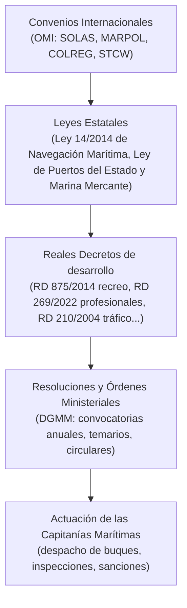
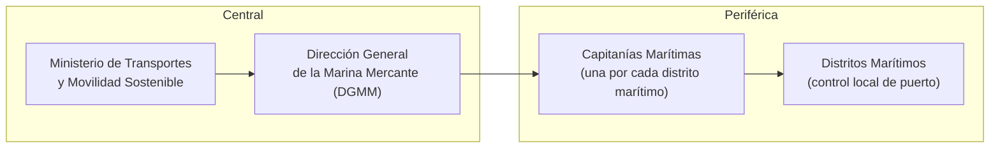

# PPER - Tema 1: Marco Normativo y Administración Marítima

El examen del PPER no evalúa cómo gobernar un barco (eso ya lo certificó el CY), sino si sabes **quién manda, qué ley aplica y qué papeles hacen falta** cuando ese gobierno se convierte en una actividad profesional. Este primer bloque sienta las bases: la jerarquía normativa marítima española y el mapa de organismos que la administran.

---

## 1. Jerarquía Normativa Marítima

España regula el sector marítimo mediante una pirámide de normas que conviene tener clara antes de entrar en el detalle de cada Real Decreto:

*   **Convenios OMI:** España, como Estado firmante, incorpora a su derecho interno los grandes convenios internacionales (SOLAS para seguridad de la vida humana en el mar, MARPOL para contaminación, COLREG/RIPA para el reglamento de abordajes, STCW para formación de la gente de mar).
*   **Ley 14/2014, de Navegación Marítima:** Es la norma civil y mercantil de referencia: contratos de fletamento, hipoteca naval, embargo de buques, abordajes, salvamento, averías, seguro marítimo y, para lo que aquí interesa, la matrícula y el abanderamiento de los buques.
*   **Texto Refundido de la Ley de Puertos del Estado y de la Marina Mercante:** Norma administrativa troncal: organiza la Administración marítima, tipifica infracciones y sanciones, y regula el régimen general de seguridad marítima.

> [!NOTE]
> Una pregunta clásica de examen consiste en distinguir si un supuesto (por ejemplo, un abordaje entre dos embarcaciones de recreo) se resuelve por la vía **civil** (Ley de Navegación Marítima: indemnización de daños) o por la vía **administrativa sancionadora** (Ley de Puertos del Estado y de la Marina Mercante: multa por infracción). Ambas vías son compatibles y no se excluyen entre sí.

---

## 2. La Administración Marítima: Estructura Central y Periférica

### 2.1 Administración Central
La **Dirección General de la Marina Mercante (DGMM)**, dependiente del Ministerio de Transportes y Movilidad Sostenible, es el órgano estatal que:
*   Expide y homologa las titulaciones náuticas (de recreo y profesionales).
*   Convoca anualmente los exámenes del PPER, publicando el temario cerrado y la fecha de la convocatoria mediante Resolución en el BOE.
*   Ejerce la potestad sancionadora en materia de seguridad marítima, abanderamiento y despacho de buques.

### 2.2 Administración Periférica: las Capitanías Marítimas
Cada **Capitanía Marítima** es la autoridad marítima local (a nivel de distrito marítimo o provincia costera) y es, en la práctica, la ventanilla con la que el patrón profesional trata día a día:
*   **Despacho de buques:** Autorización de salida a la mar (rol de despacho), especialmente relevante para embarcaciones que trabajan comercialmente (chárter, escuela).
*   **Enrole y desenrole:** Inscripción de la tripulación en el Libro de Rol o Registro correspondiente; es el documento que después sirve para acreditar días de embarque como patrón (por ejemplo, para solicitar el propio PPER).
*   **Inspecciones y sanciones:** Comprobación in situ de que la embarcación lleva el equipo de seguridad exigido, la documentación en regla y que el patrón está habilitado para el uso (particular o profesional) que se le está dando.

> [!CAUTION]
> Uno de los errores más sancionados en la práctica: patronear una embarcación de recreo con fines lucrativos (chárter sin tripulación, "bareboat" cobrando, patroneo remunerado a terceros) estando en posesión solo del PER o del CY, sin el PPER u otra titulación profesional habilitante. Es una infracción administrativa **grave**, con independencia de la pericia náutica del patrón.

---

## 3. Ordenación de la Navegación y Despacho de Buques

La reglamentación de ordenación de la navegación marítima regula, entre otros aspectos:
*   Los trámites de **despacho de salida y entrada** de las embarcaciones, diferenciando el régimen simplificado de las embarcaciones de recreo particulares del régimen aplicable a embarcaciones que ejercen actividad comercial.
*   Las condiciones de **tripulación mínima de seguridad** exigibles según el tipo de navegación y el número de pasajeros.
*   El régimen documental que debe llevarse a bordo: certificado de navegabilidad, licencia de navegación/hoja de asiento, seguro de responsabilidad civil, rol de despacho y titulación del patrón.

*(Verificar la denominación y numeración exacta del Real Decreto de ordenación de la navegación marítima vigente en el momento del examen, ya que ha sido objeto de sucesivas actualizaciones).*

---

## Ejemplos Prácticos

**Caso 1: ¿Quién sanciona?**
Un patrón con título de CY es sorprendido por una patrulla de Vigilancia Aduanera patroneando un velero de recreo de 15 metros con seis clientes de pago a bordo, sin PPER ni ninguna otra titulación profesional. ¿Qué organismo instruye el expediente sancionador y sobre qué base normativa?

*Resolución:* La instrucción corresponde a la **Capitanía Marítima** del distrito donde se detecta el hecho (o, en su caso, donde tenga su sede el titular), en aplicación del régimen sancionador de la Ley de Puertos del Estado y de la Marina Mercante. El CY no habilita para el ejercicio profesional del patroneo: la infracción consiste en ejercer una actividad remunerada de transporte de pasajeros sin la titulación profesional habilitante (PPER u otra), con independencia de que la persona sepa navegar perfectamente.

**Caso 2: Vía civil vs. vía administrativa**
Durante una travesía de chárter, el patrón (con PPER en regla) provoca por negligencia una vía de agua que daña la embarcación de otro armador fondeado al lado. ¿Se agota la responsabilidad con la multa administrativa que pueda imponer Capitanía Marítima por la maniobra imprudente?

*Resolución:* No. La sanción administrativa (Ley de Puertos del Estado y de la Marina Mercante) es independiente de la responsabilidad civil por los daños causados al tercero, que se rige por la Ley 14/2014 de Navegación Marítima (régimen de abordajes y responsabilidad extracontractual) y, en su caso, se cubre mediante el seguro de responsabilidad civil obligatorio de la embarcación.

---

## Referencias

*   Ley 14/2014, de 24 de julio, de Navegación Marítima.
*   Texto Refundido de la Ley de Puertos del Estado y de la Marina Mercante (Real Decreto Legislativo 2/2011, de 5 de septiembre).
*   Real Decreto 875/2014, de 10 de octubre, por el que se regulan las titulaciones náuticas para el gobierno de las embarcaciones de recreo.
*   Real Decreto 269/2022, de 12 de abril, por el que se regulan las titulaciones profesionales de la Marina Mercante (certificado de especialidad de patrón profesional de embarcaciones de recreo, art. 93).
*   *(Consulta siempre la Resolución anual de la DGMM en el BOE, que fija el temario cerrado y vigente para la convocatoria del examen del año en curso).*
